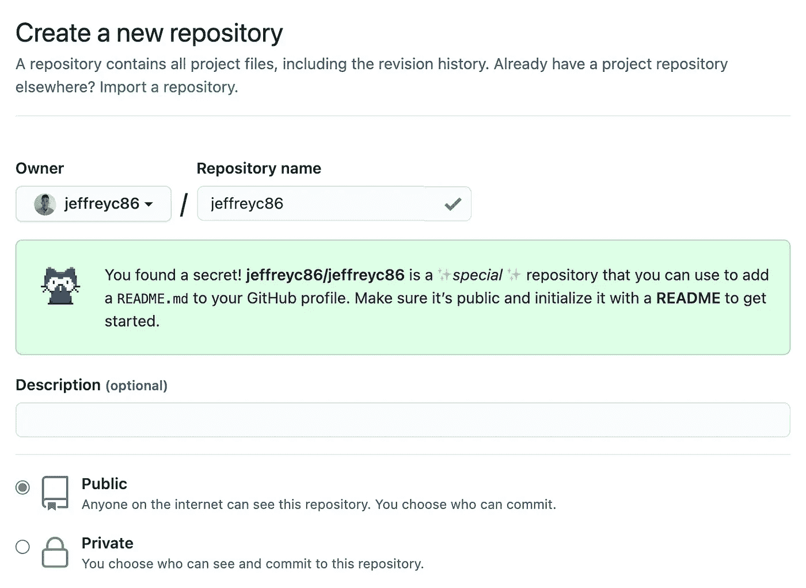
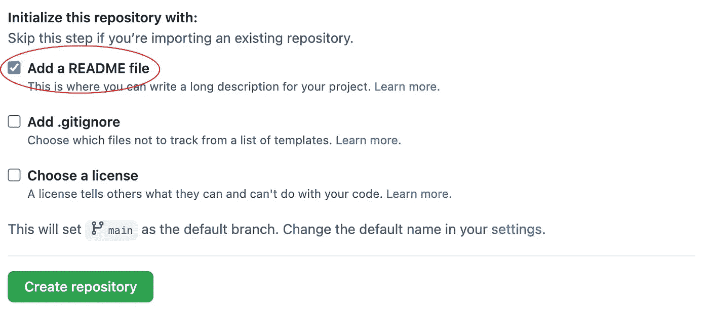
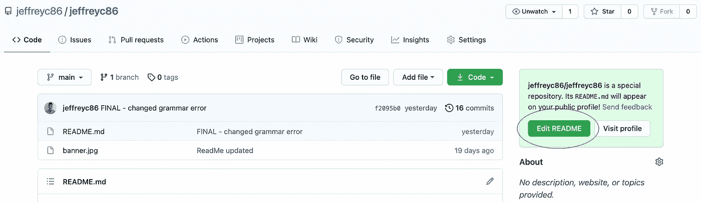
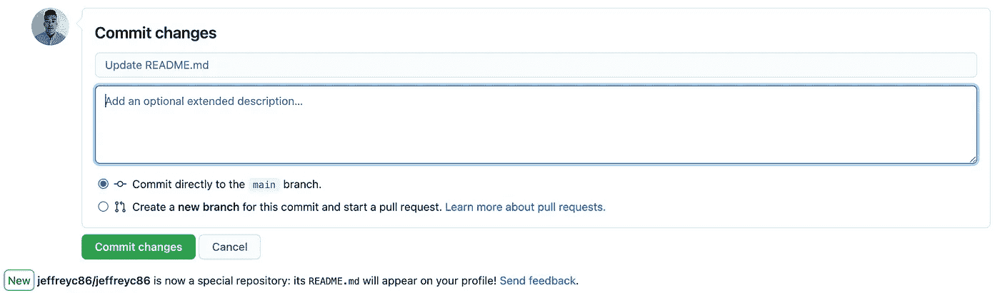
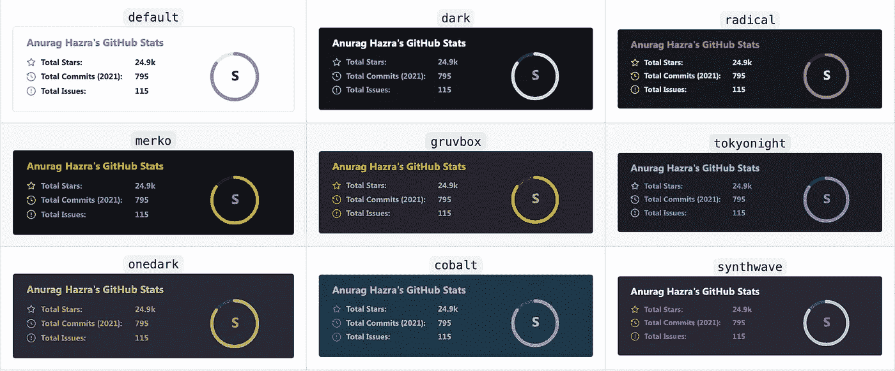
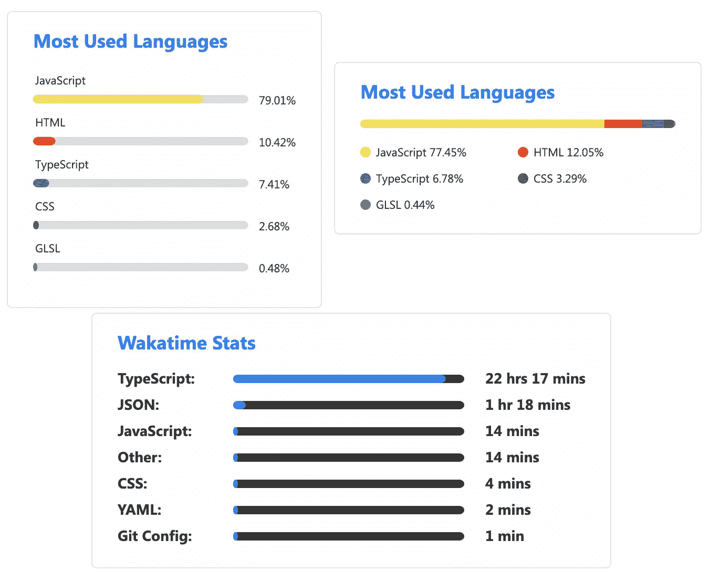
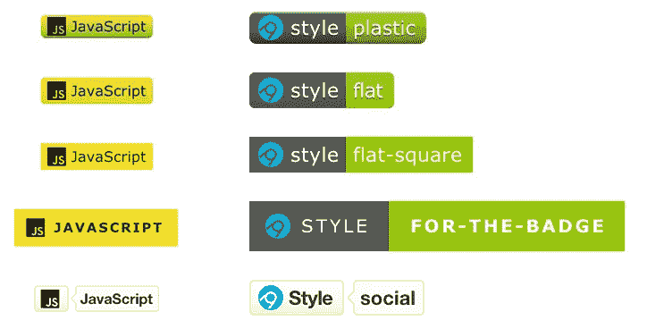
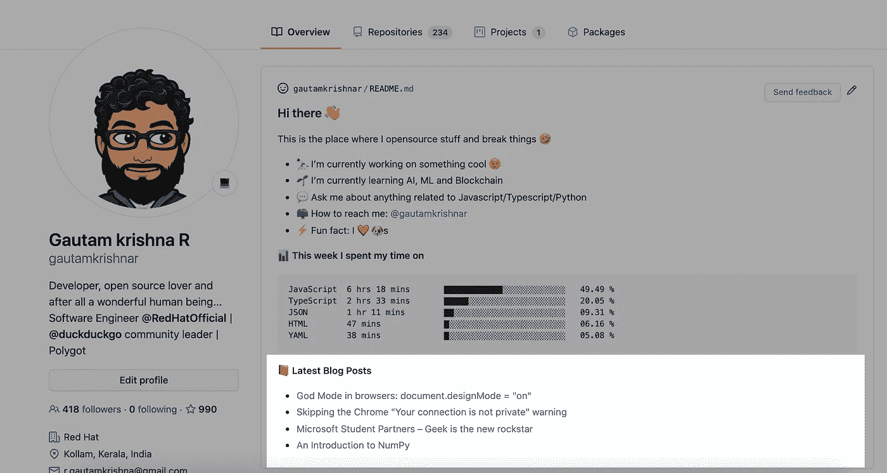
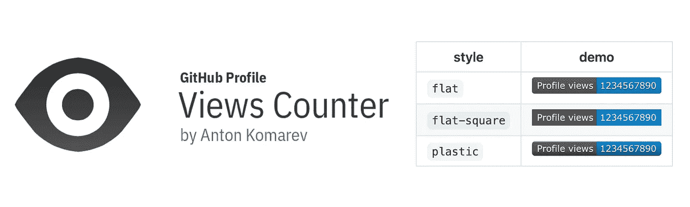

# 通过个性化您的 GitHub 个人资料脱颖而出

> 原文：<https://medium.com/nerd-for-tech/stand-out-by-personalizing-your-github-profile-f0a5d73f2b4d?source=collection_archive---------1----------------------->

*该功能允许您在 GitHub 个人资料上显示可定制的自述文件*

如果你曾经在 GitHub 上浏览过，你可能会注意到一些用户资料已经被图像、技能徽章、活动跟踪器等个性化了。这个功能是 GitHub 在 2020 年 7 月推出的，允许用户为自己的个人资料创建一个自述文件。在这里查看文档。

当有人访问您的个人资料时，个人资料自述文件会自动显示，并立即显示在您的固定存储库上方。它允许用户添加比 GitHub 的标准生物部分更多的内容，并使用 Markdown，这意味着可以包含更多的灵活性(例如:图像和 gif)。

与任何可靠的存储库一样，自述文件是包含项目信息的重要组成部分；在这种情况下，用户。

# 如何设置个人资料自述文件

GitHub 在他们的[文档](https://docs.github.com/en/github/setting-up-and-managing-your-github-profile/managing-your-profile-readme)中提供了非常详细的说明，但是可以总结为三个步骤。

1.  使用与您的 GitHub 用户名完全相同的名称**创建一个**公共**库。**

输入存储库名称后，应该会出现此消息。

确保用自述文件初始化它。

2.编辑自述文件。您可以直接在 GitHub 上这样做，或者将存储库克隆到您的本地机器上并编辑文件。

请记住，自述文件在 Markdown 中。如果你需要复习基本语法，你可以访问文档[这里](https://www.markdownguide.org/basic-syntax/)。

这一步是你可以尽情发挥你的创造力的地方，或者如果你想看起来更干净/专业，就不要这样做。

你还可以添加很多特性，稍后会有更多的介绍。

3.最后，提交并发布您的更改。成品将直接显示在您的个人资料上。

*如果你已经将文件复制下来，确保你将编辑的内容推上来。

**注意** —如果出现以下任何情况，将从您的 GitHub 配置文件中删除配置文件自述文件:

*   自述文件为空或不存在。
*   存储库是私有的。
*   存储库名称不再与您的用户名匹配。

# 您可以添加到个人资料中的功能

一旦你掌握了 GitHub 概要文件的工作方式，你就可以添加很多很棒的特性。下面列出了一些重点。

## GitHub 自述文件统计

GitHub README Stats 跟踪你的 GitHub 活动，并有大量的内置主题和功能。还有一个选项可以跟踪你一直在使用的语言，如果你使用 [Wakatime](https://wakatime.com/) 你还可以跟踪你在特定语言上花费的时间。

有各种布局选项和主题颜色。

查看 GitHub README Stats 文档[点击这里](https://github.com/anuraghazra/github-readme-stats)。

## Shields IO

向您的个人资料添加自定义图标和徽章。

Shields IO 与其说是一个特性，不如说是一个徽章生成器。用户可以通过定制样式和颜色的徽章来展示他们的技能。生成徽章时，还可以选择包含来自 [Simple-Icons](https://simpleicons.org/) 的徽标，该徽标有近 2000 种不同的公司徽标。

点击了解如何创建徽章[。](https://shields.io/)

## 博客帖子工作流

如果你经常写博客或发布视频，你可以直接在你的 GitHub 个人资料中包含这些链接。博客帖子工作流将与您的发布站点同步，并更新显示的链接以反映任何新帖子。

点击查看博文工作流程文档[。](https://github.com/gautamkrishnar/blog-post-workflow)

## Spotify 正在播放

有几个 Spotify 播放器，但这个由 [codeSTACKr](https://www.youtube.com/channel/UCDCHcqyeQgJ-jVSd6VJkbCw) 开发的版本很干净，视觉上很吸引人。这确实需要一点时间来设置，因为它需要一个 Spotify 授权令牌，并通过 [Vercel](https://vercel.com/) 部署。

阅读此处的设置说明[。还可以看看另一个 Spotify 播放器](https://github.com/codeSTACKr/spotify-now-playing/blob/master/SetUp.md)。

## GitHub 个人资料视图计数器

这个功能可以记录你的 GitHub 被访问的次数。它不跟踪唯一访问者，但仍然是一个很酷的功能，可以在你的个人资料中实现。视图计数器包括几个样式和颜色选项。

点击查看文档[。](https://github.com/antonkomarev/github-profile-views-counter)

# 最后

无论你是为你的开发伙伴创建一个有趣的动画版本，还是把它作为招聘人员查看的伪简历，GitHub profile README 都是必不可少的。它让访问者对你的技能、兴趣，但最重要的是对你有更多的了解。

如果你被困住了，需要一些建议或灵感，看看这两个有几个概要示例的存储库:

*   [牛逼 GitHub 简介自述](https://github.com/abhisheknaiidu/awesome-github-profile-readme)
*   [牛逼 GitHub 简介自述模板](https://github.com/durgeshsamariya/awesome-github-profile-readme-templates)

如果你还没有，现在就开始创建你的吧！