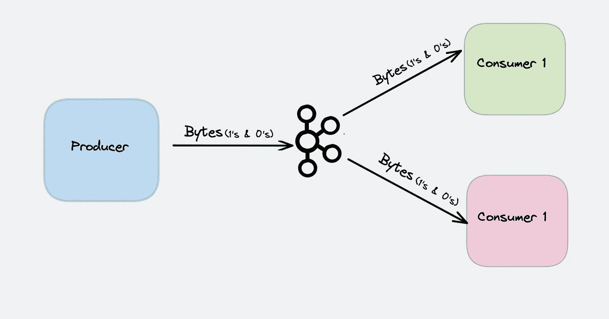
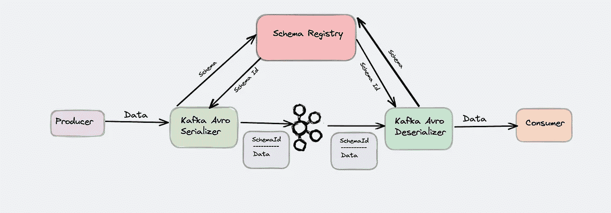
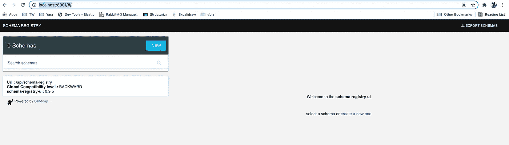
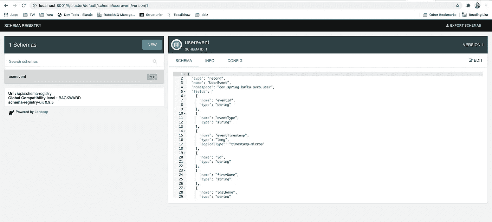
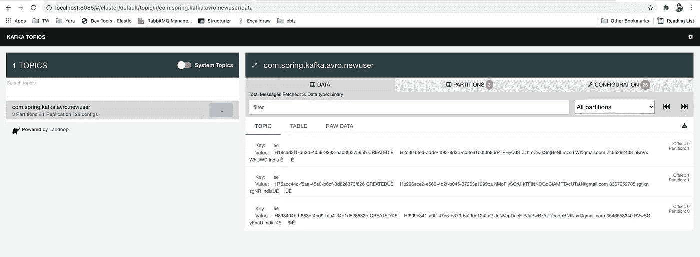
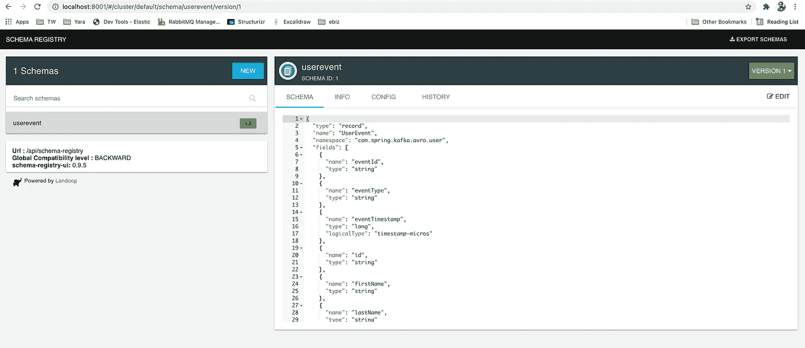

# 使用 Apache Avro 和 Schema Evolution 标准化 Kafka 事件流的数据格式

> 原文：<https://medium.com/nerd-for-tech/standardize-data-format-for-kafka-event-streams-using-apache-avro-and-schema-evolution-a2df6924b54c?source=collection_archive---------0----------------------->

在这个故事中，我提供了 Apache Avro 和合流模式注册中心的概述。它们如何工作，它们解决的问题，以及一个 Java spring boot 和 node js 示例。

**卡夫卡不验证传入的数据**

Kafka 以字节为输入，以字节为输出。这使得卡夫卡更加强大和快速。



> **卡夫卡以字节为单位输入并发布。**
> 
> **没有数据验证/确认。通常，任何类型的数据都可以发布到主题中。**

数据具有字节以外的含义，因此消费者需要解析它，然后再解释它。当一切顺利时，它就是赢家。如果没有，你就按紧急按钮。

它们主要发生在这两种情况下:

*   您要查找的字段已不存在。
*   字段的类型已经改变(例如，以前的`String`现在是`Integer`)。

**如何克服这些情况？**

1.  解析错误时捕捉异常，代码会变得难看并且很难维护。
2.  每次从生产者处保持相同的格式，这是开启的，但是在软件生命周期中，总是期望修改数据。
3.  采用一种数据格式并实施允许您执行模式演进的规则，同时保证不中断下游应用程序。

# 需要调整数据格式和策略

有两种方法可以管理 Kafka 上的数据一致性。

**文本格式方式(JSON/XML)**

JSON——一个非常明显的偏好。它很容易实现，由 MongoDB、PostgreSQL 等一些数据库提供本地支持。
JSON 格式被大量使用，有很多优点。作为默认选择，这是最好的选择。但是维护模式是困难的。

**优点:**

*   数据可以采用任何形式(数组、嵌套元素)
*   JSON 是网络上被广泛接受的格式。
*   几乎任何语言都可以阅读 JSON。
*   JSON 可以很容易地在网络上共享。

**缺点:**

*   *JSON 没有原生模式支持* *(JSON 模式不是 JSON 的规范)。*
*   由于重复的键，JSON 对象的大小可能相当大。
*   没有注释，元数据，文档。

**二进制序列化选项**
纯文本序列化的第一个优点是这种格式是人类可读的。从 DB 中选择一些事件并直接从查询结果中分析它们是非常方便的。二进制格式需要一个额外的步骤，将字节转换成可读的内容。

显然，二进制格式的压缩程度更高，因此存储空间的使用会更低。实际利润取决于事件模型。对于较大的模型，从文本格式消息中节省至少 50%的磁盘空间。

**不同的序列化方式**

***java 序列化—*** 这不是一个通用的解决方案，因为源和目标都应该将 Java 对象理解为源和目标的 Java。这实际上是不可能的，所以这不是一个选择。
***Kryo*** —非常快，非常紧凑，但它只在 JVM 上工作，将我们的基础设施限制为只有 JVM 应用程序是没有意义的。同样同上。
***Thrift***—Thrift 是服务通信的序列化和 RPC 框架。Thrift 在所有主要语言中都支持这些特性，并且对 C++、Python、Hack 和 Java 都有很强的支持。这类似于 ProtoBuffer，但受脸书专利的限制。
***协议缓冲区*** — gRPC 方式。
***Avro*** —阿帕奇连载—现在正在调查。

那个数据格式是 **Apache Avro** 。在这篇博客中，我将讨论为什么你需要 Avro，以及为什么它能被**融合模式注册表很好地补充。**

# 阿帕奇 Avro

Avro 依赖于*模式*。读取 Avro 数据时，写入数据时使用的模式始终存在。这允许写入每个数据时没有每个值的开销，使得序列化既快又小。这也有助于动态脚本语言的使用，因为数据及其模式是完全自描述的。

当 Avro 数据存储在一个文件中时，它的模式也随之存储，因此文件可以在以后被任何程序处理。如果读取数据的程序需要不同的模式，这很容易解决，因为两种模式都存在。

当在 RPC 中使用 Avro 时，客户端和服务器在连接握手中交换模式。(这可以被优化，以便对于大多数调用，实际上没有模式被传输。)因为客户机和服务器都有对方的完整模式、同名字段、缺失字段、额外字段等之间的对应关系。都可以轻松解决。

Avro 模式是用 [JSON](https://www.json.org/) 定义的。这有助于在已经有 JSON 库的语言中实现。

# 与其他系统的比较

Avro 提供类似于系统的功能，如[节俭](https://thrift.apache.org/)、[协议缓冲](https://code.google.com/p/protobuf/)等。Avro 在以下基本方面不同于这些系统。

*   *动态类型* : Avro 不需要生成代码。数据总是伴随着一个模式，该模式允许在没有代码生成、静态数据类型等的情况下完全处理该数据。这促进了通用数据处理系统和语言的构建。
*   *未标记的数据*:由于在读取数据时存在模式，因此需要用数据编码的类型信息要少得多，从而导致较小的序列化大小。
*   *没有手动分配的字段 id*:当模式改变时，在处理数据时，旧模式和新模式总是存在，因此可以使用字段名称象征性地解决差异。



> Avro 在大数据社区越来越受欢迎。由于合流(由于合流模式注册)的大力推动，它也成为最受欢迎的快速数据序列化格式。

**Avro 如何解决我们的问题？**

这类似于 RDMS，如果不按照模式创建表，我们就不能插入数据，如果不首先提供模式，就不能创建 Avro 对象。

Avro 具有以下特点:

> *Avro 支持原语类型* ( `int`、`string`、`long`、`bytes`等)、复杂类型(`enum`、`arrays`、`unions`、可选)、逻辑类型(`dates`、`timestamp-millis`、`decimal`)和数据记录(`name`、`namespace`)。
> 
> *Avro 支持嵌入式文档*。
> 
> 使用 JSON 定义 Avro 模式。
> 
> Avro 对象包含模式和数据。

# **Avro 与 Spring Boot 一起行动**

对于演示，我们需要以下基础设施和技术。完整源代码请访问[***GitHub***](https://github.com/ereshzealous/avro_playground/tree/master/spring-boot)。

***Docker:***Docker-compose 文件有 zookeeper，Kafka，schema-registry，schema-registry-ui，kafka-rest-proxy，kafka-topics-ui，kafka-manager。

***Java 11，IntelliJ Idea，Maven。***

**Avro 生产商**

*下面是 Avro 文件*

*用下面的插件配置 maven 插件，生成 Avro 类*

```
<plugin>
    <groupId>org.apache.avro</groupId>
    <artifactId>avro-maven-plugin</artifactId>
    <version>${avro.version}</version>
    <executions>
        <execution>
            <phase>generate-sources</phase>
            <goals>
                <goal>schema</goal>
            </goals>
            <configuration>
                <sourceDirectory>${project.basedir}/src/main/resources/avro</sourceDirectory>
                <outputDirectory>${project.basedir}/src/main/java/avro</outputDirectory>
            </configuration>
        </execution>
    </executions>
</plugin>
```

要生成 Avro 类，请使用下面的 maven 目标。这将生成类，生产者使用该类发送消息。

```
mvn clean generate-sources
```

**Producer application.yml**

让我们提出这个应用程序所需的所有基础设施

```
$ docker-compose up -d
Then check whether all processes are running or not
$ docker-compose ps
          Name                        Command                  State                                               Ports
-----------------------------------------------------------------------------------------------------------------------------------------------------------------
kafka                      /etc/confluent/docker/run        Up (healthy)   0.0.0.0:29092->29092/tcp,:::29092->29092/tcp, 0.0.0.0:9092->9092/tcp,:::9092->9092/tcp
kafka-manager              /kafka-manager/bin/cmak -D ...   Up (healthy)   0.0.0.0:9000->9000/tcp,:::9000->9000/tcp
kafka-rest-proxy           /etc/confluent/docker/run        Up (healthy)   0.0.0.0:8082->8082/tcp,:::8082->8082/tcp
kafka-schema-registry-ui   /run.sh                          Up (healthy)   0.0.0.0:8001->8000/tcp,:::8001->8000/tcp
kafka-topics-ui            /run.sh                          Up (healthy)   0.0.0.0:8085->8000/tcp,:::8085->8000/tcp
schema-registry            /etc/confluent/docker/run        Up (healthy)   0.0.0.0:8081->8081/tcp,:::8081->8081/tcp
zookeeper                  /etc/confluent/docker/run        Up (healthy)   0.0.0.0:2181->2181/tcp,:::2181->2181/tcp, 2888/tcp, 3888/tcp
```

让我们在这里访问模式注册 UI。没有模式，我们将在第一次发布消息时创建一个。



# 开始制作

导航到 avro-producer 并运行`AvroProducerApplication.java as Java Application`。生成器启动并将每 15 秒发布一次消息。创建了一个版本为 1 的架构。



# 卡夫卡经理

要查看 Kafka 管理器，请单击此处的[并创建一个指向本地动物园管理员的新集群。](http://localhost:9000/)

# 卡夫卡主题用户界面

请点击[这里](http://localhost:8085/#/)看卡夫卡专题。数据由生产商以 Avro 格式生成。



# 开始消费

同样在消费者中，我们需要同样的 Avro 生成的类来进行反序列化。在这里，它是版本 1。

**消费应用. yml**

> 导航至 avro-consumer 并运行`AvroConsumerApplication.java as Java Application`。应用程序将使用该应用程序。

```
Payload: {"eventId": "18cad3f1-d62d-4059-9293-aab3f637595b", "eventType": "CREATED", "eventTimestamp": 1631695376, "id": "2c3043ed-adde-4f93-8d3b-cd3e61b0f0b8", "firstName": "lrPTPHyQJS", "lastName": "ZzhmCvJkSn", "email": "[BeNLmzerLW@gmail.com](mailto:BeNLmzerLW@gmail.com)", "mobileNumber": "7495292433", "city": "nKnVxWhUWD", "country": "India", "createdOn": 1631695376, "updatedOn": 1631695376}
---
2021-09-15 14:22:56.893  INFO 11393 --- [container-0-C-1] c.spring.kafka.avro.config.UsersStream   : 
---
Headers: {kafka_offset=1, scst_nativeHeadersPresent=true, kafka_consumer=org.apache.kafka.clients.consumer.KafkaConsumer@e7f8ed6, deliveryAttempt=1, kafka_timestampType=CREATE_TIME, id=219a54d9-e16c-4a8d-17bf-c7e7cd27bd51, kafka_receivedPartitionId=1, contentType=application/vnd.userevent.v1+avro, kafka_receivedTopic=com.spring.kafka.avro.newuser, kafka_receivedTimestamp=1631695406702, kafka_groupId=eventServiceGroup, timestamp=1631695976893}Payload: {"eventId": "75acc44c-f5aa-45e0-b6cf-8d826373f826", "eventType": "CREATED", "eventTimestamp": 1631695406, "id": "b296ece2-e560-4d2f-b045-37263e1299ca", "firstName": "hMoFIySCrU", "lastName": "kTFINNOGqC", "email": "[AMFTAcUTaU@gmail.com](mailto:AMFTAcUTaU@gmail.com)", "mobileNumber": "8367952785", "city": "rgtjxnsgNR", "country": "India", "createdOn": 1631695406, "updatedOn": 1631695406}
---
2021-09-15 14:22:56.894  INFO 11393 --- [container-0-C-1] c.spring.kafka.avro.config.UsersStream   : 
---
Headers: {kafka_offset=0, scst_nativeHeadersPresent=true, kafka_consumer=org.apache.kafka.clients.consumer.KafkaConsumer@e7f8ed6, deliveryAttempt=1, kafka_timestampType=CREATE_TIME, id=18096877-34aa-93e5-83f2-79eecb4ae7ba, kafka_receivedPartitionId=0, contentType=application/vnd.userevent.v1+avro, kafka_receivedTopic=com.spring.kafka.avro.newuser, kafka_receivedTimestamp=1631695391699, kafka_groupId=eventServiceGroup, timestamp=1631695976894}Payload: {"eventId": "898404b9-883e-4cd9-bfa4-34d1d528582b", "eventType": "CREATED", "eventTimestamp": 1631695391, "id": "f909e341-a0ff-47e6-b373-6a2f0c1242e2", "firstName": "JcNVepDueF", "lastName": "PJaPwBzAzT", "email": "[ccdpBNtNsx@gmail.com](mailto:ccdpBNtNsx@gmail.com)", "mobileNumber": "3546653340", "city": "RVwSGyEnaU", "country": "India", "createdOn": 1631695391, "updatedOn": 1631695391}
---
```

# Avro 模式的发展和兼容性

数据管理的一个重要方面是模式演变。在定义了初始模式之后，应用程序可能需要随着时间的推移对其进行改进。当这种情况发生时，下游消费者能够无缝地处理用新旧模式编码的数据是至关重要的。这是一个在实践中容易被忽略的领域，直到您遇到第一个生产问题。如果没有仔细考虑数据管理和模式演化，人们通常会在以后付出更高的代价。更多详情，请访问[此处](https://docs.confluent.io/platform/current/schema-registry/avro.html)。

`*BACKWARD*`:使用模式 X 的消费者可以处理用模式 X 或 X-1 产生的数据。这是 Avro 模式设置的默认兼容级别。

`BACKWARD_TRANSITIVE`:使用模式 X 的消费者可以处理使用模式 X、X-1 或 X-2 生成的数据。

`FORWARD`:使用模式 X 生成的数据可以被使用模式 X 或 X-1 的消费者读取。

`FORWARD_TRANSITIVE`:使用模式 X 生成的数据可以被使用模式 X、X-1 或 X-2 的消费者读取。

`FULL`:模式 X 和 X-1 之间向后和向前兼容。

`FULL_TRANSITIVE`:在模式 X、X-1 和 X-2 之间向后和向前兼容。

`NONE`兼容性类型意味着模式兼容性检查被禁用。

# 升级客户端的顺序

配置的兼容性类型对升级客户端应用程序的顺序有影响，即生产者使用模式将事件写入 Kafka，消费者使用模式从 Kafka 读取事件。根据兼容性类型:

*   `BACKWARD`或`BACKWARD_TRANSITIVE`:不能保证使用旧模式的消费者可以读取使用新模式产生的数据。因此，在开始生成新事件之前，请升级所有使用者。
*   `FORWARD`或`FORWARD_TRANSITIVE`:不能保证使用新模式的消费者能够读取使用旧模式产生的数据。因此，首先，使用新模式将所有生成器升级到，并确保使用旧模式生成的数据对使用者不可用，然后升级使用者。
*   `FULL`或`FULL_TRANSITIVE`:确保使用旧模式的消费者可以读取使用新模式生成的数据，使用新模式的消费者可以读取使用旧模式生成的数据。因此，您可以独立升级生产者和消费者。
*   `NONE`:兼容性检查被禁用。因此，您需要对何时升级客户端保持谨慎。

# 在上面的例子中尝试兼容性

让我们在模式中添加一个新字段`active`，它是一个布尔类型，默认值为 true。这种变化是由生产者产生的。但是消费者没有使用最新的模式进行升级，但是消费者仍然可以使用默认情况下兼容`BACKWARD`的旧模式。

最新的模式是版本 2



尽管如此，消费者仍然可以使用这些消息

```
---
Headers: {kafka_offset=2, scst_nativeHeadersPresent=true, kafka_consumer=org.apache.kafka.clients.consumer.KafkaConsumer@57ea6a32, deliveryAttempt=1, kafka_timestampType=CREATE_TIME, id=b22504e0-a579-f3b8-000c-42ed4ff0e6db, kafka_receivedPartitionId=2, contentType=application/vnd.userevent.v2+avro, kafka_receivedTopic=com.spring.kafka.avro.newuser, kafka_receivedTimestamp=1631697283218, kafka_groupId=eventServiceGroup, timestamp=1631697283224}Payload: {"eventId": "df29818f-3ae1-4cbb-8f24-84e8e9f6ab58", "eventType": "CREATED", "eventTimestamp": 1631697283, "id": "f49783f5-f8f9-4931-be2d-8433a60eb7da", "firstName": "ikfLuTTStC", "lastName": "RHofUQYeNk", "email": "[EGnkrAnDug@gmail.com](mailto:EGnkrAnDug@gmail.com)", "mobileNumber": "5127259588", "city": "lIqWLLPnRF", "country": "India", "createdOn": 1631697283, "updatedOn": 1631697283}
```

**使用 Avro 的节点 Js 应用**

我已经在 GitHub[](https://github.com/ereshzealous/avro_playground/tree/master/node/kafka-consumer)**页面上创建了一个示例节点 js 应用程序。请检查**