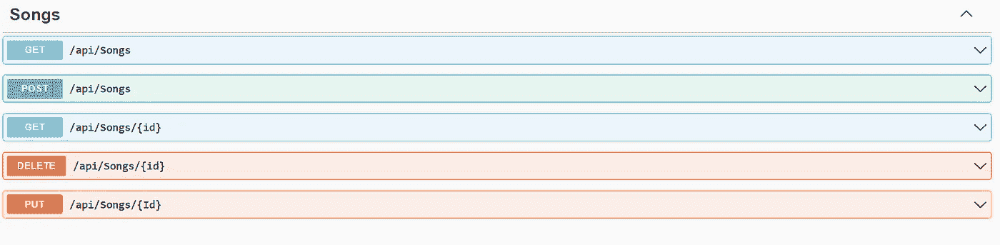
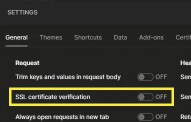
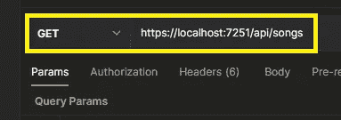
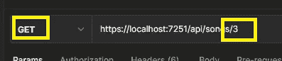
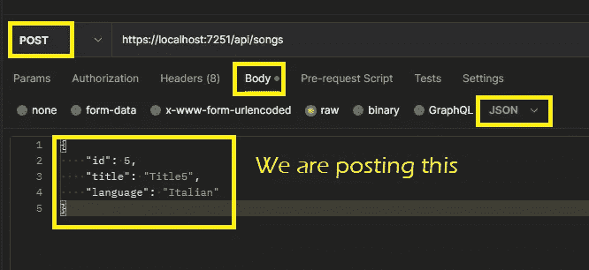
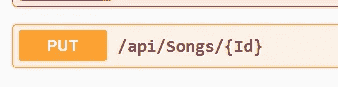
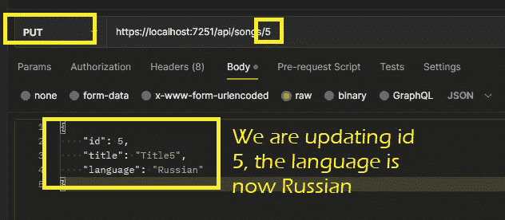
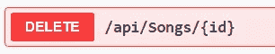
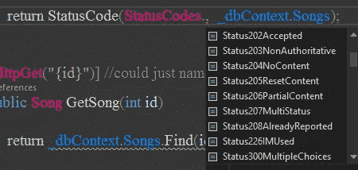

# 开始一个实体框架代码项目—1(基础)

> 原文：<https://medium.com/nerd-for-tech/start-an-entity-framework-code-project-1-basics-5d4a421bf4da?source=collection_archive---------3----------------------->

像往常一样，这些是我对一些主题的笔记，在这种情况下，我想有几篇关于 EF 的文章(总之看起来会很多)。所以第一个开始了。

对于本文，我使用的是安装了`Microsoft.EntityFrameworkCode`和`Microsoft.EntityFrameworkCode.SqlServer`包的 Visual Studio。我的电脑上还安装了 SQL server。

# 创建项目

在 Visual Studio 社区(我用的是最新版本)，去创建新项目，选择**ASP.NET 核心 Web API** 。你不需要创建一个 API 来使用 EF，你也可以在一个控制台项目或者任何你想要的东西中使用它。

采用缺省值，你最终会得到一些你已经需要的文件。

# 一些背景信息

EF 在. Net 应用程序中用于与数据库通信。当你处理数据库时，我们称之为 CRUD 操作。

创建—发布

ead —获取

更新-上传

删除-删除

还有一个补丁选项，但并不常见。

上面(右侧)是我们可以从浏览器或一些访问我们的 API 的应用程序获得的请求类型。我们使用代码来传达请求的进展情况。一些最常见的是:

*   200 好吧
*   400 错误请求
*   401 未经授权
*   403 禁止
*   404 未找到
*   不可接受
*   500 服务器错误
*   503 服务不可用
*   201 已创建
*   202 项被接受
*   204 无内容
*   不允许 405 方法
*   415 不支持的媒体类型

# SQL Server 中的数据库

一旦安装了 SQL Server，您就可以创建自己的数据库或使用现有的数据库(您可以使用 google“下载 northwind 数据库”并查看会出现什么)。我使用的是 Northwind 数据库，我添加了一个新表，只有 3 列(id、title、language)。表名是 Songs。

# EF —代码优先或数据库优先

使用 code first，您将从代码中创建 DB 和表。有了 DB，首先您已经有了 DB，然后您的代码需要匹配您的表。根据我的经验，DB 是独立维护的，代码使用它，所以我将使用 DB 优先的方法。

不管采用哪种方法，您都需要一个**实体模型类**来匹配每个表，以及一个**控制器类**用于表和您将要在其上进行的操作。

# 确定如何连接到数据库

您将需要一个从 **DbContext** (指数据库)继承的类。这个类大概是这样的(你可以随意命名你的类):

```
public class APIDbContext : DbContext
{
  public DbSet<Song> Songs { get; set; }

  public APIDbContext(DbContextOptions<APIDbContext> options) : base(options)
  {

  }
 }
}
```

如果 **DBContext** 指的是数据库，那么 **DbSet** 指的是表。

一旦你有了数据库，你需要告诉你的应用程序如何连接到它。打开 program.cs 文件，寻找`var app = builder.Build();`

在此之前的某个时候，您可能会希望添加类似这样的内容:

```
builder.Services.AddDbContext<APIDbContext>(option => option.UseSqlServer("Data source= YOUR_SERVER\\YOUR-INSTANCE;" + "Initial Catalog=Northwind;" +
  "Integrated Security=true;" + "MultipleActiveResultSets=true;"));
```

您的连接字符串可能不完全相同。如果证书出错，可以尝试将字符串设置为 Encrypt=False。

# 为歌曲表设置模型和控制器

型号应与表格相匹配:

```
public class Song
 {
  [Required]  
  public int Id { get; set; }

  [Required]
  [StringLength(100)]
  public string Title { get; set; }

  public string Language { get; set; }
 }
```

控制器具有以下动作:

```
[Route("api/[controller]")]//this will determine the url to call the action
[ApiController]
public class SongsController : ControllerBase
{
  private APIDbContext _dbContext;
  public SongsController(APIDbContext dbContext)
  {
   _dbContext = dbContext;
  }  

  [HttpGet] //could just name it Get
  public IEnumerable<Song> GetSongs()
  {
   return _dbContext.Songs;
  }

  [HttpGet("{id}")] 
  public Song GetSong(int id)
  {
   return _dbContext.Songs.Find(id);
  }

  //add FromBody to let it know that the data we need to add is coming 
  //from the body of the request.
  [HttpPost]
  public void PostSong([FromBody] Song song)
  {
   _dbContext.Songs.Add(song);
   _dbContext.SaveChanges();
  }

  [HttpPut("{Id}")]
  public void PutSong(int id, [FromBody] Song song)
  {
   Song s = _dbContext.Songs.Find(id);
   s.Title = song.Title;
   s.Language= song.Language;
   _dbContext.SaveChanges();
  }

  [HttpDelete("{id}")]
  public void Delete(int id)
  {
   Song s =_dbContext.Songs.Find(id);
   _dbContext.Songs.Remove(s);
   _dbContext.SaveChanges();
  }
 }
```

请注意，使用属性来指示操作的类型，我可以随意命名该方法。让我们一次看一个。

# 运行应用程序并拨打电话

当您开始从 Visual Studio 运行应用程序时，您将看到 Swagger 出现。(如果您收到一条关于颁发证书的消息，您可以说“不”,在浏览器上，您只需在出现警告时单击“继续”。

一旦 Swagger 出现，你可以看看你有什么行动。对于上面的代码，我们将看到:



我不会从这里打电话，而是从邮递员那里。没有的话可以从 postman.com[安装](http://postman.com)

注意:在 postman 中，没有证书你不能只说继续，但是你可以点击设置和:



**让我们调用 get 从数据库中获取歌曲:**

```
[HttpGet] //could just name it Get
  public IEnumerable<Song> GetSongs()
  {
   return _dbContext.Songs;
  }
```

在大摇大摆中我们看到我们将称之为:


所以关于邮递员:



我们会回来的(状态 200OK):

```
[
    {
        "id": 1,
        "title": "Title1",
        "language": "Frend"
    },
    {
        "id": 2,
        "title": "Title2",
        "language": "German"
    },
    {
        "id": 3,
        "title": "Title3",
        "language": "Spanish"
    },
    {
        "id": 4,
        "title": "Title4",
        "language": "English"
    }
]
```

让我们从数据库中调用 1 首歌曲。



它仍然会给出状态 200，并且只返回 id=3 的那个。

**来贴一首歌**



如果我们去数据库，我们会在那里看到新歌。

**放一首歌吧，意思是，更新一首。**



**现在，让我们删除最后一个，因为我们不确定**



# 它怎么知道去哪个表？

你需要用相同的方式命名实体和表，除了，有一些 EF 遵循的约定，你可以覆盖其中的一些。在我的例子中，实体模型是 Song。但是数据库是歌曲。

然而，如果您正在使用一个现有的数据库，并且您不喜欢您的模型的那些表名，您可以这样做，它仍然可以工作。

在实体模型上，使用类似`[Table(“tbl_name_in_db]`的属性

或者如果使用 fluent API(以后)，它将是`.ToTable(“tbl_name_in_db”)`

# on model 创建

因为你遵循了命名惯例，EF 将会弄清楚许多关于你的数据库的事情。然而，有些时候你可能想变得更特殊。在这种情况下，您可以在 DBContext 类中添加这样的代码。

```
public class APIDbContext : DbContext
{
  public DbSet<Song> Songs { get; set; }

  public APIDbContext(DbContextOptions<APIDbContext> options) : base(options)
  {
  }

  protected override void OnModelCreating(ModelBuilder modelBuilder)
  {
        modelBuilder.Entity<Song>()
            .Property(s => s.title)
            .IsRequired(); //set the title property to required
  } 
}
```

您已经在 Song 类本身中使用了一个属性，但是这是使用 fluent API 来完成的。您可以设置多个属性。例如，在产品表的产品实体中，您可以:

```
 modelBuilder.Entity<Product>()
                .Property(product => product.ProductName)
                .IsRequired()
                .HasMaxLength(40);
```

# 一些附加信息

如果我们要为一个列命名一个不同于表中名称的属性:

```
//UnitPrice is the name in the table.
[Column("UnitPrice", TypeName ="money")]
public decimal? cost { get; set; }
```

回到 in 创建:

```
//do not bring back in queries if the price is >= 50
modelBuilder.Entity<Product>().HasQueryFilter(p => p.cost < 50);;
```

EF 6 和更高版本允许你创建 preconvention 模型，意思是，将被全面共享的属性，就像这样(仍然在 APIDbContext 中):

```
protected override void ConfigureConventions(ModelConfigurationBuilder configurationBuilder)
{
   //apply this max to all string columns
   configurationBuilder.Properties<tring>().HaveMaxLength(75);

   //or have a custom interface IDoNotMap and make sure none of 
   //the properties implementing it are mapped
   //can also put a type in the IgnoreAny
   //Could have also used [NotMapped] in a particular property.
   configurationBuilder.IgnoreAny<IDoNotMap>(); 
}
```

EF 可以让你做不同的事情，除了查找和添加之外，你还可以使用 linq 进行排序、过滤或查询。

# _dbContext。save changes()；

请注意，在我的代码中，在每个操作之后，我都在 DbContext 上调用了 SaveChanges。你不必做它。您可以累积一些添加、放置等操作，然后在最后调用 SaveChanges()。当您这样做时，所有操作都将被发送到数据库。请记住，如果不调用 SaveChanges，DB 中不会发生任何事情。

SaveChanges 将启动一个事务。只有在所有更改都成功的情况下，它才会提交。您可以使用 DBContext 数据库控制显式事务。需要导入 Microsoft . entityframeworkcore . storage，如果手动控制事务，会是这样的:

```
using (IDBContextTransaction t = db.Database.BeginTransaction())
   //...do whatever
   //after SaveChanges
   t.commit();
```

# 状态代码

如果我们想返回一个特定的状态代码，我们需要稍微改变一下我们的方法。让我们看看最简单的 Get。现在我有:

```
[HttpGet] //could just name it Get
public IEnumerable<Song> GetSongs()
{
   return _dbContext.Songs;
}
```

可以改成这样:

```
public IActionResult GetSongs()
{
   return Ok( _dbContext.Songs);
}
```

或者这个，如果我们想要更具体的代码，因为微软给了我们很多:

```
public IActionResult GetSongs()
{
  return StatusCode(StatusCodes.Status200OK, _dbContext.Songs);
}
```



您可以返回一个字符串或任何适合每个特定方法的内容。

这是第一个。还会有更多的。

注意:请记住，为了让代码专注于 EF 的问题，我不检查空值，不捕捉异常，等等。当你写真正的代码时，不要忘记确保它不会在出错时爆炸:-)