# 开始在 Unity 中使用后处理

> 原文：<https://medium.com/nerd-for-tech/start-using-post-processing-in-unity-9b081da8f6a7?source=collection_archive---------15----------------------->

## 统一指南

## 关于如何开始在 Unity 中使用后处理的快速指南

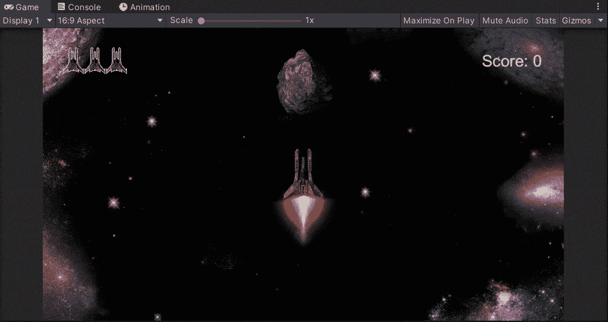

**目标**:设置 Unity 开始在你的游戏中使用后期处理特效。

为了开始在 Unity 中使用后处理，我们需要遵循以下步骤:

*   选择顶部的*窗口>程序包管理器*，打开程序包管理器窗口；

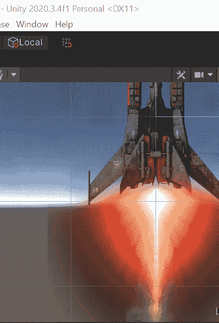

*   打开后，选择 **Unity 注册表**选项，在列表中显示后处理包。然后选择它并点击安装按钮:

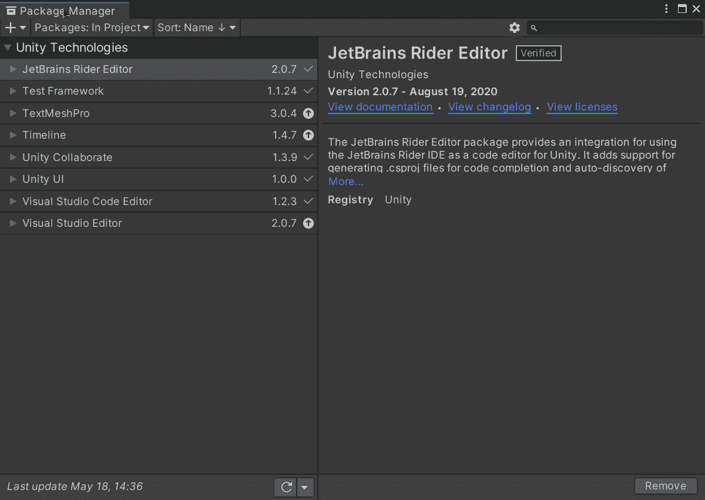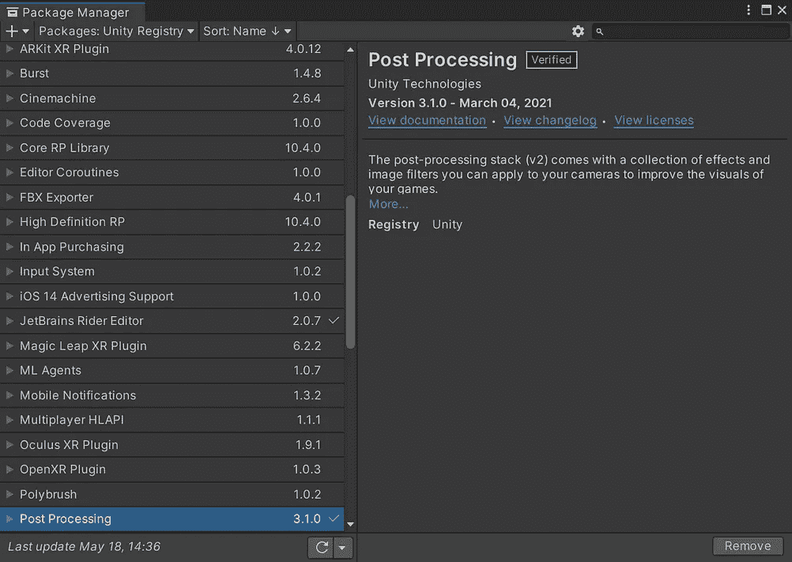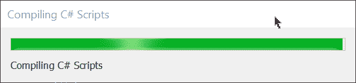

等待软件包安装到您的 Unity 项目中。

*   现在，您将能够在项目视图的包文件夹中显示后处理包:

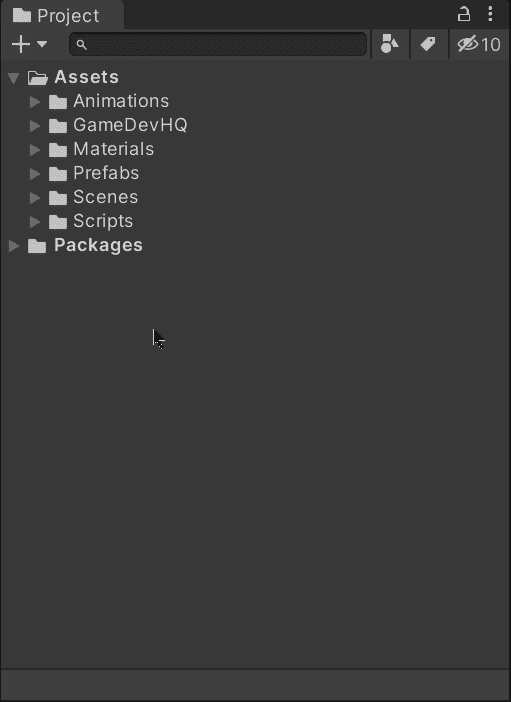

*   安装后，创建一个新的空对象，并向其中添加一个后处理卷组件:

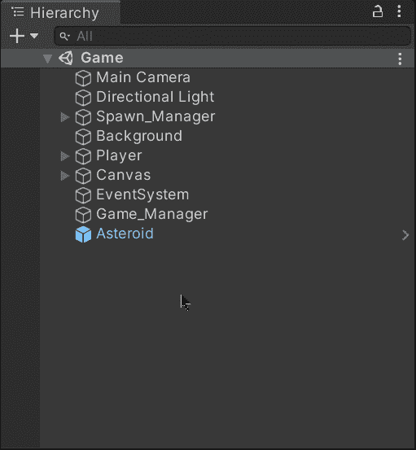

*   选择您希望后处理效果是全局的还是仅是局部的，并通过单击“新建”按钮创建新的后处理配置文件。概要文件将被创建，您可以通过点击它在项目视图中高亮显示它:

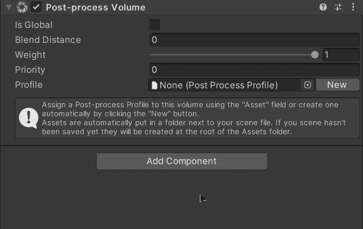

由于我的游戏发生在一个简单的空间环境中，我选择使用全局效果。

*   这样，我们可以开始在游戏中添加不同的后期处理效果:

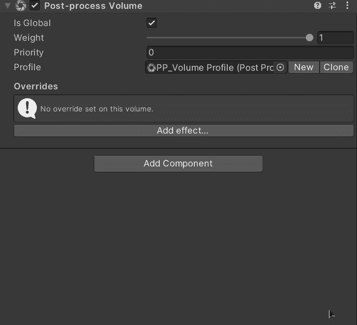

*   但是，为了成功地显示效果，我们需要在相机游戏对象中添加一个后处理层组件:

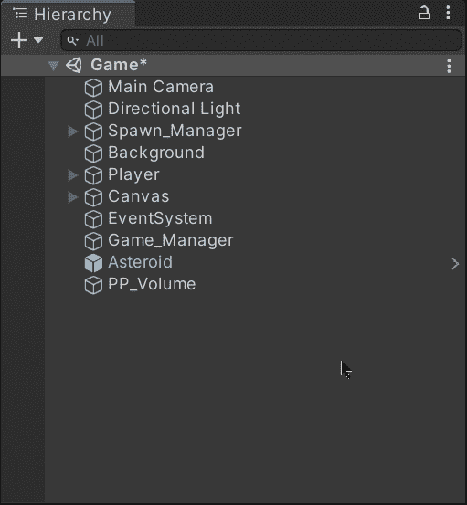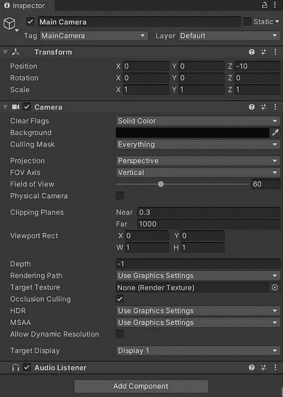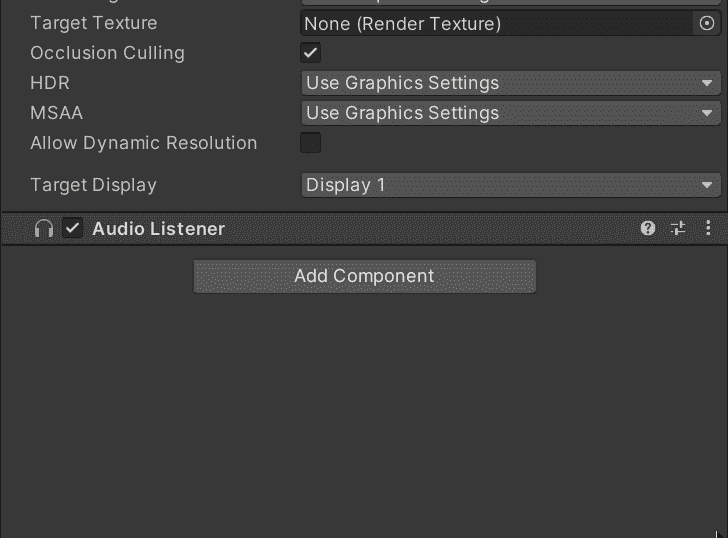

*   然后，让我们通过点击检查器顶部的**添加层**选项来创建一个新的用户层，以指示后处理层组件的层:

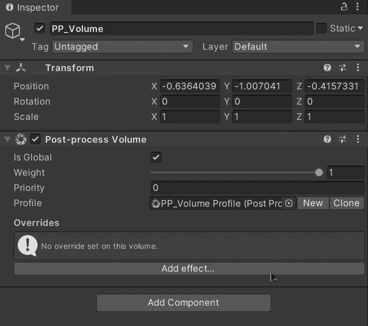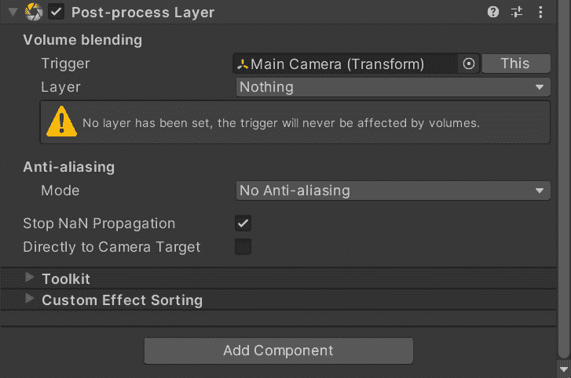

*   此外，确保包含后处理体积组件的空游戏对象设置在同一层以显示效果:

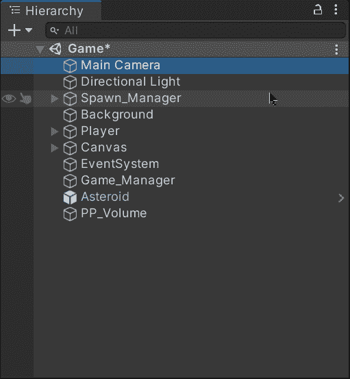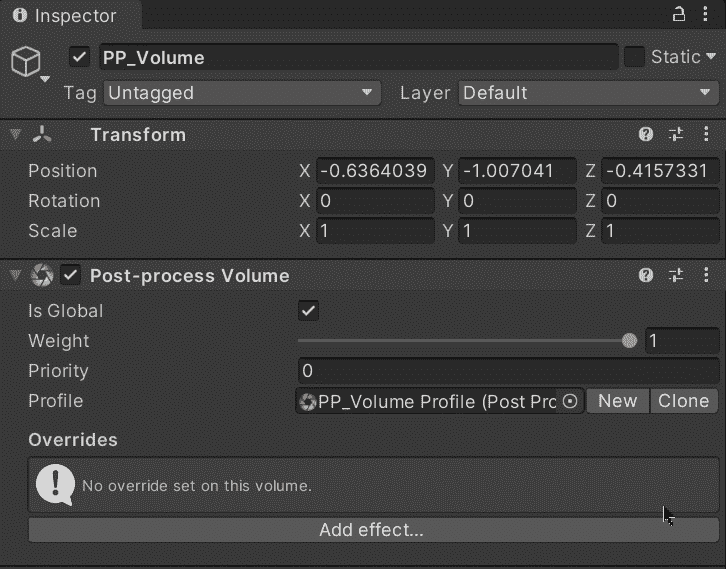

*   现在，我们可以添加任何后期处理效果，并开始通过修改每个效果的不同属性来改变我们在 Unity 中的游戏外观:

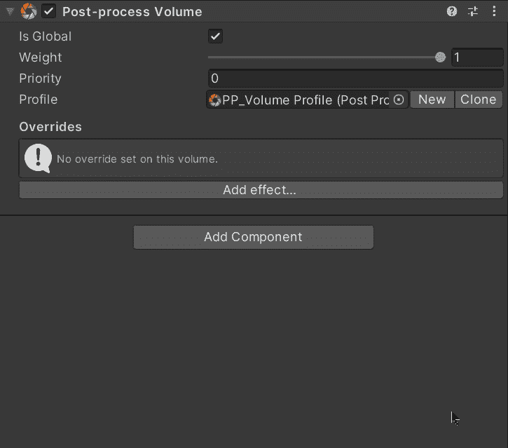

就这样，你可以开始在 Unity 中为你的游戏使用后期处理效果了！:d .我会在下一篇帖子中看到你，在那里我将展示如何使用不同的后期处理效果来使你的游戏进入 Unity 的 AAA 状态。

> *如果你想了解我更多，欢迎登陆*[***LinkedIn***](https://www.linkedin.com/in/fas444/)**或访问我的* [***网站***](http://fernandoalcasan.com/) *:D**