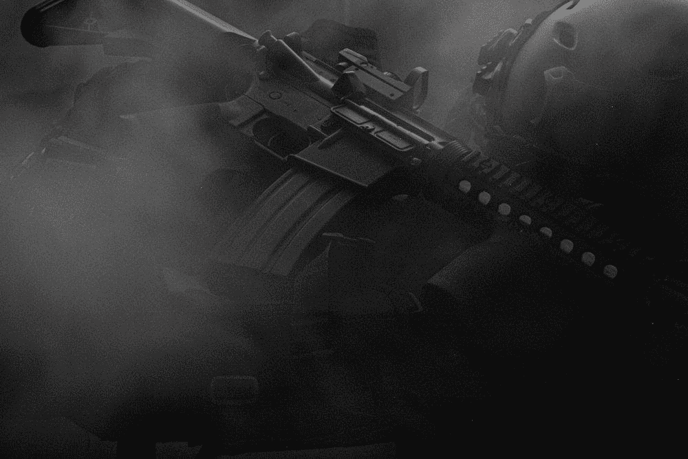
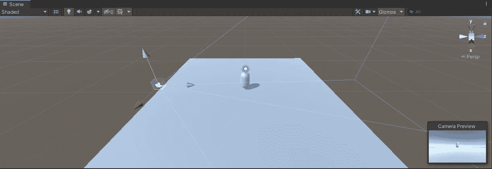

# 在 Unity 中开始一个新项目

> 原文：<https://medium.com/nerd-for-tech/starting-a-new-project-in-unity-e87f9980e0b?source=collection_archive---------16----------------------->

我在 unity 开始了一个新项目。这个项目将是一个第三人称生存射击游戏。

到目前为止，我已经设置了初始场景，并将项目连接到 git 存储库

当我在这个项目上工作的时候，我将会更新我如何为这个游戏创建不同的机制和特性的教程。