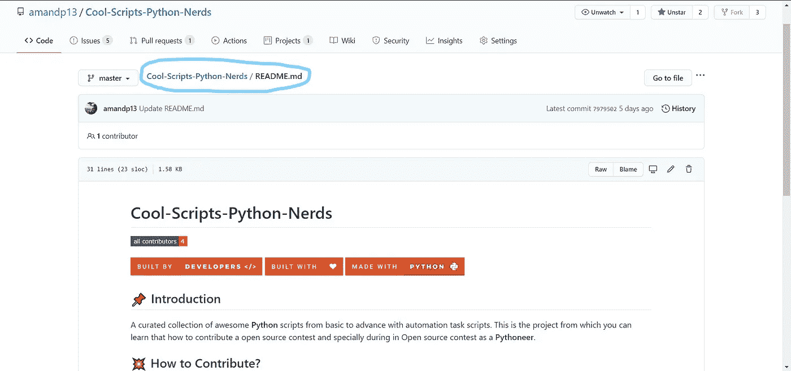
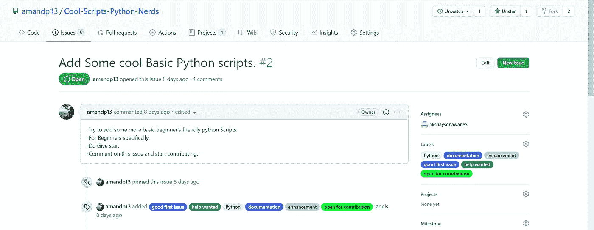
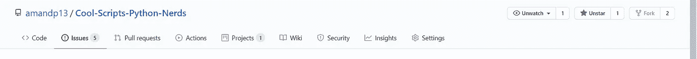
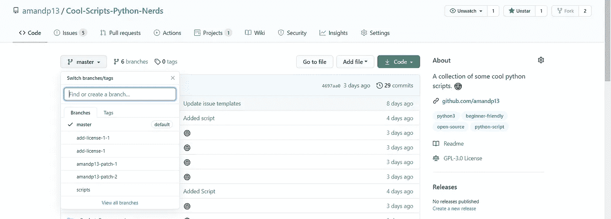
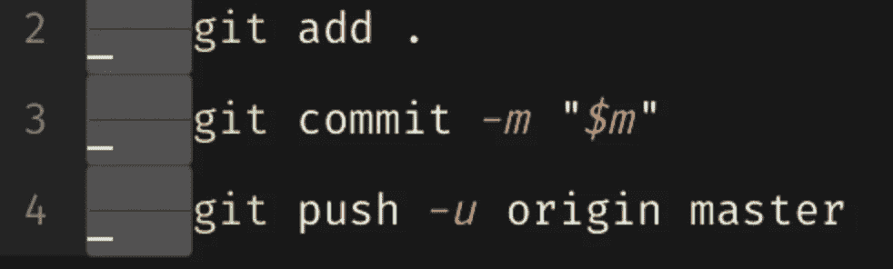
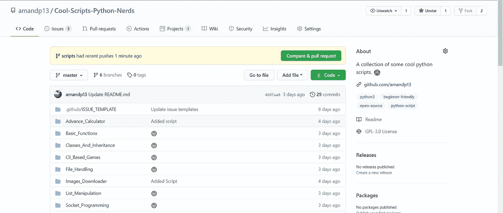
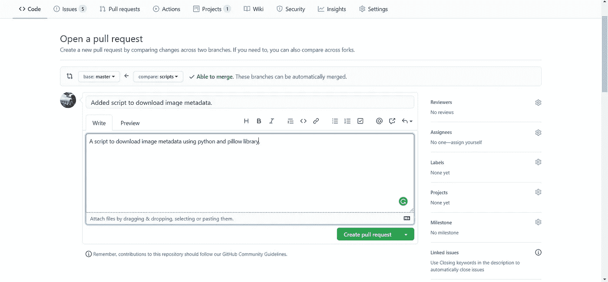

# ✨开始开源贡献。✨

> 原文：<https://medium.com/nerd-for-tech/starting-open-source-contribution-f2e2fe0a0470?source=collection_archive---------2----------------------->

开源贡献入门…

> “在真正的开源中，你有权掌控自己的命运。——莱纳斯·托瓦尔兹


# 那么什么是开源呢？🤔

坦率地说，*开源是对所有人开放的东西*🙂，即它没有真正的所有者。因此它被定义为将原来的**源**T4 代码**免费提供**并可以根据用户的要求重新分发和修改的软件。听起来很有趣，对吧？…这非常有趣。

所以一个**开源** **软件**仅仅是一个带有**源代码** **代码**的软件，任何人都可以根据他/她的需要或工作来检查、修改和增强。

> “我是一个懒惰的人，这就是为什么我喜欢开源，让别人替我做工作。”——莱纳斯·托瓦尔兹

# 现在，为什么要贡献开源呢？🙃

如果你想知道为什么即使你是一个初学者，做出贡献对你来说也很重要，我会列出一些我到目前为止所学到的原因:

1.  你会学到更多关于**编程**的知识，当你踏上编码之旅时，你只学习特定的语言或基本的语法，但你可能很难看到它是如何应用于**现实世界的项目**。
2.  你知道某人正在做什么或已经做了什么，你可以深入研究他的代码，这将帮助你提高你的技能。
3.  通过**提出一个问题或帮助解决一个**，你能够应用你在编程课程中学到的东西。这使你更好地理解这个概念，并在更深的层次上。
4.  学习如何使用像[堆栈溢出](https://stackoverflow.com/)这样的资源和语言文档来解决问题。
5.  你可以帮助其他开发者。
6.  你可以看到一个项目是如何完成和启动的。
7.  作为一名开发人员，你可以提高自己的谷歌搜索技能，谷歌就像上帝一样。😄
8.  开源贡献是一个很好的地方，在这里你可以**与其他开发者**合作，改进他们的代码或者修正他们的代码。
9.  遇到对同一件事感兴趣的人。
10.  你甚至可以参加任何**开源竞赛**比如 [Hakincode](https://hakincodes.tech/) s，e.t.c。

根据我的经验，作为一个初学者，每一个贡献(尽管很小)都是一种成就，值得庆祝。事实上，随着你的学习，你会有动力做出越来越多的贡献。

虽然"**开源**"通常指的是软件，但你可以在任何事情上合作。作为开源项目开发的东西数不胜数。

> 你不仅仅需要有编码技能，或者构建任何项目，或者甚至贡献任何代码，但是你可以贡献，因为你可以用很多方式来统治。在一个项目/软件中有一个文档部分:一个人可以编写或改进它，一个设计部分，例如:创建一个标志，甚至可以举例说明项目是如何使用的，提出一个新的问题，给出建议，等等

# 那么如何入门呢？🏌️

**开源贡献**要求你知道基本的 **git 命令**，也知道如何在 **Github** 上导航。您可以查看 [Git Hub 指南](https://guides.github.com/)，了解基本知识。


马库斯·温克勒在 [Unsplash](https://unsplash.com?utm_source=medium&utm_medium=referral) 上拍摄的照片

**这里有一些术语可能有助于开源项目:**

*   **作者:**创建项目的人。
*   **所有者:**对项目拥有管理所有权的人。
*   贡献者:为项目做出贡献的人。

**这些文件通常列在存储库的顶层，其中一些如下:**

*   **许可证**:每个开源项目都必须有一个[开源许可证](https://choosealicense.com/)。如果项目没有许可证，它就不是开源的。
*   自述文件:自述文件是欢迎新社区成员加入项目的指导手册。它解释了为什么项目是有用的，以及如何开始。
*   **贡献**:READMEs 帮助人们*使用*项目，而贡献文档帮助人们*为项目贡献*。它解释了什么类型的贡献是必要的，以及该过程如何工作。
*   **:行为准则为参与者的相关行为设定了基本规则，有助于营造一个友好、热情的环境。**

> **这里有一些你可以为开源项目做贡献的方法**
> 
> **-提交错误修复。**
> 
> **-添加新功能。**
> 
> **-更新文档。**
> 
> **-回答问题。**
> 
> **-检查代码。**

# **聊了这么多，我们开始吧🤘 …**

1.  **从寻找一些开源项目开始。**

*   **搜索 **GitHub 项目**，这些项目是开源的，并且有**问题**被标记为**好-优先问题**、**初学者友好、容易、** e.t.c **。****
*   **阅读**自述文件。****

**这里是我的**开源库**，你可以在这里试一试你的 OSC。💯**

**[](https://github.com/amandp13/Cool-Scripts-Python-Nerds) [## amand p13/Cool-Scripts-Python-Nerds

### 从基础到高级自动化任务脚本的精彩 Python 脚本精选集合。这是项目…

github.com](https://github.com/amandp13/Cool-Scripts-Python-Nerds) 

这是/将是从基础到高级的一些很酷的 Python 脚本的集合。

## 💥如何投稿💥？

```
All contributions welcomed. Follow these [Contribution.md](https://github.com/amandp13/Cool-Scripts-Python-Nerds/blob/master/Contribution.md) to contribute.
Do read the [Readme.md](https://github.com/amandp13/Cool-Scripts-Python-Nerds/blob/master/README.md) file for better understanding of the project.
```



## 💥入门指南💥：

```
**Take a look at the Existing Issues or create your own Issues!** (The issue tab on Github repositories is where you can search for labels that you can work on).
```


如果你被困在某个地方，请仔细阅读该问题并做一些研究。



> - [ **可选** ]评论“我想为这个问题做点贡献”，这样就可以把它分配给你，然后你就可以开始着手处理它了。附注**这取决于所有者希望你如何贡献**。

```
- Fork the Repository in your account.[See Top right corner of the Repository.]
```



```
- Create a Branch for any Issue that you are working upon.
```



编写提交消息和描述性的附加信息。

```
- Add the files using git add [Add Scripts related to your respective issues]
- Add a commit message!
- Push changes - git push -u origin <name_of_your_branch>
```



```
- Go and check your forked Repository and Click "Compare and pull requests".
```



```
- Create a Pull Request which will be promptly reviewed and suggestions would be added to improve it.
```



# 恭喜👏您创建了拉动式请求。

> 不要等到你“足够好”了才参与项目，开始吧，你会在过程中学习。

*这篇文章也发表在*[***Geeksforgeeks***](https://www.geeksforgeeks.org/)*上。*

> 谢谢你，我希望这对你有帮助。🙏**