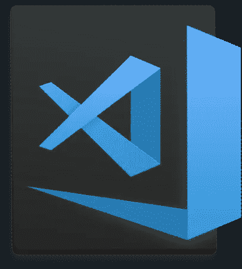
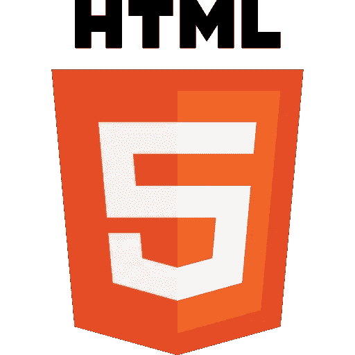
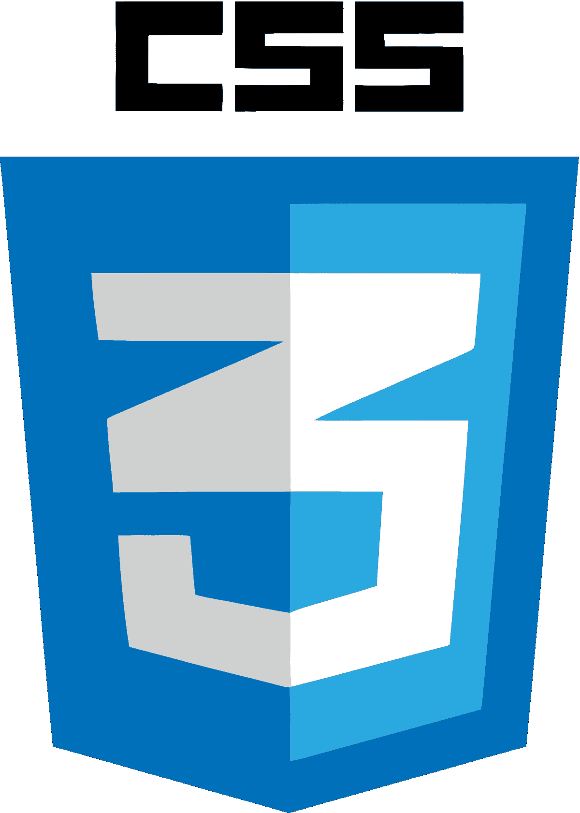
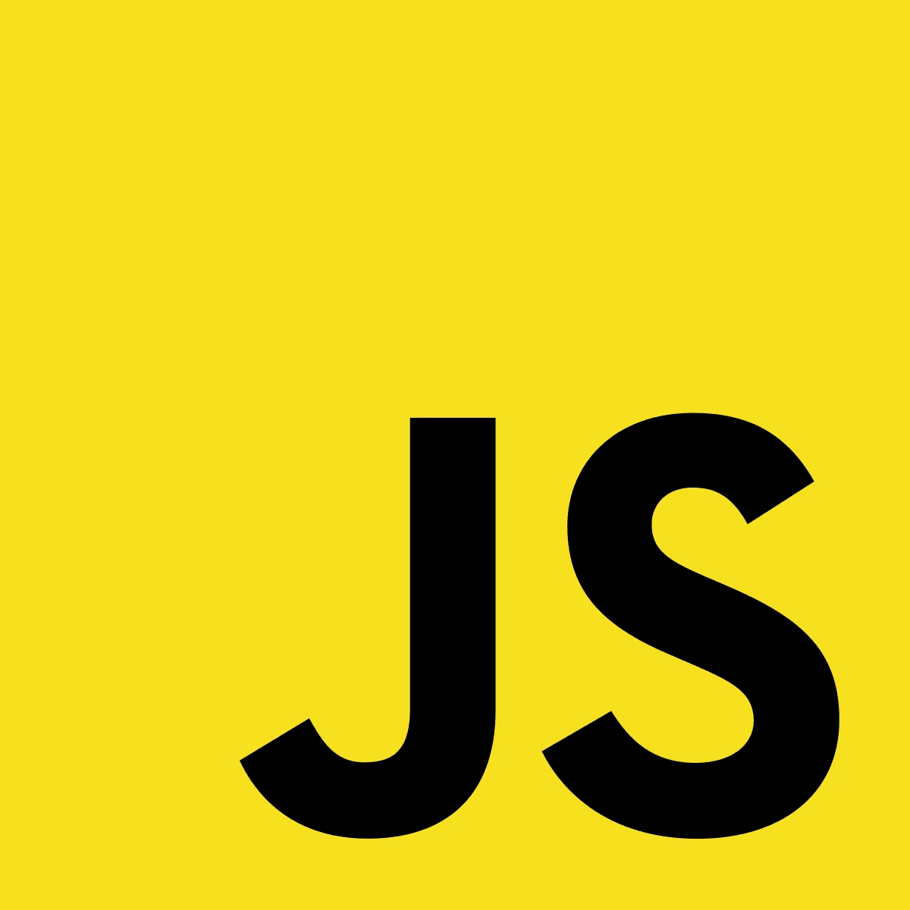

# 2021 年开始网络开发

> 原文：<https://medium.com/nerd-for-tech/starting-web-development-in-2021-105d43940613?source=collection_archive---------4----------------------->

2021 年开始网络开发

如果你想在 2021 年开始网络开发，你可能会非常不知所措🙄。

在这里，我将带您通过一个方便路线图，作为一个完全的初学者开始 web 开发。

**抓紧…**

好的，首先，如果你想开始网站开发，你将成为一名程序员，这意味着你要写一些代码，为了写代码，你需要一个代码编辑器。

## 快速说明⚠

> 如果您打算使用记事本来编写代码，现在就离开它。你将成为一名程序员，而不是一名打字机。

你需要一个为程序员设计的代码编辑器。

代码编辑器不仅可以帮助你编写代码，还可以改善你的编程体验。

有许多代码编辑器，您不必一一尝试。

试试 VS Code，唯一最好的代码编辑器。

现在，如果你不知道你在网上看到东西是建立在三个关键元素之上的
****CSS**和 **JavaScript****

# ****HTML** ，网页的积木🧱**

****

**你在网上看到的所有东西都是 HTML 格式的，比如图像、按钮、文本、形状等等。**

**所以开始学习 HTML 吧，你可以在几周内轻松学会。**

# **CSS，样式🎨网络**

****

**学习完 HTML 之后，你将使用 CSS(层叠样式表)
CSS 帮助设置 HTML 元素的样式，比如对齐它们，改变字体样式，背景图片，颜色，位置等等。**

**这需要你 2-3 周的时间📅来学习 CSS，这样你就可以用 HTML 和 CSS 来构建一些东西👨‍🎨。**

# **JavaScript，编程👨‍💻网络**

****

**现在，在学习了 HTML 和 CSS 之后，你将学习网页的唯一编程语言。**

**JavaScript 帮助你使网页更加动态。**

**学习 JS 需要**10-12 个月**，所以你可以称自己为程序员。**

# **那么接下来呢🤷🏻‍♂️**

****

**图片来自谷歌**

**现在是时候用你学到的所有东西来构建一些项目了。**

**构建项目不仅能帮助你像程序员一样思考，还能让你的编程技能更上一层楼。**

**所以，砰💥在你的键盘上，并通过建立食谱弄脏你的手🍴用编程。**

# **感谢阅读。祝你愉快😎**