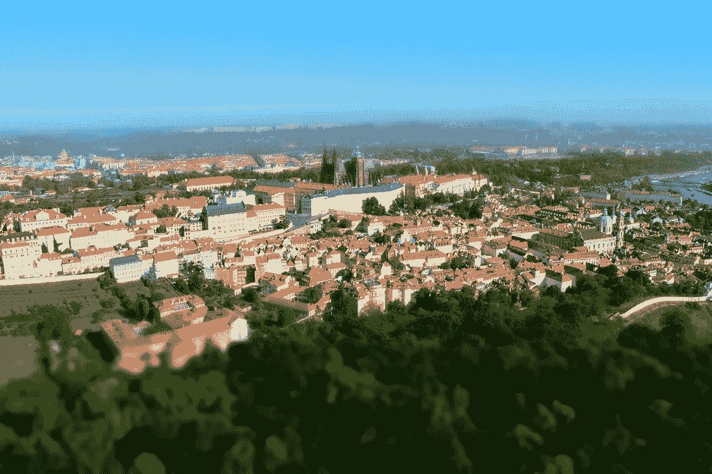

# 从 PHP 中的事件源开始

> 原文：<https://medium.com/nerd-for-tech/starting-with-event-sourcing-in-php-161a83597d69?source=collection_archive---------1----------------------->

你想开始使用 PHP 中的事件源，但是你觉得你没有足够的知识？也许你已经开始了演示项目，但工具太复杂，无法让学习过程变得愉快？
或者你不知道这是怎么回事，你想知道？

如果是这样的话，那么这篇博文将帮助你开始使用 PHP 开发事件源。

# 什么是事件采购？

事件源是一种在一系列事件中存储特定状态的方法。
要了解标准方法的区别，让我们看看*产品实体*。

在这个例子中，我们有状态实体。这个实体允许我们改变产品的价格。我们通过更换旧价格来做到这一点。

然而，如果任何客户会争辩说，当他买的产品便宜 10 美元。我们很难证实这一点。

> *另一方面，事件采购通过设计为这些问题提供了答案。你实现了实体，并获得了回顾过去的可能性，因为状态是从所有发生的事情中传递出来的。*

我们不是直接改变实体状态，而是返回一个事实，关于刚刚发生的事情。通过这种方式，我们可以获取事件并将其存储在数据库中。

那么状态是如何被改变的呢？

通过提供获取事件和修改状态的方法。得益于此，当我们从数据库加载事件时，我们可以调用相关方法并填充实体状态。

# 活动采购来回答你最深层次的问题

我们希望验证客户是否正确，价格应该比他必须支付的价格低 10 美元。怎么才能做到呢？

如果我们存储事件发生的日期，那么我们可以浏览它们，看看在特定时刻的价格。

我们再举一个例子。假设我们的经理想知道每次价格变动之间的确切差价是多少。替他做计算就好了，这样他不用计算器就能直接看到答案。
在这种情况下 ***突起*** 前来救援。

> *投影就像从事件构建的有状态实体，设计用于回答问题或为视图提供数据。*

我们已经创建了*投影*，无论何时价格发生变化，我们都会对其进行更新。回答经理关于价格如何变化的问题，变成了询问预测的问题，因为答案已经从事件中准备好了。

通常你会把它存储在某个数据库中，但是为了举例，我们会把它保存在内存实现中。

# 履行

我们将使用*生态区*和*proof 的事件商店*。它们一起工作就像胶水代码，所以你可以专注于重要的事情，业务功能和流程。

> [*交错区*](https://docs.ecotone.tech/modelling/event-sourcing) *与* [*Prooph 的事件存储*](https://getprooph.org/docs/html/event-store/event_store.html) *一起降低了在 PHP 中构建基于事件的应用程序的门槛，使之成为有趣而愉快的体验。*

在了解更多细节之前，建议先了解一下 [CQRS](https://blog.ecotone.tech/cqrs-in-php/) 和[事件处理](https://blog.ecotone.tech/event-handling-in-php/)的基础知识。

1.  首先，我们需要将我们的*实体*标记为#[*eventsourcingpaggregate]。*
    这将告诉生态区，产品应该用于事件采购。
    如果你想知道什么是集合，你可以把它想象成具有行为的实体。
2.  *#【aggregate identifier】*描述实体的标识符是什么属性。
3.  为事件添加版本控制，因为这是证明所必需的
4.  *#[CommandHandler]* 描述对您的实体的可能操作
5.  *#[EventSourcingHandler]*描述从事件中恢复实体状态的操作

在我们用命令调用我们实体之前，让我们也为经理的需求建立投影。

1.  *#【Projection(" price _ change _ over _ time "，Product::class)】*这个告诉生态区，那个类是名为" *price_change_over_time* "的投影，应该使用来自 *Product* 的事件。
2.  *#【query handler(" product . getpricechange ")】*这允许我们使用路由关键字" product.getPriceChange" *来查询投影。*
3.  *#【EventHandler】*描述这个投影对什么事件感兴趣

# 执行示例

这一切是如何一起玩的？
*命令处理程序*从*命令总线*调用，返回的事件存储在数据库中，从保存的事件中调用*事件源处理程序*和投影。

让我们来执行这个例子:

# 摘要

生态区和 Prooph 为你提供了在 PHP 中构建事件源应用程序的所有必要组件。你可以在内存中存储事件/*PostgreSQL*/*MySQL*/*Maria db*。得益于这两个框架的结合，您可以直接关注业务逻辑，而将粘合代码留给 econtero 和 Prooph。

如果你想看这个例子的完整实现，你可以在这里找到它[。](https://github.com/ecotoneframework/quickstart-examples/tree/master/EventSourcing)