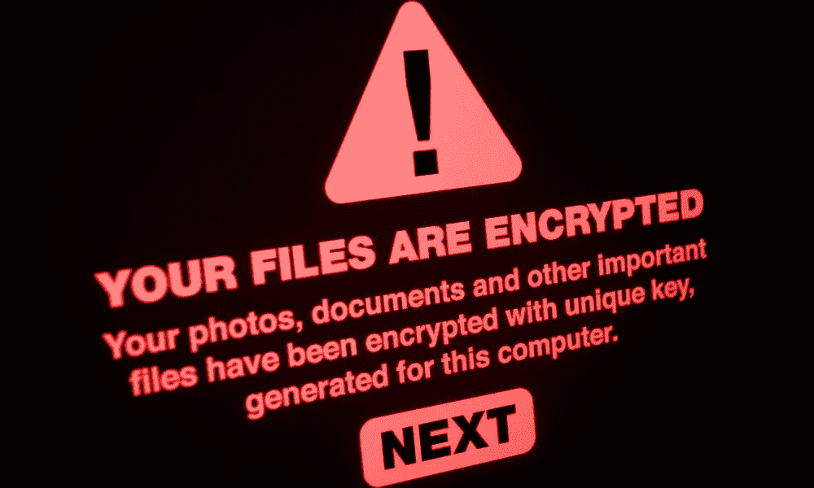

# 创业公司和网络劫匪

> 原文：<https://medium.com/nerd-for-tech/startups-and-cyber-stick-up-men-b4f7b856ddcc?source=collection_archive---------11----------------------->

## 如果勒索软件锁定了您的系统，您会作何反应？对于许多新公司来说，这是一个显而易见的问题:尽快付清欠款。

它像任何一天一样开始。

你坐在办公桌前，打开电脑，打开 Slack，点击你的第一封邮件。

然后突然屏幕变黑了。红色警报开始闪烁:

> *‘呜呜！您的文件现已加密。如果你想再见到他们，就付我们一万美元。你有 8 个小时的时间来回应。*

被迫在你的钱和你的数据之间做出选择，你会怎么做？对于很多企业家来说，答案很简单。

投降并支付现金。

一项对创业公司的调查显示[超过一半(55%)的人愿意支付赎金](https://www.appriver.com/files/documents/cyberthreatindex/Q2-2019-AppRiver-Cyberthreat-Index-for-Business-Survey%20Report.pdf)来取回他们的数据。范围较大一端的扩大规模更有可能带来回报，四分之三的人表示愿意，39%的人表示愿意付出几乎任何代价。

这充分证明了数据对数字商业模式的重要性。只有 36%的受访者认为他们可以在不遭受重大损失的情况下看穿一次成功的攻击。

网络罪犯知道这一点，他们也相应地做好了准备。

Malwarebytes 的一项研究显示，勒索软件攻击上升了 500%。

那是因为它们起作用了。

全球爆发的 WannaCry 和 NotPetya 感染了 150 个国家的电脑，造成了数十亿美元的损失。像马士基和默克这样的跨国公司看到世界各地的计算机和电话网络关闭。佐治亚州亚特兰大市的政府系统。都残废了。英国国民医疗服务体系(NHS)不得不取消 19000 个预约，并花费了近 1 亿英镑来补救损失。

黑客们抢走了大约 20 万美元——与造成的损失相比，这是微不足道的一笔钱——但仍不失为一笔不错的收入。

只有足够多的企业被这种威胁吓住了，以至于无法盈利。

如果调查是准确的，罪犯今天会带着更多的钱逃走。

# 该认输了吗？

当如此多的企业[屈服于勒索](https://www.telegraph.co.uk/technology/2017/12/16/british-companies-stockpile-bitcoin-use-ransomware-hush-money/)以使攻击消失时，它对数字商业的状态说了什么？

或许可以理解为什么自举或天使投资的企业会感到脆弱——他们的网络安全预算通常很少。但事实是，各种规模的组织都有能力阻止勒索病毒。一些权力在于技术解决方案，但更多的权力在于**人**。

如果您想避免在屈服于勒索或失去对业务关键数据的访问权之间做出抉择，请遵循以下步骤:

1.  *定期进行系统备份*并将它们保存在单独的系统中，或者与网络断开的物理介质上。清理受感染的硬件并在系统间重新填充信息需要时间，但你会知道如果灾难性感染发生，有一个可行的 B 计划。
2.  然后*制定一个循序渐进的业务连续性和恢复计划* n。这包括准备好备份并对其进行测试以确保其正常工作，拥有一个手动或辅助流程以在短期内继续任何受影响的服务，知道如果您需要恢复服务应该向谁求助，以及运行模拟以找出计划中的任何弱点。
3.  当安全补丁到来时，不要等着采取行动。WannaCry 的感染导致英国 NHS 服务停止，这得益于微软已经发布了一个安全软件补丁，但是许多 NHS 机器还没有更新。
4.  *了解大多数恶意软件感染来自哪里*。大多数都是通过[网络钓鱼活动](https://thedefenceworks.com/services/phishing-simulation-training/)进入系统。培训员工识别网络钓鱼攻击可能是防范勒索软件和数据安全的最有效方法之一。

# 保护数据不仅仅是技术

也是人的问题。您必须提高整个组织中安全风险的可见性，确保每个人都清楚公司的安全政策，并向员工提供他们需要的知识，以便在攻击发生时发现攻击。

有效的安全意识培训计划是确保企业中的每个人都具备适当水平的安全知识并承担一定程度的个人责任的最佳方式之一。

对于一些企业来说，**简单地支付赎金**并希望立即恢复运营似乎是一个可行的选择——但这很难作为业务连续性的方法推荐。甚至[网络安全初创公司](https://techcrunch.com/2020/09/03/cygilant-ransomware/)也可能容易受到攻击。

平衡业务中断的成本和恢复的成本可能会诱使您屈服于赎金要求。但是，即使你做了勒索者要求的一切——你能拿回你的数据吗？

网络安全社区的意见不一，但是 CyberEdge 的一项研究表明[不到 20%的付费解密文件的组织实际上拿回了文件。](http://cyber-edge.com/cdr/)

这是一次冒险的赌博。