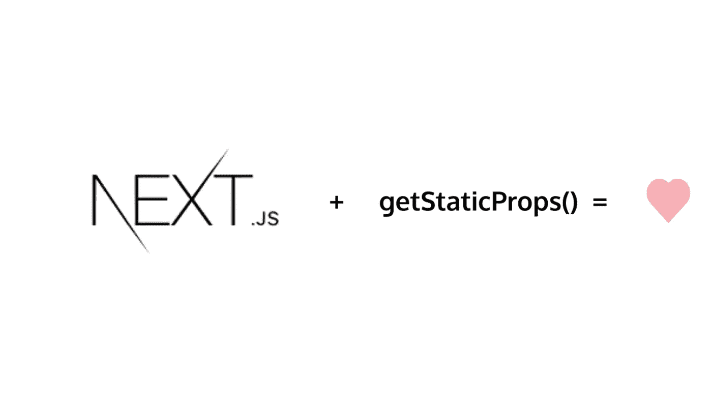

# 使用 getStaticProps 进行静态生成

> 原文：<https://medium.com/nerd-for-tech/static-generation-with-getstaticprops-7568de1e91b4?source=collection_archive---------9----------------------->

**静态生成**意味着我们在构建期间预先生成一个页面。这样，构成内容的所有 HTML 数据在构建时就已经加载到页面中了。所谓构建，我指的是在应用程序部署期间预渲染应用程序。

部署应用程序后，页面会提前准备好。允许它们被服务于应用的服务器/ **CDN** (内容交付网络)缓存。现在，当一个客户机请求服务器时，如果有任何传入的请求正在被解析，那么页面可以被分离给客户机。

只有在 pages 文件夹中，我们才能使用:

> 可以添加到 pages 目录下的任何页面文件中

NextJS 会自动预生成。但是我们想告诉 NextJS 我们希望预渲染哪些文件；我们可以这样做:

NextJS 首先执行`getStaticProps`，然后渲染`HomePage()`组件。

`getStaticProps`不仅允许我们编写服务器端代码，还允许我们导入节点模块，如`fs`节点文件系统。

我们可以用 NextJS 做的其他很酷的事情。

> 旁注:记住`JSON`，是一个在浏览器端和节点上都有的全局对象。

我们可以通过运行测试我们的构建

npm 运行构建
npm 启动

这将允许我们看到为我们的应用程序构建了什么…