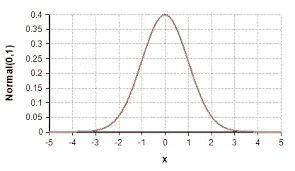
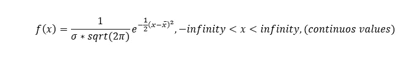
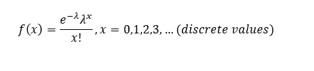
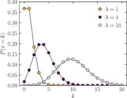
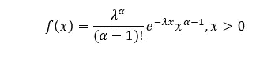
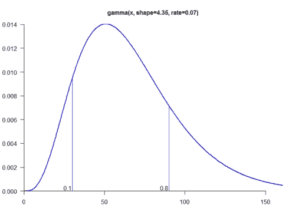
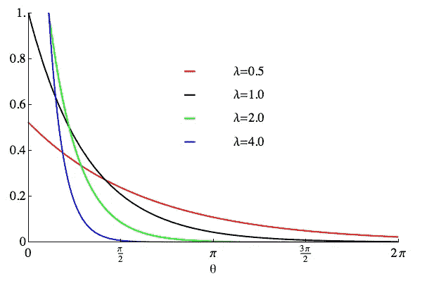
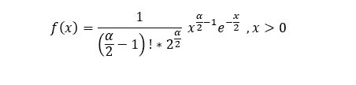
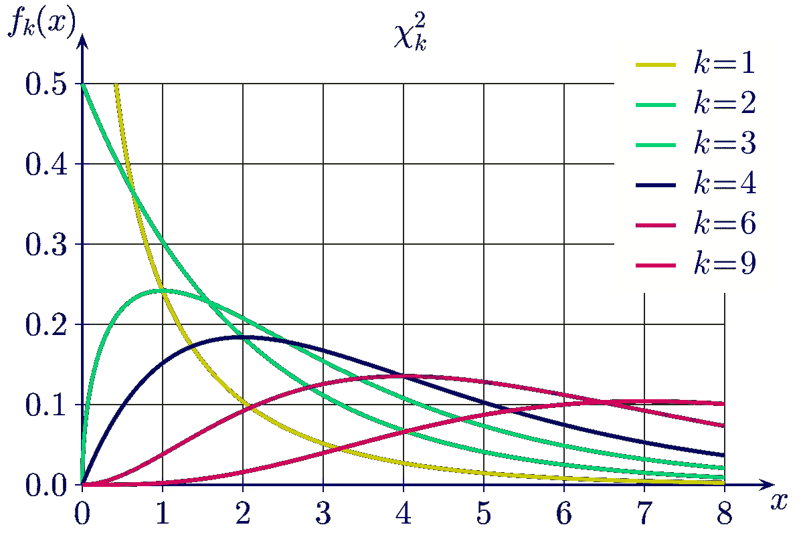

# 数据科学职业生涯的统计分布

> 原文：<https://medium.com/nerd-for-tech/statistical-distributions-aabea60f8540?source=collection_archive---------18----------------------->

正如我们所讨论的，你需要了解统计学的基础知识，以便能够更好地分析数据。数据科学行业中最重要的一个统计学主题是分布的概念。

由[尼古拉斯·卡佩罗](https://unsplash.com/@bash__profile?utm_source=medium&utm_medium=referral)在 [Unsplash](https://unsplash.com?utm_source=medium&utm_medium=referral) 上拍摄的照片

还等什么！让我们深入研究数据科学及其应用所需的重要理论。

但是首先让我们理解，它在统计学中的分布是什么意思？这个分布有特定的参数，这使得每个分布都与众不同。它是一组预先确定的观察结果，这些观察结果很可能基于总体的模式而出现，例如，如果我们观察某个实验的样本，它应该来自该特定实验的唯一分布(*换句话说，样本应该来自该实验遵循的分布)*。

从图形上看，我们可以说每个分布都有一个不同的模式，随机变量的值不断变化。一个分布可能随着变量值的上升而上升，而另一个可能有下降的趋势。每个这样的分布都是我们所说的独特“分布”的一个例子。

此外，我们可以找到实验的基本信息，使用下面的分布统计。

# **伯努利分布:X ~二项式(n，p)**

让我们以投掷骰子的结果为例来理解这一点。假设我们想要模拟在骰子 上得到偶数的 ***次数。*中的每一次投掷都独立于前一次*和*投掷中特定数字出现的概率，在整个实验过程中是相等且恒定的*。因此，它满足伯努利分布的基本要求。(*同样，每个分布都有自己的一套假设，这使得它们是独一无二的)。****

**概率:**现在，假设，我们想知道在接下来的四次投掷中获得两个偶数的概率是多少。如果我们将 X 定义为一个随机变量，即我们从 n 次试验中观察到一个偶数的次数。那么数学上我们需要 X = 2，n=4 的概率。因此我们需要:P(X=2)！

*R 码:dbinom(x，n，p)#其中 p 是一次掷出偶数的概率。
这里变成了
> dbinom(2，4，1/2)*

**分布函数:**求 7 投中至少 5 投得到偶数的概率。这里我们在技术上关注的是 CDF ( *或者通俗地说，给出 X ≤x 的概率的一般函数，这里 X 是随机值，这里为 5* )。这里，我们使用如下所示的内置函数:

*R 代码:
> pbinom(5，7，1/2)*

**分布四分位数:**给定我们想要的概率 0.25，我们得到偶数的次数(我们得到偶数的次数)。即，我们希望找到分布的第一个四分位数，我们使用下面的 r 代码。

*R 代码:
> qbinom(0.25，n，p)*

# **正态分布:X~N( mu，sigma )**

这是预测建模中最常用的分布之一。毕竟，大多数线性回归、多元回归和其他模型构建形式的假设都是基于这些。举一个这样的例子:当拟合线性回归模型时，从拟合的模型获得的残差应该遵循正态分布。

什么是正态分布？它采用参数 mu(总体均值)和 sigma(方差)。mu 和 sigma 的无限可能组合可以有几种趋势。但是总的图形趋势如下所示。

图片来自谷歌，链接:[https://wiki.analytica.com/index.php?title =正态分布](https://wiki.analytica.com/index.php?title=Normal_distribution)

下面给出了它的数学方程，也称为“pdf”。(*钟形曲线下的面积等于 1，因为总概率总是等于 1)。*

正态分布 PDF，图片由作者提供

注意:*由于是连续分布，我们无法找到精确的点概率。*

PDF 在某一点的值，即 P(X=x)
*> dnorm(x，mu，sigma)#注意，这里要输入的第二个参数不是方差而是标准差。*

分布函数:P(X≤x)
*> pnorm(x，mu，sigma)*

现在，80 百分位
> qnorm(0.8，mu，sigma)

# 泊松分布:X~泊松(λ)

派对上客人的到来遵循这种单参数分布或模式(为简单起见，*)。*基本分布函数由下式给出:

泊松分布的 PDF，图片由作者提供

一旦我们为一个特定的参数绘制了图形，对于 X 的整个区域，我们得到下面的图形分布。

图片来自谷歌，[https://en.wikipedia.org/wiki/Poisson_distribution](https://en.wikipedia.org/wiki/Poisson_distribution)

PDF 在某一点的值，即 P(X=x)
*> dpois(x，l)#这里，l =λ*

分布函数:P(X≤x)
*> ppois(x，l)*

现在，80 百分位的
>qpi(0.8，l)

# 伽玛分布:X~伽玛(α，λ)

这也是应用范围最广的发行版之一。它也是许多其他发行版的基础。它的基本分布函数以两个参数为要求。pdf 是:

伽玛分布的 PDF

一旦我们为一个特定的参数绘制了图形，对于 X 的整个区域，我们得到下面的图形分布。

图片来自谷歌，[https://blog . revolution analytics . com/2015/10/parameters-and-percentiles-the-gamma-distribution . html](https://blog.revolutionanalytics.com/2015/10/parameters-and-percentiles-the-gamma-distribution.html)

PDF 在一点的值，即 P(X=x)
*> dgamma(x，a，l)#这里，a =α，l =λ*

分布函数:P(X≤x)
*> pgamma(x，a，l)*

现在，80 百分位
> qgamma(0.8，a，l)

克里斯·里德在 [Unsplash](https://unsplash.com?utm_source=medium&utm_medium=referral) 上拍摄的照片

# 指数分布:X ~ Exp(λ)

当α= 1 时，这是伽马分布的特殊情况。它用于模拟特定事件之间的持续时间或时间流逝，例如，*下一次地震之间的时间。*

这里，pdf 由下式给出:

指数的 PDF，图片由作者提供

一旦我们为一个特定的参数绘制了图形，对于 X 的整个区域，我们得到下面的图形分布。

图片来自谷歌，[https://en . Wikipedia . org/wiki/Wrapped _ exponential _ distribution](https://en.wikipedia.org/wiki/Wrapped_exponential_distribution)

PDF 在某一点的值，即 P(X=x)
*> dexp(x，l)#这里，a=1，l =λ*

分布函数:P(X≤x)
*> pexp(x，l)*

现在，80 百分位
> qexp(0.8，l)

# 分布

这也是一个应用广泛的重要分布。它的基本分布函数以一个参数为要求。pdf 是:

卡方分布的 PDF，图片由作者提供

一旦我们为一个特定的参数绘制了图形，对于 X 的整个区域，我们得到下面的图形分布。

图片来自谷歌，[https://en.wikipedia.org/wiki/Chi-square_distribution](https://en.wikipedia.org/wiki/Chi-square_distribution)

PDF 在某一点的值，即 P(X=x)
*> dchisq(x，DF)#这里，df 是分布的自由度(它所取的参数)*

分布函数:P(X≤x)
*> pchisq(x，df)*

现在，80 百分位
> qchisq(0.8，df)

希望你喜欢这些非常基本，但非常有用的统计概念。

快乐学习！