# 统计检验

> 原文：<https://medium.com/nerd-for-tech/statistical-test-979d2edf2f1d?source=collection_archive---------14----------------------->

我的数据科学之旅(第 3.1 部分)

凯利·西克玛在 [Unsplash](https://unsplash.com?utm_source=medium&utm_medium=referral) 上的照片

抽取样本是因为收集整个人口数据需要大量的时间和金钱；在我们能够分析样本数据并从中得出推论之前，需要进行统计检验，以检查抽取的样本是否来自被研究的总体。

# 不同类型的测试及其目的

# **相关性测试**

相关性用于测试变量之间的关系，它是对事物之间关系的一种度量。

## 皮尔逊相关系数

它测量两个变量之间关系的方向和大小。范围从[-1 到 1]，1 表示最强相关，-1 表示强负相关，0 表示无相关。

## 斯皮尔曼等级相关

Spearman 相关是 Pearsons 相关的非参数版本。spearman 相关性衡量两个排序变量之间单调关联的强度和方向。(通过将最高值指定为等级 1 来指定等级，第二高的值排名第二，依此类推)，在已排名的变量上找到相关性。Spearman 相关可应用于顺序数据和连续数据。范围[-1 到 1]。

单调关系:如果一个变量增加/减少，另一个变量不会减少/增加。

## 肯德尔等级相关

肯德尔相关性是一种非参数相关性，用于测量两个变量之间的顺序关联(每个变量的大小与指定的等级无关)。通过将最低的值定为等级 1，次低的值定为等级 2，等等，给变量分配等级。

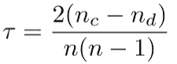

肯德尔氏τ

nc =一致对的数量

nd =不一致对的数量

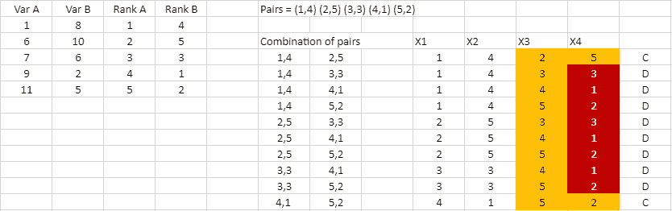

Var A、Var B 是分配了等级的实际数据；然后等级被配对和组合

如果 X3>X1 和 X4>X2，那么它就是和谐对，否则就是不和谐对

C=2 和 D=8，肯德尔的τ=-0.6 反相关

因为我们采用等级并使用等级进行计算，所以它对异常值很敏感

## 卡方检验

独立性卡方检验确定分类变量之间是否存在关联。这是非参数检验。

**拟合优度**

例如，75 名学生中，11 名是左撇子。这个样本符合 12%是左撇子的理论吗？

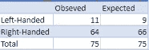

观察值和期望值的交叉表

期望值和观测值有多远？

预期(左撇子)= 75 的 12%

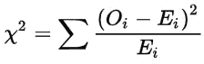

Oi =观察到的

Ei =预期

H0:理论是正确的(12%左撇子)= 0.12

H1:理论是错误的(x%左撇子)≠ 0.12

自由度=(行数-1 )*(列数-1)，显著性=0.05

chi2 =(11–9)/9 = 0.505，从表中我们得到 3.84

自 Chi2 < 3.84 H0 is accepted ( 12% are left-handed or there is not enough evidence to prove the proportion of left-handed is other than 12%)

**独立性测试**开始，如果 Chi2 > 3.84(来自 Chi 分布表的值)，则 H0 被拒绝

例如，120 个人被调查以检查他们偏好的社交媒体。社交媒体偏好与性别无关吗？

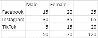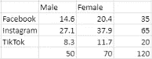

观察值通过乘以边际概率并除以总和而转换为期望值。

e 为 15(脸书和男性)=(50*35)/120=14.6

自由度=2，显著性值= 0.05

H0:独立

H1:依赖

chi2 =(15–14.6)/14.6+(30–27.1)/27.1+…。=2.84

拒绝如果 Chi2>5.991，H0 是公认的社交媒体，性别独立。

# **常态测试**

确定数据集是否遵循正态分布

## 夏皮罗-维尔克试验

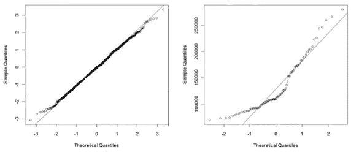

正态分布与非正态分布

对于单变量连续数据，QQ 图(分位数-分位数图)将绘制具有相同均值和标准差的正态分布的数据分位数与预期分位数，样本分位数与预期分位数(如果样本为正态分布)。

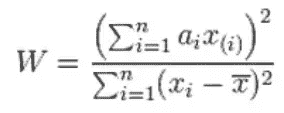

分子:QQ 图的平方斜率

ai =样品重量

H0: w=1 数据呈正态分布

H1: w≠1 数据不是正态分布

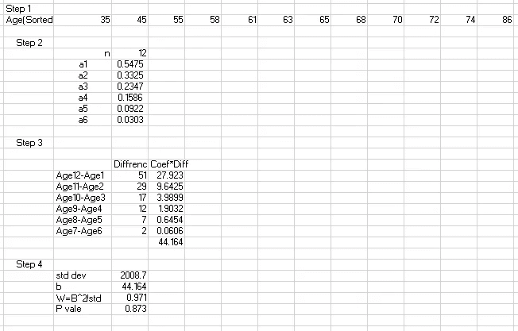

步骤 1:对数据进行排序

第二步:从夏皮罗-维尔克系数表中找出系数值

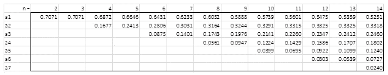

夏皮罗-维尔克系数表

第三步:找出第一个和最后一个元素之间的差，然后是第二个和倒数第二个，并将差乘以系数。

步骤 4:计算标准差和标准差

步骤 5:从表中找到 P 值

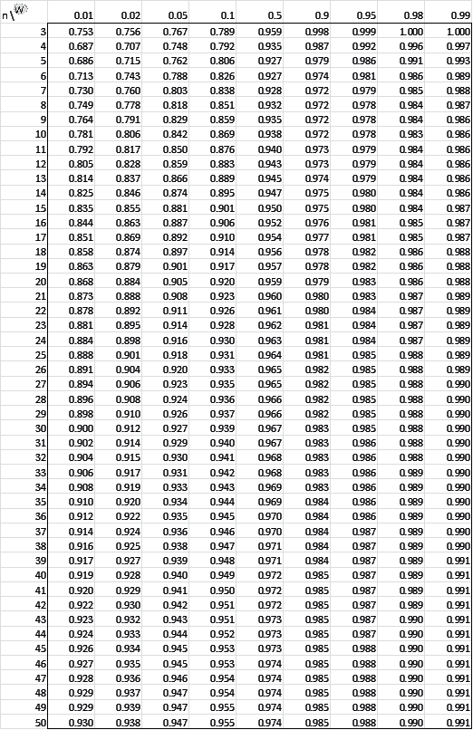

因为 P=0.873 >0.05，所以接受零假设。给定的分布遵循正态分布。

## 达戈斯蒂诺的 K 平方检验

该测试基于偏度、正态分布和峰度

正态分布没有偏斜。峰度衡量分布的尾部与正态分布的尾部的差异程度。正态分布的值为 3

# 参数统计假设检验

参数分析依赖于正态分布的数据，因此可以对潜在人群的参数进行估计。

## 学生的 t 检验(不成对)

学生 t 检验测试两个独立样本是否彼此显著不同

我们不能只使用两个分布的平均值来决定它是否显著不同，样本的方差也会影响

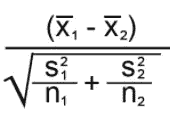

t 统计

样品 1 和 2 x̅1 x̅2=平均值

s1 s2 =样本 1 和 2 的标准差

n1 n2 =观察次数

H0:无统计学显著差异μ1=μ2 或{μ1-μ2}=0 → μd=0

H1:两个样本都是不同的μ1≦μ2 或{μ1-μ2}≠0 →μd≠0 ( <or>或≦)</or>

1.  左尾:T>Tc(临界值)
2.  右尾:T
3.  两条尾巴:-Tc

## 配对学生 t 检验

成对样本 *t* 检验或非独立样本 *t* 检验用于确定两组观察值之间的平均差异是否为零。这里两个样本都是相关的。

例如之前和之后的情况，在计划之前和计划之后评估培训计划的有效性

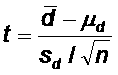

.

d̅=the 差异均值

Sd =差值的标准差

μd=假设差异，其中样本的平均差异为 0 或其他

H0:无统计学显著差异μd=0 或某值(<or>或≦)</or>

H1:两个样本的μd≠0 ( <or>或≦)</or>

1.  左尾:T>Tc(临界值)
2.  右尾:T
3.  Two Tail: -Tc

## Analysis of Variance Test (ANOVA or F Test)

Used to analyze the difference in the mean of more than 2 independent groups, it checks the impact of one or more features.

**F 统计量:**衡量不同样本的均值是否显著不同的统计量。F 比率越低，样本均值越相似。f 分布没有负值，所以它只有一条尾巴。它是组内变异和组间变异的比率。

**两种类型的方差**

1.  组内方差:从一个尾部到另一个尾部围绕平均值或长度的数据分布
2.  组间方差:两个样本的平均值之差

t 检验是一种确定两个群体在统计上是否不同的方法。相比之下，ANOVA 确定三个或三个以上的群体在统计上是否彼此不同。

## 单向方差分析

研究中采用了一个因素，例如背景噪音如何影响学习

H0: μ1=μ2=μ3

H1:至少有 1 个样本μ是不同的

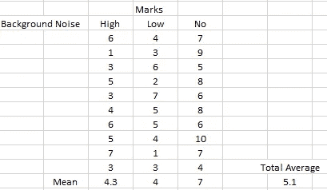

这里三个不同的班级用不同的学生进行了测试，而不是同一个班级用三个不同的测试

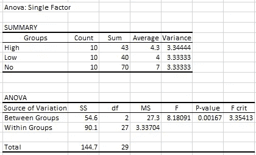

组间=组高、低、无之间的方差

组内=高方差+低方差+无方差

ss =平方和它量化了可变性

ms =均方，平均方差(ss/df)

f =检验统计= ms(组间)/ms(组内)

因为 F > Fcrit 或 P 值< 0.05, H0 is rejected. That is, the mean of at least 1 group is different

Note- The one way ANOVA does not tell which mean is significantly different from other, further test should be conducted (post-hoc test)

## Two Way Anova

Two factors are taken for the studying, e.g., How does background noise affects the studies of the student of different age.

Two-way ANOVA can have up to 3 hypotheses.

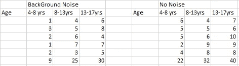

Two Null hypothesis

H1: No difference in the mean for background noise and no noise
H2:各年龄组的平均值无差异

替代假设

H3:这两个组的平均值有差异，或者是年龄差异，或者是噪音差异，或者两者都有

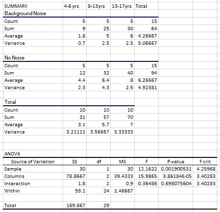

使用 Excel

在上图中，方差分析部分，

1.  样本:说明背景噪声组和无噪声组之间的差异，因为 F 统计大于 F 临界或 P 值<0.05, H1 is rejected that is there is a difference in the mean of the Background noise group and No noise group.
2.  Columns: represents the age. It tells the difference in the age groups. F> F 临界，所以 H2 被拒绝，年龄组的平均值存在差异。
3.  相互作用:这表明噪音和年龄之间的相互作用是否显著。在这里，相互作用并不重要。噪音和年龄没有交互作用。也就是说，噪音因素对分数的影响和年龄因素一样。

## 重复测量方差分析检验

它与单向方差分析相同，但具有依赖水平(以某种方式共享可变性)，例如，抗焦虑药物在治疗前、治疗后和治疗后 2 周对患者的作用，因为在治疗前、治疗后 1 周、治疗后 2 周是同一患者，所以这些水平是依赖的。

H0: μ1=μ2=μ3

H1:至少有 1 个样本μ是不同的

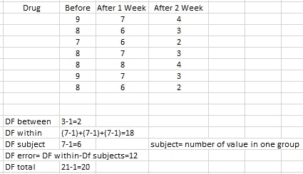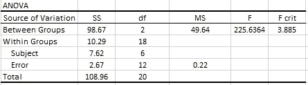

使用 F 分布表中的 DF between 和 Df within 找到 Fcrit，=3.885

由于 F>Fcrit H0 被拒绝，这是有显着差异的焦虑水平

**方差分析**

一种方法:1 个因素(分类)来分析分数(从属特征)

两种方法:2 个因素(分类)来分析从属特征

**方差分析**(多变量方差分析)

一种方法:1 个因素(研究周期(分类))来分析 2 个相关特征(测试分数和收入)

两种方法:2 个因素，(学习期间(分类)，焦虑(分类))用于 2 个相关特征(考试分数和收入)

**安科瓦**

c 代表协方差。在方差分析中，单因素方差分析有一个分类因子(背景噪声、低噪声、无噪声)，而对于双因素方差分析，两个因子都是分类的(背景噪声(是、否、低)和年龄组)

ANCOVA 的不同之处在于，它有一个分类因子和另一个称为协变量的连续因子，例如因子 1 焦虑水平(分类)和一个协变量(研究小时数)来分析测试分数。

如果去掉因素 1，那么结果将是一个回归(学习小时数(连续)和分数(连续目标) )

**曼科娃**

man ova+一个协变量，与 MANVOA 相同，它有两个或更多从属特征，但有一个因子和一个协变量

一种方法:1 个因素(研究周期(分类))和一个协变量(年龄(连续))来分析 2 个相关特征(考试分数和收入)

两种方法:两个因素(学习期间(分类)，焦虑(分类))和一个协变量(年龄)用于两个相关特征(考试分数和收入)

MANOVA 和 MANCOVA 都有两个或更多的从属特征(要分析的特征)

# **非参数统计假设检验**

不假设样本取自正态分布的统计推断。在非参数检验中，中位数用来比较不同的样本，而不是平均值。

## 单一样本或配对样本

匹配对表示之前和之后的情况，其中获取之前和之后之间的差异，并将其视为单个样本。

例如，给定 10 个患者的血红蛋白水平，中值血红蛋白水平是否小于 13.0g/dl

H0: η=13

H1: η <13

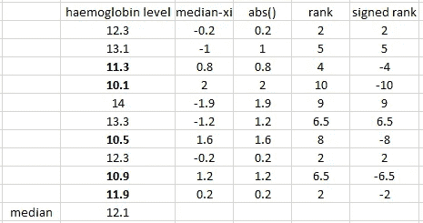

The sum of +ve rank =24.5

The sum of -ve rank=30.5

W(test statistic)=min(24.5,30.5)=24.5

if W

Wc=10 so, H0 is accepted

## Mann Witney

For two samples

e.g., hemoglobin level for two samples, male and female

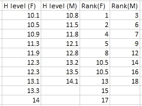

H0: η1=η2

H1: η1≠η2

The sum of rank for female Tf=86

The sum of rank for male Tm=85

T=85(consider the lowest sum as the test statistic)

ET(Expected Test Statistic)= 1/2×n1(n1+n2+1)=76

From the Mann witney table, get W for m(n1)and n(n2). The W is given in an interval. if ET is within the interval, H0 is accepted

since ET=76 is in between [53,99], H0 is accepted, there is no difference in the median for two sample

# Proportion

hypothesis-testing based on sample proportion instead of the sample mean, just like z test

e.g., 70% of the population of a town own a phone, 200 samples are collected to check if this is true and out of 200 130 owned cell phone is 70% correct?

H0: po=0.70, qo=(1–0.70)=0.30

H1: po≠0.70

n=200, x=130, p̂(sample proportion) =x/n =0.65

Zc(critical point beyond which H0 is rejected)= 1.96 ( Zc for area value of 0.025, since it is a two-tailed test)

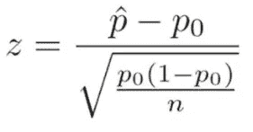

Z=-1.54, since -1.96

## Two Sample Proportion

e.g., two products are manufactured and tested for defects. Product 1 has 32 defects out of 800 manufactured, and for product 2, 30 products were defective out of 500 manufactured. Is there a difference in both groups?

H0: p1=p2

H1: p1≠p2

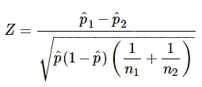

p̂1=x1/n1=0.04

p̂2=x2/n2=0.06

Zc=1.96

Z=-1.646, Since -1.96

# Choosing The Right Statistical Test

Data can be categorized into two categories Categorical variables and Numerical variables.

## Categorical Variable

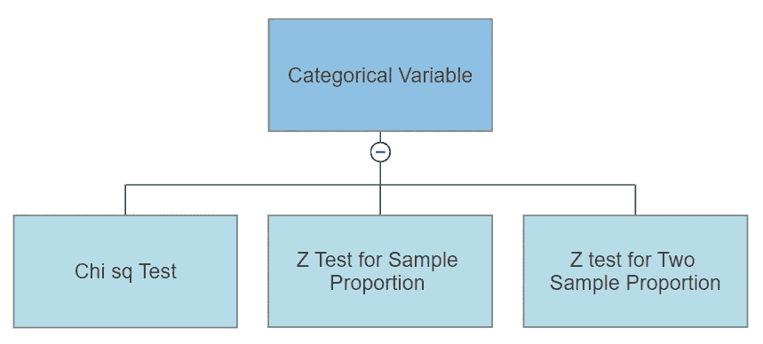

## Numerical Variable

Numerical Variable further classified into 1 sample, 2 samples, > 2 个样本。

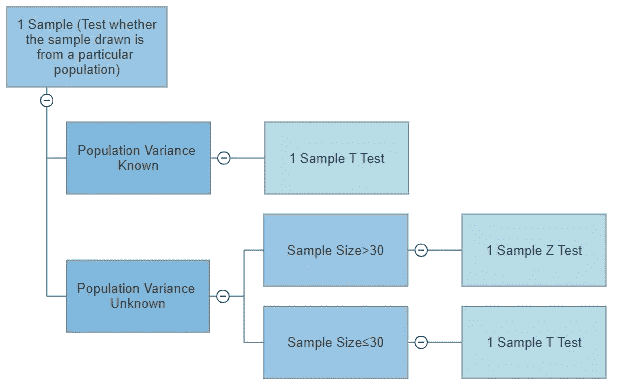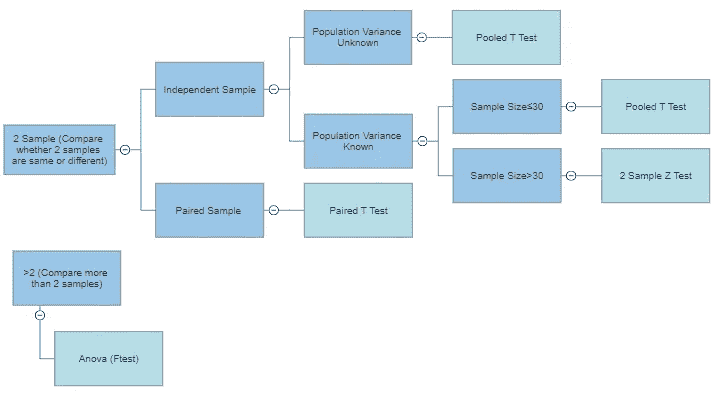

感谢您的阅读