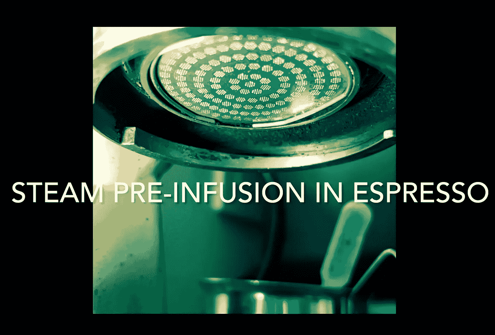

# 浓缩咖啡的蒸汽预浸:综述

> 原文：<https://medium.com/nerd-for-tech/steam-pre-infusion-for-espresso-a-summary-1c58c65a937a?source=collection_archive---------0----------------------->

## 咖啡数据科学

## 收集一些蒸汽

蒸汽预注入开始是因为我的实验比较了体面的浓缩咖啡机和金快车。然后，我努力找出金快车优于德快车的一些原因，我发现了一些蒸汽预注入。然后我努力去理解它，最终我为我的 DE 设计了一个概要文件，试图模仿它。

以下是这份总结的大纲:

1.  DE 与 Kim Express 的比较
2.  咖啡打喷嚏了
3.  蒸汽预注入的历史
4.  DE 的蒸汽预注入

所有图片由作者提供

# 德 vs 金快递

在使用了 DE 五个月后，我觉得应该对我的 Kim Express 进行配对测试。

金不仅仅是好了一点点；差距是巨大的。我仍然每天使用我的 DE，我相信它可以做得更好。我还不知道怎么做。

这让我觉得我错过了一个变量，这就是为什么这被称为第一轮。我相信我可以做一个更好的简介，但更深入地了解金是必要的。

 [## 体面的浓缩咖啡 DE1Pro vs 金快递:第 1 轮

### 金是卫冕冠军

towardsdatascience.com](https://towardsdatascience.com/decent-espresso-de1pro-vs-kim-express-round-1-54dffdfd2892) 

# 咖啡喷嚏

在过去的几个月里，我观察到每次喝浓缩咖啡前都会有一点咖啡骚动。

我不知道这是什么，但在观看了一些视频后，我发现最初的压力变化导致少量的粉末吹过冰球并出来。

我称之为咖啡喷嚏。

 [## 浓缩咖啡中的咖啡打喷嚏

### 浓缩咖啡开始时的罚款

medium.com](/geekculture/the-coffee-sneeze-in-espresso-b759aeb8d825) 

在我比较了 DE 和 Kim 之后，我又看了看喷嚏。为了更好地理解我的杠杆和伟大的浓缩咖啡，我对咖啡喷嚏进行了更深入的研究。

 [## 在浓缩咖啡中捕捉咖啡喷嚏

### 请给我一张纸巾。

medium.com](/nerd-for-tech/catching-the-coffee-sneeze-in-espresso-c6053ca55719) 

# 蒸汽预浸

蒸汽预注入并不是浓缩咖啡机的新功能。有一个有趣的历史，机器有一些蒸汽预灌输，但它不是设计的一部分。

 [## 浓缩咖啡蒸汽预注入的不为人知的故事

### 一些幸运机器的意外收益

medium.com](/nerd-for-tech/the-untold-story-of-steam-pre-infusion-for-espresso-e41a3a559153) 

我拍了一些 Kim Express 和没有移动式过滤器的像样的浓缩咖啡机的慢动作视频。目的是观察蒸汽预注入。我让它们慢下来，以便理解蒸汽是如何先于水出现的。

这些视频中真正的瑰宝是音频。

# 模拟蒸汽预注入

我花了一些时间试图理解蒸汽预注入，我想出了如何在体面的咖啡机上用很低的流速在高水温下获得类似的效果。

我并没有试图优化这第一步，但我想分享我的东西，以帮助任何想尝试它的人。

 [## 自预浸泡以来，浓缩咖啡的最佳改进:蒸汽预浸泡

### 利用杠杆机器的提示进行改进

towardsdatascience.com](https://towardsdatascience.com/the-best-improvement-for-espresso-since-pre-infusion-steam-pre-infusion-42983203b79c) 

我希望这些测试鼓励人们更好地理解浓缩咖啡机，并影响未来的设计。

如果你愿意，可以在推特、 [YouTube](https://m.youtube.com/channel/UClgcmAtBMTmVVGANjtntXTw?source=post_page---------------------------) 和 [Instagram](https://www.instagram.com/espressofun/) 上关注我，我会在那里发布不同机器上的浓缩咖啡照片和浓缩咖啡相关的视频。你也可以在 [LinkedIn](https://www.linkedin.com/in/dr-robert-mckeon-aloe-01581595) 上找到我。也可以关注我在[中](https://towardsdatascience.com/@rmckeon/follow)和[订阅](https://rmckeon.medium.com/subscribe)。

# [我的进一步阅读](https://rmckeon.medium.com/story-collection-splash-page-e15025710347):

[我未来的书](https://www.kickstarter.com/projects/espressofun/engineering-better-espresso-data-driven-coffee)

[我的链接](https://rmckeon.medium.com/my-links-5de9eb69c26b?source=your_stories_page----------------------------------------)

[浓缩咖啡系列文章](https://rmckeon.medium.com/a-collection-of-espresso-articles-de8a3abf9917?postPublishedType=repub)

工作和学校故事集