# 带舵的转向 Kubernetes 应用

> 原文：<https://medium.com/nerd-for-tech/steering-kubernetes-applications-with-helm-4527ddf12aa0?source=collection_archive---------12----------------------->

喂！你要享受 Kubernetes 的款待了。听我说完。你是一个伟大的集装箱化技术爱好者，正在 Kubernetes 上开发一个高度可扩展的产品。一切都很好，直到你被告知要包括更多的微服务，管理 RBAC 和重启所有服务。毫无疑问，你有能力完成所有的任务，但代价是什么。最有可能的是，您将运行多个 YAML 脚本，考虑它们的时序、依赖的 pod、容器和服务的状态。如果您可以通过 CLI 上的一个命令轻松部署您的应用程序，岂不是更简单？

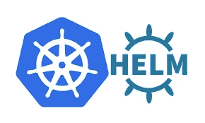

库伯内特和赫尔姆

这是我向你介绍赫尔姆的部分。Helm 是一个 Kubernetes 管理工具。基于 Kubernetes 的 Helm build 将极大地帮助您管理和维护复杂的 Kubernetes 部署。此外，从集群管理员的开发人员的角度来看，对您的资源进行更改和更新是相当简单的。Helm 甚至减轻了版本控制和回滚带来的潜在麻烦。

我们将带着头盔和一条实用的战线潜入库伯内特斯。我们将使用 Helm 在 Kubernetes 集群上部署一个 WordPress 应用程序。

让我们为我们的项目创建一个工作空间:

```
$ mkdir -pv wp-helm/
```

## 舵建筑

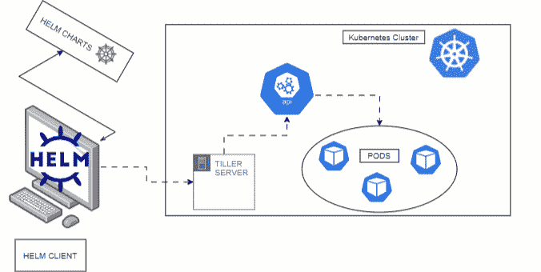

舵 2

头盔有 2 种结构，头盔 2 和头盔 3。Helm 2 采用客户端-服务器架构，客户端名为 Helm，服务器名为 Tiller。客户端与 Tiller 和图表存储库进行交互。Tiller 与 Kubernetes API 服务器交互。它将 Helm 模板文件呈现到 Kubernetes 清单文件中，用于通过 Kubernetes API 对 Kubernetes 集群进行操作。

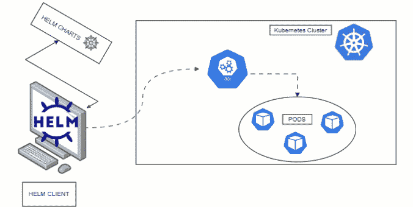

Helm3

《圣盔 3》于 2019 年上映。它建立在头盔 2 的顶部。这次更新中最有趣的更新是去掉了舵柄。因此，现在 Helm 客户端直接与 Kubernetes API 服务器通信。通过移除蒂勒，Helm 3 支持现代 Kubernetes 的所有现代安全、身份和授权功能。

# 舵的基本结构

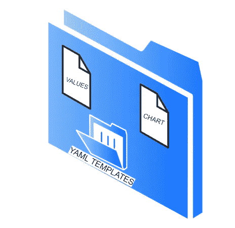

Helm 项目的董事成员

helm 的基本工作空间必须包括以下内容:

*   chart . YAML-Helm Charts 是简单的 Kubernetes YAML 清单，组合成一个软件包，可以向您的 Kubernetes 集群发布。Chart.yaml 描述了图表的基本信息，例如名称、描述或图表版本。
*   values . YAML-values . YAML 定义默认值，用于在部署 Helm 图表时解析模板/中定义的模板。
*   模板目录—模板/文件夹包含图表的所有模板。Helm 将解析所有的。yaml 文件，并将它们与 values.yaml 文件中定义的值一起解析为模板

# 让我们构建我们的应用程序

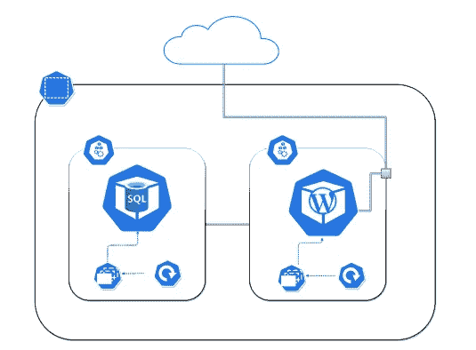

我们应用程序的基本架构

我们将有 2 个部署，WordPress Pod 和 MySQL Pod 运行在 2 个不同的节点，使用 Helm 的默认名称空间。

## 创建图表文件:

```
$ vim wp-helm/Charts.yamlapiVersion: v1
name: mywebversion: 0.1
appVersion: 1.1
description: This is my first chart
```

这个文件包含了我们发布的基本版本信息。

## 创造价值:

```
$ vim wp-helm/values.yamlwordpress: mywp1
data_base_root_pass: <<db_rootpass>>
data_base_name: <<db_username>>
user: <<db_username>>
data_base_pass: <<db_userpass>>
sql_image: mysql:5.7
sql_db_name: <<db_name>>
wordpress_image: wordpress:5.1.1-php7.3-apache
```

价值观。YAML 文件包含部署应用程序时所需的所有参数。

## 创建模板:

要运行一个 WordPress 应用程序，我们有一个基本的清单:

一个 WordPress 容器

SQL 服务器

暴露网络服务器端口，用于公共连接

因此，我们必须为每个资源创建 3 个 YAML 清单。

**wordpress.yml**

```
$ vim wp-helm/templates/wordpress.ymlapiVersion: apps/v1
kind: Deployment
metadata:
  creationTimestamp: null
  labels:
    run: {{ .Values.wordpress }}
  name: {{ .Values.wordpress }}
spec:
  replicas: 2
  selector:
    matchLabels:
      run: {{ .Values.wordpress }}
  template:
    metadata:
      creationTimestamp: null
      labels:
        run: {{ .Values.wordpress }}
      name: {{ .Values.wordpress }}
    spec:    
      containers:
      - image: {{ .Values.wordpress_image }}
        name: {{ .Values.wordpress }}
        resources: {}
      dnsPolicy: ClusterFirst
      restartPolicy: Always
status: {}
```

**mysql.yml**

```
$ vim wp-helm/templates/mysql.ymlapiVersion: apps/v1
kind: Deployment
metadata:
  creationTimestamp: null
  labels:
    run: mydb1
  name: mydb1
spec:
  replicas: 2
  selector:
    matchLabels:
      run: mydb1
  template:
    metadata:
      creationTimestamp: null
      labels:
        run: mydb1
      name: mydb1
    spec:
      containers:
      - env:
        - name: MYSQL_ROOT_PASSWORD
          value: {{ .Values.data_base_root_pass }}
        - name: MYSQL_DATABASE
          value: {{ .Values.data_base_name }}
        - name: MYSQL_USER
          value: {{ .Values.user }}
        - name: MYSQL_PASSWORD
          value: {{ .Values.data_base_pass }}
        image: {{ .Values.sql_image }}
        name: {{ .Values.sql_db_name }}
        resources: {}
      dnsPolicy: ClusterFirst
      restartPolicy: Always
status: {}
```

**service.yml**

```
$ vim wp-helm/templates/service.ymlapiVersion: v1
kind: Service}}
metadata:
  creationTimestamp: null
  labels:
    app.kubernetes.io/managed-by: Helm
    run: mywp1
  name: mywp1ss_image }}
spec:
  ports:s }}
  - port: 80
    protocol: TCP
    targetPort: 80
  selector:
    run: mywp1
  type: NodePort
status:
  loadBalancer: {}
```

我们的目录树如下所示:

$ tree WP-helm/
WP-helm/
├──chart . YAML
├──readme . MD
├──模板
│├──MySQL . yml
│├──service . yml
│└──WordPress . yml
└──values . YAML

# 部署我们的应用程序

```
$ helm install helmdemoapp /ws-helm 
```

如果一切就绪，您会在终端上看到一条成功发布的消息。

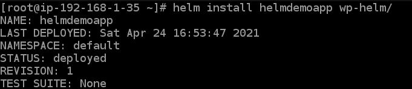

让我们检查一下是否一切顺利，

检查舵释放状态:

```
$ helm list
```

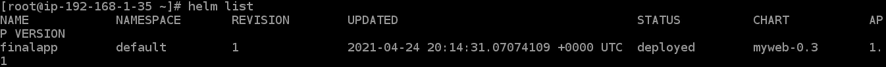

检查部署状态:

```
$ kubectl get deployments
```

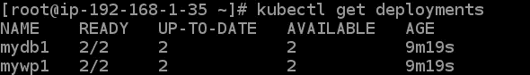

检查带有暴露端口的 WordPress Pod 在哪里运行:

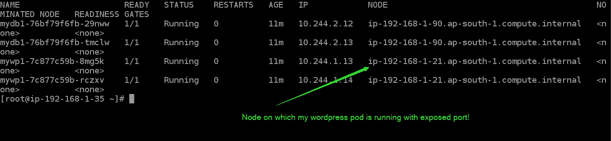

检查服务状态:

```
$ kubectl get svc -o wide
```

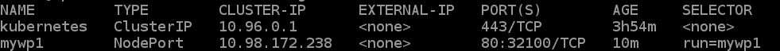

一切就绪。你的申请已经准备好了！

# 访问 WordPress 应用程序:

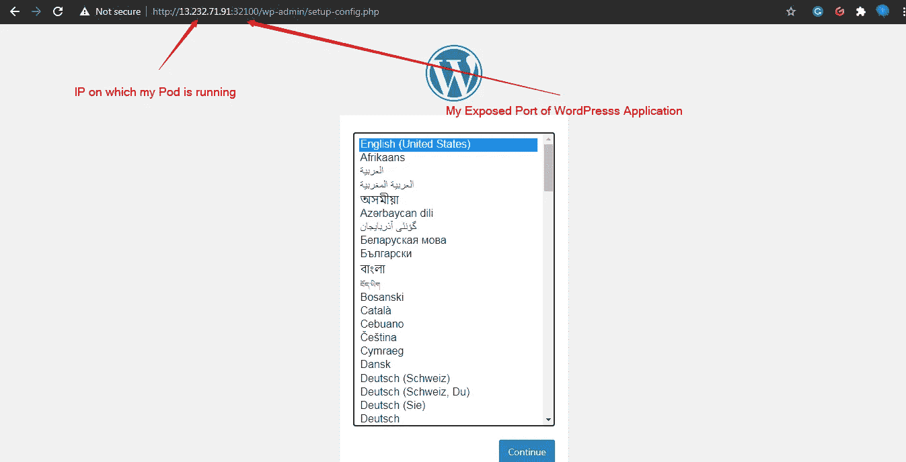

我们的应用程序正在运行。类似地，如果您有自己的应用程序映像，您可以使用 Helm 很好地规划它在 Kubernetes 上的部署。

如果您遇到一些困难，可以在下面的链接中找到上面的代码:

 [## git wit-Mistry/Kubernetes-Wordpress-using-Helm

### 通过在 GitHub 上创建一个帐户，为 git wit-Mistry/Kubernetes-Wordpress-using-Helm 开发做贡献。

github.com](https://github.com/gitwit-mistry/Kubernetes-Wordpress-using-Helm) 

在 LinkedIn 上找到我，了解更多有趣技术的应用！

[](https://www.linkedin.com/in/prathamesh-mistry-a111071b4/) [## Prathamesh Mistry -数据科学家- Flip Robo Technologies | LinkedIn

### 查看 Prathamesh Mistry 在世界上最大的职业社区 LinkedIn 上的个人资料。Prathamesh 列出了 3 项工作…

www.linkedin.com](https://www.linkedin.com/in/prathamesh-mistry-a111071b4/) 

谢谢，注意安全！