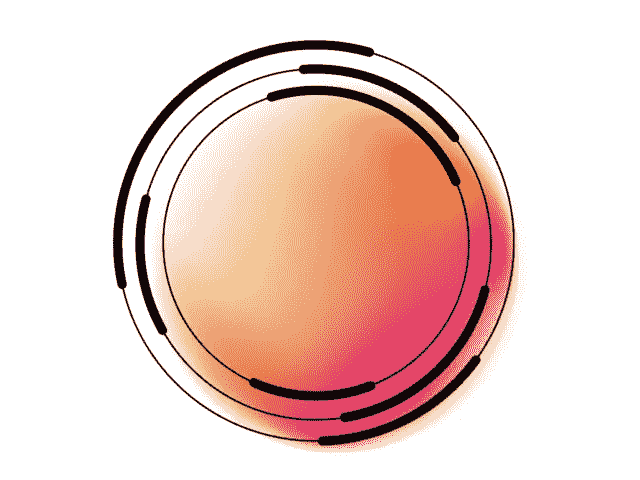
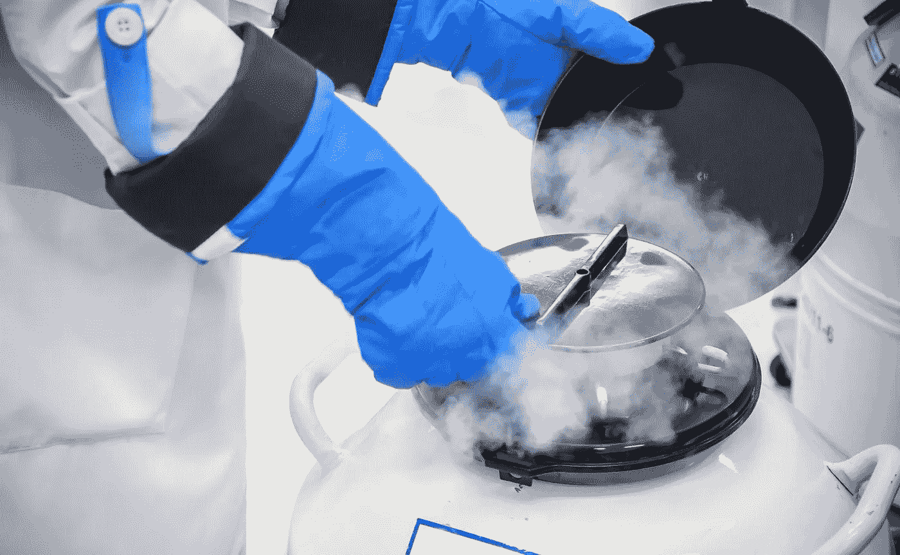

# 干细胞储存:储备你的未来

> 原文：<https://medium.com/nerd-for-tech/stem-cell-storage-banking-your-future-20cc6834fc0?source=collection_archive---------14----------------------->

## 彻底改变我们看待医疗保健、老龄化和长寿的新方法

想象许多年后的未来，当你成长、衰老并经历了生活所提供的一切。你现在已经奄奄一息了。然后来了一个穿着白色夹克的老人(或女人)，手里拿着科学的秘密。他向你承诺，他可以用一个年轻的身体取代你生病的身体。他会消除你脸上的皱纹，给你一次机会去追逐你错过的梦想。难道你不会为了这个机会给他你的一切吗？

相信我，作为一个刚刚 18 岁的孩子，我知道这种情况很遥远。你离死亡还很远，我们离再生年轻身体的科学还很远，甚至离再生年轻器官的科学还很远。然而，一些最近的科学调查告诉我们，我们必须现在就开始为这个未来做准备****，否则就太晚了。但首先，让我告诉你为什么。****

# **在你的细胞中老化**

**如果你在黑板上乱涂乱画，并把它放在外面足够长的时间，这些字迹最终会被雨水、冰雹或邻居给植物浇水冲掉。在那块板上潦草的信息正在慢慢地丢失久而久之。类似的过程也发生在你的细胞内。一个细胞有一块黑板，上面有它所有的信息，DNA，告诉它们是谁，做什么。久而久之，信息丢失了。如果细胞失去了它的信息，它不再知道该做什么，所以停止运作。这是你细胞老化的过程。**

****

**信息丢失，归功于[阿波罗机器人](https://stock.adobe.com/ca/images/chalkboard-erased-scribbles-black-chalkboard-texture-with-eraser-marks-and-visible-smudged-scribbles/101243291)**

**一旦信息从 DNA 中丢失，我们就没有办法恢复它。黑板上的字一旦被擦掉，我们就看不清了。所以，据我们所知，衰老在某种意义上是不可逆的。这可能是许多医疗创新领域的一个主要问题，尤其是再生医学。**

## **再生和老化**

**再生医学是一个简单的概念。如果你身体的一部分发生了什么，比如说你的肾脏停止工作，再生医学旨在通过用一个功能性的肾脏来取代它来恢复它的功能。为了拥有一个在你体内起作用的肾脏(不是所有人都会，因为我们每个人都略有不同)，它很可能必须从你自己的一些细胞中生长出来。这就是问题所在。假设我们要治疗的病人已经 70 岁了。最好的情况是我们取出他的一些细胞，并成功地将其培育成肾脏。然而，这个肾脏是从一个 70 岁的细胞中生长出来的，这个细胞已经因为衰老而失去了一些功能。至少可以说，这是**次优的**，甚至可能**有害的**，如果有问题的细胞在其 DNA 中有广泛的突变(衰老的标志)。**

**所以，这意味着再生医学**对那些细胞已经老化的老年人根本不起作用。具有讽刺意味的是，大多数需要再生和替换的疾病最常发生在老年人身上。你不会听说很多年轻人患有骨关节炎、肝衰竭或肺癌，对吗？那么我们能做些什么来规避这个问题呢？答案就在细胞储存中。****

# **细胞储存**

**细胞储存是一个同样简单的概念。一个细胞是从一个人年轻时取出的，然后在液氮中冷冻以备将来使用。当细胞被冷冻时，它们不再老化。这样，当你变老时，你手上有许多你自己的年轻细胞，它们可以生长并被改造成器官和替代物。为了确保我们储存的细胞可以用于生长成各种器官和组织，我们需要储存多用途的细胞。幸运的是，在你的身体里，有许多这样的细胞。它们被称为干细胞。**

****

**细胞储存，归功于[迷宫脐带血](https://www.mazecordblood.com/2018/05/14/stem-cells-frozen-stored-storage-location/)**

**把干细胞想象成你最初的蓝图。在干细胞内部，制造你所需要的所有信息(DNA)都在那里，可以被读取。干细胞理论上可以分化成任何类型的细胞，制造任何组织和器官，从神经元到皮肤细胞。由于这种特殊性，细胞储存大多以干细胞为主。**

**通过储存你的干细胞，你实质上是在为你的未来做准备。几年后，当年老的你急需替换衰竭的心脏或肺时，医生可以用你储存的年轻干细胞来制造它们。从这个意义上说，你寄托了希望，希望你能从痛苦或即将到来的死亡中被拯救出来。**

# **结论**

**我们没有人能预测未来；但是我们所有人都可以为此做好准备。当我们的生活和幸福受到威胁时，为未来做准备绝对值得我们关注和努力。**

**感谢阅读！我是亨利，一个 18 岁的科技和长寿爱好者，致力于帮助延长人类健康寿命。**

**如果你想跟随我的旅程，请跟随我在媒体上，在那里我将每周发表文章。另外，你可以[加入我的每月简讯](https://www.subscribepage.com/r9v2w3)，或者在 [LinkedIn](https://www.linkedin.com/in/henry-fu-b152281ba/) 上与我联系。😃**