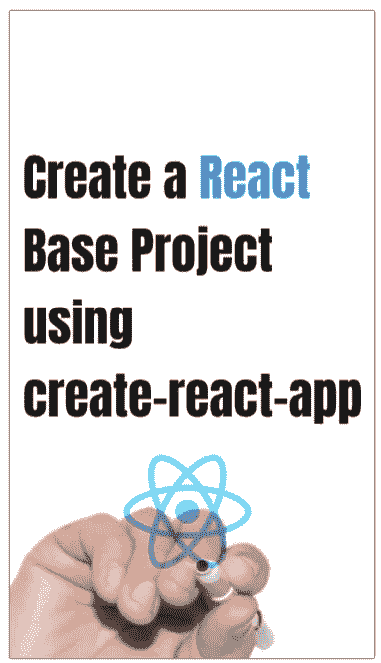
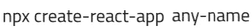
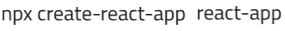
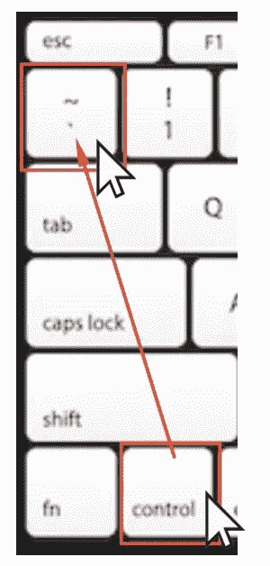
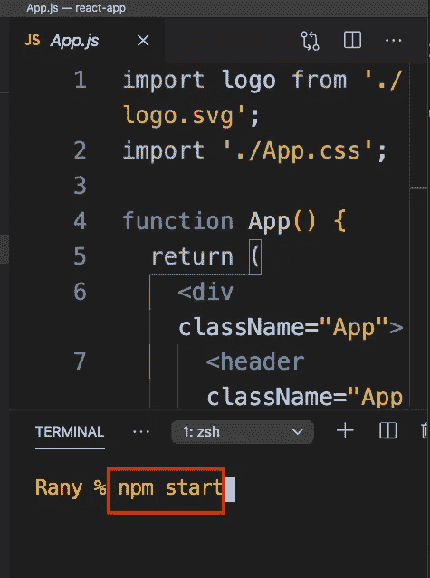
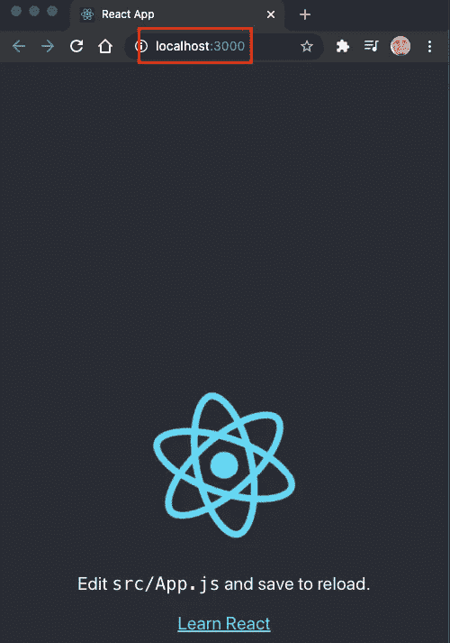

# 步骤 2:使用 npx create-react-app 创建一个 React 基础项目

> 原文：<https://medium.com/nerd-for-tech/step-2-create-a-react-base-project-using-npx-create-react-app-84ee840ad130?source=collection_archive---------5----------------------->

# 步骤 1:安装 NodeJs、npm 和 create-react-app

 [## 步骤 1:在 Mac 上安装 NodeJs 和 npm

### 在我们开始任何反应项目之前，我们需要安装节点转到 https://nodejs.org/en/download/滚动到你的…

www.linkedin.com](https://www.linkedin.com/pulse/step1-install-nodejs-npm-mac-rany-elhousieny-phd%25E1%25B4%25AC%25E1%25B4%25AE%25E1%25B4%25B0/?trackingId=WgbKeLZHPgsrA4Dfm1RY1Q%3D%3D) 

这是第 2 步:安装 NodeJs 后，使用命令创建一个基础 React 项目

npx 创建-反应-应用任何名称

您可以将任何名称替换为您想要的任何名称。我将使用 react-app

安装完成后，它会要求您将目录更改为您的应用程序

cd react-app

写代码。打开 visual studio 代码

当 visual studio 代码打开时，单击 ctrl +`打开终端

在终端上，编写 npm start 来启动本地主机上的页面

让我们在下一篇文章中对 App.js 做一些修改