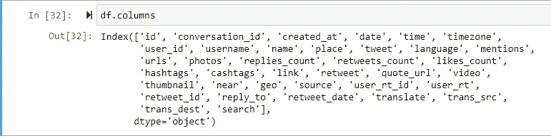
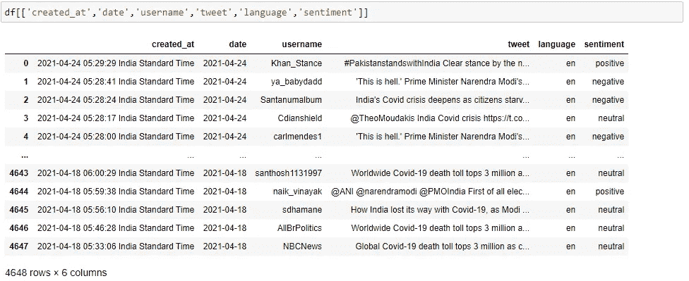
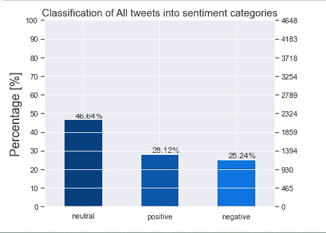
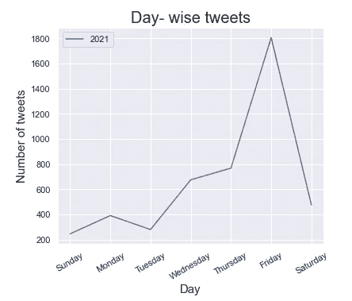
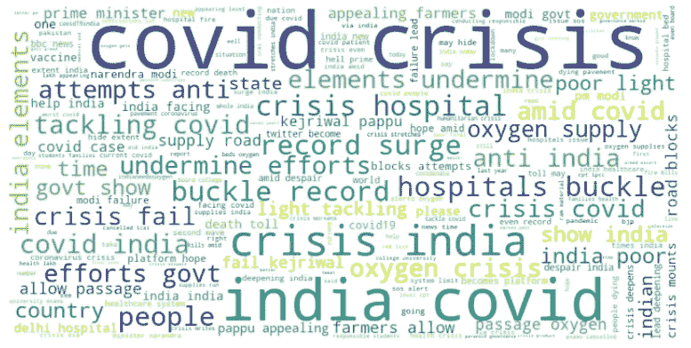

# twitter 情感分析分步指南

> 原文：<https://medium.com/nerd-for-tech/step-by-step-guide-to-twitter-sentiment-analysis-bc250caf3a3c?source=collection_archive---------4----------------------->

## 使用 python 和 twint 库

Twint 是一个高级的 python 库，用于从 twitter 上抓取 tweets，它不需要任何认证证书就可以连接到 twitter。


由[林赛·亨伍德](https://unsplash.com/@lindsayhenwood?utm_source=medium&utm_medium=referral)在 [Unsplash](https://unsplash.com?utm_source=medium&utm_medium=referral) 拍摄的照片

让我们开始吧，在这里我使用 jupyter 笔记本来编写和执行代码。

首先，你需要安装 [twint](https://pypi.org/project/twint/) 库(我是通过 anaconda 提示符安装的)，使用下面的代码获取 twint 的正确更新版本。

```
pip3 install --user --upgrade -e git+https://github.com/twintproject/twint.git@origin/master#egg=twint
```

导入所有必需的库

```
import twint
import nest_asyncio
nest_asyncio.apply()
#we need nest_asyncio to call async routines,similar as performing concurrent tasks.
```

创建一个 twint 的对象并向其传递参数，让我们在 twitter 上搜索包含单词“covid india”的推文。

```
c = twint.Config()
c.Search = 'covid crisis india'
c.Since = '2021-04-18'
c.Until = '2021-04-24'
c.Hide_output = True
c.Pandas = True
twint.run.Search(c)
df = twint.storage.panda.Tweets_df #result is saved to df
```

“自”和“至”用于给出推文的日期范围。如果你想把搜索到的 tweets 保存到一个 pandas dataframe(df)中，那么包括 *c.Pandas = True。* twint.run.Search(c)用于从 twitter 中提取数据。

之后，我们收集了数据(4648，37)，让我们看看列



提取的列

我们有*‘date’*列，使用它我们可以提取一些新的列，如*年、月和日*并可以相应地使用它们*。*

```
#extract year,month,day into new columns from datetime column
df['year']=pd.to_datetime(df['date']).dt.strftime('%Y')
df['month']=pd.to_datetime(df['date']).dt.strftime('%m')
df['day']=pd.to_datetime(df['date']).dt.strftime('%A')
```

一旦我们准备好我们的专栏，让我们预处理推文(即删除网址，用户名和停用词)，因为这些不会增加情感的价值。为此，我们将创建一个函数，并使用 lambda 方法调用它。这里，我使用了一个 stopwords.txt 文件，它包含了要删除的非索引词列表。

```
def preprocess_tweets(tweet):

    fo = open("stopwords.txt", "r+")
    stop_words = list(fo.read().split(','))
    translation={39:None}
    processed_tweet = tweet
    processed_tweet=' '.join(re.sub("(@[A-Za-z0-9]+)|([^0-9A-Za-z \t])|(\w+:\/\/\S+)"," ",tweet).split())
    processed_tweet = " ".join(word for word in processed_tweet.split() if word not in str(stop_words).translate(translation))
    return(processed_tweet)df['Processed Tweet'] = df['tweet'].apply(lambda x: preprocess_tweets(x.lower()))
```

在此之后，我们可以检查处理后的 tweet 看起来如何，让我们检查一条记录

> **推文**:印度陷入危机，新的 covid 病例打破全球记录[https://t.co/bLt0NV73w7](https://t.co/bLt0NV73w7)
> **已处理推文:**印度危机新的 COVID 病例打破全球记录

因此，在这个阶段，我们有我们需要的一切。现在，让我们将这些经过处理的推文归类为不同的情绪。这里使用 [textblob](https://textblob.readthedocs.io/en/dev/quickstart.html) 库来实现同样的功能。使用`pip install textblob`安装库。

```
#here we are making a new column 'polarity' by applying textblob function on the processed tweets which are in english language
from textblob import TextBlob
df['polarity'] = df[df['language']=='en']['Processed Tweet'].apply(lambda x: TextBlob(x).sentiment[0])
```

“极性”列将有数值，让我们创建一个新列，将数值映射到单词“积极、消极或中性”情绪

```
df['sentiment'] = df['polarity'].apply(lambda x: 'positive' if x > 0 else('negative' if x<0  else 'neutral'))
```

现在，我们的表看起来像这样:



## 让我们对准备好的数据做一些分析

绘制情感计数，用百分比表示，下面是代码

```
plt.figure(figsize=(6,5))
plt.title('Classification of All tweets into sentiment categories',fontsize=15)
plt.ylabel('Percentage [%]',fontsize=18)
ax = (df.sentiment.value_counts()/len(df)*100).plot(kind="bar", rot=0,color=['#04407F','#0656AC','#0A73E1'])
ax.set_yticks(np.arange(0, 110, 10))
plt.grid(color='#95a5a6', linestyle='-.', linewidth=1, axis='y', alpha=0.7)
ax2 = ax.twinx()
ax2.set_yticks(np.arange(0, 110, 10)*len(df)/100)for p in ax.patches:
    ax.annotate('{:.2f}%'.format(p.get_height()), (p.get_x()+0.15, p.get_height()+1))
```



情感计数图

我们可以计算出，在 2011 年 4 月 18 日至 2011 年 4 月 24 日之间发布的所有关于“印度 covid 危机”的推文中，有 25.24%是负面的。

让我们检查每天的推文数量(我们有一周的数据)

```
y=set(df['year'])
sns.set(style='darkgrid',)
for item in list(y):
    data=df[df['year']==item]['day'].value_counts().reindex(days)
    sns.lineplot(data = data,palette = "hot", legend="brief",label=item)
plt.xticks(rotation=30)
plt.legend()
plt.title('Day- wise tweets',fontsize = 20)
plt.xlabel('Day',fontsize = 15)
plt.ylabel('Number of tweets',fontsize = 15)
```



我们可以看到周五人们发了更多的推文。现在，让我们通过从处理过的推文中制作一个单词云来检查这些推文中使用最多的单词。这可以通过使用 python 的“wordcloud”库来完成。

```
from wordcloud import WordCloud,ImageColorGenerator
text = " ".join(tweet for tweet in df['Processed Tweet'].astype(str))
wordcloud = WordCloud(
    background_color = 'white',
    width = 1000,
    height = 500).generate(text)
plt.imshow(wordcloud, interpolation='bilinear')
plt.axis('off')
plt.rcParams['figure.figsize'] = [20, 20]
plt.tight_layout()
```



词云

从 cloud 这个词中，我们可以看出人们在谈论医院危机、政府努力、氧气危机、贫困等等。这些非常有助于获得“正在谈论什么”的第一手信息。

这里，我们看到了如何根据推文生成分析报告。这是对使用 python、twint 和 textblob 进行情感分析的简单介绍。我们可以一直深入下去，并创建一个包括其他内容的分析报告。

感谢你阅读这篇文章，希望你喜欢学习它！