# 步骤 2:将 MVC 添加到微服务中:实践中使用 Java、Maven 和 Spring Boot 的微服务设计模式

> 原文：<https://medium.com/nerd-for-tech/step2-adding-mvc-to-the-microservice-microservices-design-patterns-in-practice-using-java-maven-13bac7b70c98?source=collection_archive---------4----------------------->

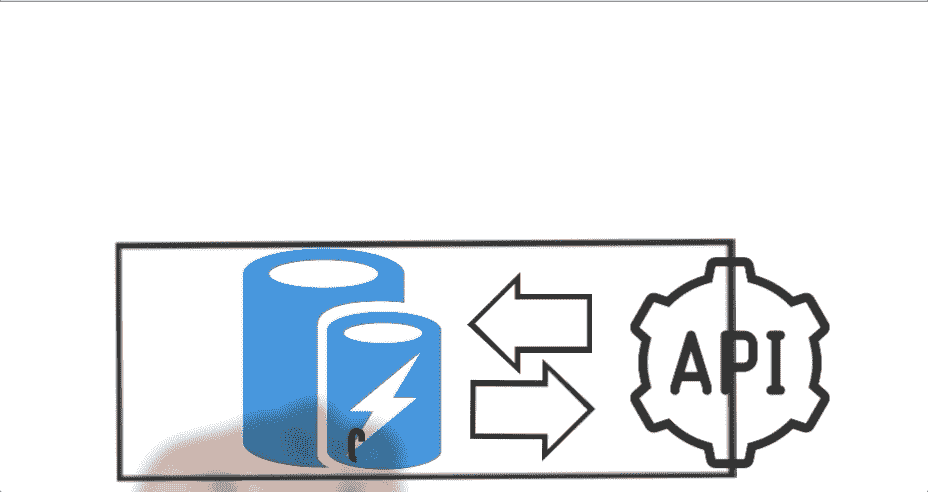

在前一篇文章中创建了 UserMicroservice 之后，让我们添加数据模型(MVC 中的“M ”)


本文是解释使用 Java、Maven 和 Spring Boot 实践微服务设计模式的系列文章的一部分

# 首先:为 Java Spring Boot 微服务项目准备你的 Mac:安装 JDK、Brew、Maven 和 IntelliJ

[](/microservices-architectures/prepare-your-mac-for-java-spring-microservice-projects-install-jdk-brew-maven-and-intellij-7ccb0207ca04) [## 为 Java Spring 微服务项目准备您的 Mac:安装 JDK、Brew、Maven 和 IntelliJ

### 我想创建一个移动友好的技术系列，以便在上下班时间在公共汽车上或…

medium.com](/microservices-architectures/prepare-your-mac-for-java-spring-microservice-projects-install-jdk-brew-maven-and-intellij-7ccb0207ca04) 

# 步骤 1:使用 Sprint Boot 构建微服务

[](https://www.linkedin.com/pulse/microservices-design-patterns-practice-using-java-1-rany/) [## 使用 Java、Maven 和 Spring Boot 实践微服务设计模式:步骤 1:构建一个

### 作者 Rany ElHousieny(https://Rany . ElHousieny。

www.linkedin.com](https://www.linkedin.com/pulse/microservices-design-patterns-practice-using-java-1-rany/) 

# [本文]步骤 2:将 MVC 添加到微服务中

[](https://www.linkedin.com/pulse/step2-adding-mvc-microservice-microservices-design-rany/) [## 步骤 2:将 MVC 添加到微服务中:实践中的微服务设计模式使用 Java、Maven…

### 本文是解释使用 Java、Maven 和 Spring 实践微服务设计模式的系列文章的一部分…

www.linkedin.com](https://www.linkedin.com/pulse/step2-adding-mvc-microservice-microservices-design-rany/) 

项目代码可在找到

[](https://github.com/ranyelhousieny/ECommerceMicroservicesProject) [## ranyelhousieny/电子商务服务项目

### 使用 Spring Boot、Maven 和 Java 的电子商务微服务项目

github.com](https://github.com/ranyelhousieny/ECommerceMicroservicesProject) 

===================================

在上一篇文章中我们创建了 UserMicroservice 之后，让我们添加数据模型(MVC 中的“M”)。我们将创建一个名为 User 的类

在项目上创建一个新包，并将其命名为 web.model，如下所示

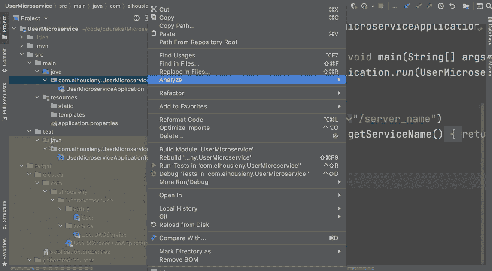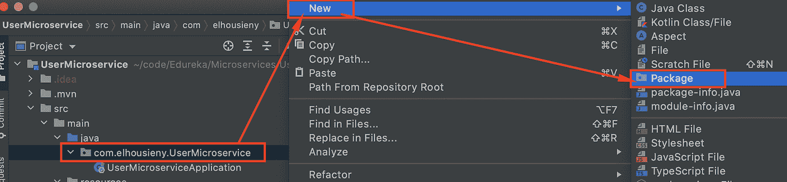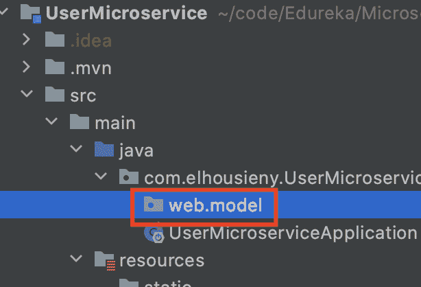

# 现在，让我们创建一个用户类

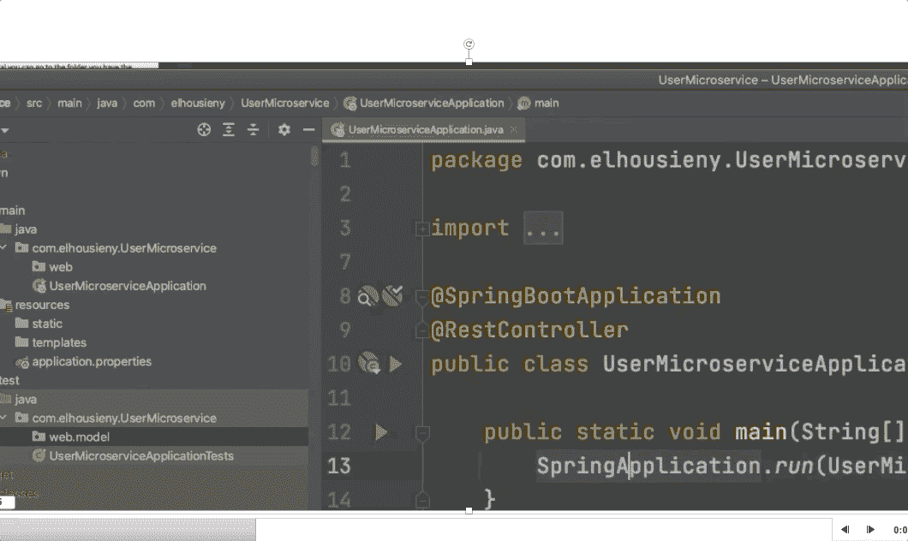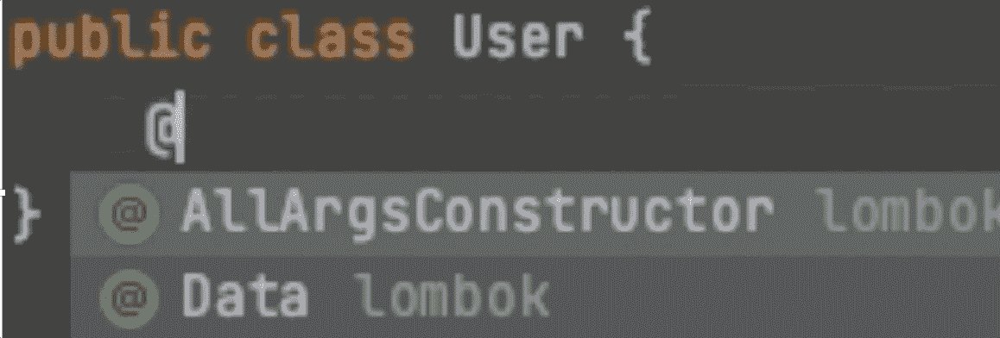

如图所示添加 id 和用户名。在右边

```
public class User {
    @Id
    private String userName;
}
```

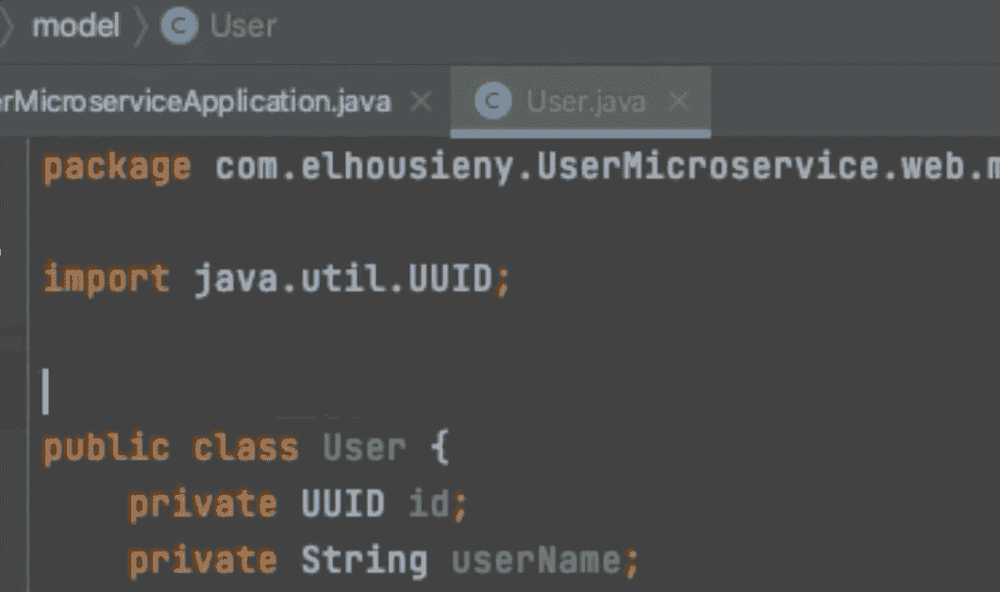

现在，我们将通过添加注释来使用龙目岛的魔力

@Data 添加 getters 和 setters

```
import lombok.Data;
@Data
public class User {
    private UUID id;
    private String userName;
}
```

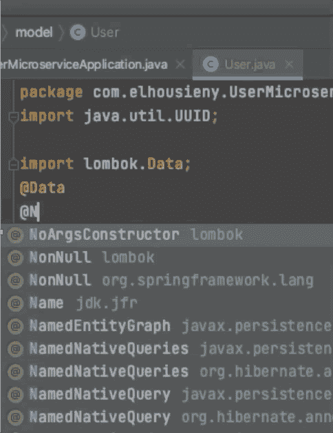

让我们也添加构造函数

@NoArgsConstructor 用于不带参数的构造函数

@AllArgsConstructor 用于将所有参数作为参数的构造函数

```
import lombok.AllArgsConstructor;
import lombok.Data;
import lombok.NoArgsConstructor;
@Data
@NoArgsConstructor
@AllArgsConstructor
public class User {
    private UUID id;
    private String userName;
}
```

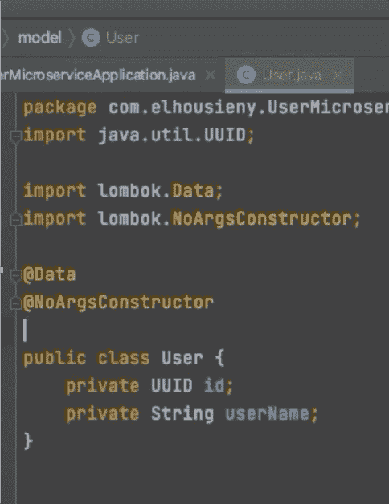

# 创建控制器

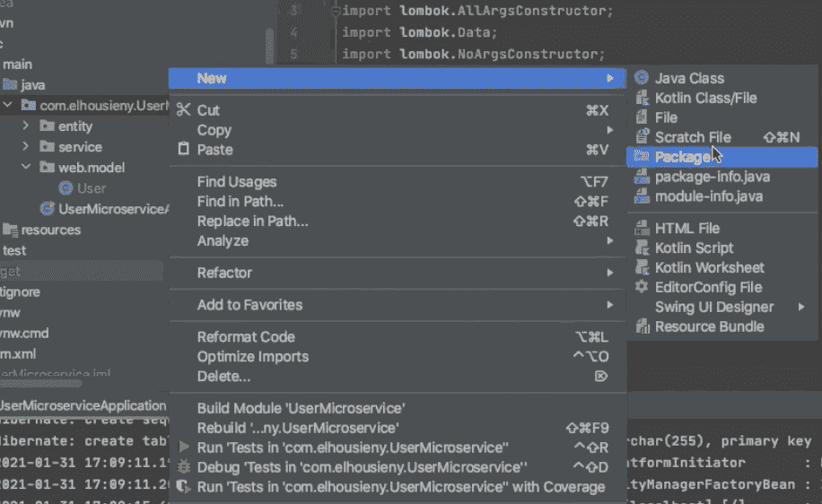

我们在上一篇文章中已经这样做了，但是在这里我们将以一种有组织的方式来做。在 web 下创建一个新的包，命名为 controller，然后在它下面创建一个新的 Java 类，命名为“UserController”

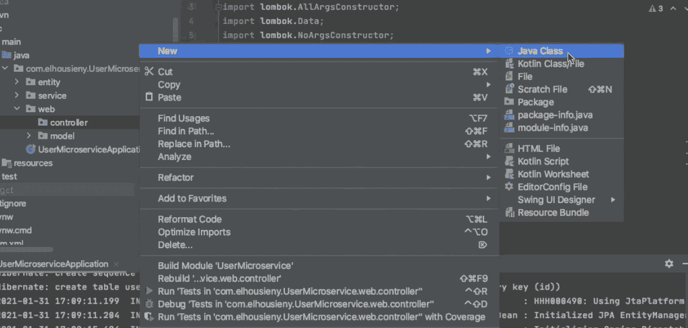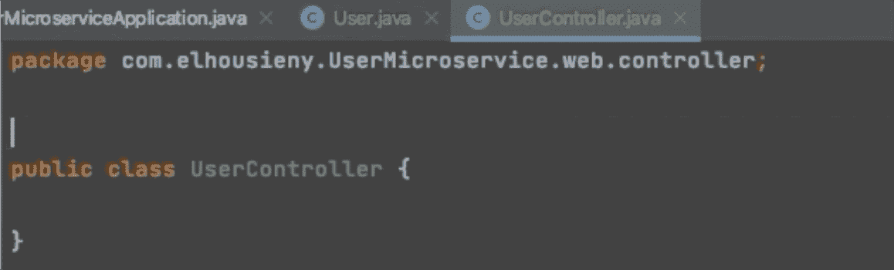

为 Sprint Boot 添加@RestController 注释，以添加所需的主体和头

# 返回用户的实例

确保您的用户类如下所示

```
@Data
@NoArgsConstructor
@AllArgsConstructor
public class User {
    @Id
    private String userName;
}
```

现在让我们返回这个类的一个实例，而不是字符串，如下所示

```
@RestController
public class UserController { @GetMapping("/user")
    public User getUserName(){
        return new User("I am a User");
    }
}
```

重新运行应用程序，它会有如下输出

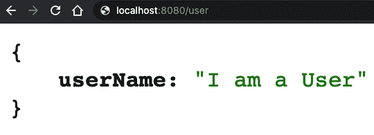

现在我们返回一个 Json 对象，因为它是正确的数据

作者:

[](https://www.linkedin.com/in/ranyelhousieny/) [## 兰尼·埃尔豪斯尼，PhDᴬᴮᴰ -软件工程高级经理- Zulily | LinkedIn

### 𝙈𝙞𝙘𝙧𝙤𝙨𝙚𝙧𝙫𝙞𝙘𝙚𝙨解决方案架构师𝘼𝙒𝙎𝙎𝙤𝙡𝙪𝙩𝙞𝙤𝙣𝙨𝘼𝙧𝙘𝙝𝙞𝙩𝙚𝙘𝙩𝘾𝙚𝙧𝙩𝙞𝙛𝙞𝙚𝙙…

www.linkedin.com](https://www.linkedin.com/in/ranyelhousieny/) [](https://www.youtube.com/channel/UCJ6bFYSkBws-ug6fqJ_9CNg) [## 兰尼·埃尔豪斯尼

### https://www.linkedin.com/in/ranyelhousieny/·https://rany.elhousieny.com AWS 解决方案架构师认证…

www.youtube.com](https://www.youtube.com/channel/UCJ6bFYSkBws-ug6fqJ_9CNg)