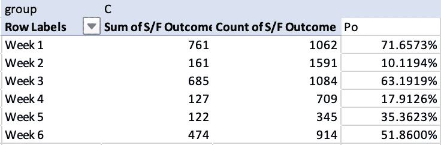
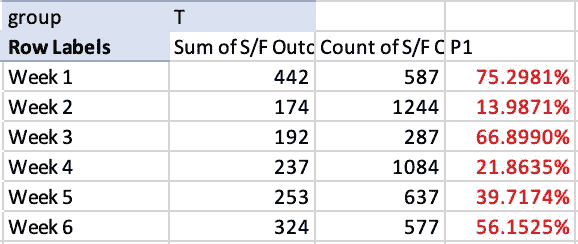
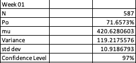

# 使用 MS Excel 进行 A/B 测试的步骤

> 原文：<https://medium.com/nerd-for-tech/steps-to-a-b-testing-using-ms-excel-82b6b7b6d19f?source=collection_archive---------1----------------------->

A/B 检验实验基本上是由两组 A(对照)和 B(处理)进行的实验，通常假设处理优于对照。A/B 测试在网页设计和市场营销中很常见，例如像 [NYT 这样的出版商 A/B 测试他们的网页标题](https://blog.tjcx.me/p/new-york-times-ab-testing)来决定哪个产生更多的点击。

回到该过程，理想地，受试者被随机分配或随机分配到治疗组，从而可以得出结论，A & B 之间的差异是由于治疗的效果或抽签的运气，其中偶然自然表现更好的受试者被放在 A 或 b 中

一个有趣的问题是，*为什么有一个控制组，为什么不把结果与以前的经验进行比较*？因此，在比较两种结果时，你能够保持“其他一切”不变。在与以前的经验进行比较的情况下，“其他事情”可能会有所不同。例如，将周一运行的实验的网站点击量与前一天的数据进行比较，可能会导致错误的解释。这是因为假设“其他一切”在工作日和周末都是一样的听起来不太对。

*为什么不是 A/B/C/D？*这种类型的实验实际上节省了时间，因为它由两个以上的小组进行，所以被称为**多臂强盗**。

**选择测试统计量**

测试统计或指标用于比较 A 组和 b 组。DS 中最常见的指标可能是一个二元变量，在 NYT 的情况下，它可能是点击或不点击。因此，在进行实验后，我们总结了每个标题 A 和标题 b 的点击与无点击数据。在这种情况下，需要注意的是，该指标不是连续变量(点击次数只能是整数，即 250 次点击，而不能是 250.5 次点击)。

建议在进行实验之前选择一个测试统计数据，以避免研究人员的偏见，理想的情况是在许多指标中只选择一个指标。

**假设检验或显著性检验**

A/B 测试通常是带着假设进行的。为了理解为什么看数字来决定 A 是否优于 B 是有缺陷的，我们需要理解自然随机行为的范围。这个想法是为了防止研究人员将随机行为误解为具有某种意义的模式，或者避免被随机性所愚弄。

因此，假设检验是对 A/B 检验的进一步分析，以评估随机性是否是对 A 和 B 中观察到的差异的合理解释。如果我们能够排除这一点，那么剩下的唯一选项将是差异是由于治疗引起的，然后成功地结束实验。

**制定无效&替代假设**

*   规则一，无效假设和替代假设必须考虑所有的可能性
*   零假设是检验所有处理都是平等的，所有的差异都是偶然的这一基本假设。我们总是想拒绝我们的无效假设。

**单向 Vs 双向假设检验**

想象一下，你的网站有蓝色的点击图标，这是一个既定的默认选项，然而，你想运行一个实验来检查绿色图标是否给出一个更好的点击率。所以基本上你会坚持蓝色图标，除非证明不是这样(绿色更好)。在这种情况下，你可以使用一个**单向(单尾)假设**测试来保护你不被绿色图标方向的随机性所欺骗。

然而，如果你想做一个假设测试来保护你不被任何方向(蓝色或绿色)的随机性所愚弄，备选假设是双向的或双向(双尾)假设。

即使在遵循了所有必要的步骤之后，您的测试结果报告也可能会被一些不知不觉地渗入到过程中的错误所歪曲。一般称为**I 型和 II 型**错误，这些错误基本上会导致错误的测试结论和/或错误的赢家和输家声明。

犯 I 型错误的概率用“α”表示，定义为当 Ho 为真时拒绝 Ho 的概率。第一类错误与你决定结束测试的置信度有关。这意味着，如果你决定以 95%的置信度结束你的测试，你就接受了你的测试结果有 5%的概率是错误的。减少这种错误的一个方法是在你结束实验之前，运行测试足够长的时间，以获得足够的样本。另一种方法是增加你的信心水平，这可能意味着你可以增加第二类错误，即接受 Ho，即使它是假的。也称为β错误或假阴性，其中“β”表示犯第二类错误的概率。

**统计显著性**

我们来看看酒吧区一家叫 DoorDash 的送餐创业公司。他们与各种餐厅合作，并有一个销售团队，该团队有一个将潜在线索转化为上门客户的流程。他们对当前 B2B 销售流程中的变化进行了 A/B 测试，其中他们对一半的销售人员的销售流程进行了一些更改，其他人使用了相同的流程。六周后，他们收集了所有销售员工的销售数据，希望衡量这些变化的影响，并决定是应用还是放弃。

在第 1 周，DoorDash 的销售团队(控制组)在销售流程没有变化的情况下，从 1062 个潜在销售线索中转化了 761 个。接下来的几周也是如此。

现在让我们看看治疗组的数字。在同一个星期，即第 1 周，销售流程发生变化的团队(治疗组)能够将 587 个销售线索中的 442 个转化为客户。这绝对是一个进步。

然而，由于转换数如此之低，我们需要检查这是否只是由于随机性而发生的。为了排除随机性，让我们做一个置信区间为 95%的假设检验。我们测试的标准是测试组的转换率。

让我们建立两个假设:

Ho: Pc = Pt(对照组成功率与试验组相同)
Ha: Pc < Pt(对照组成功率小于试验组)

因为假设检验本质上是正式检验样本所代表的总体是否正态分布。零假设表明总体是正态分布的，而另一个假设表明总体不是正态分布的。

如果测试 p 值小于预定义的显著性水平，您可以拒绝零假设，并推断数据不是来自正态分布的总体。如果 p 值大于预定义的显著性水平，则不能拒绝零假设。

请注意，当样本量较大时，与正态性的微小偏差会产生具有统计显著性的 p 值，相反，用小样本检测非正态性是不可能的。你应该经常检查正常的情节并运用你的判断，而不是仅仅依靠假设检验。由于中心极限定理，许多统计检验和估计对适度偏离正态是稳健的。

让我们在 MS Excel 中设计第一周的实验来排除这种可能性。

为了能够测试我们的 Ho，我们需要为 6 个样本(6 周)设计一个正态分布。为此，我们基本上需要两样东西:均值和标准差。偏差。因为均值和标准差。可能每周都不一样，我们将不得不在 6 周内重建 6 次我们的发行版。

为了在 excel 中做到这一点，让我们将样本量(N)定义为治疗组的 587，并从我们的对照组中选取转化率(Po)71.6573%。使用这两个数字，让我们计算 mu 或总体平均值，它将进一步用于计算方差，最后是 std。偏差。

> Mu = N * Po
> 
> 差异= N*Po*(1-Po)
> 
> 标准差= SQRT(方差)

使用 norm.dist()函数构建第 1 周的正态分布。它使用我们刚刚在上面计算的值 N、平均值和标准差来计算正态分布的置信水平。

另一个重要步骤是选择 alpha 值或不太可能的概率阈值，随机机会结果必须超过该值，实际结果才能被认为具有统计显著性。在这个例子中，让α为 5%。

在 97%的置信度下，我们可以得出结论，治疗组的较好转换不在正常机会变化的范围内。因此，机会并不是数字提高的原因，因此差异在统计上是显著的。