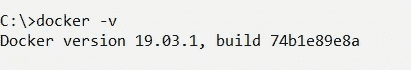
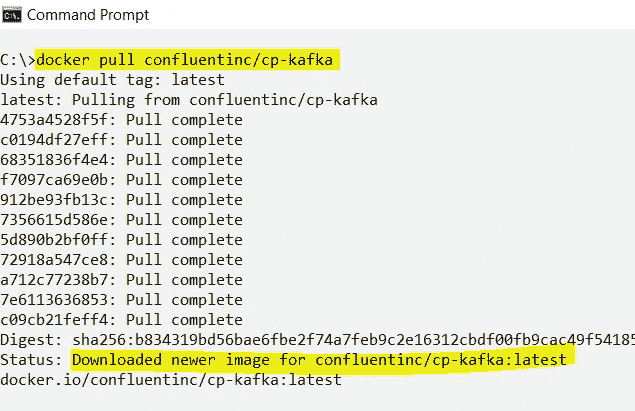
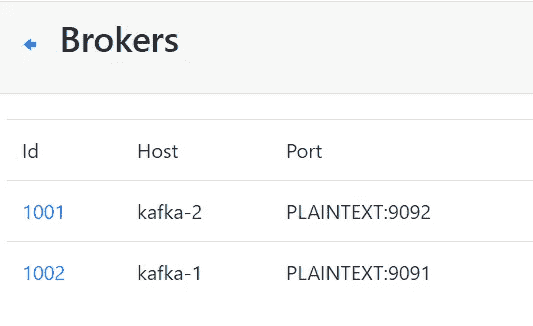
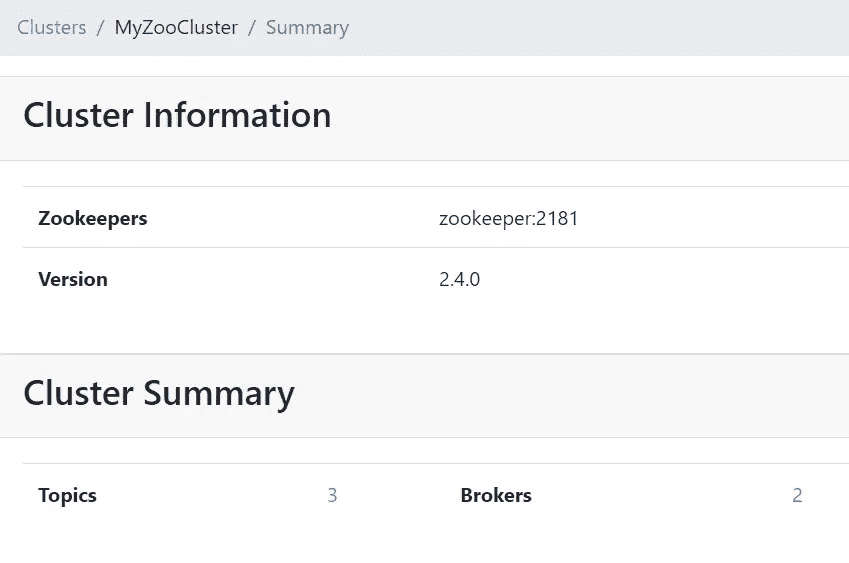
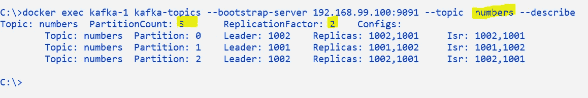
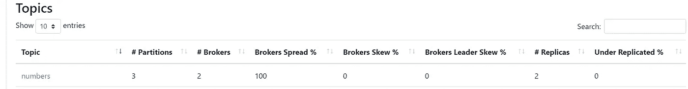
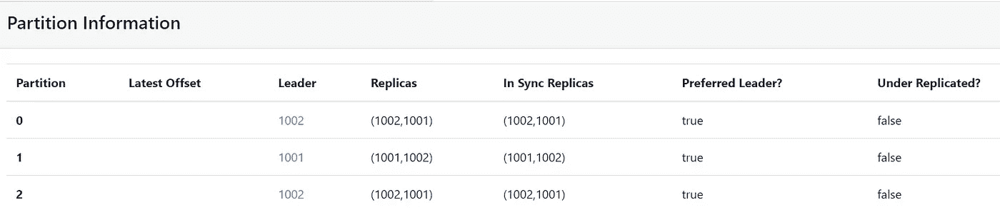

# 在本地和 Docker 上设置 Kafka 集群的步骤

> 原文：<https://medium.com/nerd-for-tech/steps-to-setup-kafka-cluster-on-local-and-docker-ae84324cde86?source=collection_archive---------2----------------------->

在本文中，我们将看到在 Docker (Docker 工具箱)或本地机器上安装和运行 Kafka 集群的步骤。


> [阿帕奇卡夫卡:快速入门](/nerd-for-tech/apache-kafka-quick-start-1edeef53773e)
> 卡夫卡连接:快速入门

注意:这里我们设置了一个 Kafka 集群，有 3 个代理和一个 Zookeeper 实例。

**在本地机器上安装 Kafka(windows):**

从下面的链接下载卡夫卡:

[](https://kafka.apache.org/downloads) [## 阿帕奇卡夫卡

### 2.7.0 是最新版本。目前的稳定版本是 2.7.0。您可以通过以下方式验证您的下载…

kafka.apache.org](https://kafka.apache.org/downloads) 

一旦 kafka 被下载到本地机器上，将 Kafka 解压到目录中，并创建两个目录来保存 Zookeeper 和 Kafka broker 的日志，如下所示。

Kafka CLI 命令在 local/docker 中启动 Kafka 集群(windows)
*Windows 命令路径:* ***../Kafka _ 2.12v/bin/windows***

1.  *启动/停止 Zookeeper*
    *-Zookeeper-server-start . bat
    -Zookeeper-server-stop . bat*
2.  *开始/停止 Kafka 经纪人*
    *-Kafka-server-start . bat
    -Kafka-server-stop . bat*
3.  *为卡夫卡选题*
    *-Kafka-topics . bat*
4.  *创建控制台制作人*
    *-卡夫卡-控制台-制作人. bat*
5.  *创建控制台消费者*
    *-卡夫卡-控制台-消费者. bat*
6.  *创建主机消费群*
    *-Kafka-consumer-groups . bat*

**注**:以下命令对于 linux 机器是相同的:../卡夫卡 _2.12v/bin

让我们使用 Kafka CLI 命令启动 Zookeeper 和 Kafka 代理/服务器，如下所示

```
**## START ZOOKEEPER**
zookeeper-server-start <LOCAL-KAFKA-PATH>/etc/kafka/zookeeper.properties**## START 2 KAFKA BROKERS (on port - 9091, 9092: configured in server properties)**
kafka-server-start <LOCAL-KAFKA-PATH>/etc/kafka/server-0.properties
kafka-server-start <LOCAL-KAFKA-PATH>/etc/kafka/server-1.properties**## CREATE TOPIC - NUMBERS**
kafka-topics --bootstrap-server localhost:9091 --create --topic squaredNumbers --partitions 3 --replication-factor 2**## TOPICS LIST FROM CURRENT CLUSTER**
kafka-topics --bootstrap-server localhost:9091 --list**## DESCRIBE TOPIC "NUMBERS"**
kafka-topics --bootstrap-server localhost:9091 --topic  numbers --describe
```

**在 Docker 桌面/Docker 工具箱上设置 Kafka 集群:**

*Docker 安装:*
[https://docs.docker.com/docker-for-windows/install/](https://docs.docker.com/docker-for-windows/install/)
[https://docs . Docker . com/Docker-for-windows/install-windows-home/](https://docs.docker.com/docker-for-windows/install-windows-home/)
[https://docs.docker.com/docker-for-mac/install/](https://docs.docker.com/docker-for-mac/install/)

执行以下任何命令来验证 docker 安装

> 对接器版本



让我们进入 Docker 终端或命令提示符，使用 docker pull 命令和 Kafka-image-name "[CP-Kafka](https://hub.docker.com/r/confluentinc/cp-kafka)"



Docker hub —卡夫卡图像

[在 docker 容器上启动 Zookeeper 和 Kafka Broker](https://docs.confluent.io/3.3.0/installation/docker/docs/quickstart.html)



让我们首先创建一个主题“numbers ”,其中分区为 3，复制因子为 2。

注意:“kafka-1”是运行 Kafka broker 的 docker 容器名。

IP: 192.168.99.100 : Docker 工具箱默认 IP

```
## CREATE TOPIC - NUMBERS
docker exec kafka-1 kafka-topics --bootstrap-server 192.168.99.100:9092 --create --topic numbers --partitions 3 --replication-factor 2## TOPICS LIST FROM CURRENT CLUSTER
docker exec kafka-1 kafka-topics --bootstrap-server 192.168.99.100:9092 --list## DESCRIBE NUMBERS TOPIC
docker exec kafka-1 kafka-topics --bootstrap-server 192.168.99.100:9091 --topic  numbers --describe
```



**参考文献**:

*   [在本地设置卡夫卡](https://docs.confluent.io/platform/current/quickstart/ce-quickstart.html)
*   [在 Docker 上设置 Kafka](https://docs.confluent.io/platform/current/quickstart/ce-docker-quickstart.html?utm_medium=sem&utm_source=google&utm_campaign=ch.sem_br.nonbrand_tp.rmkt_tgt.kafka_mt.mbm_rgn.india_lng.eng_dv.all&utm_term=%2Bkafka%20%2Bdocker&creative=&device=c&placement=&gclid=Cj0KCQiA-OeBBhDiARIsADyBcE4dvxHvl_A4egCzX2-unAd-1DptauuPKcQQwNUnfNnIcHIflutjfFIaAiymEALw_wcB#)