# 使用深度学习的股票市场分析和预测

> 原文：<https://medium.com/nerd-for-tech/stock-market-analysis-and-forecasting-using-deep-learning-f75052e81301?source=collection_archive---------3----------------------->

数据集取自[谷歌](https://www.google.com/)、[微软](https://www.microsoft.com/en-in)、 [IBM](https://www.ibm.com/in-en) 、[亚马逊](https://www.amazon.com/gp/navigation-country/select-country)

# 简介:

这是一个利用深度学习进行股市分析和预测的项目。这里我们使用 [python](https://www.python.org/) 、 [pandas](https://pandas.pydata.org/) 、 [matplotlib](https://matplotlib.org/) 、 [numpy](https://numpy.org/) 、 [plotly](https://plotly.com/) 、 [pytorch](https://pytorch.org/) 来实现我们的模型。

股票市场、股权市场或股份市场是股票(也称为股份)买方和卖方的集合，代表企业的所有权要求；这可能包括在公共证券交易所上市的证券，以及只在私下交易的股票，如通过股权众筹平台出售给投资者的私营公司股票。股票市场的投资通常是通过股票经纪公司和电子交易平台进行的。投资通常是有投资策略的。

对于统计专家来说，股票预测一直是一个具有挑战性的问题。这一预测背后的主要原因是买入价格可能上涨的股票，然后卖出价格可能下跌的股票。股市预测一般有两种方式。基本面分析依赖于公司的技术和基本面信息，如市场地位、费用和年增长率。第二种是技术分析方法，集中在以前的股票价格和价值。

我们可以看到，股票市场是一个有利可图的资源，但也有一些风险因素。在这一领域，股票市场不断起伏。所以我们必须非常注意市场价格和股票增减因素。为此，我们需要一个对股票市场政策非常熟悉的经纪人。

但在数据科学、深度学习和时间序列分析的发展之后，股票购买者的任务变得非常简单。为了数据科学的幸福，他或她可以很容易地在谷歌中搜索并获得必要的股票市场政策信息。

在项目的第一部分，我们将尝试分析数据。在第二部分，我们将预测股票市场。

# 数据集:

这里我们将使用多个股票市场数据集，例如

1.  谷歌(2006-2018 年)
2.  微软(2006 年至 2018 年)
3.  IBM(2006 年至 2018 年)
4.  亚马逊(2006-2018 年)

照片由[约尔戈斯·恩特拉哈斯](https://unsplash.com/@yiorgosntrahas?utm_source=medium&utm_medium=referral)在 [Unsplash](https://unsplash.com?utm_source=medium&utm_medium=referral) 拍摄

这个数据集中总共有 3019 行和 4 列。

# 股票市场分析:

我们将发现以下内容:-

1.  形容
2.  封闭和开放的分布。
3.  关闭和打开之间的相关性。
4.  可视化数据集的属性[开盘、盘高、盘低、收盘、成交量]。
5.  比较每个数据集的“高”和“接近”。
6.  最后是数据集中的趋势性和季节性。

## 描述:

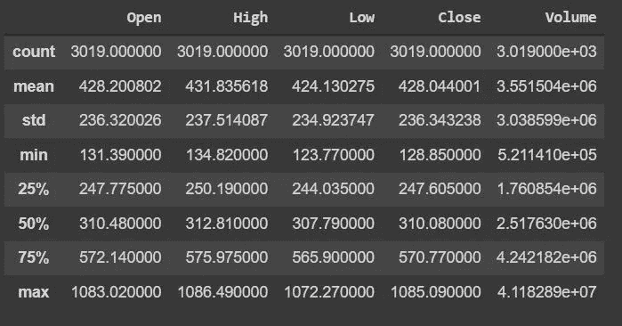

谷歌

在描述了 google 数据集之后，最小值和最大值之间有很大的差异。75%的值接近平均值。

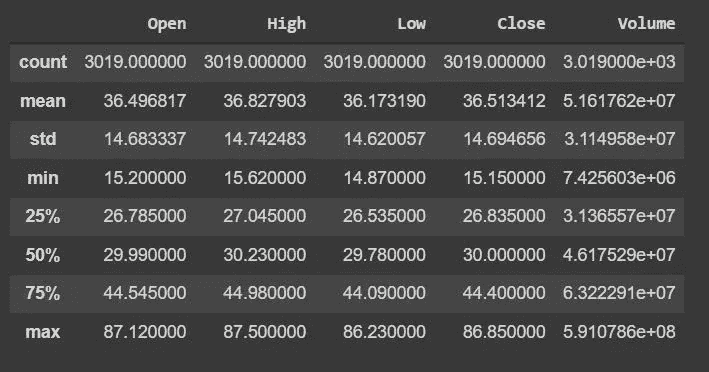

微软

对于 Microsoft 数据集也是如此，最小值和最大值之间有很大的差异。75%的值接近平均值。

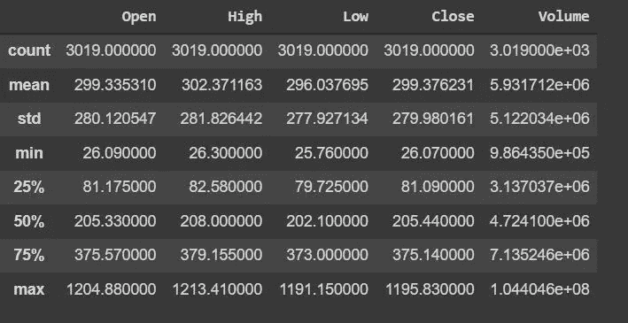

亚马孙

亚马逊数据集也是如此，最小值和最大值之间存在很大差异。75%的值接近平均值。

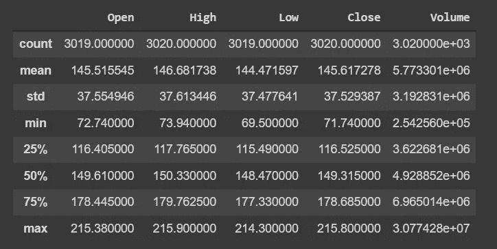

国际商用机器公司

但是对于 IBM 数据集，我们可以看到所有的值都接近平均值。

## 关闭和打开的分布:

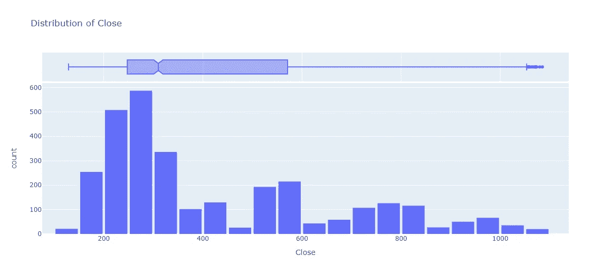

对谷歌关闭

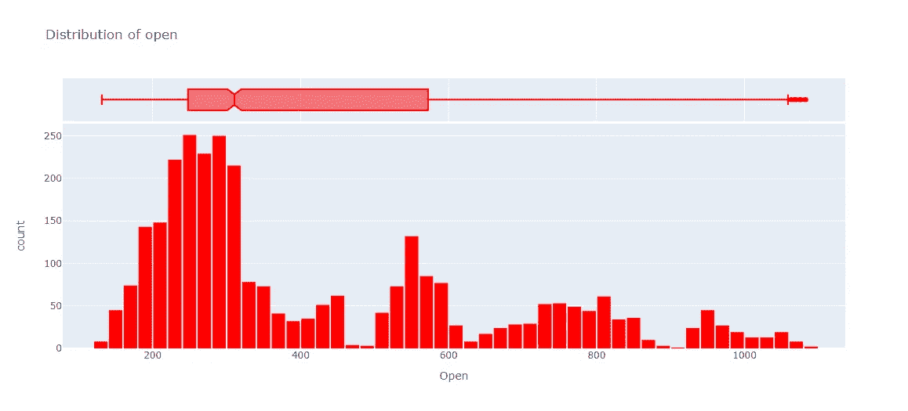

为谷歌开放

## 关闭和打开之间的相关性:

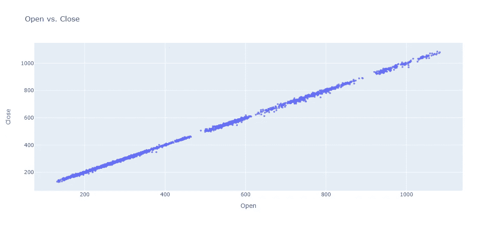

打开与关闭

“开”和“关”的关联度非常高。正如我们从散点图中看到的。

## 比较每个数据集的“高”和“接近”:

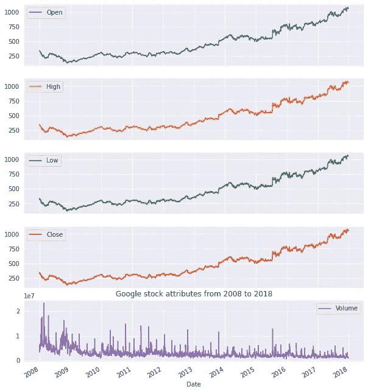

谷歌股票

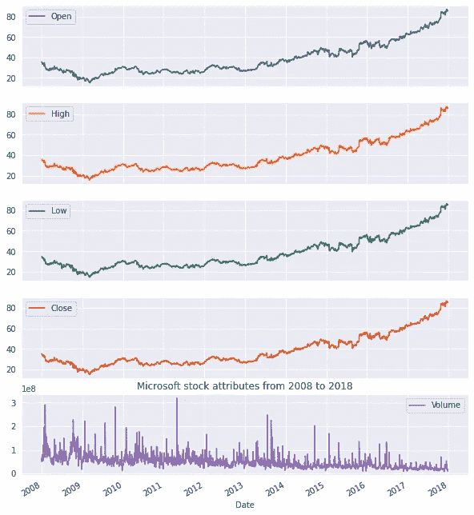

微软

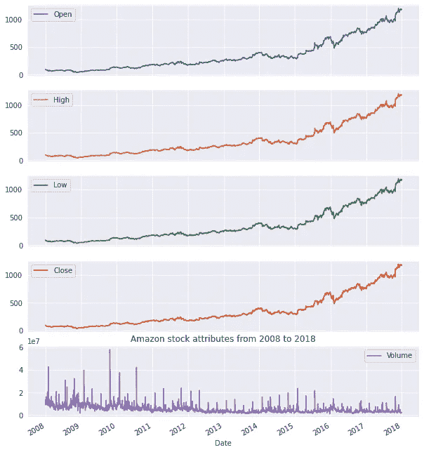

亚马孙

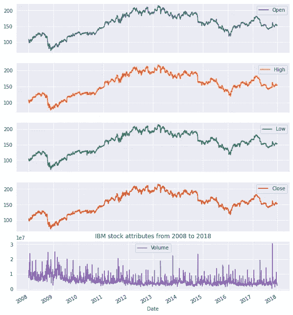

IBM 股票

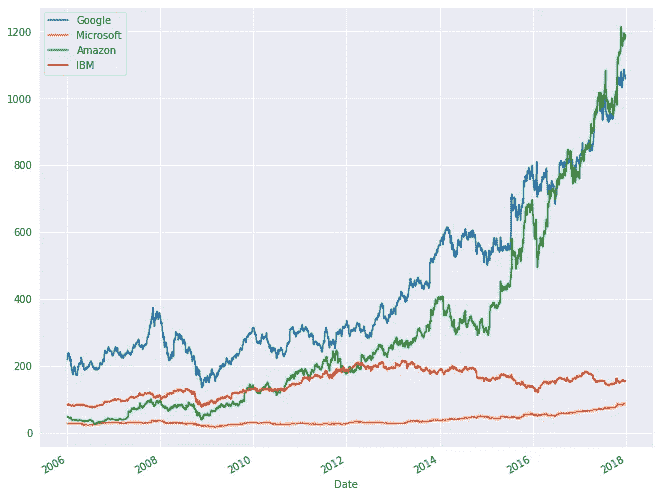

正如我们在这里看到的，微软的“高”值是非常缓慢地直线增加。IBM 的“高”值和亚马逊的“高”值开始于大致相同的阶段，甚至亚马逊的“高”值也略低，但在 2012 年后，亚马逊的“高”值开始呈指数增长，IBM 的“高”值略有下降。自 2016 年以来，谷歌的“高”值和亚马逊的“高”值之间一直在激烈竞争，2018 年，亚马逊的“高”值也击败了谷歌的“高”值。

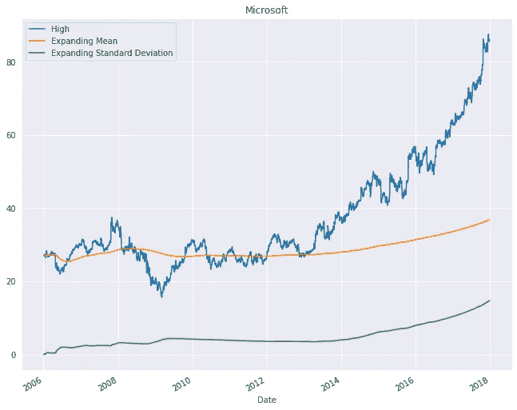

在微软的数据中，我们可以看到 2009 年的“高”值长期低于平均值，因此我们可以说有一些损失。

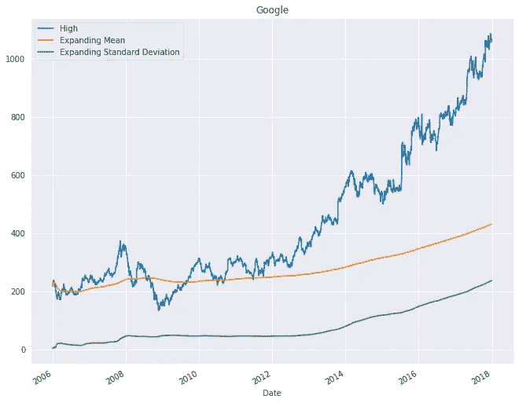

谷歌的数据也是如此，我们可以看到 2009 年的“高”值在很长一段时间里都低于平均值，所以我们可以说有一些损失。但这并不像亚马逊那样损失巨大。

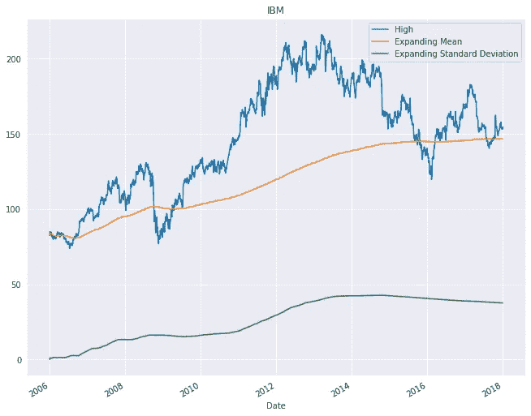

IBM 的数据也是如此，我们可以看到 2009 年的“高”值长期低于平均值，因此我们可以说有所损失。在 2013 年再次下跌后，2016 年出现了巨额亏损，但在那之后，他们做得很好。在 2017 年再次获得一些利润后，又出现了一次下降。

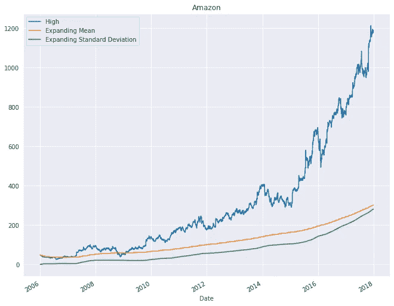

对于亚马逊的“高”价值来说，情况有所不同，他们在 2009 年也面临亏损，但利润很少。在那之后，它们的增长是指数级的。

这里我们可以看到每家公司在 2009 年都面临亏损，可能是因为经济放缓。

## 趋势和季节性:

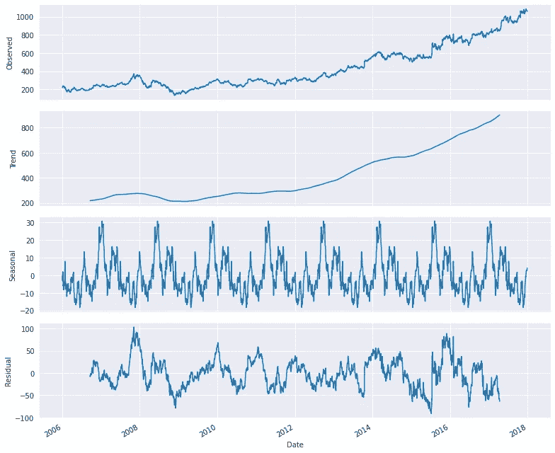

谷歌

在 2012 年之前，增长趋势非常缓慢，但在 2012 年之后，出现了指数增长趋势。和非常高的季节性。

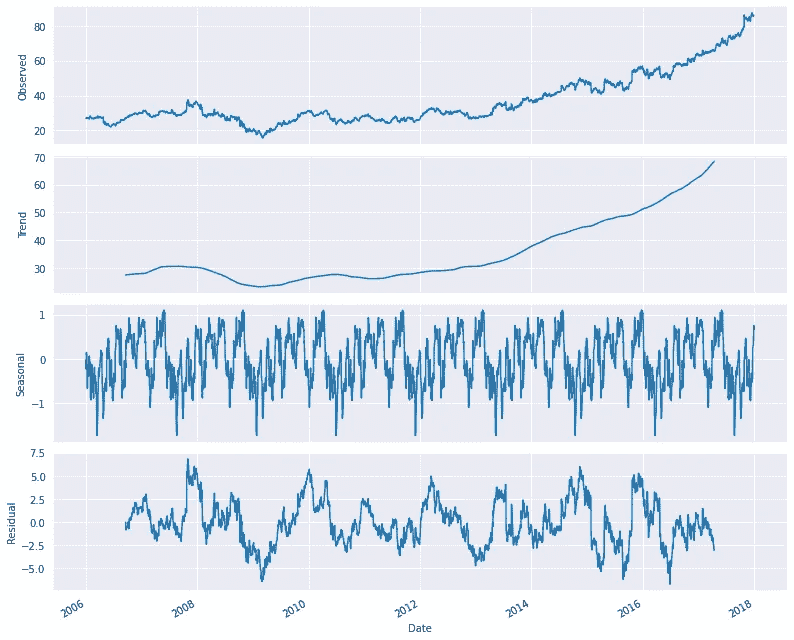

微软

微软的数据也是如此，直到 2012 年，增长趋势非常缓慢，但在 2012 年之后，出现了指数级的增长趋势。和非常高的季节性。

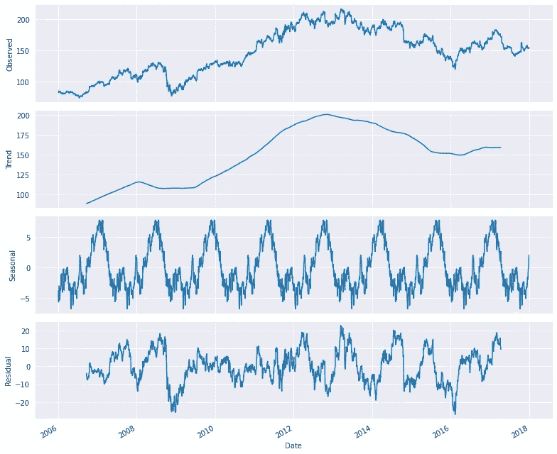

国际商用机器公司

IBM 数据在 2008 年之前呈非常缓慢的增长趋势，但在 2009 年之后，直到 2013 年呈指数增长趋势，然后在 2016 年出现大幅下降，然后呈非常缓慢的增长趋势。和非常高的季节性。

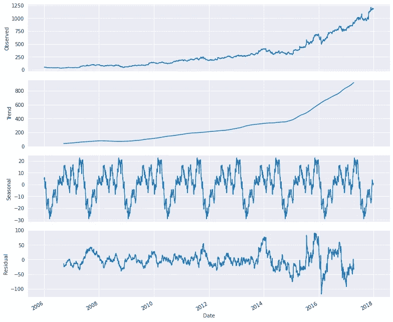

亚马孙

亚马逊的数据类似于谷歌的数据。

因为收盘和高点之间有很强的相关性，如果我们能画出收盘值，那么我们就能看到趋势和季节性非常相似。

从前面几行可以看出对股市的分析。现在我们将看到预测程序。

# 预测:

在这个过程中，有一些训练数据和测试数据，我们必须将这些数据与实际数据进行拟合。从生成的图表中，我们可以看到数据过于拟合，以至于我们无法区分实际数据和预测数据(3 条图表线完全匹配)。

# 时间序列预测:

时间序列预测使用有关历史值和相关模式的信息来预测未来活动。通常，这与趋势分析、周期性波动分析和季节性问题有关。和所有的预测方法一样，不能保证成功。

在 [Unsplash](https://unsplash.com?utm_source=medium&utm_medium=referral) 上由 [Aron 视觉](https://unsplash.com/@aronvisuals?utm_source=medium&utm_medium=referral)拍摄的照片

# 深度学习:

**深度学习**(也被称为**深度结构化学习**)是基于[人工神经网络](https://en.wikipedia.org/wiki/Artificial_neural_networks)和[表示学习](https://en.wikipedia.org/wiki/Representation_learning)的[机器学习](https://en.wikipedia.org/wiki/Machine_learning)方法的更广泛家族的一部分。学习可以是[有监督](https://en.wikipedia.org/wiki/Supervised_learning)、[半监督](https://en.wikipedia.org/wiki/Semi-supervised_learning)或[无监督](https://en.wikipedia.org/wiki/Unsupervised_learning)。

[深度神经网络](https://en.wikipedia.org/wiki/Deep_learning#Deep_neural_networks)、[深度信念网络](https://en.wikipedia.org/wiki/Deep_belief_network)、[图形神经网络](https://en.wikipedia.org/w/index.php?title=Graph_neural_network&action=edit&redlink=1)、[递归神经网络](https://en.wikipedia.org/wiki/Recurrent_neural_networks)、[卷积神经网络](https://en.wikipedia.org/wiki/Convolutional_neural_networks)等深度学习架构已经应用于[计算机视觉](https://en.wikipedia.org/wiki/Computer_vision)、[语音识别](https://en.wikipedia.org/wiki/Speech_recognition)、[自然语言处理](https://en.wikipedia.org/wiki/Natural_language_processing)、[机器翻译](https://en.wikipedia.org/wiki/Machine_translation)、[生物信息学](https://en.wikipedia.org/wiki/Bioinformatics)、[药物设计【等领域](https://en.wikipedia.org/wiki/Drug_design)

[人工神经网络](https://en.wikipedia.org/wiki/Artificial_neural_network) (ANNs)受到[生物系统](https://en.wikipedia.org/wiki/Biological_system)中信息处理和分布式通信节点的启发。人工神经网络与生物大脑有各种不同。具体来说，神经网络倾向于静态和符号化，而大多数生命体的生物大脑是动态的(可塑的)和模拟的。

深度学习中的形容词“深”指的是网络中多层的使用。早期的工作表明，线性感知器不能成为通用的分类器，但是具有非多项式激活函数和一个无限宽度的隐藏层的网络可以。深度学习是一种现代变体，涉及无限数量的有限大小的层，允许实际应用和优化实施，同时在温和条件下保留理论普遍性。在深度学习中，为了效率、可训练性和可理解性，各层也被允许是异构的，并且广泛偏离生物学上已知的[连接主义者](https://en.wikipedia.org/wiki/Connectionism)模型，由此产生了“结构化”部分。

# GRU 模式:

门控循环单元本质上是一个简化的 LSTM。它在网络中扮演着完全相同的角色。主要区别在于门的数量和重量——GRU 要简单一些。它有两个门。由于它没有输出门，所以无法控制内存内容。更新门控制来自先前激活的信息流以及新信息的添加，而重置门被插入到候选激活中。

GRU 模型

# 带图表的结果:

经过所有的预测和分析，我们得到了下面的结果图。

(1)在亚马逊股票预测的图表中我们可以看到，三条线【训练预测、测试预测、实际值】被恰如其分地淹没在彼此之间。由此，我们可以说这个预测是恰当的。

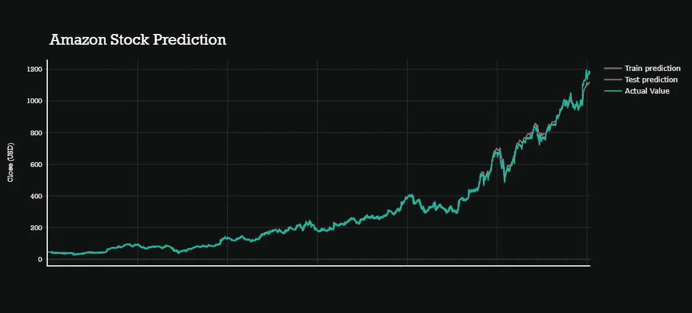

(2)在 Google 股票预测的图表中我们可以看到，三条线【训练预测、测试预测、实际值】很贴切地相互淹没。由此，我们可以说这个预测是恰当的。

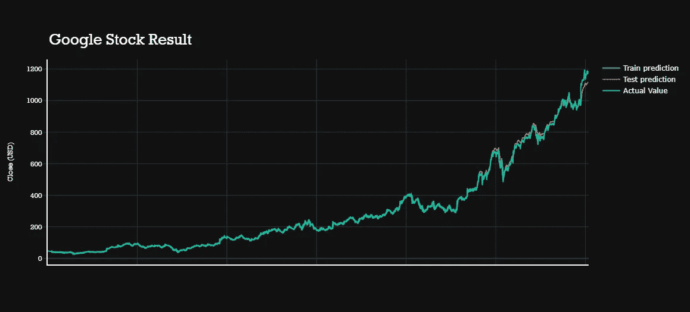

(3)在 IBM 股票预测图中我们可以看到，三条线【训练预测、测试预测、实际值】很贴切地相互并列。由此，我们可以说这个预测是恰当的。

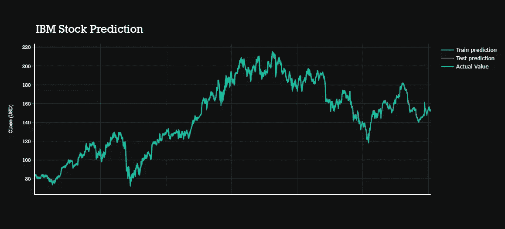

(3)在微软股票预测的图表中我们可以看到，三条线【训练预测、测试预测、实际值】很贴切地并列在一起。由此，我们可以说这个预测是恰当的。

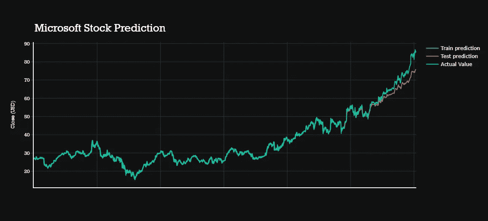

# 挑战:

在这个项目中，我们可能会面临一些挑战，比如安装问题。像这样，拟合模型的时间序列分析可能是臭名昭著的，但一旦你能够修复它并找到正确的参数，这将是一项非常容易的工作。所以这是这个项目的主要阻碍。

# 未来工作:

现在我正在尝试用 [Flask](https://flask.palletsprojects.com/en/2.0.x/) 或者 [Streamlit](https://streamlit.io/) 把这个深度学习项目做成 web 应用。如果有人有兴趣帮我填写，请通过 LinkedIn 或 Gmail 联系我。

Gmail:nandisoham2017@gmail.com

[领英](https://www.linkedin.com/in/soham-nandi-b39288215/)

# 项目链接:

> [https://github . com/soham 2707/Stock-Market-Analysis-And-Forecasting-Using-Deep-learning . git](https://github.com/soham2707/Stock-Market-Analysis-And-Forecasting-Using-Deep-Learning.git)