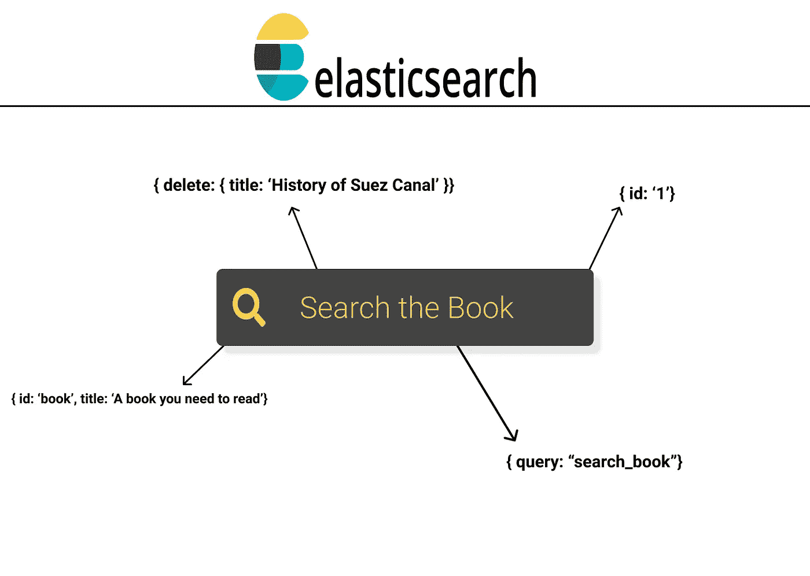
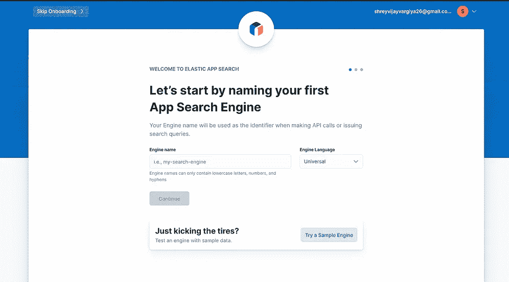
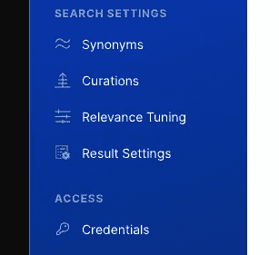
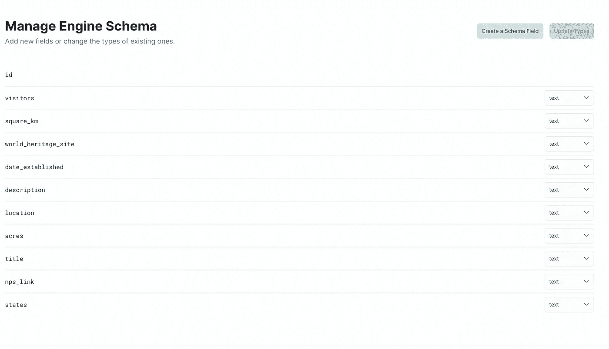
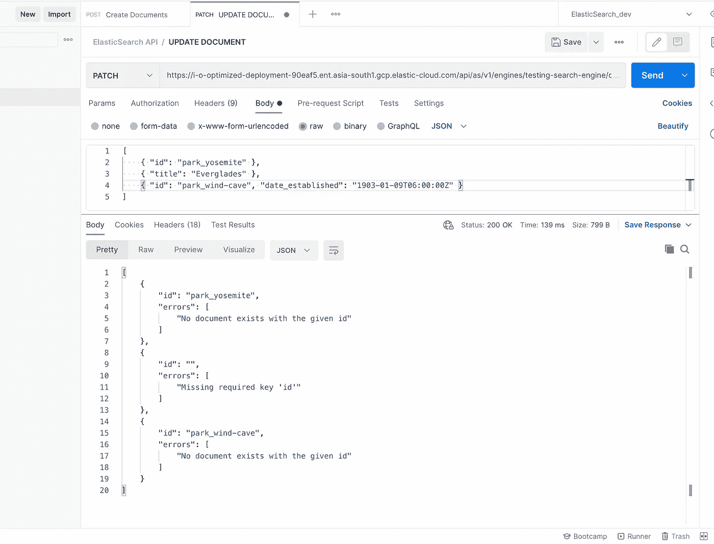
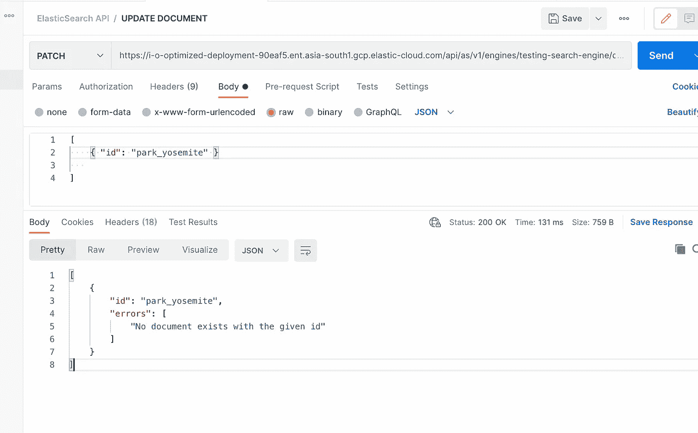
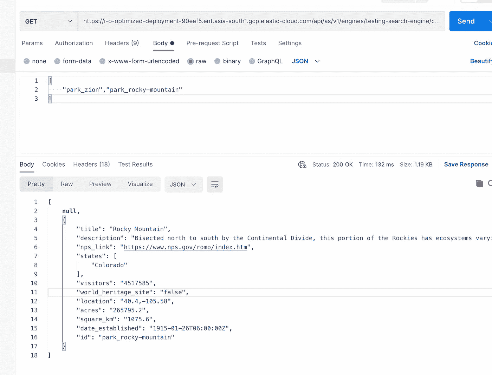
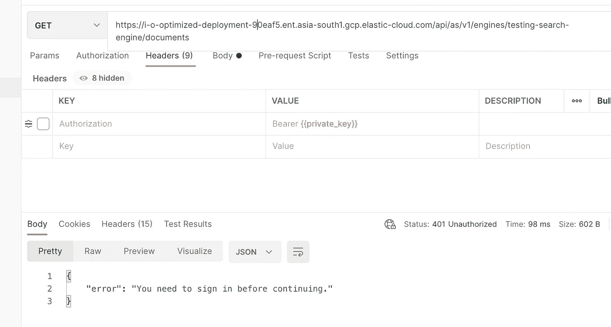

# 停止使用 MongoDB 或 PostgreSQL 进行搜索查询

> 原文：<https://medium.com/nerd-for-tech/stop-using-mongodb-or-postgresql-for-search-queries-3e95a34c68c9?source=collection_archive---------16----------------------->

弹性搜索入门，第 1 部分



由我设计的搜索查询横幅([更多请参考此处](http://ihatereading.in/creativity))

我不想这篇文章超过 6 分钟，所以我决定把它分成几部分。阅读下面的链接，了解那个小小的**搜索框**在你网站的主页上有多么令人惊讶和不受欢迎。

```
Article Link => [https://www.nngroup.com/articles/search-visible-and-simple/](https://www.nngroup.com/articles/search-visible-and-simple/)
```

但是搜索框背后至关重要的一步是它的准确性，尤其是在用户的第一次搜索查询中得到更好的匹配。文章描述了对于大多数搜索框，第一个搜索查询的匹配率仅高达 **51%，**，后面的查询匹配率更低。

设置有效的搜索查询对于提供令人愉快的搜索体验是必不可少的。让我们从研究这个开始。

# 概观

ElasticSearch 是一个 NoSQL 数据库，由于它的名字，它最适合在 JSON 对象中处理搜索查询的用例。

— ElasticSearch 与 MongoDB 类似，将每个文档视为一个 JSON 对象，保存每个文档及其对应的索引值，也称为**索引**。

—带有索引步骤的保存文档使 ElasticSearch DB 在提供一系列文档的良好搜索体验方面更胜一筹。

# 入门指南

首先，在 ElasticSearch 网站上创建一个帐户(链接在下面)。随后创建了第一个 **App** 搜索引擎。

```
**Website:** [https://cloud.elastic.co/home](https://cloud.elastic.co/home)
```



左图询问第一个搜索引擎应用程序名称，右图显示完成所有必需步骤后应用程序引擎的设置

以上图片是完成上述所有步骤后网站和仪表板外观的参考。

# 应用程序接口

像 MongoDB 或 Firebase 一样，ElasticSearch 也有自己的 API 来尝试对文档集合使用几种方法。以下是最常用的方法-

*   文档 API
*   搜索 API
*   聚合 API
*   索引 API

为了详细理解，我将介绍每个 API。

# 文档 API

*   **创建文档—** 创建文档基本上意味着创建一个数据的 JSON 对象数组。例如，您的文档将类似于下面添加的文档

```
const singleDocument = {
 description: '',
 title: '',
 id: 'user_details'
};
const anotherSingleDocument = {
 description: '',
 title: '',
 id: 'user_details'
};const Document = {
  singleDocument, anotherSingleDocument
}
```

为了创建文档，我们有一个 API，它需要一个授权令牌和带有相应 API 端点的数据数组。

```
**Method:** POST,  **Endpoint:** /api/as/v1/engines/{ENGINE_NAME}/documents 
```

要获取凭据，请单击仪表板侧边栏上的凭据选项卡。这将打开模式并显示您的密钥，如**搜索密钥**和**私人密钥，**保存这两个密钥，因为我们稍后会用到它们。API 的 URL 可以在搜索引擎仪表板的主页内提供。



仪表板侧栏上的“凭据”选项卡

# 抽样资料

这是我用来发布文档的样本数据。

用于发布文档的示例数据数组

一旦向所需的端点发出 POST 请求，它将在出错或成功的任何情况下返回 200 作为响应状态。如果响应对象包含 id 和`**errors array with zero-length**`，那么数据被成功索引，文档被成功创建，否则错误将在`**errors array**`中被捕获

*   **检查创建的文档—** 要使用上述 POST 方法检查创建的文档，您需要交叉检查使用这个文档创建的模式。例如，这里的对象是一个包含键值对的文档。我们的文档包含“visitors”、“square_km”、“location”作为键和模式。要检查模式，请单击侧栏上的 Schema 选项卡，这将显示所有模式的列表。



我的单个文档的模式

**Schemas 的类型** elastic search 中的 Schemas 是枚举，默认情况下每个键都有文本作为 schema。否则，您可以给文档的任何内容定义以下模式的键-

1.  数字
2.  地理定位
3.  日期
4.  字符串/文本

*   **更新文档—** ElasticSearch 简单使用 PATCH 方法更新文档，该 HTTP 方法需要一个对象的数据数组，其中有一个对象作为需要更新的键值对。

```
**Method:** PATCH, **Endpoint:** /api/as/v1/engines/{ENGINE_NAME}/documents
```

这是我们提供的数据阵列，用于更新弹性搜索方法

```
[
  { "id": "park_yosemite" },
  { "title": "Everglades" },
  { "id": "park_wind-cave", 
     "date_established": "1903-01-  09T06:00:00Z" }
]
```

ElasticSearch 将查找具有 id 标题的连续文档，并相应地更新它们。第一个更新对象将只返回一个 id，因为我们没有提供任何要更新的数据；第二个更新对象将无法找到任何需要更新的文档，因为没有提供 id；第三个更新对象将成功更新对象，因为 id 和值都已提供。



邮递员中更新 API 的响应



一旦提供的 id 在文档中不存在，来自 POSTMAN 中更新 API 的另一个响应。

为了正确理解响应错误，尝试在 API 中添加数据，如下所示

```
1\. const data = [{ "id": "park_yosemite" }]
```

```
2\. const data = [{ title: 'Everglades' }]
```

```
3\. const data = [{ "id": "park_wind-cave", "date_established": "1903-01-09T06:00:00Z" }]
```

所有上述 API 将给出不同的响应，它们相应的响应将帮助您更好地理解更新方法。

*   **删除文档—** ElasticSearch 提供了一个使用 DELETE 方法的 API，需要一个 id 数组或单个 id 来分别删除文档和文档。

```
**Method:** DELETE, **Endpoint:** /api/as/v1/engines/{ENGINE_NAME}/documents
```

一旦提供了 id，响应对象将给出相应的 **id** 和`**deleted**` 布尔键值。`**deleted**`布尔值决定了文档的结果，如果为真，则提供 id 的文档被删除。您可以在数据数组中提供多个 id，并将单个 id 作为单个对象。


邮递员中删除 API 的响应对象

*   **获取文档—** 可以查询单个文档或文档列表。ElasticSearch 提供了一个 API，它使用 GET 方法并需要一个 id 数据数组来获取具有相应 id 的文档。

```
**Method:** GET, **Endpoint:** /api/as/v1/engines/{ENGINE_NAME}/documents
```



来自 GET API 的响应对象

这里**空**对应**‘没有找到这样的对象’。**

N 注意:如果您在为 ElasticSearch 端点制作 API 时发现 POSTMAN 中有错误，如下图所示。在这种情况下，您忘记在**标题**选项卡中添加授权标题。



未提供标题时出错

# 结论

这是唯一的文档 API，在下一部分中，我将介绍提供的搜索 API。为了更好的参考，我分享了 POSTMAN 集合和代码库。

**直到，下次。祝大家愉快。**

```
Collection Link [https://www.getpostman.com/collections/9f5ea5712d531be92e2b](https://www.getpostman.com/collections/9f5ea5712d531be92e2b)
```