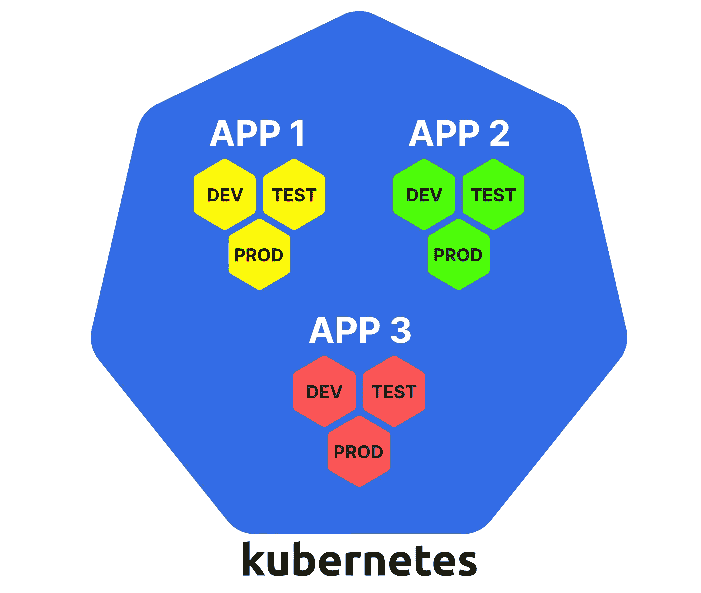
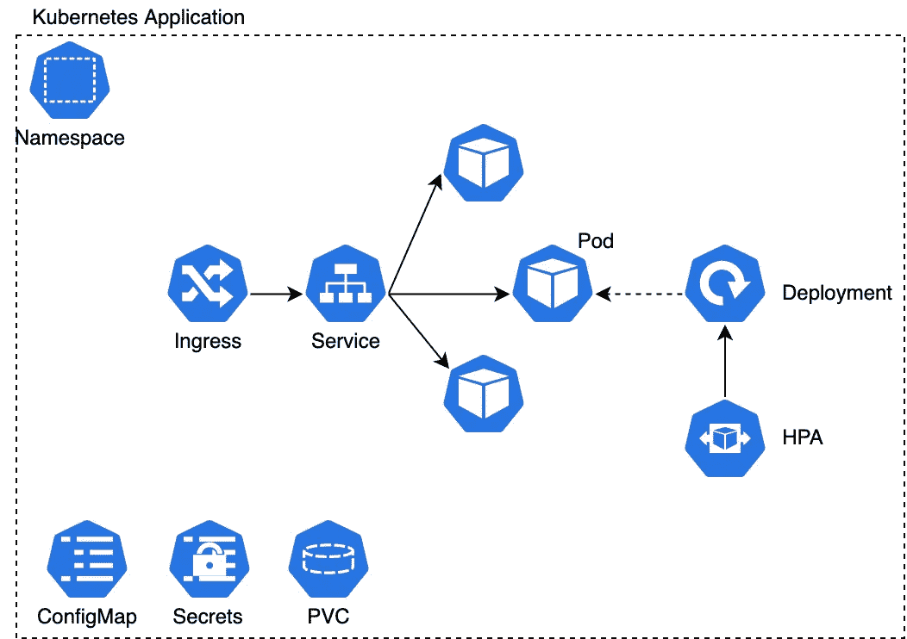
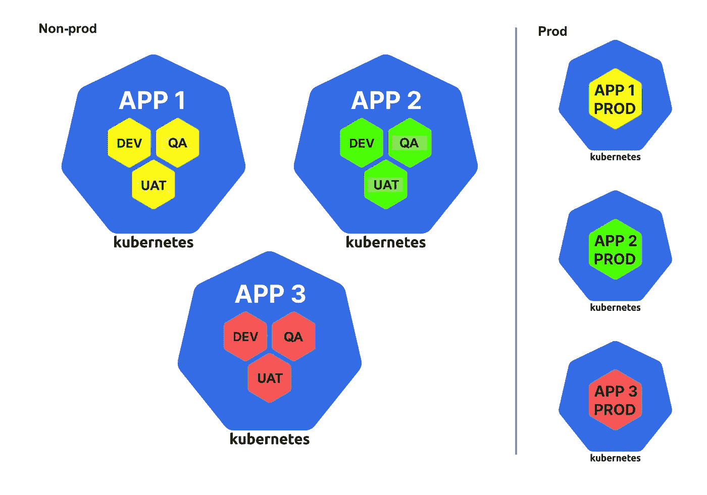

# 停止使用大型集群:Kubernetes 集群管理的最佳实践

> 原文：<https://medium.com/nerd-for-tech/stop-using-one-large-cluster-best-practice-on-kubernetes-cluster-management-87e49624ab9a?source=collection_archive---------5----------------------->

# TL；博士:

取代许多小型 Kubernetes 集群，大型集群仍然在组织中普遍使用。然而，集中的集群管理会**降低可用性**，**减缓开发**，甚至让产品团队**遭受组织孤岛**。

尽管大型集群在一定程度上给我们带来了好处，但补充解决方案正在积极开发中，以减轻应用小型分布式集群的不便。准备团队**入门套件**以加快设置并在**政策**的帮助下保持合规性。同时，基于跨职能技术构建**社区**也是必不可少的，因为团队需要比中央管理方式更多的能力。

# 定义

**用大来描述 Kubernetes 星团是相当模糊的。**您可以在几个不同的级别上比较两个集群，如节点、pod、容器。[1]没有绝对的标准来区分大的集群

**大往往是直观的，就像鼓胀者的代码气味，并能告诉我们一些深层次的问题。我们最好用复杂这个词来准确描述这种感觉，而不是大，因为这样的感觉总是意味着一件事情做得太多，不再简单。**

大型集群(来自 learnk8s.io)

在实践中，我们可以将具有任何证据的群集视为复杂的群集:

1.  **托管属于不同团队的多个应用**
2.  **将非生产环境和生产环境放在一起**

笔记应用是微服务十年中又一个模糊的词。为了遵循 Kubernetes 的世界规范，**我们将业务能力服务视为一个应用程序，包括使其可部署的若干资源**。有时，一个团队负责不止一个服务，但是它应该拥有高度相关的服务以保持凝聚力。[2]

Kubernetes 应用程序包含许多组件

复杂的集群给人一种失控的感觉，除此之外，与更多更小的集群相比，它们还有一些明显的弱点。[3][4]

# 一个大型集群的缺点

## 1.可用性较差

一个大型集群意味着你的整个系统依赖于一个点。如果这个集群崩溃了，你所有的应用都会瘫痪。网络配置、全局插件或 Kubernetes 升级中的任何错误都可能导致意外的集群范围的中断。

让爆炸半径覆盖你所有的资产是不明智的。提高可用性的一个天真但有用的想法是将你的资源分成不同的空间。

## 2.较低的可扩展性

遗憾的是，受限于共享控制平面， **Kubernetes 集群无法无限扩展**。理论上节点的上限是 5，000，但是据报道，即使只有 500 个节点，您也可能遇到麻烦。[5][6]

**你也值得考虑云资源配额。**云提供商确实对许多类型的资源设置了配额，例如计算机实例、CPU、存储卷和一系列网络资源。[7]这些配额会阻止您的群集申请更多资源进行扩展。

## 3.较少的部署

另一个考虑是**所有的应用程序所有者必须遵循相同的维护生命周期**，这可能会扰乱一些团队的节奏。

**此外，庞大的中央集群管理团队可能会成为价值交付的瓶颈。**与自助云服务提供商相比，大型集群需要专门的团队来维护和向其他团队提供服务。这种集中的依赖性会减慢开发速度，并限制团队发展他们系统的能力。[8]

## 4.灵活性较差

**通常情况下，应用程序需要特定的定制。一些计算密集型应用需要特定的带有 GPU 的工作节点，一些依赖于特定的 CNI 插件。有些依赖于特定的服务网格，您必须对其进行全局配置。[9]如果集群太大，具有相似需求的团队可能会受到影响。**

**在云提供商的帮助下设计现代应用时，强大的云服务是相当重要的一部分。**一个大型集群限制了集成所需云服务的灵活性，而这些云服务有可能简化开发、提高性能、增强安全性并降低成本。

## 5.较弱的安全性

最后但同样重要的是，我们必须意识到 **Kubernetes 的名称空间是一种软多租户设计**。有许多跨名称空间共享的组件。[10]例如，由于共享 DNS，一个租户可以看到另一个租户创建的服务。虽然这些资源共享在大多数情况下不应该成为问题，但是它们会增加系统违规的严重性。

我们不希望看到所有成员都能访问生产环境。**帐户受损会给包含生产和非生产应用程序环境的群集带来严重后果。**理想情况下，很少有直接在生产集群上操作的情况，因此我们不应该因为软租赁而将它们放在同一个集群中。

# 你应该有多少个集群？

很明显，我们应该把我们的大集群分成许多小集群，但是指导原则是什么呢？

为了减少团队的依赖性并使基础设施自助服务，我建议您**为应用团队至少准备两个集群，一个用于非生产环境，另一个用于生产环境**。

对于负责多个相关应用程序的团队，他们可以自己决定是否将两个集群分成更多部分。

一个有吸引力的事实是，一些云平台不会对主节点收费。[11]所以**我们不需要担心雇佣更多和更小的集群会增加成本**。

虽然通过这种方式，我们可以避免大型集群带来的缺点，但我们也失去了大型集群的一些优势:

1.  **快速启动**。—对于应用程序团队来说，使用完美调整的配置启动群集并不容易。
2.  **服用方便**。—分布式群集的监控和治理更具挑战性。
3.  **能力要求低**。—在 Kubernetes 内部玩比处理基础设施更轻松。

为了减轻失去上述优势的痛苦，看看这三个实践。它们不是为分布式 Kubernetes 集群设计的，但却意外地适合成为它们的补充。

# 基础设施入门套件

**初学者工具包是一组样板文件，供应用团队配置基础设施，包括专用集群。**初学者工具包将团队从过多的配置中拯救出来，以满足合规性要求，并帮助团队真正快速地启动他们的项目。

一个初学者工具包很可能包含几个技术栈。例如，Terraform 被用来帮助建立基础设施。可以定制 Tekton、Jenkins 或其他管道服务，以提供标准管道作为 CI/CD 基线。不要忘记在内部集成代码扫描工具，因为初学者工具包应该指导团队遵循良好的实践。

# 合规政策

另一个挑战是确保集群在应用程序的整个生命周期中都是合规的。在集群之上，所有其他流程也必须遵守法规，包括特定于组织的内部要求、行业范围的规则和政府命令。[8] **支持团队不应与应用团队紧密结合并提供专门的服务，而应实施策略以确保所有集群满足需求**，例如升级到特定版本。

**借助 OPA 和 GateKeeper 等策略工具，我们能够持续跟踪基础设施状态。它们也有助于审计和阻止不允许的操作。我们可以使用这些策略自动化工具来使流程更像自助服务，这意味着更少的团队依赖性、更强的内部凝聚力和更分散的治理。**

# 技术社区

集群下放也对团队能力提出了更高的要求。虽然入门套件和政策已经提供了良好的开端和持续的指导，但一些实践技能仍然是有利可图的。一个团队掌握了为他们的业务场景配置基础设施的知识，无疑可以提高应用程序的可靠性。

**在自主的跨职能团队中，专业技能很难在团队间传播。**建立社区有助于**在团队之间积累和交流知识**。要让一个社区真正高效，控制它的规模，留出足够的时间，并且只接受从事类似技术工作的人。此外，有意识地要求成员在更大的团队中轮换是获得专业知识广度的另一种有效方式。[12]

# 结论

就像代码的味道一样，当操作大型集群时，我们可以感觉到一些可怕的事情。通过比较一个大型集群和许多小型集群，我们知道**大型集群在可用性、可伸缩性、交付效率、灵活性和安全性方面存在不足**。

为了避免管理大型中央集群的缺点，我们应该采用一种策略**将应用程序分布到不同的集群中**。

然而，与此同时，它也带来了更高的复杂性和对产品团队的更多要求。**为了减少不便，初学者工具包、合规政策和技术社区值得一试**。

# 参考

[1] Kubernetes 组件| Kubernetes
[https://kubernetes.io/docs/concepts/overview/components/](https://kubernetes.io/docs/concepts/overview/components/)
【2】BusinessCapabilityCentric
[https://Martin fowler . com/bliki/BusinessCapabilityCentric . html](https://martinfowler.com/bliki/BusinessCapabilityCentric.html)
【3】Kubernetes:一个集群还是多个集群？
[https://tanzu . VMware . com/content/blog/kubernetes-one-cluster-or-many](https://tanzu.vmware.com/content/blog/kubernetes-one-cluster-or-many)
【4】构建 Kubernetes 集群—您应该有多少个？
[https://learnk8s.io/how-many-clusters](https://learnk8s.io/how-many-clusters)
【5】大型集群的注意事项| Kubernetes
[https://Kubernetes . io/docs/setup/best-practices/cluster-large/](https://kubernetes.io/docs/setup/best-practices/cluster-large/)
【6】不搞一刀切， 如何调整 Kubernetes 集群
[https://events 19 . lfasiallc . com/WP-content/uploads/2017/11/BoF _-Not-One-Size-Fits-All-How-to-Size-Kubernetes-Clusters _ Guang-Ya-Liu-_-SAH dev-zala . pdf](https://events19.lfasiallc.com/wp-content/uploads/2017/11/BoF_-Not-One-Size-Fits-All-How-to-Size-Kubernetes-Clusters_Guang-Ya-Liu-_-Sahdev-Zala.pdf)
[7]使用配额|文档|谷歌云
[https://cloud.google.com/docs/quota](https://cloud.google.com/docs/quota)
[8]devo PS 文化中的合规性