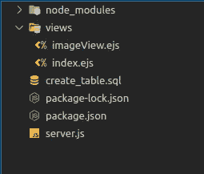
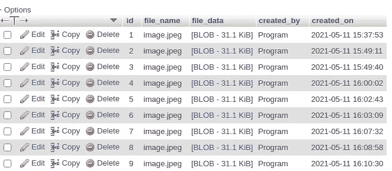

# 将文件存储在 MySQL 数据库中，并使用普通 JS 和 Node 进行查看。射流研究…

> 原文：<https://medium.com/nerd-for-tech/store-files-binary-in-mysql-database-and-view-using-vanilla-js-and-node-js-95a227002b85?source=collection_archive---------4----------------------->

有几种方法可以上传文件并将其保存在服务器上。在本教程中，我们将实现如何使用**普通 Javascript** 读取文件，使用 Node 将文件的二进制数据保存在 **MySQL DB 中。JS** ，并查看它们。

所有 JS 框架的 JS 代码实现都是一样的。我假设你有**和*节点。JS*** 基础开发知识和 ***phpMyAdmin*** 安装在你的系统中。

让我们深入实施。

> **创建项目**

安装以下模块。

npm i express ejs mysql

npm i -D 节点

项目结构应该如下所示。

> **实施**

在 phpMyAdmin 中运行以下 SQL 命令来创建一个表。

我们将使用 LONGBLOB 数据类型来存储文件的二进制数据。LONGBLOB 是一种 BLOB(二进制大对象),最大长度为 4294967295 个字符。

让我们设置 API 代码来渲染 HTML 页面并将文件数据保存在 DB 中；

将下面的代码放在 server.js 文件中。

在 config 对象中，放置您的 MySQL 用户、密码和相关的数据库名称。

*   **获取“/”:-**将呈现上传文件的页面。
*   **POST "/store":-** 它将从请求体中提取文件的数据，并将其存储在数据库中。
*   **GET "/image/:id":-** 它将使用参数中的 id 从数据库中获取文件数据，并发送到 UI 以显示。

让我们实现 UI 端代码。

放在 index.ejs 中的代码下方

让我们看看上面的代码发生了什么。

我在文件输入域中附加了一个 onchange 事件，它在加载文件时触发。

**FileReader** 对象允许 web 应用程序从用户计算机异步读取文件或原始数据缓冲区，可从**文件**或 **Blob** 对象中检索。

**文件**对象可以从输入元素选择文件返回的**文件列表**对象中获取。

**FileReader** 只能访问用户通过输入栏或拖放加载的文件内容。它不能通过路径名访问文件。

它有几个事件处理程序和方法，这里我们使用其中的三个。

*   **FileReader.onload:-** 每次成功完成读取操作时都会触发此事件。
*   **FileReader.onerror:-** 每次读取操作遇到错误时，都会触发此事件。
*   **filereader . readasdataurl():-**开始读取指定的 Blob 或文件，一旦完成，结果属性 data: URL 表示文件的数据。

从服务器收到保存的文件 id 响应后，我们将删除输入字段，并将用户重定向到“/image/{fileid}”，用户将能够在这里查看加载的图像。

放在 imageView.ejs 中的代码下方

在这个文件中，我们从/ **图像 */* :id** 路线接收 **< %= name % >** 数据。

现在做 npm 启动，去 [http://localhost:3000](http://localhost:3000/) 。

上传一个文件，您将被重定向到另一个页面，在那里您将能够查看上传的图像。

您可以打开 ***phpMyAdmin*** 并检查存储的记录，如下所示。

phpMyAdmin

如果您有任何问题，请留下您的评论。

查看 Github 仓库中的源代码。

 [## dev-sankhadip/Store-File-Database-and-View-in-Vanilla-JS-Node。JS 和 MySQL

### 贡献给 dev-sankhadip/Store-File-Database-and-View-in-Vanilla-JS-Node。JS-and-MySQL 开发通过创建一个…

github.com](https://github.com/dev-sankhadip/Store-File-Database-and-View-in-Vanilla-JS-Node.JS-and-MySQL) 

# Sankhadip Samanta

*软件开发人员、代码商|技术作家*

在 [Linkedin](https://www.linkedin.com/in/sankhadip-samanta-7bb891180/) 上找到我😃和 [Github](https://github.com/dev-sankhadip) 😅