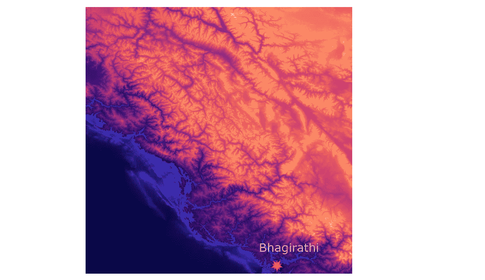
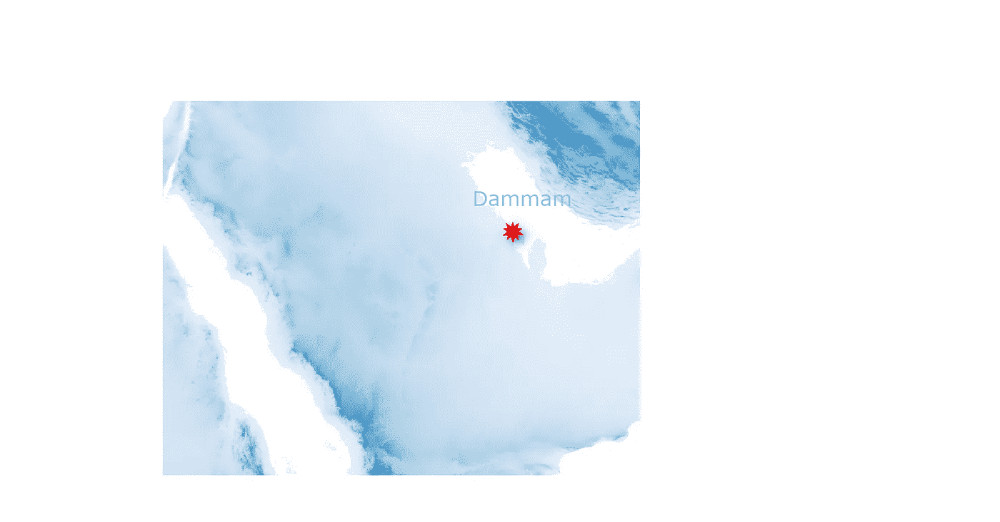
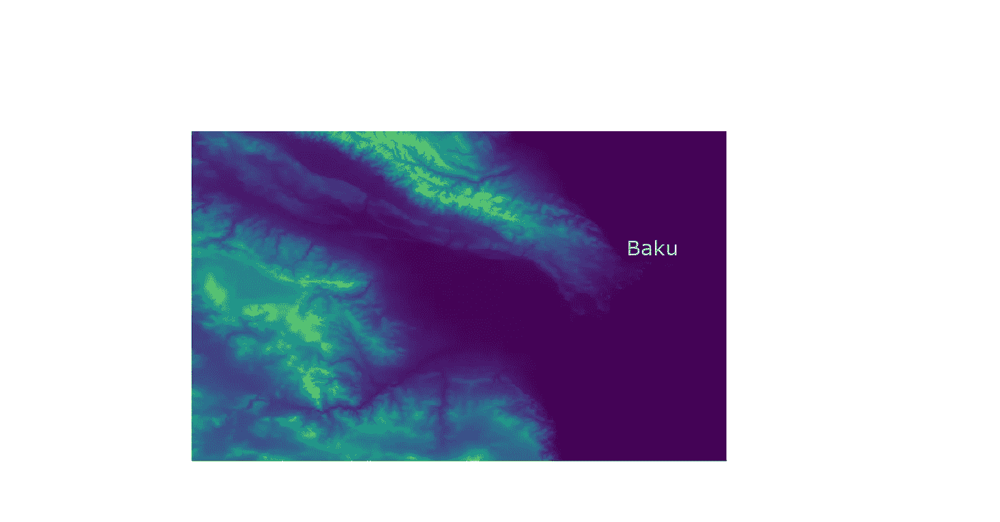
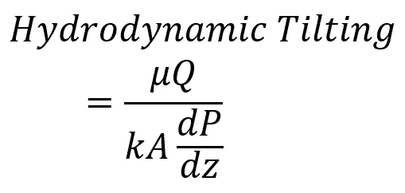
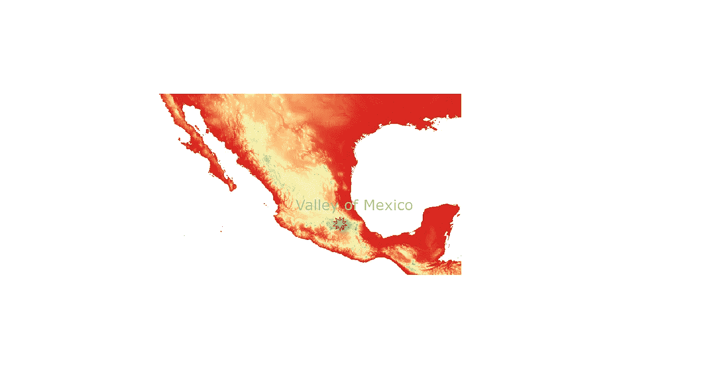
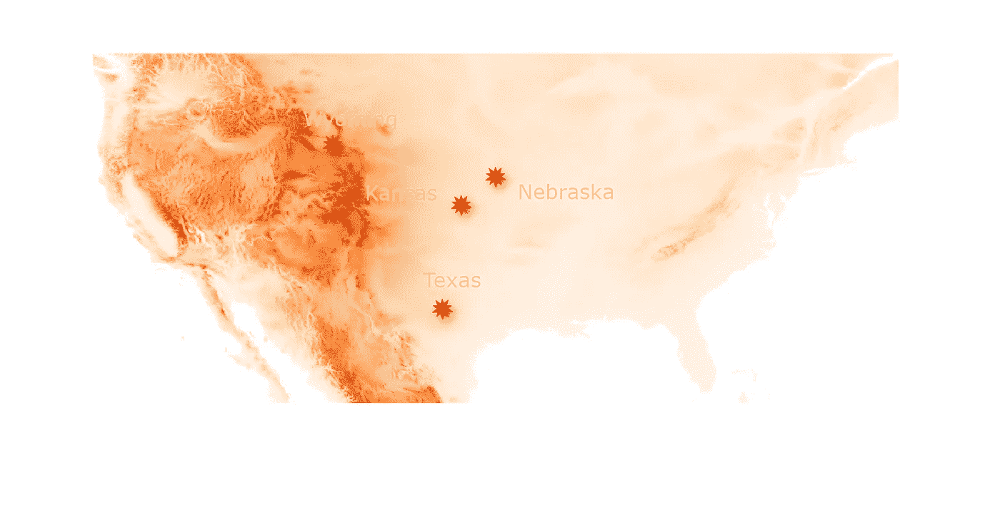
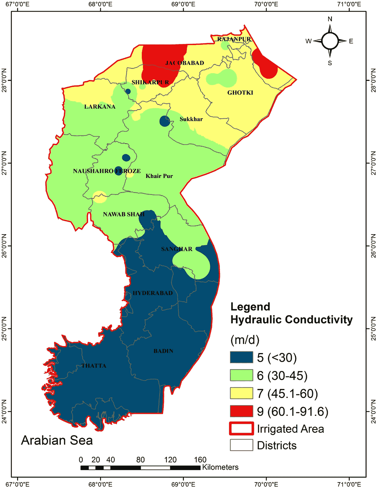

# 地下水足迹最大的地层和含水层——第一部分

> 原文：<https://medium.com/nerd-for-tech/strata-and-aquifers-with-the-largest-groundwater-footprint-part-i-f553cd09dcae?source=collection_archive---------16----------------------->

***GIS 地图，包括*的拓扑和高程**

> 地下水渗漏或渗透的拓扑结构和带有导管或渠道的地图通过查看在地下水集水区起主要作用的集水区地标的地理信息系统地图获得。其中一些最受欢迎的提到如下。

> 在加州的**中央山谷，由于山谷地区发生自然补给，导致土壤水平下沉并偏离正常水平，因此对土壤下沉进行了监测。人们发现，地下水足迹构成了全球含水层面积的 3.5 倍。但是大约 80%的含水层的地下水足迹面积小于其含水层面积。这些统计数据很有趣，我偶然发现了一个地下水足迹最大的含水层列表，我想在这里分享一下。**

# 恒河上游

*   **流域面积**:132 万平方公里
*   含水层面积:0.48 x 1⁰⁶公里
*   **地下水足迹** : 26.1 +/- 7.5

**恒河上游，在 Bhagirathi 和 Alakananda 河有河口**

> **恒河上游**河口位于 **Bhagirathi** 和 **Alakananda** 河流。GIS 地图中显示的色差是西藏地区的色差。
> 
> 恒河三角洲是世界上最大的河流三角洲。恒河两岸是由营养丰富的沉积物形成的肥沃土地。恒河从西边的 Bhagirathi 延伸到东边靠近孟加拉国的 Meghna 河。
> 
> 西南季风导致流域降水。降水也是由来自孟加拉湾的热带气旋引起的。

恒河上游含水层是一个高渗透性含水层，通常为 30-60 米/天，某些地区为 50-60 米/天。

> 这是添加到 GIS 地图的标记坐标，它是位于 Bhagirathi 的上恒河河口。
> 
> *东经 78.59 度，北纬 30.15 度*

# 北阿拉伯和南阿拉伯

*   **流域面积**:91.62 万公里
*   **地下水足迹(北阿拉伯)** : 17.3 +/- 4.7 x 10⁶公里
*   **地下水足迹(南阿拉伯)** : 9.5 +/- 3.6 x 10⁶公里
*   **含水层面积(北阿拉伯)** : 0.36 x 10⁶公里
*   **含水层面积(南阿拉伯)** : 0.25 x 10⁶公里

> 在**阿拉伯半岛**，风的雕刻和侵蚀表现为北北西向。含水层伴随着**沙特**和**巴林**的**鲁斯地层**以及出现在建筑行业的鲁斯石灰岩。**棕色结晶石灰岩**和**橙色泥灰岩**构成了含水层的一部分。下一层是白色石灰岩，形成了**区域。含水层**是**达曼地层**的上部，由白色多孔细晶状普通白垩质石灰岩组成。
> 
> 这种白色石灰岩与阿拉伯半岛上的阿拉特石灰岩相关。
> 
> 构造事件表征了**阿拉伯板块**的形成。这涉及亚洲、非洲和地中海。

> 这是添加到表示达曼的 GIS 地图的标记坐标。
> 
> 东经 50.10326 度，北纬 26.43442 度

## 形成阿拉伯板块的主要构造事件列表

# 波斯人

*   **流域面积**:91.62 万平方公里
*   **地下水足迹**:8.4±3.7×10⁶公里
*   含水层面积:0.42 x 10⁶公里

> 波斯坎儿井是联合国教科文组织的世界遗产中心，位于伊朗。坎儿井是一条隧道或渠道，水通过它从山的内部流到必要的地方。传统的方法被用来计算坎儿井的长度、坡度和高度，有经验的坎儿井工人被雇来做同样的工作。坎儿井系统使农业和定居点成为可能，并激发了沙漠特有的建筑和景观风格。这包括建造建筑物，如水库、磨坊、灌溉系统和花园。

# 南里海

*   **地下水足迹**:5.9±2.0×10⁶公里
*   **含水层面积**:0.06×10⁶公里

> 在**南里海盆地**有许多 **OWC** (油水界面)倾斜，这使得油气田内的油气勘探和活动扩大。南里海位于**伊朗**和**阿塞拜疆**海岸。在南里海观察到 [**超压水**](https://core.ac.uk/download/pdf/77002433.pdf) 。这是由于快速沉积物沉积造成的，并导致不平衡压实。流动的 [**路径**](https://core.ac.uk/download/pdf/77002433.pdf) 没有很好地连接，这意味着不存在容纳这种超压水的汇(顾名思义)。由于这种超压水没有可渗透单元，所以在整个盆地钻井。

> 一些砂层单元的压力低于邻近的页岩，这导致砂层单元内的 [**流出点**](https://core.ac.uk/download/pdf/77002433.pdf) 释放与页岩相反的超压。
> 
> 这意味着对于给定的压降，密度对比越大，OWC 的垂直位移越小。这就是为什么流体动力倾斜在气藏中不如在油藏中明显。[@ ref](https://core.ac.uk/download/pdf/77002433.pdf)

> 这是添加到代表阿塞拜疆巴库的 GIS 地图的标记坐标。
> 
> 东经 49.867092 度，北纬 40.409264 度

## **水动力含水层理论(超压和流体接触)**

**OWC 倾斜**

**渐变率**

**该比率也表示为**

# 墨西哥西部

*   **地下水足迹**:5.5±2.0×10⁶公里
*   **含水层面积** : 0.21 x 10⁶公里

> 10 至 40 米深的含水层层 1 ( **Capa Duras** )被认为是由淤泥和沙子组成的坚硬层。大约 100 米深的**湖相粘土**层(**含水层 II** )被认为是弱透水层。自流井是在 19 世纪开采地下水时用 Capa Duras 形成的。然后出现**淋溶层** ( **含水层 III** )，厚度约为 100 至 500 米。该层由**更新世**和现代**玄武岩沉积**组成。下一个含水层是第四含水层**、**、**层状火山沉积物**，其边界为深度达 500 至 1000 米的上新世湖泊粘土沉积物。
> 
> **—湖泊地带**、 **Pedmont(过渡)地带**和**山地地带**是墨西哥**流域**的三大水文地带。

> 这是添加到 GIS 地图的标记坐标，表示墨西哥山谷。
> 
> -东经 98.9156133 度，北纬 19.6017873 度

# 高平原

*   **地下水足迹**:4.5±1.2×10⁶公里
*   **含水层面积**:0.50×10⁶公里

> [**高地平原含水层**](http://citeseerx.ist.psu.edu/viewdoc/download?doi=10.1.1.849.2596&rep=rep1&type=pdf) 位于**美国**境内，是世界上最大的淡水含水层之一，受到水位持续下降和水质恶化的威胁。

> **细质地土壤**——砂质、粉质、粘土质或壤土占主导地位。**碳酸钙**常见于这些土壤。**高平原含水层**储存的可排水总量为 3.9 x 10 米，这也是它可能是世界上最大的淡水含水层之一的原因。高平原含水层主要由晚第三纪或第四纪近地表沉积物组成。
> 
> **中新世**时期高地平原上的**奥加拉组**，是含水层的主要地质单位。它由粘土、淤泥、沙子和砾石的异质序列组成。其他成员如碳酸钙也是 [**奥加拉地层**](https://en.wikipedia.org/wiki/Ogallala_Aquifer) 的一部分。Ogalla 地层的水一般质量较高，适合大多数农业、工业和家庭使用。

> 覆盖高平原含水层区域的一些地点有:
> 
> ***—堪萨斯州***
> 
> ***—得克萨斯***
> 
> ***—怀俄明州***
> 
> ***—内布拉斯加州***

对这些地区每月的年降水量进行了评估，结果如下所示:

*   怀俄明州夏延市五月是最高的，大约 60 毫米
*   五月、六月、七月是内布拉斯加州北普拉特地区年降雨量最大的三个月
*   九月是得克萨斯州米德兰-敖德萨最高的月份，大约 64 毫米
*   六月、五月和九月是该地区气温最高的三个月，分别为 110 毫米、97 毫米和 88 毫米。

> 氨和硝酸盐的存在及其数量表明，约 1/5 至 1/2 的溶解硝酸盐存在于奥加拉地层中。这表明补给发生在土壤中，形成发生在早期。根据水中的氘和氧-18 的数量，并没有显示从蒸发的水中补充的水处于很高的水平。这是因为这将增加补给中来自大气的氮(N)量。

# 下印度河

*   **地下水足迹**:4.2±1.5×10⁶公里
*   含水层面积:0.23 x 10⁶公里

> 在其中一篇论文中， **DRASTIC** 方法被应用于信德省的印度河下游平原含水层。**激烈的**方法构成:
> 
> **— D** 水位深度
> 
> **—R**e 充电
> 
> **—**更快的媒体
> 
> **—**油介质
> 
> **— T** 地形图
> 
> 包气带(非饱和带)的影响
> 
> —液压 **C** 传导性

> **塔塔**、**巴丁**、**拉卡纳**、**什卡尔布尔**和**雅各布阿巴德**区域由水深 1.5 m 的>组成。其余区域水深为 1.5-4.5 米和 4.6-10.7 米。含水层由**中细砂**、**中粗砂**、**砾石**和**石灰岩**组成。印度河下游的土壤由**粘土、粉质粘土、砂质粘土、壤土**和**沙区**组成。Thatta、Badin 和 Hyderabad 地区的水力传导率为< 30 米/天，而 Nawab Shah 、 **Naushahro Ferzone** 、 **Larkhana 地区**的水力传导率为 30-45 米/天。这些地区:- **Ghotki** 、 **RajanPur** 和 **Jacobabad** 和 **Shikarpur** 的部分地区的降雨量为 45.1-60 米/天。Shikarpur 和 Jacobabad 等一些富水区的降雨量为 60.1-91.6 米/天。

> ***第二部分地下水足迹含水层清单将尽快公布。***