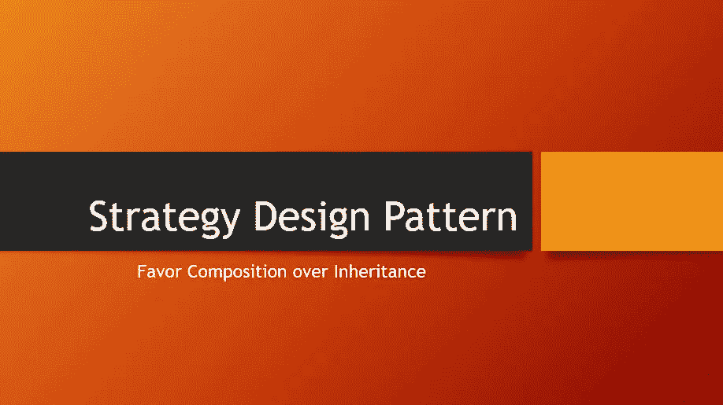
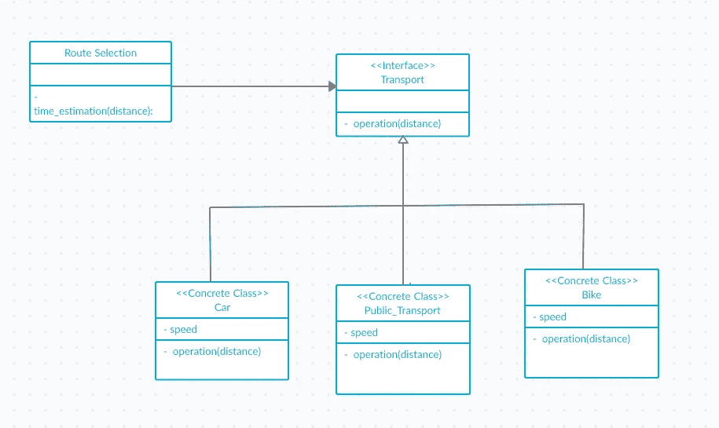

# 战略设计模式— Python

> 原文：<https://medium.com/nerd-for-tech/strategy-design-pattern-python-896f2d38012d?source=collection_archive---------2----------------------->



> 策略模式定义了一系列算法，封装了每一个算法，并使它们可以互换。策略让算法独立于使用它的客户端而变化。

为了理解策略设计模式，让我们以一个运输系统为例。您正在开发一个应用程序，它为用户选择的路线提供时间估计。有不同种类的交通工具，如公共交通工具、汽车和自行车。每种运输方式根据其速度和其他因素有不同的估计时间。

解决这个问题的简单方法是使用 if…else 条件。每种运输方式都有不同的“如果”代码块。从长远来看，这种方法在维护代码时会导致问题。每次我们需要添加新功能时，都需要修改代码。实现它的更好的方法是使用策略设计模式。

将有一个路线选择类和其他三个类，它们将从抽象类 Mood of Transport 继承而来。

在策略模式的上下文中，我们将把算法家族定义为汽车、公共交通、自行车，并使用传输接口封装它。用户可以独立使用这些算法来估计旅行时间。UML 图将看起来像这样



使用 creately.com 设计

> *策略模式允许您通过使用组合来改变运行时的行为。*

transport.py 文件包含传输源的代码。

route_selection.py 文件中提供了路线选择和时间估计代码。

我们可以在不影响现有实现的情况下，通过添加任何新的运输方式来扩展这种设计。

您可以通过下面的链接从 GitHub 获得这段代码。

```
https://github.com/sohaib-dev/Strategy_design_pattern
```