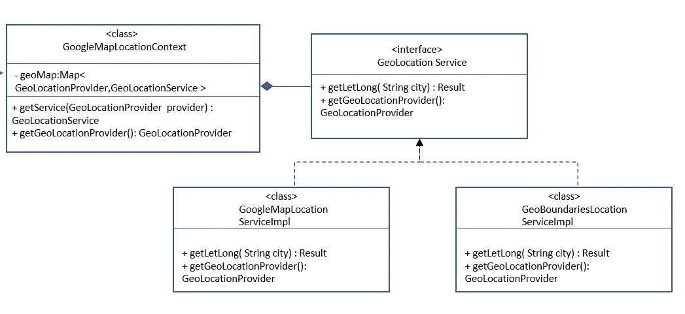
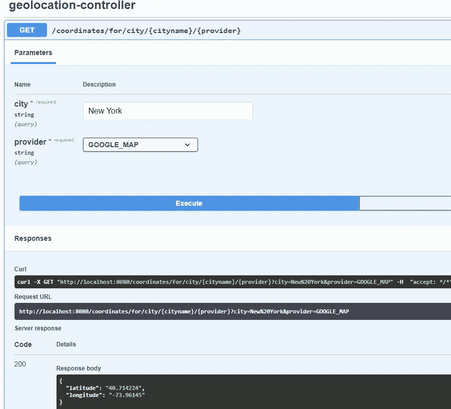

# 微服务中的策略模式

> 原文：<https://medium.com/nerd-for-tech/strategy-pattern-in-microservices-d93c67f7d5f0?source=collection_archive---------3----------------------->

如今，对于任何主要的应用程序开发项目来说，微服务体系结构已经成为首选的解决方案。

我们可以把[微服务](/javarevisited/10-best-java-microservices-courses-with-spring-boot-and-spring-cloud-6d04556bdfed?source=rss-bb36d8439904------2&utm_source=dlvr.it&utm_medium=linkedin)想象成一组处理单元任务的轻量级服务，而不是一个完成所有任务的单片软件。这种架构解决了各种问题，但是构建微服务架构有其自身的挑战。

在本文中，我们不会讨论如何构建微服务解决方案，而是讨论在单个微服务中，策略模式会有多大帮助。

# **用例**

为了理解它，让我们来看一个简单的问题陈述:

我们将开发一个“地理定位”服务，它将返回给定地址的纬度/经度。

服务将有一个端点，它将为我提供给定地址的纬度/经度。为了获得纬度/经度，让我们假设客户端已经请求使用 Google 地图地理编码 API。

这方面的步骤非常简单:

1.  定义一个采用城市名称的端点(/coordinates/for/city/{ city name })
2.  编写一个服务类，调用带有城市名称的外部 API，并返回纬度/经度结果。

到目前为止还不错，我们有一个服务，可以根据谷歌地图 API 给我提供位置信息。

现在我们决定在多个客户机上使用这个服务，或者说我们想在另一个应用程序中使用这个服务。直到顾客/客户同意我们使用谷歌地图应用编程接口没有问题，但说一些客户想利用其他地理定位应用编程接口，如地理边界，telize，地图瓦片等。为了同样的任务。在这种情况下，我们必须更新服务代码来处理它。

这种变化的需求需要一种策略来决定内部使用哪个服务来获得相同的纬度/经度响应，但是底层服务或者说底层算法是不同的。

此外，有一个单一的[微服务](https://javarevisited.blogspot.com/2021/09/microservices-design-patterns-principles.html)来执行让地理定位对不同的地理定位 API 提供者提供底层支持的任务也是有意义的。因此，让我们看看什么是战略模式，以及它如何适应这种情况。

# 战略模式

正如 Wiki 所言，“这是一种行为设计模式，支持在运行时选择算法。代码不是直接实现单个算法，而是接收运行时指令，以决定使用哪一组算法。”

这正好符合我们的问题陈述，我们现在将支持一组地理定位服务并返回纬度/经度，但是选择哪个底层服务将根据客户端提供的运行时指令而有所不同。

下图 U [ML 图](/javarevisited/5-best-uml-books-and-courses-for-java-programmers-13c551a9235d?source=user_profile---------25----------------------------)显示了我们将如何构建解决方案。GoogleMapLocationContext 将被注入 rest 控制器中。

战略地理位置

# 实际设置

我们将使用 springboot 2.4.4 来演示该解决方案，其中我们将有一个单一的端点，它将根据城市和服务提供商来确定底层服务。在服务中，我们将打印日志语句并返回虚拟数据。

# 解决办法

# Swagger UI

# 优势

通过这种方法，我们获得了一种灵活的设计，其中选择哪个底层服务的决定被推迟到运行时，使其模块化并可以在多个应用程序中作为服务使用。

当客户端尝试通过 swagger 测试提供程序选择类型时，使用 Enum 而不是 String 来定义 GeoProviders 会使提供程序选择类型变得安全。此外，我们现在可以利用[枚举映射](https://www.java67.com/2016/09/difference-between-identityhashmap-weakhashmap-enummap-in-java.html)，在我们的例子中，它比[散列表](https://www.java67.com/2017/08/top-10-java-hashmap-interview-questions.html)性能更好，在这里我们为不同的策略创建上下文。

这种方法也使得代码更加清晰和易于维护。我们可以在单个服务中使用条件检查(if，switch case ),而不是[策略模式](https://javarevisited.blogspot.com/2014/11/strategy-design-pattern-in-java-using-Enum-Example.html),但是这将使服务中的一切变得混乱，使得维护起来有点困难。另外，对于一个看代码的新人来说，理解起来会有点困难。

使用 strategy pattern，为新的 geoprovider 扩展代码将很容易，因为我们不必接触任何现有的代码，相反，我们在我们定义的 [Enum](https://javarevisited.blogspot.com/2011/08/enum-in-java-example-tutorial.html) 中添加一个新的 geoprovider 类型，然后为新的提供者实现 geo provider 服务接口。就是这样！

将增加对新地理位置类型的支持，从而避免破坏任何现有代码的机会。

# 摘要

我们从一个简单的地理定位服务的陈述开始，扩展到支持多个地理定位服务，并看到了策略模式如何在构建解决方案中发挥重要作用。

然后我们也看到了这种设计的优势。

我希望你们喜欢阅读这篇文章，并在开始设计策略时收获颇丰。