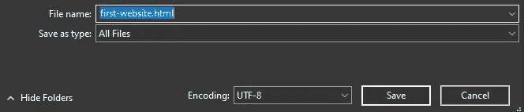
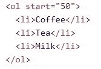
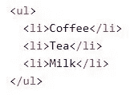
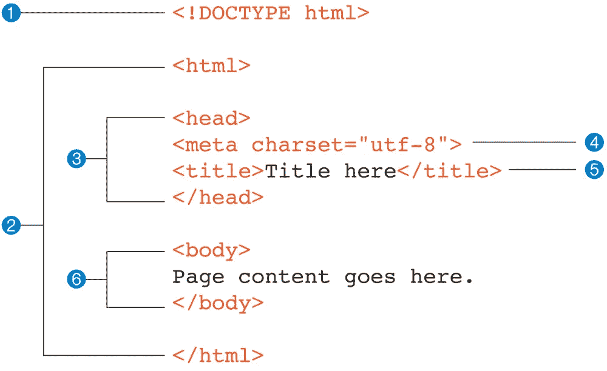

# 网站开发第一天(里程碑 1:个人作品集)

> 原文：<https://medium.com/nerd-for-tech/streaks-day-1-6eb638ca8db8?source=collection_archive---------21----------------------->

## 假设你甚至没有任何一种关于 web 开发的知识，让我们从头开始潜入这个世界。今天你将学习网站和 HTML 的基础知识。

> 模块 1:作为初学者学习和探索 HTML

# 1.有史以来第一个网站

> 在没有任何知识的情况下，创建一个网页并在任何浏览器中打开它。人类总是喜欢在我们眼前看到结果，因此我们会得到灵感。
> 
> 创建并打开一个项目文件夹(从现在开始，您将使用该文件夹存储您的所有文件)
> 
> →打开记事本>写下您喜欢的任何内容>将该文件以“*****”的名称保存在项目文件夹中。html "将文件类型更改为"所有文件" >现在使用任何您喜欢的浏览器打开该文件。

仔细检查一下。html "扩展名，同时保存文件

瞧😁！！

> 你已经创建了你的第一个网站。

# 2.使用 Visual Studio 代码和 HTML 简介

> 根据您的系统从这里下载并安装 VS 代码

 [## 下载 Visual Studio 代码- Mac、Linux、Windows

### Visual Studio 代码是免费的，可以在您喜欢的平台上获得——Linux、macOS 和 Windows。下载 Visual Studio…

code.visualstudio.com](https://code.visualstudio.com/download) 

> →打开 VS 代码>使用 VS 代码打开项目文件夹>打开以前的文件“first-website.html”>添加或删除更多文本>保存文件(快捷键:Ctrl + S)>重新加载浏览器(按 F5)以查看新的更改。

# 3.开始使用段落、粗体和斜体标签

> 开始编辑您现有的文件，并尝试这些标签。
> 
> #段落标签:这个标签帮助你创建段落。
> 
> →
> 
> 这是一个段落标签。
> 
> # Bold 标签:这个标签将文本加粗，这样可以容易地吸引注意力。[还有一个标签(**强标签**)，它的作用类似粗体标签，但具有不同的语义重要性，我们会逐渐知道]
> 
> →我是一名 **Web 开发人员**
> 
> # Italic 标签:这个标签给任何文本一种类似斜体的弯曲效果。
> 
> →她整天都在跟踪我。

# 4.不同类型的标题

> HTML 标题是您想要在网页上显示的标题或副标题。
> 
> 从 h1 到 h6 有 6 种类型的标题标签。其中
> 
> # 定义最重要的标题，而
> 
> ###### 定义最不重要的标题。
> 
> # 标题 1
> 
> < h2 >标题 2 < /h2 >
> < h3 >标题 3 < /h3 >
> < h4 >标题 4 < /h4 >
> < h5 >标题 5 < /h5 >
> < h6 >标题 6 < /h6

# 5.锚标记和“href”属性

> 标签定义了一个超链接，用来从一个页面链接到另一个页面。
> 
> 元素最重要的属性是 href 属性，它表示链接的目的地。
> 
> [Youtube](”https://www.youtube.com")
> 
> 如果没有“href ”, anchor 标记中还有一些其他属性。让我们谷歌一下，熟悉一下。

# 6.在网站上显示图像

> 标签用于在 HTML 页面中嵌入图片。
> 
> 标签有两个必需的属性:
> 
> → src —指定图像的路径
> 
> → alt —如果图像由于某种原因无法显示，指定图像的替代文本
> 
> 
> 
> * *“src”保存本地参考(如果图像在系统中),或者“URL ”(如果您想从网上获取任何图像)。

# 7.列表项目、有序列表和无序列表

> →使用
> 
> *   (列表项标签)定义每个列表项。

从 50 开始的有序列表

> 标签

无序列表

> 标签定义了一个无序的列表。

# 8.表单、输入和按钮

> 标签
> 
> 、<textarea>、<button>、<select>、<option>、</option><optgroup>、<fieldset>、<label>、<output/></label></fieldset></optgroup></select></button></textarea>
> 
> 标签指定了一个用户可以输入数据的输入字段。根据类型属性的不同，元素可以以多种方式显示。不同的输入类型如下:按钮，复选框，颜色，日期，电子邮件，文件，隐藏，密码，电台等。
> 
> 谷歌这些属性，深入了解用法。

# 9.Div，Small & Break 标签

> 标签定义了一个 HTML 文档中的一个分部或一个部分。标签被用作 HTML 元素的容器——然后用 CSS 样式化或者用 JavaScript 操作。使用 class 或 id 属性可以很容易地对
> 
> 标记进行样式化。
> 
> 标签定义了更小的文本(比如版权和其他旁注)。
> 
> 标签
> 插入一个单独的换行符。标签对于写地址或诗歌很有用。
> 标签是一个空标签，这意味着它没有结束标签。

# 10.Html 结构，头，体，标题，元标签

> 1.这是一个**文档类型声明**(也称为**文档类型声明**)
> 
> 2.整个文档包含在一个 html 元素中。html 元素被称为**根元素**，因为它包含文档中的所有元素，并且它可能不包含在任何其他元素中。它用于 HTML 和 XHTML 文档。
> 
> 3.在 html 元素中，文档被分成一个**头**和一个**体**。head 元素包含关于文档本身的描述性信息，比如它的标题、它使用的样式表、脚本和其他类型的“元”信息。

HTML 网页的结构

> 4.head 元素中的 meta 元素提供关于文档本身的信息*。元元素可以用来提供各种信息，但是在这种情况下，它指定了文档中使用的**字符编码**(字母、数字和符号的标准化集合)。*
> 
> 5.标题中还有一个强制性的标题元素。根据 HTML 规范，每个文档都必须包含一个描述性的标题。
> 
> 6.最后，body 元素包含了我们希望在浏览器窗口中显示的所有内容。

* *你必须谷歌所有这些关键字，以便有深入的了解。**

# 今天到此为止。我明天会回来😉

## &虚拟的👏👏👏拍手不会让手掌疼😏😏