# 网站开发冲刺第二天(里程碑 1:个人作品集)

> 原文：<https://medium.com/nerd-for-tech/streaks-day-2-696d135fcc7c?source=collection_archive---------16----------------------->

> 模块 CSS 入门(级联样式表)

# 1.CSS 简介

> CSS 代表级联样式表。它描述了 HTML 元素如何在屏幕、纸张或其他媒体上显示。也省了很多工作。它可以一次控制多个网页的布局。外部样式表存储在 CSS 文件中。
> 
> 打开你的 VS 代码>创建一个新文件夹>创建一个新文件(当然使用了"。html "扩展) >输入"！"并按回车键获得整个 HTML 结构的瞬间>改变标题为“探索 CSS”

# 2.嵌入样式标签、颜色名称和代码

> 现在，按照之前的教程(条纹日-1)写一些带标题的段落，给它们一些风格。
> 
> 标签用来定义文档的样式信息(CSS)。

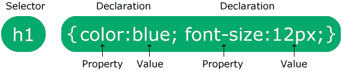

CSS 语法

> 标记应包含在外壳的头部标记内。因此，为了给你的标题和段落赋予样式，你必须在样式标签中编写规则，就像这样{ property:values；}

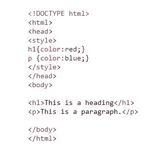

添加样式标签

> 有几种方法可以给样式标签添加颜色，你可以写颜色的名称或者使用你想要的颜色的十六进制码/RGB 码/HSL 码。此外，如果你在那里看到类似“rgba”的东西，“a”表示颜色通道的不透明度。

# 3.背景颜色、高度、宽度、字体、CSS 度量单位

> 为了设计你的段落，让我们在背景上涂一些颜色。在这种情况下，您必须编写一个类似 p { background-color: rgb(182，238，245)的规则；}

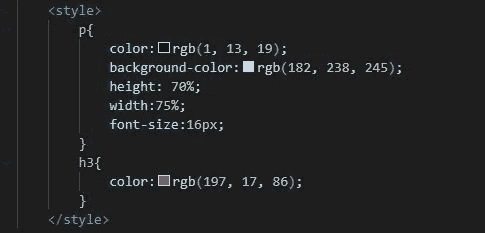

设置段落样式

> 并用值固定段落书写规则的高度和宽度。还有，根据你来改变字体大小。有很多测量单位，但我们将坚持使用“像素”(类似于像素)。你最好在谷歌的帮助下看看其他的测量单位。

# 4.CSS Id，Class，将样式应用于多个元素，Id 与 Class

> 如果你不想一次设计所有标签的样式，那么你必须使用“id”属性来标识你想要的标签。如果你想设计多个标签的样式，那么你必须使用“class”属性将它们包含在一个类中。

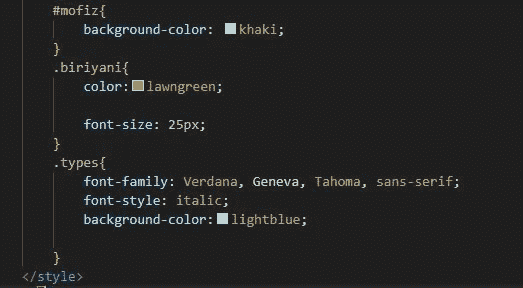

样式标签包括什么

> 然后，您必须以# id { property:values；}或# class { property:values；}

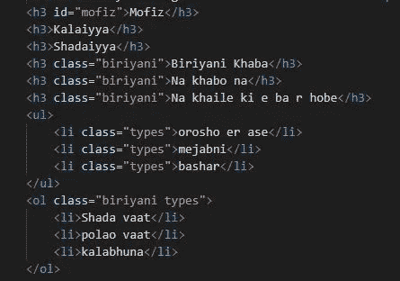

如何使用 id 和类属性

> 提示:结合两个类的风格，仅仅使用它们的名字，在它们之间加一个空格。

# 5.样式化一组元素，样式化一小部分文本

> 如果您对一组元素的样式感兴趣，而不急于分别修饰它们，那么您所要做的就是将它们包含在一个
> 
> 标签中。然后在标签中添加一个类属性。现在，你可以随心所欲地设计 div 的样式了，你所有的标签都将按照类的样式进行修饰。

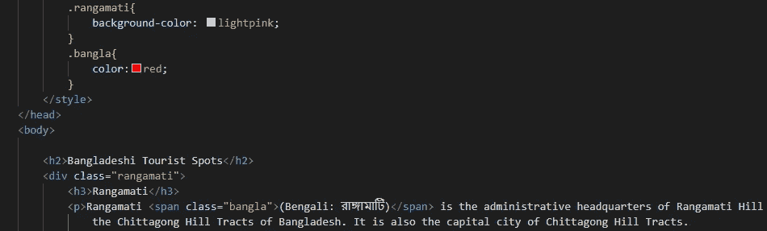

样式分组元素和文本的一小部分

> 但是如果你只是对一小部分文本感兴趣，那么你必须知道一个叫做标签的新标签。使用这个标签，你可以很容易地设置文本的样式，或者你也可以使用 class 属性来设置样式，这样更专业。此外，通过使用标签，你可以很容易地将任何文本转换成微小的文本，这在你需要在标题下写东西时很方便。

# 6.边框、边框半径、边距、设置边距的不同方式

CSS 边框属性允许您指定元素边框的样式、宽度和颜色。

border-radius 属性定义元素角的半径。

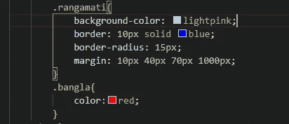

添加边框和边距

margin 属性设置元素的边距，是以下属性的简写属性:上边距、右边距、下边距、左边距。

# 7.填充，设置填充的不同方式，CSS 盒子模型

> 元素的填充是其内容和边框之间的空间。
> 
> padding 属性是以下各项的简写属性:上填充、右填充、下填充、左填充。

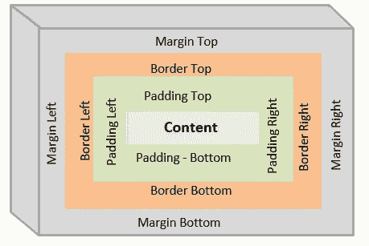

> CSS 盒子模型本质上是一个包装每个 HTML 元素的盒子。它包括:边距、边框、填充和实际内容。

# 8.文本对齐、显示、内嵌、块、内嵌块、外部 CSS

> 您也可以在样式标签中使用文本对齐规则来对齐文本。也要研究字体系列和字体粗细规则。

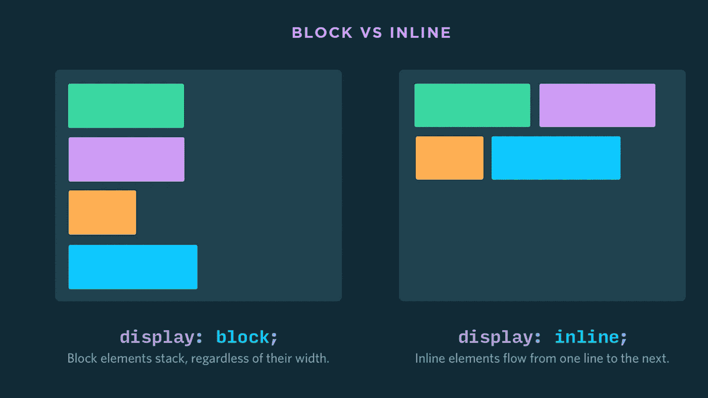

> 除此之外，还有一些标签被称为内联标签，因为它们是内联工作的，而有些标签是块式工作的。块级元素总是从新行开始。它总是占据整个可用宽度(尽可能向左右延伸)。你的工作是搜索他们之间的进一步差异。

# 9.外部内联 CSS 文件显示内联和块

> 到目前为止，我们在同一个 HTML 文件中设计我们的网页。但是推荐使用一个单独的 CSS 文件，你可以在其中编写所有的样式规则，然后在 head 部分使用<link>标签将该文件与现有的 HTML 文件链接起来。

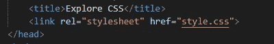

> 最后，如果您有时需要强制内联元素以块方式工作，反之亦然，您可以通过使用以下规则来强制它:

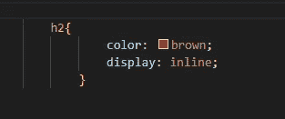

迫使 h2 充当内嵌元素

# 10.使用谷歌

> 现在，你使用谷歌是为了对我上面讨论的所有话题有更深入的了解。

# 快乐学习😊

## &虚拟的👏👏👏拍手不会让手掌疼😏😏