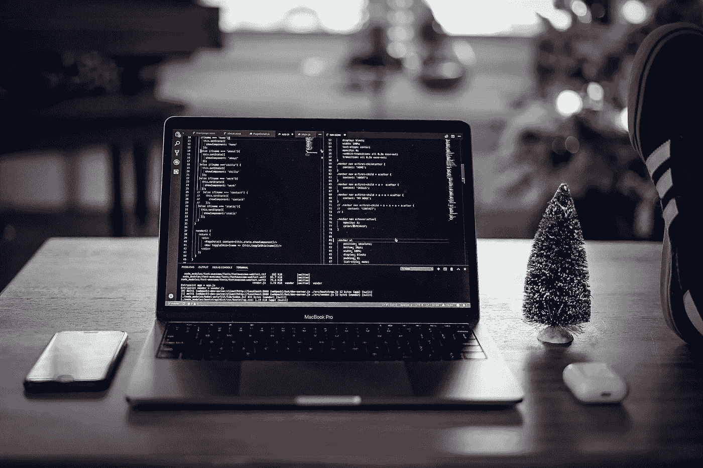

# 使用 NodeJS Websocket 传输实时外汇数据

> 原文：<https://medium.com/nerd-for-tech/stream-real-time-forex-data-with-nodejs-websocket-9fb9b1c2e048?source=collection_archive---------6----------------------->



如果您发现了这一点，我假设您对使用 Websockets 获取实时数据感兴趣。至少本教程应该能够帮助你在 NodeJS 中运行你的第一个 WebSocket 客户端。本教程假设几乎没有 Nodejs 知识，但是有编程经验，尤其是 Javascript，将会有所帮助。Javascript 和 Nodejs 不是你的茶，但是，如果你有兴趣，其他的 Websocket 实现如 [Python](https://rahul-khanna.medium.com/your-first-python-socketio-client-506b3c2e9187) 、 [C#](https://khanna-rahul.medium.com/your-first-c-websocket-client-5e7acc30681d) 和 [Golang](https://rahul-khanna.medium.com/your-first-golang-websocket-fx-data-fc1eb7db35f0) 也是可用的。

如果你愿意，你也可以阅读我们的 [NodeJS REST API 实现](https://khanna-rahul.medium.com/your-first-nodejs-rest-api-client-59467659ab99)。

在我们开始设置和代码之前，快速浏览一下我们要实现的目标会很有意思。我们将下载 Nodejs 并设置我们的环境，通过连接到 TraderMade Websocket API(服务器端)通过 Websocket 接收实时外汇和 CFD(指数)数据。

为了简化，有三个步骤:

*   下载节点并设置环境
*   安装免费试用版并获取 API 密钥
*   设置 NodeJs Websocket 客户端并接收数据

我们开始吧！

## 下载节点并设置环境

Windows 和 Mac:

下载并安装[节点 j](https://nodejs.org/en/download/)

Linux:

apt-get 安装节点 js

一旦安装了 Nodejs，打开命令提示符或终端，获取运行我们的客户机所需的依赖项(库)。我们将使用“ws ”,因此运行以下命令:

```
npm install ws
```

## 这就是我们设置所需的全部内容，接下来让我们获取密钥。

## 设置试用版并获取 API 密钥

你可以按照关于如何开始 14 天免费试用的[文章](https://tradermade.com/tutorials/how-to-start-a-websocket-trial-and-subscription-plan/)来做。一旦你有了钥匙，请妥善保管。

## 设置 NodeJs Websocket 客户端并接收数据

完成环境设置后，转到 Nodejs 的安装目录，创建一个文件并将其命名为 forexWsClient.js。现在使用 Atom 或 VS 代码打开该文件，如果没有安装，只需在 windows 或 vi Linux 上使用记事本打开即可。

现在是时候写一些代码了。

```
const WebSocket = require ('ws');const ws = new WebSocket ('wss://marketdata.tradermade.com/feedadv');
```

我们将首先导入 WebSocket 对象，然后使用 wss URL 将其连接到 Tradermade。一旦建立了连接，我们将发送我们的 API 密匙(我们通过签署 WebSocket 试用版获得)以及我们希望从服务器接收的符号。在这种情况下，GBPUSD 和英国 100(代码为 FTSE100 CFD)。

```
ws.on('open', function open() {
     ws.send("{"userKey":"streaming_api_key", "symbol":"GBPUSD,UK100"}");
  });ws.on('message', function incoming(data) {
    if(data != "Connected"){
            data = JSON.parse(data)
            console.log(data)
    }
  });
```

通过身份验证后，我们将开始获取 JSON 消息的数据。真的就这么简单。

要启动该程序，只需保存 forexWsClient.js 文件，并从文件所在的位置在终端中写入以下内容:

```
node forexWsClient.js
```

瞧啊。我们有实时的外汇数据流。

```
{
    symbol: 'UK100',
    ts: '1615913144126',
    bid: 6795,
    ask: 6798,
    mid: 6796.5
  }
  {
    symbol: 'GBPUSD',
    ts: '1615913144331',
    bid: 1.38967,
    ask: 1.38969,
    mid: 1.38968
  }
```

然而，还有一些事情我们想做，使它更稳定，如重新连接，如果服务器或错误下降的连接，否则我们将不知道何时连接中断。

因此，为了做到这一点，我们将只做一些更改，如下面的完整代码所示。我们将 ws 对象和事件包装在一个名为 connect 的函数中，这个函数是在运行程序时启动的。我们还设置了一个连接关闭时的超时功能，以便建立连接。

```
const WebSocket = require ('ws');var reconnectInterval = 1000 * 10
var ws; var connect = function(){
 const ws = new WebSocket ('wss://marketdata.tradermade.com/feedadv'); ws.on('open', function open() {
     ws.send("{"userKey":"streaming_api_key", "symbol":"GBPUSD,UK100"}");
  }); ws.on('close', function() {
    console.log('socket close : will reconnect in ' + reconnectInterval );
    setTimeout(connect, reconnectInterval)
  }); ws.on('message', function incoming(data) {
    if(data != "Connected"){
            data = JSON.parse(data)
            console.log(data)
    }
  });
};
connect();
```

如果我们运行上面的程序，我们的客户机不会退出，只要服务器推送数据，它就会建立一个连接。

如果您需要更多信息，请访问 [TraderMade](https://marketdata.tradermade.com/docs/restful-api) docs 了解更多信息，或者留言。