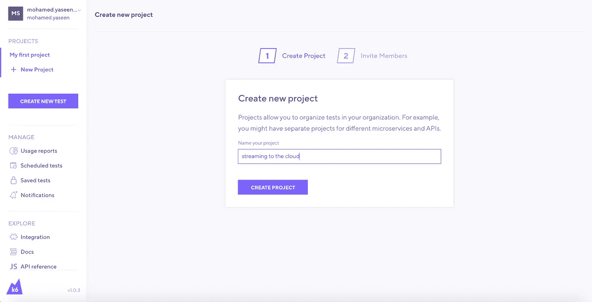
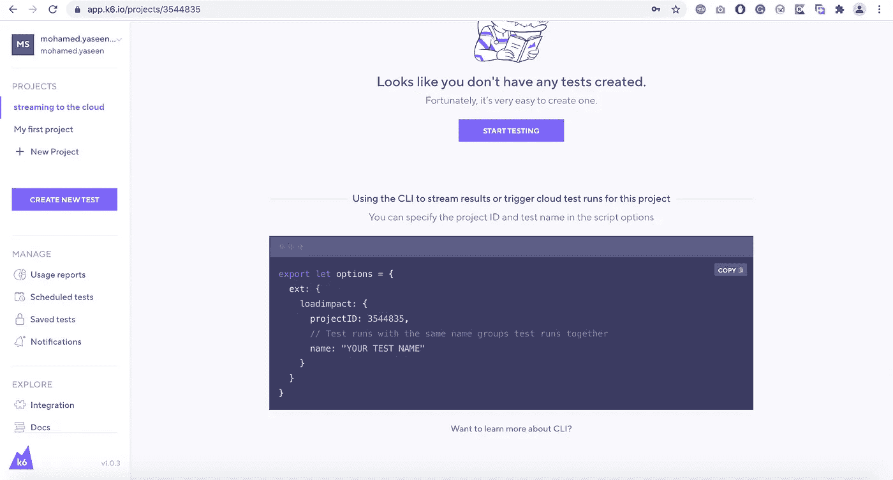
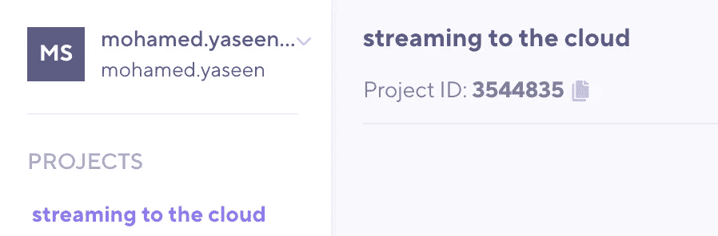
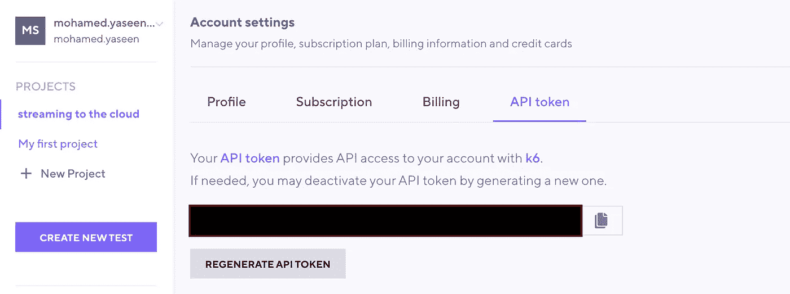
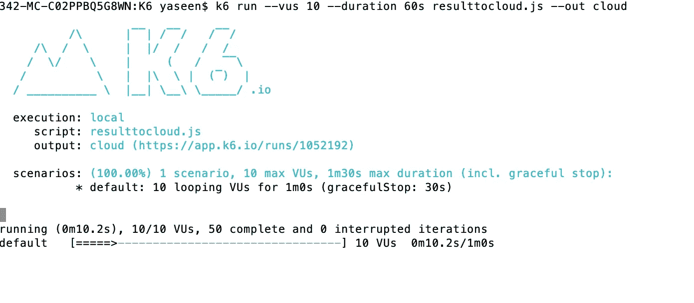
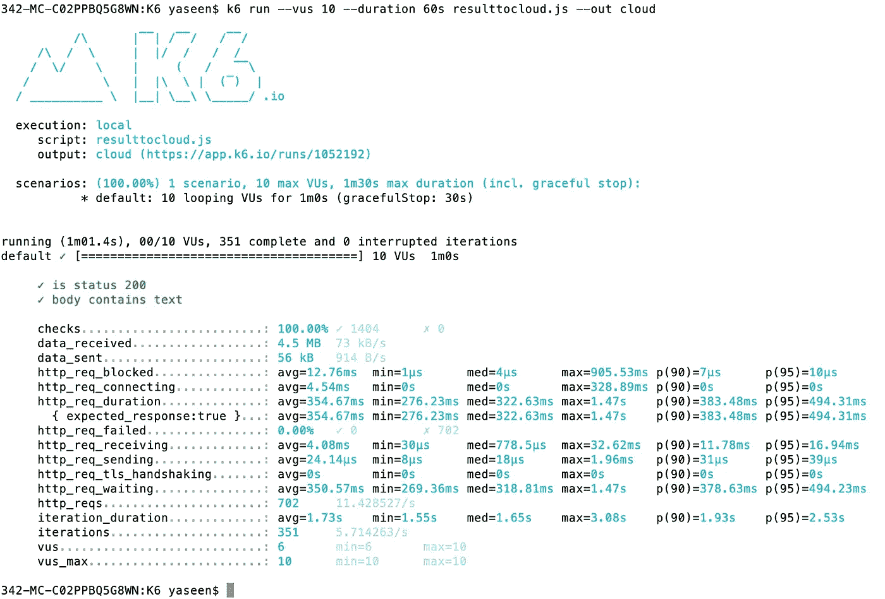
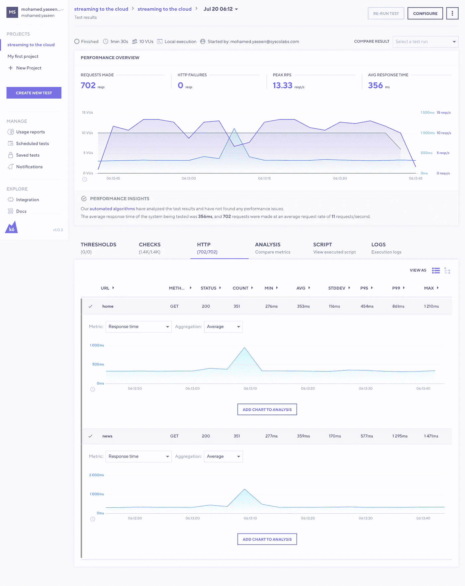

# 在本地运行时将结果流式传输到云

> 原文：<https://medium.com/nerd-for-tech/streaming-results-to-the-cloud-while-runs-locally-c962a091c991?source=collection_archive---------19----------------------->

首先，创建一个名为“流至云”的新项目，然后单击“跳过”按钮进行下一步操作。



然后创建一个名为“resulttocloud”的加载脚本。

```
import { check, sleep } from 'k6';
import http from 'k6/http';export default function () {
  let res = http.get('[http://test.k6.io/',{tags](http://test.k6.io/',{tags): {'name': 'home'}});
  check(res, {
    'is status 200': (r) => r.status === 200,
    'body contains text': (r) => r.body.includes('Collection of simple web-pages suitable for load testing.'),
  });
sleep(1);
  res = http.get('[http://test.k6.io/news.php',{tags](http://test.k6.io/news.php',{tags): {'name': 'news'}});
  check(res, {
    'is status 200': (r) => r.status === 200,
    'body contains text': (r) => r.body.includes('In the news'),
  });
}
```

然后将以下代码块添加到您的 resulttocloud 脚本中，并根据您自己的需要修改项目名称和 id。

```
export let options = {
  ext: {
    loadimpact: {
      projectID: 3544835,
      // Test runs with the same name groups test runs together
      name: "YOUR TEST NAME"
    }
  }
}
```



```
import { check, sleep } from 'k6';
import http from 'k6/http';export let options = {
  ext: {
    loadimpact: {
      projectID: 3544835,
      // Test runs with the same name groups test runs together
      name: "streaming to the cloud"
    }
  }
}
export default function () {
  let res = http.get('[http://test.k6.io/',{tags](http://test.k6.io/',{tags): {'name': 'home'}});
  check(res, {
    'is status 200': (r) => r.status === 200,
    'body contains text': (r) => r.body.includes('Collection of simple web-pages suitable for load testing.'),
  });
sleep(1);
  res = http.get('[http://test.k6.io/news.php',{tags](http://test.k6.io/news.php',{tags): {'name': 'news'}});
  check(res, {
    'is status 200': (r) => r.status === 200,
    'body contains text': (r) => r.body.includes('In the news'),
  });
}
```

现在是运行脚本的时候了。在此之前，您应该有自己的 API 令牌。按照以下步骤复制令牌。



输入以下步骤来运行脚本

```
k6 login cloud --token <<apitoken>>k6 run --vus 10 --duration 60s resulttocloud.js --out cloud
```

现在你可以在云端看到结果，如果你愿意，你可以定制你想要的结果。要做到这一点，导航到他们必须给下面的链接。"[https://app.k6.io/runs/1052192](https://app.k6.io/runs/1052192)

