# 从您的桌面上流式智能手机非常轻(不需要根)

> 原文：<https://medium.com/nerd-for-tech/streaming-smartphone-from-your-desktop-very-light-no-root-required-1aa0e8002b20?source=collection_archive---------7----------------------->


由[马克-奥利维尔·乔多因](https://unsplash.com/@marcojodoin?utm_source=unsplash&utm_medium=referral&utm_content=creditCopyText)在 [Unsplash](https://unsplash.com/s/photos/reflection?utm_source=unsplash&utm_medium=referral&utm_content=creditCopyText) 上拍摄的照片

你是流光吗？游戏玩家？或者一个需要更大显示屏的人？这篇文章将分享如何将你的设备镜像到一个台式机上，比如笔记本电脑。好处是你不需要创建一个帐户，看到任何广告，根设备，甚至互联网连接。你根本不需要。你只需要一个 USB 设备来连接你的手机和笔记本电脑。

如果谈到性能，我已经测试过了，它可以在非常低的延迟下工作(延迟几乎看不到)，但显示器仍然会给出最好的结果。好了，话不多说，我们开始练习吧。

# 我需要什么？

我之前说过，你连上网都不需要是一个道理，但是你还需要一样东西；这是你的电话。如果你没有，我认为你应该买一个😂。在这一步中，您需要激活手机的开发者模式。以我为例，我将尝试给出一个使用我的手机 Redmi 9T 激活开发者模式的示例。

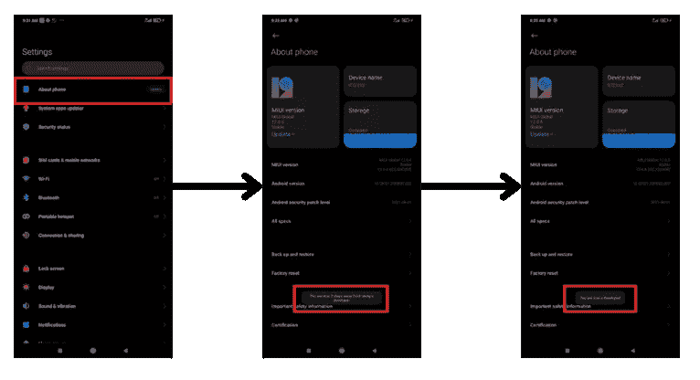

在开发者模式被激活后，你会在类似这样的附加设置中找到开发者选项。

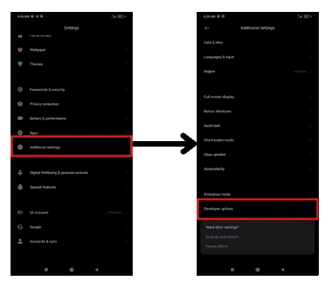

找到 USB 调试，您就可以在没有任何互联网连接的情况下镜像您的设备了。

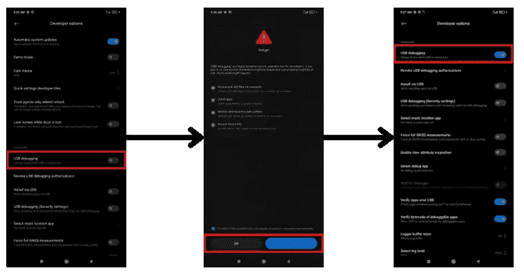

# 秘密工具

正如我之前所说，我们将使用一个名为 scrpcy 的工具。这是 Genymobile 开发的工具，它创造了 genymotion。Scrpcy 工具可以帮助我们镜像智能手机设备。

如果你像我一样是 windows 用户，向下滚动页面，在摘要中找到下载按钮，或者点击链接[这里](https://github.com/Genymobile/scrcpy/releases/download/v1.24/scrcpy-win64-v1.24.zip)。如果你是 Linux 或 macOS，你可能可以用`apt install scrcpy`或`brew install scrcpy`快速安装它。

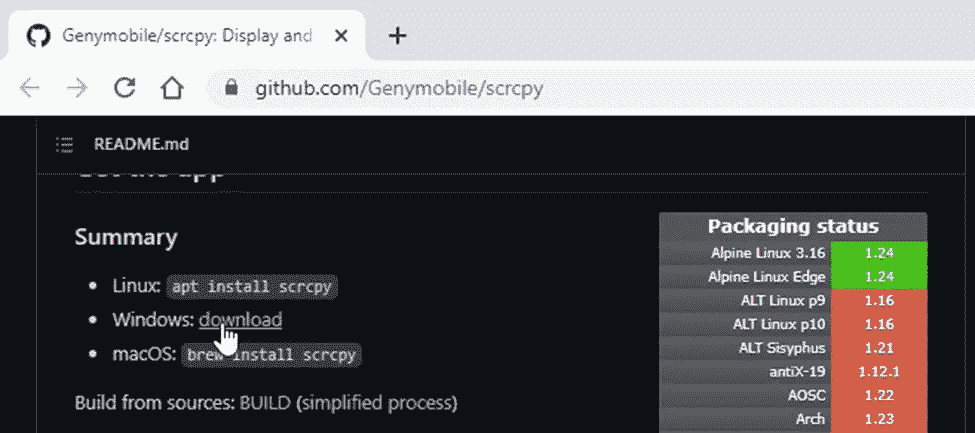

将所有数据提取到您想要的目录中

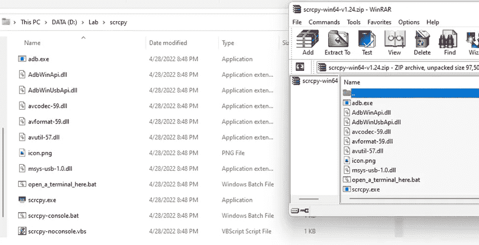

将手机连接到设备后，运行 scrcpy.exe。

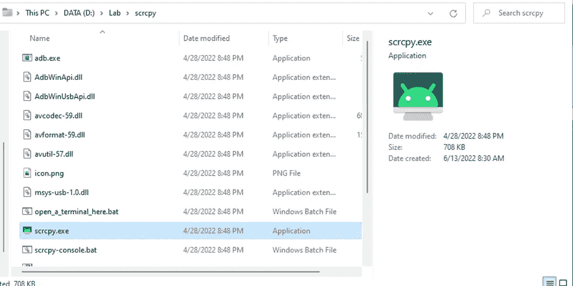

几分钟后，应用程序将启动。


手机上会有通知；允许它。

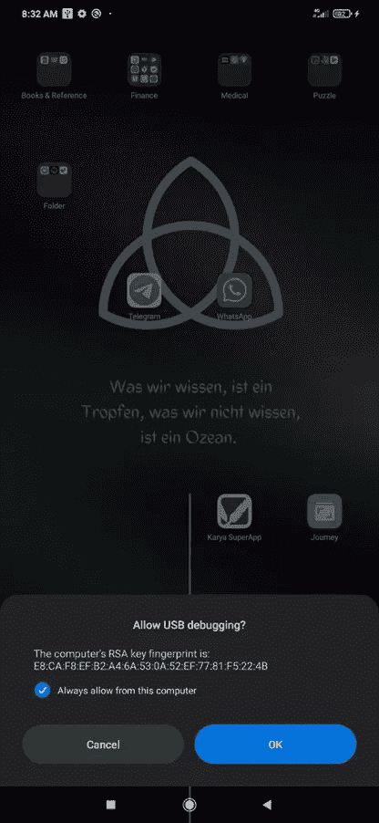

Tadaaa，现在，你可以在笔记本电脑上看到你的智能手机。

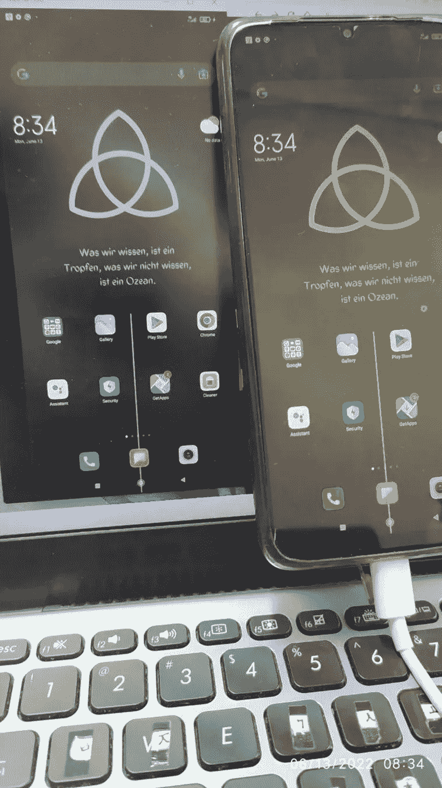

是的，正如我所说的，你可以轻松地从智能手机向笔记本电脑传输任何内容。

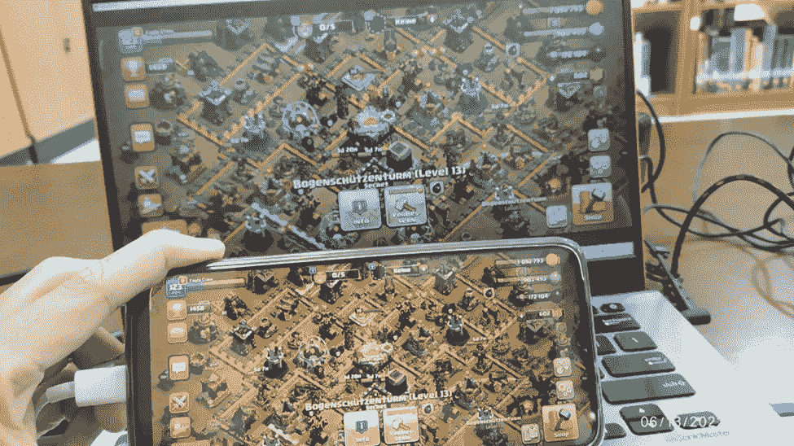

您可以从 GitHub 上的这些工具中探索许多东西，但是在深入研究之前。我想分享一下录你屏的方法。是的，你可以用这个简单的命令录制你的屏幕。

```
scrcpy --record {name_with_the_format.mp4}
```

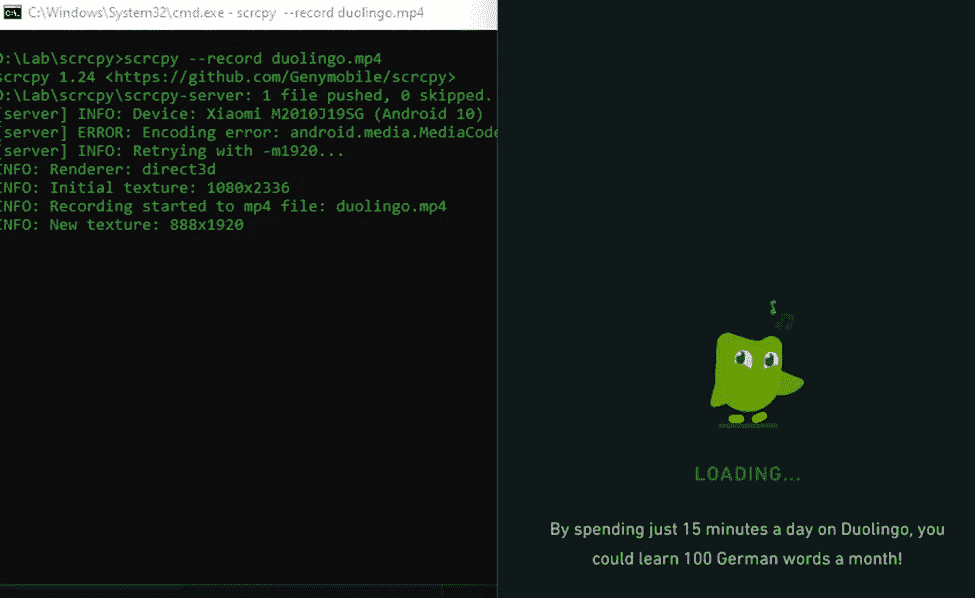

录制的文件将保存在 scrcpy 所在的目录中。

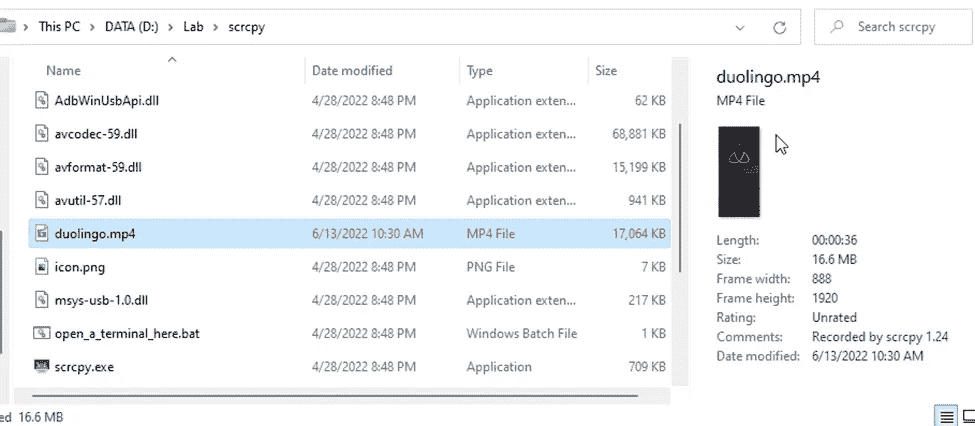

你可以随时随地运行录制的文件。

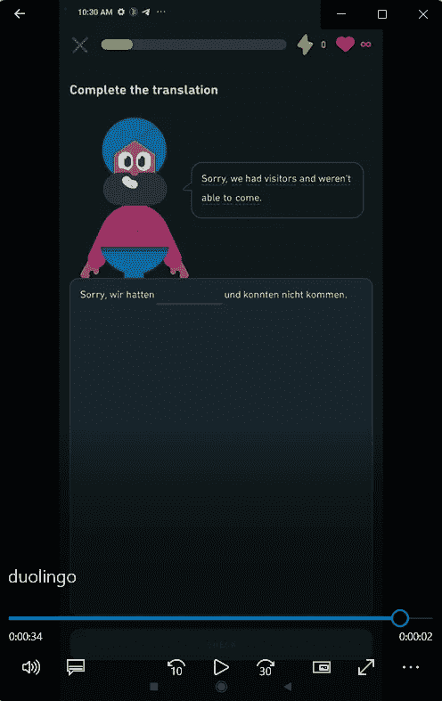

# 结论

在这篇文章中，我分享了如何将智能手机镜像到笔记本电脑中。恭喜你，你做得很好。不要忘记使用这些工具进行更多的探索；这篇文章将是你的门。它里面的秘密是你要去发现的。谢了。

# 来源

[](https://github.com/Genymobile/scrcpy) [## GitHub - Genymobile/scrcpy:显示和控制您的 Android 设备

### 用另一种语言阅读这个应用程序可以显示和控制通过 USB 或其他方式连接的 Android 设备…

github.com](https://github.com/Genymobile/scrcpy)