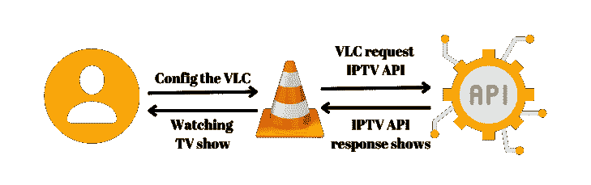
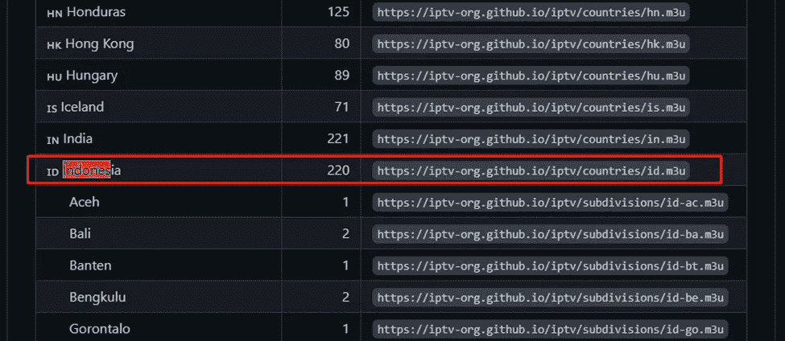
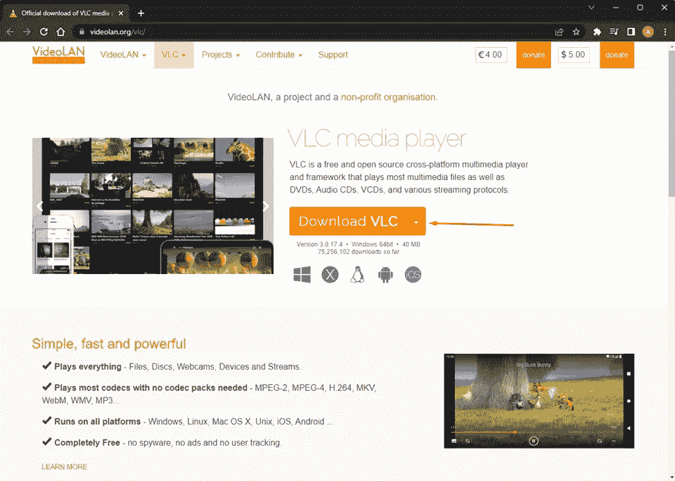
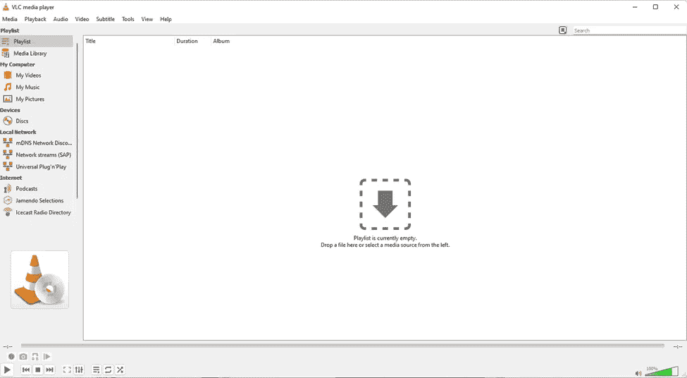
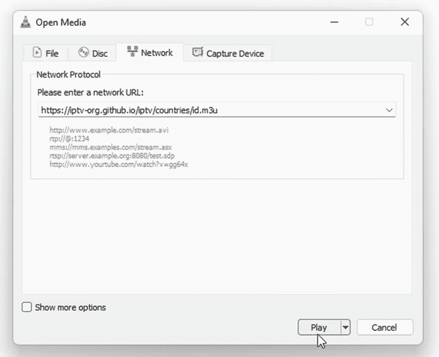
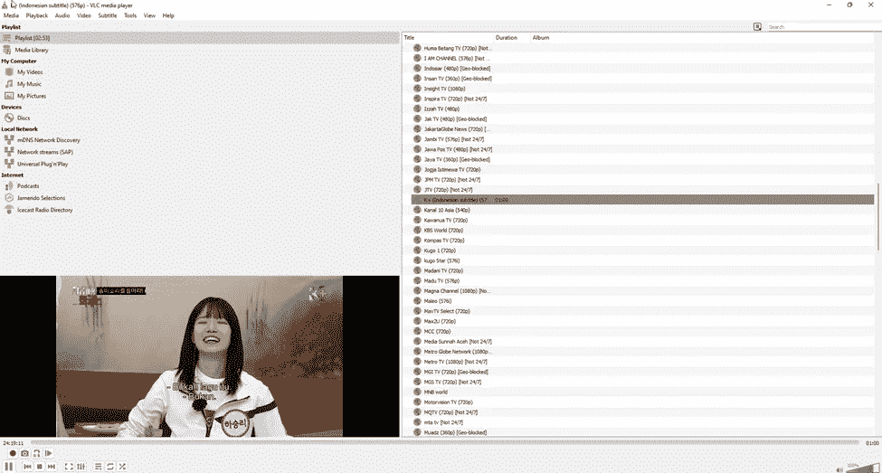
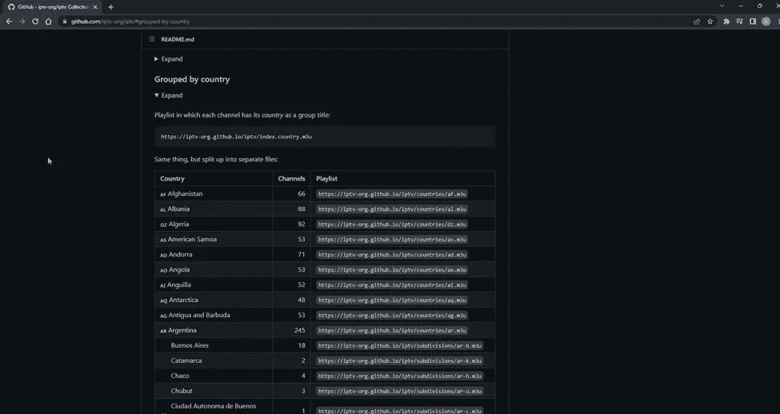

# 使用 VLC 媒体播放器，从您的设备(PC/智能手机)轻松地随处观看流媒体电视

> 原文：<https://medium.com/nerd-for-tech/streaming-tv-everywhere-from-your-devices-pc-smartphone-easily-using-vlc-media-player-9320c3485c4b?source=collection_archive---------3----------------------->


由[附身摄影](https://unsplash.com/@possessedphotography?utm_source=unsplash&utm_medium=referral&utm_content=creditCopyText)在 [Unsplash](https://unsplash.com/s/photos/tv?utm_source=unsplash&utm_medium=referral&utm_content=creditCopyText) 上拍摄

网络世界让我们的边界变得比我们想象的还要薄。技术每天都在发展。自从第一次互联网传播以来，互联网迅速增加。你知道吗，今天我们可以在任何我们想看的地方看电视节目，而不需要买一台会增加我们的花费并使我们的房间变小的电视。我们需要做的是理解如何去做。在这个故事中，让我来分享如何使用 VLC 媒体看电视。

# 流动



好的，我想告诉你的秘密是，我们将使用 API 访问全球可用的公共频道。多亏了`IPTV-org`使得变得松弛的边界打开了。他们程序的来源如下。

```
https://github.com/iptv-org/iptv#grouped-by-country
```

要开始看电视，我们应该配置我们的 VLC，配置相当简单。每个人都可以很容易地理解这一点。仅供参考，该存储库支持使用 API 按类别、语言、国家和地区观看 IPTV。简单点说，我看印尼电视剧给你举个例子。



印度尼西亚频道的链接如下:

```
https://iptv-org.github.io/iptv/countries/id.m3u
```

# 行动

1.我们使用的是 VLC，所以你应该有一个最必要的程序是 VLC 媒体播放器，你可以很容易地在这里下载。我相信你可以下载。让我们进入下一步。



2.打开 VLC 媒体。查看右上方的`media`选项卡



3.展开“媒体”并找到`Open Network Stream`或使用快捷方式`Ctrl+N`。


4.因为我们已经有了印度尼西亚 IPTV API，将其复制到 URL 部分。



5.等到电视剧开播；这里举个例子。


6.按下`Ctrl+L`，您可以访问更多频道。



要再次返回全屏，再次按下`Ctrl+L`。

# 奖金

正如我已经告诉你的，我们可以从每个国家观看。请访问此处的知识库。找到`Grouped by country`并展开。



按照与前面相同的步骤，将 URL 更改为所需的国家。在这里，我访问德国 IPTV，并看到这些节目。


# 结论

互联网的进化让人与人之间的边界变得更薄，生活给我们的选择有两个，跟随变化或者保持你的旧风格。我分享这个关于随时随地通过你的设备看电视的故事。谢谢你的解读。

## 来源

[](https://teknoding.com/cara-nonton-live-streaming-tv-online-vlc-hp-pc/) [## √ 7+ Cara Nonton 通过 VLC di PC/HP 在线直播流媒体电视

### 首页“VLC 媒体播放器”7+卡拉农顿直播电视在线通过 VLC 迪惠普安卓/PC 梅农顿直播电视…

teknoding.com](https://teknoding.com/cara-nonton-live-streaming-tv-online-vlc-hp-pc/)