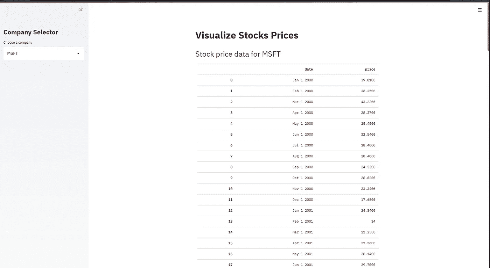
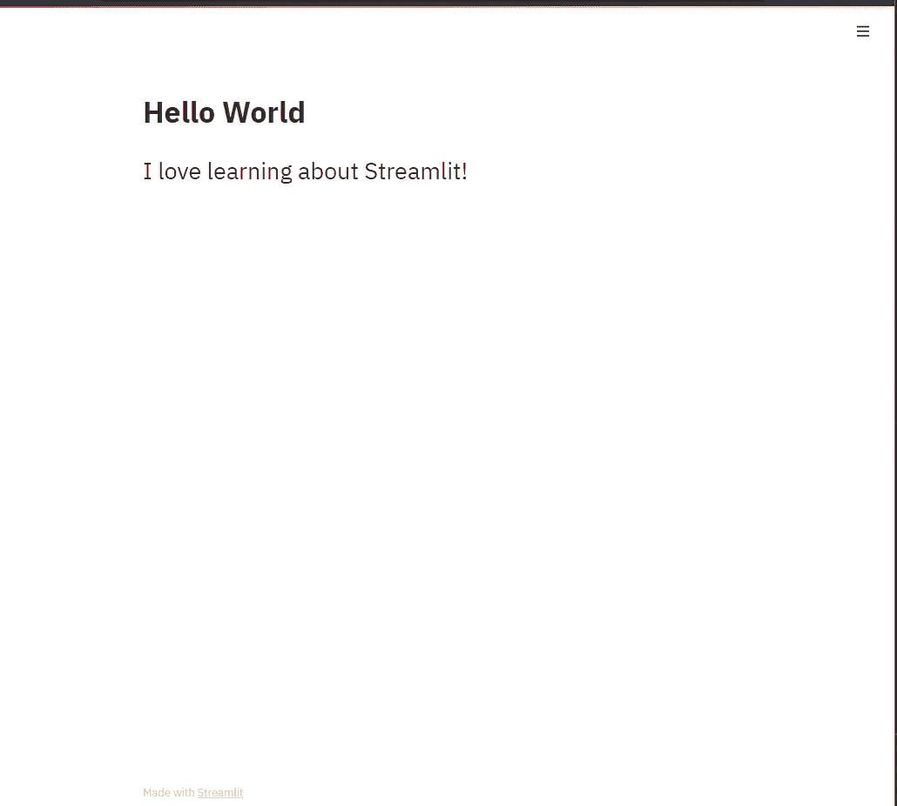
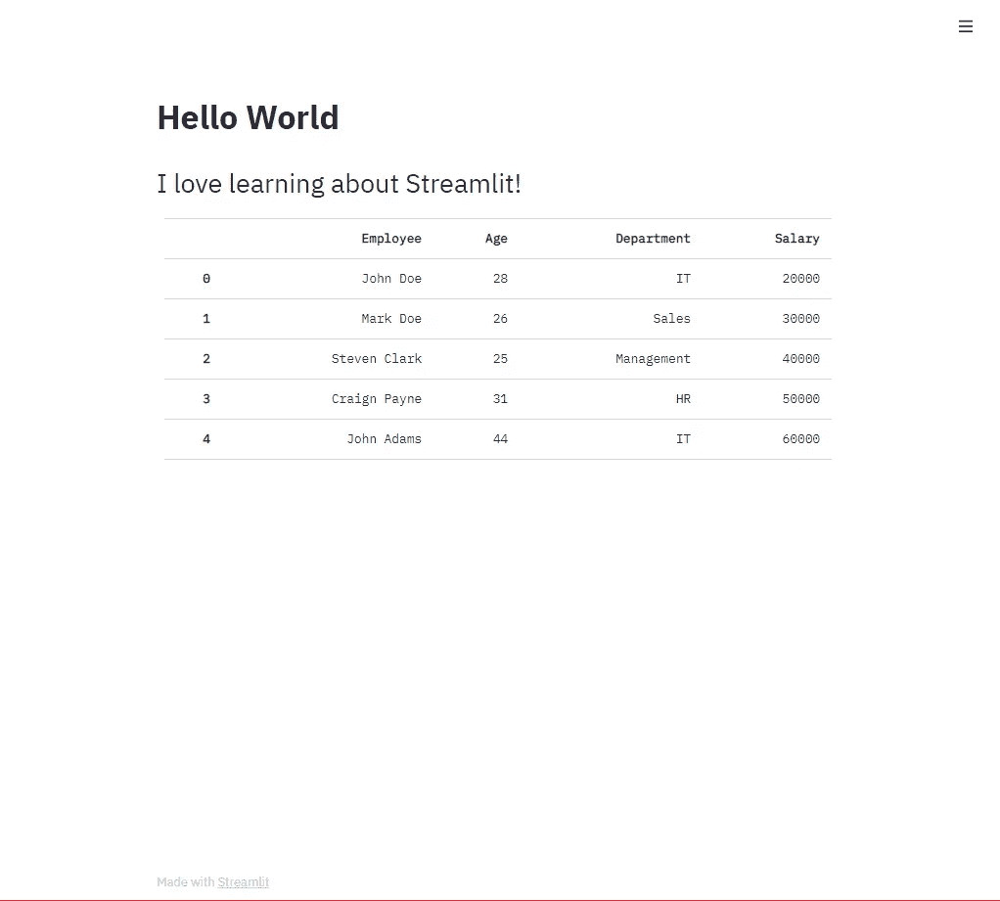

# Streamlit —在 Web 上构建强大的数据科学应用程序

> 原文：<https://medium.com/nerd-for-tech/streamlit-build-powerful-data-science-apps-on-the-web-58cd353858b5?source=collection_archive---------19----------------------->


不久前，我偶然发现了可能是有史以来最好、最酷的 Python 库，但遗憾的是，它被严重低估了，至少当我试图寻找学习它的资源时是这样，因为我预计 Python 社区会被它震惊，所以在本文中，我们将了解这个神奇的库的更多信息

**什么是细流，为什么？**

Streamlit 是一个库，它允许您用最少的代码在 web 上创建全功能的数据驱动应用程序

真正让我措手不及的是它是多么的简单和强大，用不到 10 行代码我就能在浏览器上看到一个实际的应用程序，我简直惊呆了

它有大量的预制组件和部件，你所要做的只是选择

**Streamlit 不是为了什么？**

尽管这个描述和将应用程序部署到浏览器的想法让你觉得很神奇，但 Streamlit 并不是一个真正的 web 框架，所以你不会真正拥有路由和模板渲染等功能，你所能做的只是创建数据 web 应用程序

**我们在建造什么？**

只是为了探索这个惊人的库的功能，我们将构建一个股票应用程序，我们可以在一个非常整洁的表格上查看股票价格数据，它看起来像这样



**安装 Streamlit**

用简单的命令`pip install streamlit`

**从 Streamlit 向世界问好**

```
import streamlit as st st.title("Hello World") # adding a title to our appst.header("i love learning about Streamlit!")
```

就这样，我们的应用程序现在已经准备好推出了！

**运行应用**

要运行我们的应用程序，只需使用命令`streamlit run APP_NAME.py`，当然是用您的 python 文件名替换 APP_NAME



很有趣不是吗？现在让我们添加一个包含一些虚构的名称和数据的表格，看看它看起来有多漂亮

```
import streamlit as stimport pandas as pdst.title("Hello World")st.header("I love learning about Streamlit!")employees = pd.DataFrame({"Employee":['John Doe','Mark Doe','Steven Clark','Craign Payne','John Adams'],"Age":[28,26,25,31,44],"Department":['IT','Sales','Management','HR','IT'],"Salary":[20000,30000,40000,50000,60000]})st.table(employees)
```

运行您的应用程序后，您将得到如下输出:



点击了解有关 Streamlit 组件[的更多信息](https://docs.streamlit.io/en/stable/getting_started.html)

**构建我们的股票应用**

现在，我们快速浏览了一下这个库，并了解了我们可以利用它做些什么，接下来让我们开始构建我们的应用程序，以查看主要公司的有用股票数据

首先让我们从这个[链接](https://raw.githubusercontent.com/vega/datalib/master/test/data/stocks.csv)中获取数据，然后我们将使用方法`read_csv()`通过 pandas 加载数据

```
import pandas as pd
data_link = "[https://raw.githubusercontent.com/vega/datalib/master/test/data/stocks.csv](https://raw.githubusercontent.com/vega/datalib/master/test/data/stocks.csv)"stocks = pd.read_csv(data_link)
print(stocks.head()) # prints first 5 rows 
```

现在，让我们看看我们拥有的独特公司，这样我们就可以对我们的图表有一个愿景

`stocks.symbol.unique()`这将返回我们['MSFT ' '阿姆兹' ' IBM ' '谷歌' ' AAPL']

**添加侧边栏**

Streamlit 允许我们添加一个非常漂亮的侧边栏区域，您可以在其中添加任何小部件，在这种情况下，我们添加一个选择框，并将使用用户选择的值来更改我们要显示的表格，这样会使我们的应用程序更加动态，所以让我们添加侧边栏和我们需要的小部件

```
st.sidebar.title("Company Selector")
choice = st.selectbox("Choose a company",stocks['symbol'].unique())
```

**动态表头**

优雅的做法是添加一个动态标题，告诉用户他们正在查看的公司数据，当用户从选择框中选择一家公司时，它会自动呈现

`st.title(f"Stock price data for {choice}")`

**添加我们的表**

`st.table()`帮助我们添加一个漂亮的表格到我们的应用程序中，就像我们在上面看到的那样，所以我们将把我们的熊猫数据帧变成一个表格，很好地呈现给最终用户

首先，我们需要对数据帧进行排序，使该表代表一个包含单个公司数据的数据帧版本

例如，使用`pd.loc`对数据帧进行排序，因此只显示 MSFT 数据`pd.loc[stocks['symbol'=='MSFT']]`，因此我们可以看到，我们使用此方法只包括符号列等于 MSFT 的数据帧行

利用这些知识，我们将使用从选择框返回的值对传递给`st.table()`的数据帧进行排序，看起来像这样

```
st.table(stocks.loc[stocks['symbol']==choice,['date','price']])
```

这样，每当用户改变他们选择的选项时，我们的表就会自动呈现

**将所有这些放在一起**

现在让我们把这些放在一起，看看这个图书馆有多神奇

```
import streamlit as stimport pandas as pdfrom matplotlib import pyplot as pltst.title("Visualize Stocks Prices")data = "https://raw.githubusercontent.com/vega/datalib/master/test/data/stocks.csv"stocks = pd.read_csv(data)st.sidebar.title("Company Selector")choice = st.sidebar.selectbox("Choose a company",stocks['symbol'].unique())st.header(f"Stock price data for {choice}")st.table(stocks.loc[stocks['symbol']==choice,['date','price']])
```

非常感谢，如果你已经在这里制作了它，制作这个教程是如此有趣，我希望有人在某处会发现这篇文章在任何方面都是有用的，♥

**有用链接**

[简化文档](https://docs.streamlit.io/en/stable/)

[熊猫文档](https://pandas.pydata.org/docs/)

[熊猫:初学者指南](https://devdotpy.medium.com/pandas-a-beginners-guide-cdf929f11052)