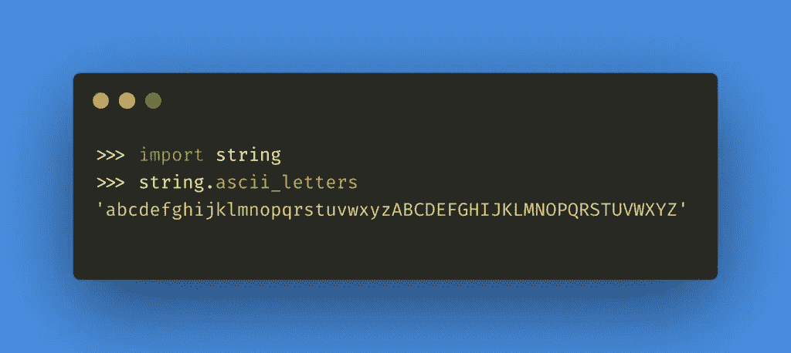
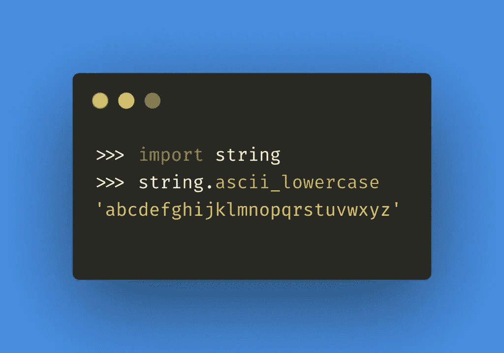
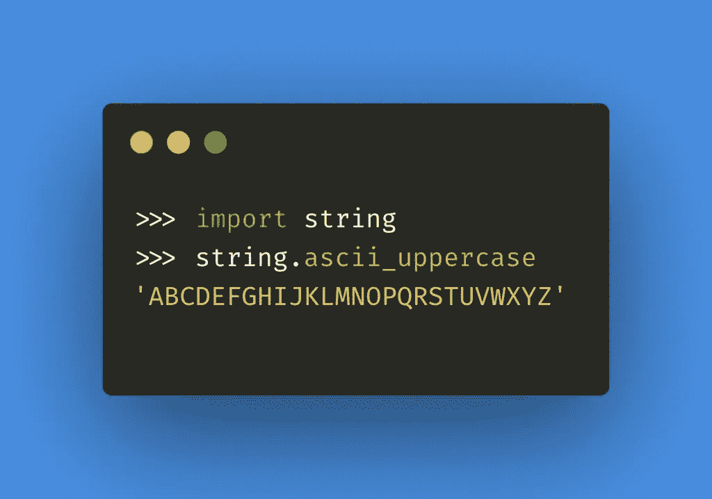
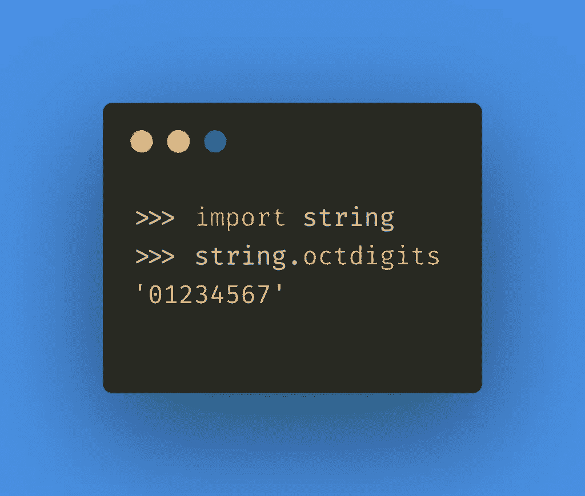
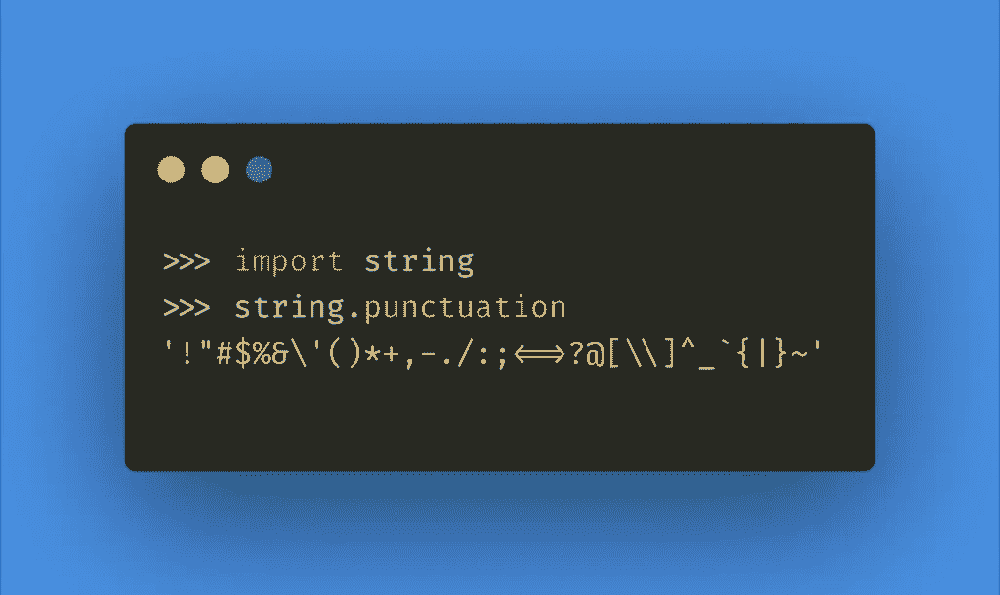
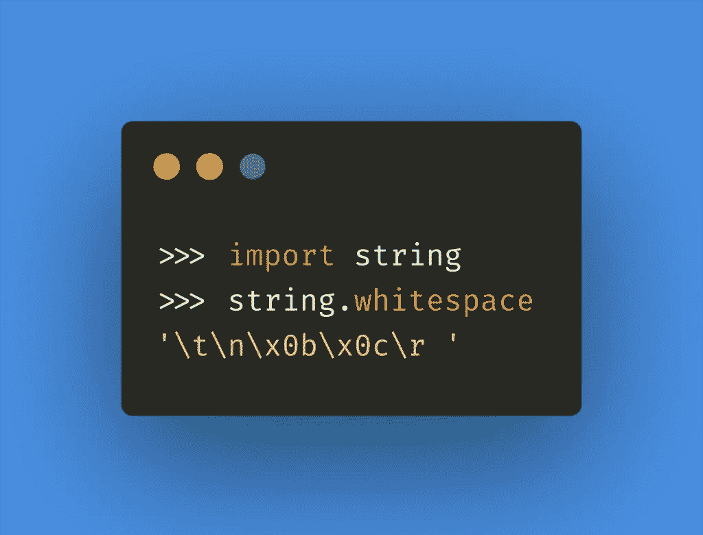

# python 中的字符串常量

> 原文：<https://medium.com/nerd-for-tech/string-constants-in-python-504805ace581?source=collection_archive---------9----------------------->

在 [Unsplash](https://unsplash.com?utm_source=medium&utm_medium=referral) 上由 [Hitesh Choudhary](https://unsplash.com/@hiteshchoudhary?utm_source=medium&utm_medium=referral) 拍摄的照片

string 模块有一些内置的常量变量。我们可以用它来代替在代码中再次声明常量。这里将要讨论的一些字符串常量是，

1.  ascii _ 字母
2.  ascii _ 小写
3.  ascii _ 大写
4.  八位数
5.  标点
6.  空白

让我们一个接一个地看看这些常量，用一段代码打印每个字符串常量。

## 1.ascii _ 字母

ascii_letters 常量是小写字母和大写字母的串联字符串。让我们导入字符串模块并打印这个常量。

## 2.ascii _ 小写

ascii_lowercase 常量由所有小写字母组成一个字符串。让我们导入字符串模块并打印这个常量。

## 3.ascii _ 大写

ascii_uppercase 常量由所有大写字母组成一个字符串。让我们导入字符串模块并打印这个常量。

## 4.八位数

octdigits 常量将打印一个八进制数(从 0 到 7)中允许的所有数字。让我们导入字符串模块并打印这个常量。

## 5.标点

标点常量有一串标点符号。让我们导入字符串模块并打印这个常量。

## 6.空白

包含所有被视为空白的字符的字符串。在大多数系统中，这包括空格、制表符、换行符、回车符、换页符和垂直制表符。

## 结论

如果你想删除代码中的标点符号，或者检查代码中是否存在所有的字母，或者类似的事情，我们可以使用这些字符串常量。

编码快乐！