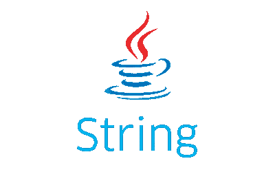
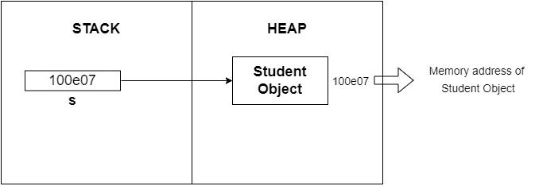
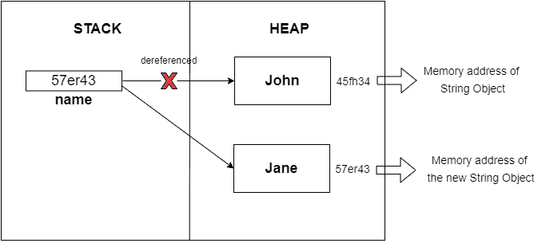
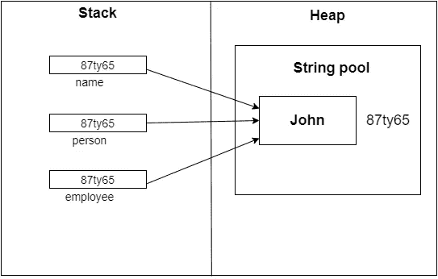
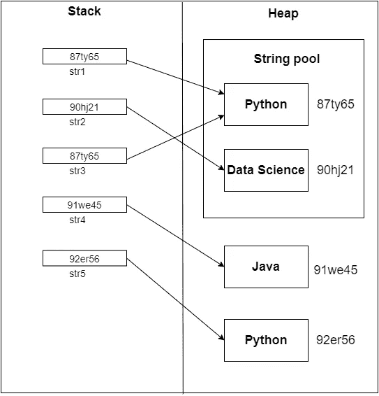

# Java 中的字符串是不可变的

> 原文：<https://medium.com/nerd-for-tech/string-in-java-is-immutable-a90f97067bd?source=collection_archive---------2----------------------->



Java 字符串

好吧，我知道你们大多数人都知道这一点！！！我也知道！！！但是我们是否正确理解了术语 ***【不可变】*** 以及我们是否知道为什么字符串在 Java 中是不可变的 ***？？？***

好了，我们开始吧！！！

## 什么是不变性？？？

***简单来说，一个对象一旦被创建，就不能被修改或更改。*** 值和对象在 Java 中是两个不同的术语。 ***值*** 是 ***一个实例变量或引用变量所保存的*** 。 ***实例变量保存实际值*** (基于类型)，例如程序员提供的。例如

```
int a = 123;
float s = 65.7;
String name = "Lakshi";
```

如你所知，Java 中的 ***对象*** 存储在 JVM 中 内存区的 ***堆区。为了更好的理解，请参考我的关于 JVM 架构的文章。因此，一个 ***引用变量*** 保存它所指向的对象的 ***内存地址，作为它的值。*** 下图说明了一个参考变量 ***。******



参考变量的图示

而一个对象是一个类 的 ***实例，带有许多 ***实例变量*** 通常称为 ***【属性】*** 。***

***String 是 Java 中的一个类*** 。因此，任何用“String”类型声明的变量都变成了一个 ***引用变量，指向一个 String 类的实例(即 String 对象)*** 。如下图所示，一个 ***变量【名称】*** 被 ***赋值*** ***【约翰】*** 。后来我们把变量的 ***值改为【简】*** 。所以在这里，只有引用变量“name”的值被更改。当“name”变量被修改为“Jane”时，被赋予值“John”的字符串对象永远不会改变。

```
String name = "John";
name = "Jane";
```

迷惑对吗？？？对于上面的代码，让我们深入研究一下在内存的堆栈和堆区域发生了什么！！！

如前所述，用 Java 创建的任何对象都存储在堆中。当 ***"name "变量被赋值为" John "，*** ***JVM 在堆中创建一个对象*** ， ***将其值设置为" John"*** (因为，一个字符串值被赋值，String 在 Java 中是一个类，因此一个字符串对象被创建)。***“name”变量指向这个对象。*** 这是下图。


对象引用的图示

后来， ***当“名”赋“简”*** 。这个 ***创建了另一个字符串对象，并将其值设置为“Jane”。*** 现在，“名字”变量指向哪里？？？是的， ***"name "变量从" John "对象解引用并指向" Jane "对象*** ，如下所示。

*注意，这些是字符串对象，它们的值是“John”和“Jane”。*



使用对象引用

> 那么，我们改变或修改了对象吗？？？没有，但是创建了一个新的 String 对象(Jane 对象)，并且“name”变量开始指向新创建的对象，即“name”变量现在指向堆中的不同位置(不同的内存地址)。因此，这意味着无论何时修改“name”变量的值，它都会用该值创建一个新对象，此后“name”将指向该对象！！！***Java 中的 String 就是这样不可变的！！！***
> 
> 提醒一下，注意这两个对象在堆中有不同的内存地址。

我们来看看 Java String 被设计成不可变的原因！！！

## 为什么 Java 字符串是不可变的？？？

观察下面的代码。这是三个具有相同值“John”的“String”类型的引用变量。我们使用“==”和来比较这三个变量。equals()函数。

这在堆内存中表示如下。



上述代码的堆表示

> ***“= =”比较变量*** 的引用(指向对象的内存地址)，由于所有变量都指向同一个对象，所以**前 3 条打印语句将返回“真”**
> 
> **谓 T41。equals()函数比较对象的值，这些变量指向** ，因为所有变量都指向同一个具有值“约翰”的对象，**最后 3 个打印语句也将返回“真”。**

假设字符串“John”占用了 4 个字节的堆内存。如果有 1000 个变量，赋值为“John”。在堆中将创建 1000 个值为“John”的对象。因此，它将占用 4000 (4 x 1000)字节的内存。这不是浪费堆内存吗，相同值的对象占用这么多空间！！！

是的，这就是为什么 Java 使用一个 ***字符串池来存储字符串。***

## Java 的字符串池

字符串池是堆中的一个存储区域。每当使用类型 String(字符串对象的引用变量)声明变量时，就会创建一个字符串对象(变量指向的对象),占用堆中的空间。在堆中多次创建相同的对象会减少内存空间和性能。

字符串池由 Java 中的 string 类维护。因此， ***String 类创建了一个字符串池*** ，以减少在 JVM 堆中创建的字符串对象的数量。现在，当创建一个字符串文字(一个分配给引用变量的字符串值)时，JVM 首先检查该文字的字符串池。如果字面量已经存在于池中，它返回对池化实例的引用( ***)，即它将返回存储在引用变量中已经指向该字面量的值，这将使新的引用变量开始指向池中的对象，这样相同的对象可以被 1000 个变量引用，从而节省堆空间*** )。如果该文本不在池中，JVM 将在字符串池中创建一个新的字符串对象(该文本作为值)。 ***同样值得注意的是，字符串池中只存储不同的字符串对象！！！***

另外，请注意，在 Java 中，有两种方法可以在堆中创建字符串对象。

1.  使用字符串文字，例如

```
String str1 = "Python";
String str2 = "Data Science";
```

2.使用“新”关键字

```
String str4 = new String("Java");
String str5 = new String("C++");
```

让我们考虑下面的代码。

堆和栈的表示如下。


使用“new”关键字时堆和堆栈的表示形式

这里，每当“new”关键字被用来创建字符串对象时，我们就明确地要求 JVM 创建一个字符串对象。因此 ***JVM 将在字符串池*** 外创建一个值为“John”的字符串对象，此后“employee”将指向该对象，如上所示。

所以，当使用“==”比较“person”或“name”变量与“employee”变量时， ***将返回 false，因为“employee”指向了现在堆中的另一个位置(引用)*** 。

的。equals()函数无论如何都会返回 true，因为这三个变量都指向具有相同值的对象“John”。



使用“new”关键字时堆和堆栈的表示形式

同样，当使用“==”比较 ***、【str1】和【str3】时，将返回 true* 、**，因为两者引用的是同一个对象。但***“str 1”或“str3”与“str5”相比，会返回 false*** ，因为“str5”指向的是在堆中显式创建的对象(使用“new”)。

> **注意，所有用“new”关键字创建的字符串对象都发生在堆中，而不是字符串池中。**
> 
> 如前所述，当“str1”被赋予“Python”时，JVM 检查字符串池，因为它不存在，所以它将在字符串池中创建相应的字符串对象。这同样适用于分配给“数据科学”的“str2”。后来，当“str3”再次被赋予“Python”时，JVM 检查字符串池中的“Python”对象，因为它已经存在，所以它返回池实例的引用，即 str1，而不在字符串池中创建新的字符串对象。

## String 类能够维护一个字符串池，基本上是因为 Java 中的 String 是不可变的。

再次强调！！！

## 不变性并不意味着你不能改变引用变量的值，而是意味着你不能改变创建的对象！！！

## Java 字符串是线程安全的

因为 ***字符串是不可变的*** ，所以 ***线程也是安全的*** 。假设有一个方法将“name”变量作为参数，如下所示。“name”变量指向堆中的“John”对象。

```
public class Application { public static void main(String args[]){
       givePromotion("John");
   } public void givePromotion(String name){
       //promotion code
   }}
```

一个 Java 程序在运行时可以创建许多线程(非守护进程)。假设两个线程同时访问同一个方法。如果 Java String 不是不可变的，当一个线程执行 givePromotion()方法时，另一个线程可以将 String 对象的值从“John”修改为“Jane”。执行线程将“name”(指向相同的 String 对象，但具有不同的值)作为“Jane ”,不同的雇员可能获得提升。如下图所示。


字符串对象不是不可变的情况下的插图

> 因为字符串对象是不可变的，所以当一个线程执行相应的方法时，另一个线程不能修改创建的对象。因此，多个线程可以同时访问同一个字符串对象。

唷！！！很多要理解对吧！！！慢慢来，你会抓住它的！！！

快乐学习！！！

## 参考

1.  [(57)为什么不变性很重要？——YouTube](https://www.youtube.com/watch?v=jK1Ik8q0lyM&list=PLD-mYtebG3X8tf1M8mRly3CO7tlTfeeLW)
2.  [Java 中的字符串池—Java point](https://www.javatpoint.com/string-pool-in-java)
3.  [什么是 Java 字符串池？— JournalDev](https://www.journaldev.com/797/what-is-java-string-pool)