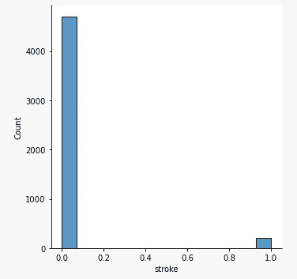
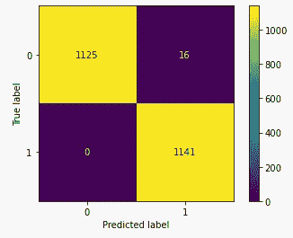
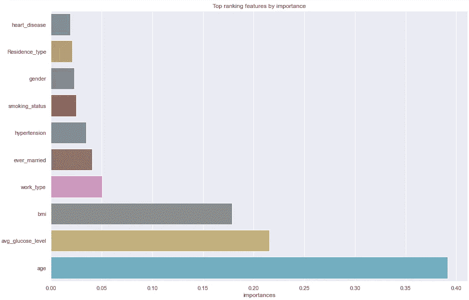

# 中风预测和不平衡数据

> 原文：<https://medium.com/nerd-for-tech/stroke-prediction-imbalanced-data-b6c406a81b8a?source=collection_archive---------1----------------------->


所有图片均由 PixaBay.com 提供

我们都曾经历过——在我们开始改变之前，我们都曾感受过那种恐惧。value_counts()。

我们很少能满足于找到一个 50/50 的二元目标。很少，我们可能会看到 60%的 0 和 40%的 1。但当我们有一百万个 0，只有少数 1 时，会发生什么呢？好吧，不要放弃希望，当然也不要相信你的第一个模型有 98%的准确性！

对于这个演练，我们将使用[中风预测数据集，它可以在 Kaggle](https://www.kaggle.com/fedesoriano/stroke-prediction-dataset) 上找到。现在，也将标准库导入到您的笔记本中。我们将快速完成 EDA 和准备工作。如果你感到迷茫，看看这本[分类初学者指南](/nerd-for-tech/a-beginners-guide-to-your-first-classification-f8547d679411)。

我们要做的第一件事是读入数据并做一些 EDA:

```
df = pd.read_csv('./data/healthcare-dataset-stroke-data.csv')df.info()output:
<class 'pandas.core.frame.DataFrame'>
RangeIndex: 5110 entries, 0 to 5109
Data columns (total 12 columns):
 #   Column             Non-Null Count  Dtype  
---  ------             --------------  -----  
 0   id                 5110 non-null   int64  
 1   gender             5110 non-null   object 
 2   age                5110 non-null   float64
 3   hypertension       5110 non-null   int64  
 4   heart_disease      5110 non-null   int64  
 5   ever_married       5110 non-null   object 
 6   work_type          5110 non-null   object 
 7   Residence_type     5110 non-null   object 
 8   avg_glucose_level  5110 non-null   float64
 9   bmi                4909 non-null   float64
 10  smoking_status     5110 non-null   object 
 11  stroke             5110 non-null   int64  
dtypes: float64(3), int64(4), object(5)
memory usage: 479.2+ KB
```

我们在这里看到的第一件事是身体质量指数的缺失值。我没有医学背景，无法诚实地评价这些价值，所以现在，我们将放弃它们。

```
df.dropna(subset = ['bmi'], inplace = True)
```

接下来，让我们仔细看看我们的对象列，并想出一个转换它们的策略。

```
text_cols = ['gender', 'ever_married', 'work_type',
             'Residence_type', 'smoking_status'][print(df[i].unique()) for i in df[text_cols]]output:
['Male' 'Female' 'Other']
['Yes' 'No']
['Private' 'Self-employed' 'Govt_job' 'children' 'Never_worked']
['Urban' 'Rural']
['formerly smoked' 'never smoked' 'smokes' 'Unknown']
```

现在让我们采取阻力最小的方法，对这些对象进行一些简单的二进制转换。为了使事情变得更简单，我们将把 smoking_status 变量组合成吸烟者与非吸烟者。我们稍后将保存的唯一类别是 work_type。

```
df['gender'] = np.where(df['gender'] == 'Male', 1, 0)df['ever_married'] = np.where(df['ever_married'] == 'Yes', 1, 0)df['Residence_type'] = np.where(df['Residence_type'] == 'Urban', 1, 0)df['smoking_status'] = np.where(((df['smoking_status'] == 'smokes') | (df['smoking_status'] == 'formerly smoked')), 1, 0)
```

如果你和我一样，你会迫不及待地向量化 work_type。对于这个任务，我推荐 SKLearn 的 LabelEncoder。

```
from sklearn.preprocessing import LabelEncoderle = LabelEncoder()df['work_type'] = le.fit_transform(df['work_type'])
```

从上面看我们的工作:

```
[print(df[i].unique()) for i in df[text_cols]]output:
[1 0]
[1 0]
[2 3 0 4 1]
[1 0]
[1 0]
```

现在是关键时刻了。

```
df.stroke.value_counts()output:
0    4700
1     209
Name: stroke, dtype: int64
```

相当不平衡！但这就是我们在这里的原因。

```
sns.displot(df.stroke);
```



这并没有让我们感觉好多少，是吗？

在平衡我们的目标之前，我们还有几个预处理步骤。接下来，让我们使用来自 SKLearn 的隔离森林来移除连续变量身体质量指数和血糖水平的一些异常值。

```
from sklearn.ensemble import IsolationForestiso = IsolationForest(n_estimators = 1000, contamination = 0.03)
  # the contamination value determines the outlier cut-off value
  # we can adjust this value to ensure we do not further 
  # imbalance our targetouts = pd.Series(iso.fit_predict(df[['bmi', 'avg_glucose_level']]),
                 name = 'outliers')outs.value_counts()output:
 1    4761
-1     148
Name: outliers, dtype: int64
```

让我们为异常值标识符创建一个新的列，删除异常值，并看看它是如何影响我们的目标的。

```
df = pd.concat([outs.reset_index(), df.reset_index()], axis = 1,
               ignore_index = False).drop(columns = 'index')df = df[df['outliers'] == 1]df['stroke'].value_counts()output:
0    4564
1     197
Name: stroke, dtype: int6
```

这实际上平衡了一些类！但是我们必须小心不要删除重要的或有意义的数据点，所以我们将在运行几个模型后重新评估我们的污染值。

接下来，让我们通过标准化数值和定义变量来完成预处理。(注意:我们可以使用 make-column-selector 和 transformer 在一个管道中实现所有这些。)

```
from sklearn.preprocessing import StandardScalerss = StandardScaler()num_cols = ['age', 'avg_glucose_level', 'bmi']df[num_cols] = ss.fit_transform(df[num_cols])X = df.drop(columns = ['stroke', 'id', 'outliers'])
y = df.strokeX_train, X_test, y_train, y_test = train_test_split(X, y, 
                                              stratify =y)
```

有趣的是:建模。

我们将需要一个基线模型来比较我们以后的平衡行为。为此，我通常会建议从逻辑回归开始，但是已经浪费了一天时间来尝试和调整该数据集的不同模型，我将建议使用随机森林分类器。

```
rf = RandomForestClassifier()rf.fit(X_train, y_train)y_pred = rf.predict(X_test)def classification_eval(y_test, y_pred):
    print(f'accuracy  = {np.round(accuracy_score(y_test,
                                           y_pred), 3)}')
    print(f'precision = {np.round(precision_score(y_test,
                                           y_pred), 3)}')
    print(f'recall    = {np.round(recall_score(y_test, 
                                           y_pred), 3)}')
    print(f'f1-score  = {np.round(f1_score(y_test, y_pred), 3)}')
    print(f'roc auc   = {np.round(roc_auc_score(y_test, 
                                           y_pred), 3)}')
    print(f'null accuracy = {round(max(y_test.mean(), 
                             1 - y_test.mean()), 2)}')classification_eval(y_test, y_pred)output:
accuracy  = 0.96
precision = 0.0
recall    = 0.0
f1-score  = 0.0
roc auc   = 0.5
null accuracy = 0.96
```

96%的准确率！相比之下……零模型的准确率为 96%。准确性在这里不是一个很好的衡量标准，因此，Kaggle 使用 f-1 对该数据集的模型进行评分。我们的 f1 分数为 0.0，我不认为这会让我们登上排行榜。

我们现在有一个 0.0 的 f-1 基线分数要打破。我认为这是可以实现的。为此，我们将利用来自 [imblearn 库](https://pypi.org/project/imbalanced-learn/)的工具。

从 imblearn 库文档:

重采样技术分为两类:

1.  对多数类欠采样。
2.  对少数民族阶层进行过度采样。
3.  结合过采样和欠采样。
4.  创建整体平衡集。

在我们的第一次尝试中，我们将利用带有默认参数的随机过采样器，这是最简单的策略。

```
from imblearn.over_sampling import RandomOverSamplerrs = RandomOverSampler()X, y = rs.fit_resample(X, y)X_train, X_test, y_train, y_test = train_test_split(X, y, 
                                             stratify = y)rf = RandomForestClassifier()
rf.fit(X_train, y_train)y_pred = rf.predict(X_test)classification_eval(y_test, y_pred)output:
accuracy  = 0.994
precision = 0.988
recall    = 1.0
f1-score  = 0.994
roc auc   = 0.994
null accuracy = 0.5
```

RandomOverSampler 工作得非常好，以至于我花了大约 4 个小时试图解决我的工作问题，确信测试数据已经泄露了。让我们尝试更多的技巧，但是 f-1 的 0.994 分将很难被打破。

```
from imblearn.over_sampling import SMOTEsmote = SMOTE()X, y = smote.fit_resample(X, y)X_train, X_test, y_train, y_test = train_test_split(X, y, 
                                             stratify = y)rf = RandomForestClassifier()
rf.fit(X_train, y_train)y_pred = rf.predict(X_test)classification_eval(y_test, y_pred)output:
accuracy  = 0.948
precision = 0.925
recall    = 0.975
f1-score  = 0.949
roc auc   = 0.948
null accuracy = 0.5
```

与我们的基线模型相比，有了相当可观的改进，但性能不如 RandomOverSampler。

注意:如果每次拟合都得到相同的指标，那是因为我们需要通过重新运行上面的单元格来重新定义变量。

另一项技术:

```
from imblearn.over_sampling import ADASYNada = ADASYN()X, y = ada.fit_resample(X, y)X_train, X_test, y_train, y_test = train_test_split(X, y, 
                                             stratify = y)rf = RandomForestClassifier()
rf.fit(X_train, y_train)y_pred = rf.predict(X_test)classification_eval(y_test, y_pred)output:
accuracy  = 0.933
precision = 0.907
recall    = 0.964
f1-score  = 0.935
roc auc   = 0.933
null accuracy = 0.5
```

最后一次尝试:

```
from imblearn.over_sampling import SMOTENCsm = SMOTENC(categorical_features = [0, 2])
     #here we have to define our categorical columnsX, y = sm.fit_resample(X, y)X_train, X_test, y_train, y_test = train_test_split(X, y, 
                                             stratify = y)rf = RandomForestClassifier()
rf.fit(X_train, y_train)y_pred = rf.predict(X_test)classification_eval(y_test, y_pred)output:
accuracy  = 0.94
precision = 0.917
recall    = 0.968
f1-score  = 0.942
roc auc   = 0.94
null accuracy = 0.5
```

与基线相比又一个巨大的进步，但仍然比不上我们的第一次尝试。我们可以尝试调整采样技术，并调整我们的分类器的超参数(这是我已经尝试过的，你可以在我的 [GitHub](https://github.com/csinnott0219) 中看到)，但我仍然不认为我们会打破我们最初的 f-1 分数 0.994。

让我们通过可视化我们的一些结果来结束。我建议在您的笔记本中创建一个新的部分，或者从一个新的笔记本开始，只包含最佳性能的模型，以便在我们评估时保持简单。

```
plot_confusion_matrix(rf, X_test, y_test);
```



假阴性比假阳性多——对健康预测不理想，这是我们想要调整的。

```
y_pred_prob = model.predict_proba(X_test)sns.displot(y_pred_prob[:, 1]);
plt.title('Histogram of predicted probabilities');
```


最后，特征提取:

```
feat_names = [i for i in X_train]
classed = [i for i in y_train]
feat_import_df = pd.DataFrame({'importances': model.feature_importances_, 
      'name': feat_names}).sort_values('importances')x = feat_import_df['importances'].tail(9)
y = feat_import_df['name'].tail(9)
sns.barplot(x = x, y = y).set_title('Top ranking features by importance');
```



看到特性的重要性，谁不兴奋呢？

上面我们可以看到年龄、平均血糖水平和身体质量指数是预测中风的最重要因素，f-1 值为 0.994，我们对这些发现相当有信心。


感谢阅读！我希望下一次你要检查你的值计数时，你会感到自信，你甚至可以对最不平衡的数据进行分类。