# 纠结于 Python 中的基本数据结构？

> 原文：<https://medium.com/nerd-for-tech/struggling-with-basic-data-structures-in-python-b28253d3c86e?source=collection_archive---------0----------------------->

由于 python 中使用的基本数据结构之间的相似性，任何初学者陷入困惑是正常的，但是如果您比较并使用它们，您可以很好地理解它们。不要只阅读理论部分，重要的是编码并使用它们来获得所需的信心。

数据结构是任何编程语言的重要组成部分，无论是 C/C++、Java、Python 等等。现在，什么是数据结构？简单地说，它是一种组织给定数据的结构或方式。你的数据可以 Python 主要有四种数据结构，即:**列表**、**元组**、**集合**、**字典**。现在考虑我们有 4 个数据输入，即:苹果，芒果，23，32。我们可以使用这些数据结构来组织我们的数据，首先是:

**列表:**

在这种数据结构中，我们将数据存储在[]括号中。列表是*有序的*，这意味着当你打印数据时，你将在控制台中以有序的方式得到它。您的列表中可以有重复的成员。

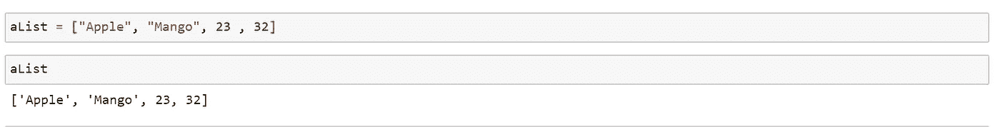

python 中的列表

您可以从索引号(*注意，索引号也可以是负数*)访问数据并对其进行更改，即列表对象是可变的*。*

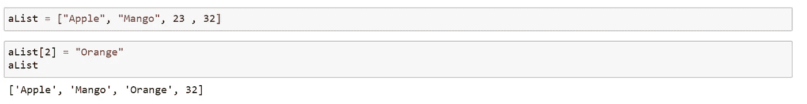

列表是可变的

同样，你可以添加、删除、排序、追加等；列表中的数据使用列表中的[功能](https://www.w3schools.com/python/python_ref_list.asp)。例如，要在列表中追加数据，可以使用 append()函数。

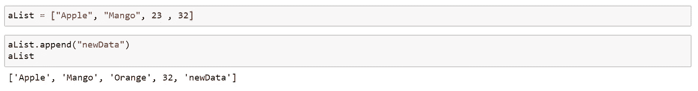

在列表中追加()

**元组:**

在这种数据结构中，我们将数据存储在()括号中。一个元组是*有序的*。您的元组中可以有重复的成员。

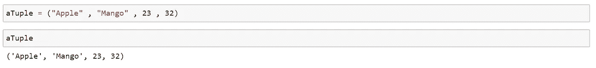

python 中的元组

您可以从索引号访问数据，但不能改变它，即元组对象是*不可变的*。

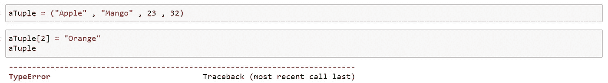

元组对象是不可变的

类似地，您可以在 Tuple 中使用其他[函数。例如，要计算数据在元组中出现的次数，可以使用 count()函数。](https://www.w3schools.com/python/python_ref_tuple.asp)

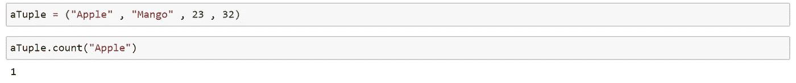

元组中的 count()

**设定:**

在这种数据结构中，我们将数据存储在{}括号内。器械包*未排序*。您的*集合中不能有重复的*成员。

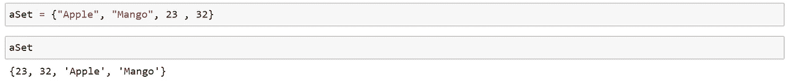

python 中的集合是无序的

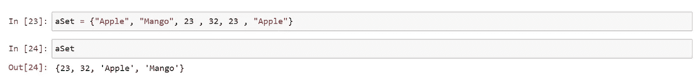

集合中不显示重复项

您不能从索引号访问数据并改变它，即集合对象是*不可变的。*

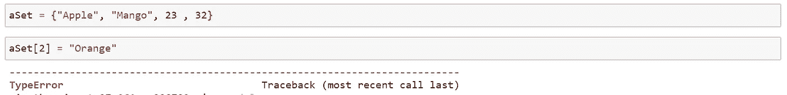

集合对象是不可变的

同样，您可以使用集合中的其他[功能。例如，要弹出一个数据，可以使用 pop()函数。](https://www.w3schools.com/python/python_ref_set.asp)

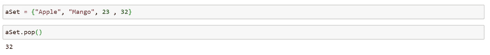

集合中的 pop()

**字典**:

在这种数据结构中，我们成对存储数据，即{}括号内的(键，项)。字典是*无序的*。您的*字典中不能有重复的*键，但是您的字典中可以有重复的条目。

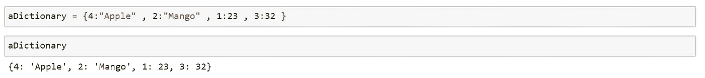

字典是无序的

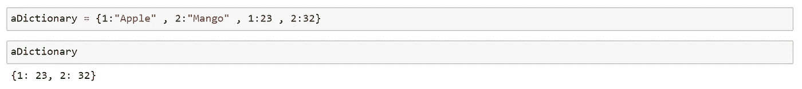

字典中有重复的关键字

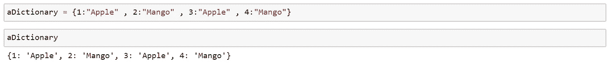

字典中的重复项目

你可以通过键访问数据并改变它，也就是说字典对象是可变的。您还可以使用 get()函数从键中访问数据。

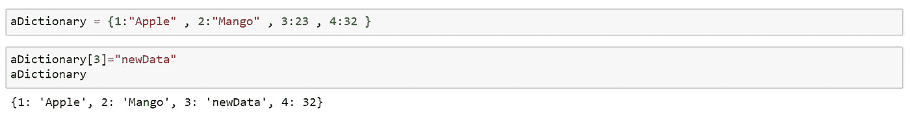

重复的对象是可变的

同样，您可以使用字典中的其他[函数。例如获取数据可能使用 get()函数。](https://www.w3schools.com/python/python_ref_dictionary.asp)

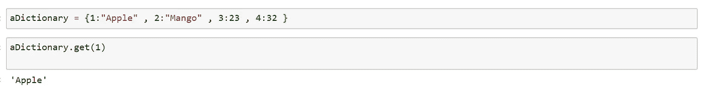

在字典中获取()

因此，这是 python 中存在的基本数据结构的简要概述。

为了熟悉所有这些数据结构，请确保在需要时使用它们并练习它们！