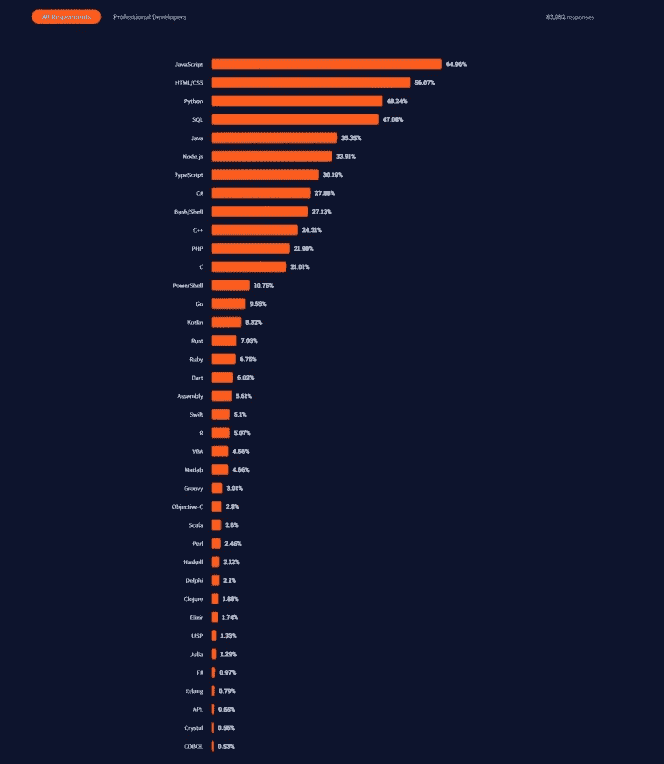
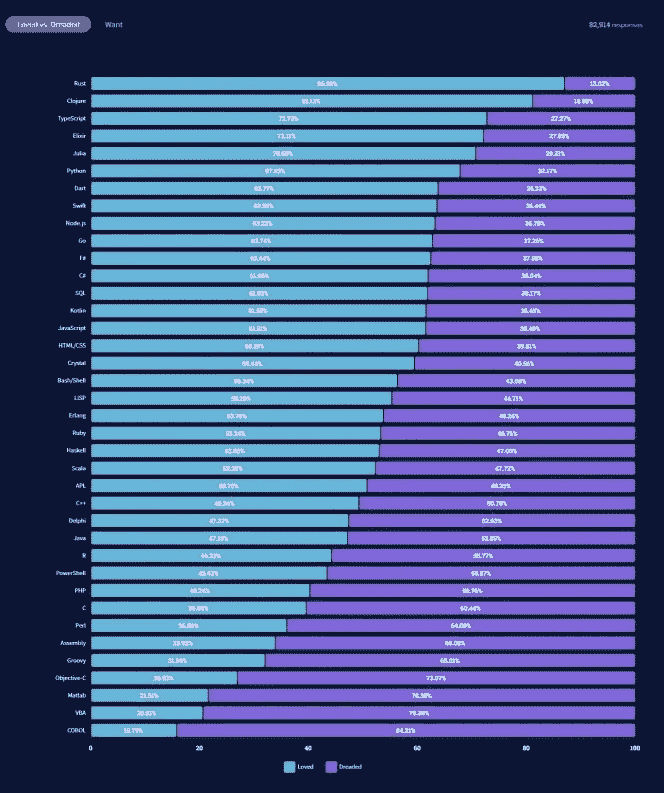
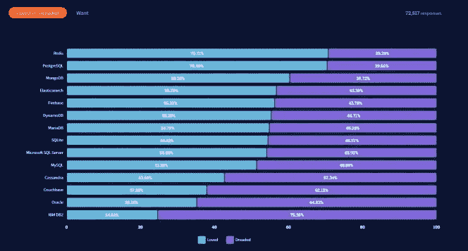
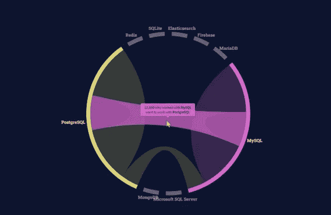
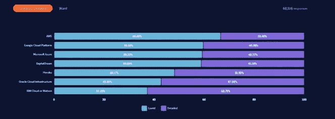
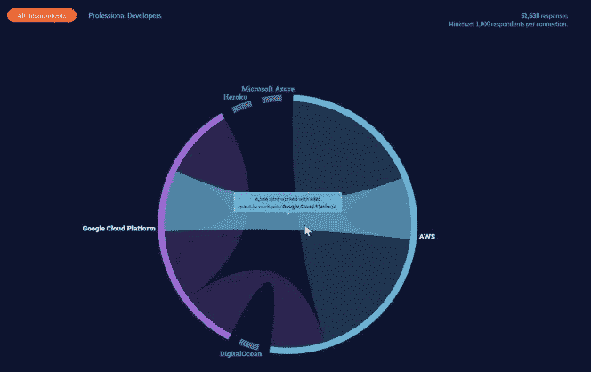
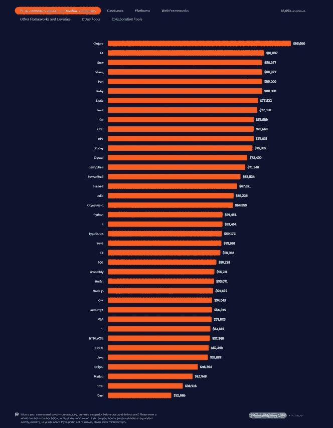

# 研究:2021 年开发者最喜欢和最讨厌的语言

> 原文：<https://medium.com/nerd-for-tech/study-most-preferred-and-most-hated-languages-for-developers-in-2021-a5bc8c8b3d5?source=collection_archive---------4----------------------->

Stack Overflow 公布了它的主要调查，评估了最流行的技术和开发者的偏好。

2021 年最流行的编程语言堆栈溢出

为了开展这项调查，Stack Overflow 在 2021 年 5 月 25 日至 6 月 15 日期间采访了 180 个国家的 8 万多名开发者。请注意，美国和印度提供的答复量最大。

# 开发人员最喜欢、害怕和追求的语言

在最受欢迎的语言的领奖台上，JavaScript 在 64.9%的受访者中排名第一，其次是 HTML / CSS (56%)和 Python (48.2%)。然而，当谈到开发人员喜欢或害怕的语言时，Rust 是最受欢迎的，占 87%，而 Cobol 排名垫底，有 15.8%的受访者表示喜欢它，而 84.2%的受访者承认害怕它。就其本身而言，Python 是 5 年来最受欢迎的语言，引起了 19%被调查开发者的兴趣。

开发者最喜欢和害怕的语言列表。堆栈溢出

# Redis 连续第五年成为最受欢迎的数据库

在数据库方面，前 3 名最受欢迎的亮点是:MySQL (50.2%)、PostgreSQL (40.4%)和 SQLite (32.2%)。然而，Redis 仍然是最受 70.7%的受访者欢迎的。75.4%的开发人员连续第二年害怕 IBM DB2。

最受喜爱和恐惧的数据库。堆栈溢出

PostgreSQL (17.9%)和 MongoDB (17.8%)在被请求最多的数据库排名中并驾齐驱。这一趋势反映在开发人员对未来一年的预期中，12，590 名使用 MySQL 的受访者希望使用 PostgreSQL。

一定比例的开发者想换数据库。堆栈溢出

# AWS，最受欢迎，最受喜爱，最受追捧的云平台

在云计算平台类别中，亚马逊网络服务(AWS)赢得了所有选票。它最受 54.2%的受访者欢迎，最受 66.5%的开发者赞赏，但也是 40.3%的开发者要求最多的。

最受欢迎和恐惧的数据库排名。堆栈溢出

请注意，目前使用 AWS 的 8，586 名开发人员希望在谷歌云上工作，而 7，668 名受访者希望从第二平台转向第一平台。

来年开发者云平台偏好。堆栈溢出

# Web 框架:最受欢迎和最受欢迎的 React.js，最受欢迎的 Svelte

最受欢迎的 3 个 web 框架是:React.js (40.1%)、jQuery (34.4%)和 Express (23.8%)。然而，它们被 Svelte 取代，后者是 71.5%的受访者最喜欢的网络框架。然而，React.js 仍然是 25.1%的开发者要求最多的。

最喜欢和最讨厌的 web 框架排名。堆栈溢出

# 让你拿到最高薪水的语言

说到收入最高的技能，去年排名第一的 Perl 上升到了第五位。2021 年，使用 Clojure 语言的开发人员以 95，000 美元(80，191 欧元)的中位工资位居榜首，领先于 81，037 美元(68，405 欧元)的 F #，其次是 Elixir、Erlang、Perl。红宝石的价格为 8 万美元(67530 欧元)。

开发者薪水最高的语言列表。堆栈溢出

 [## 堆栈溢出开发者调查 2021

### 尽管工程经理、sre、DevOps 专家职位的薪酬最高，但我们发现他们的平均薪酬也超过…

insights.stackoverflow.com](https://insights.stackoverflow.com/survey/2021#most-popular-technologies-language)