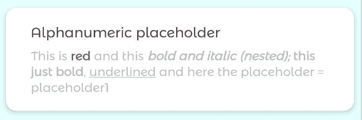
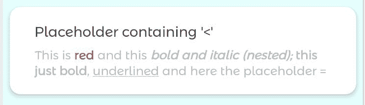
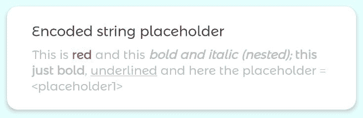
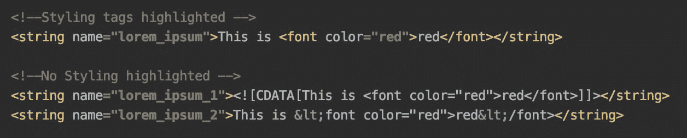
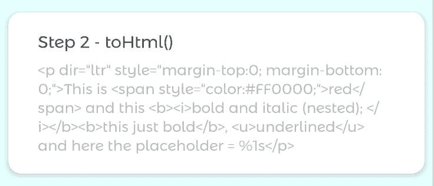
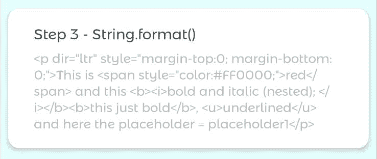
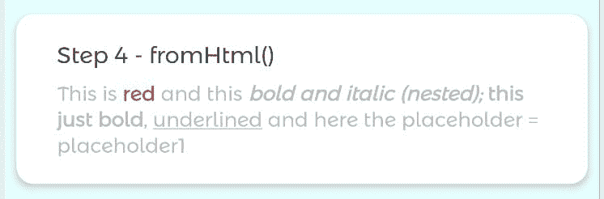

# 用 HTML 标记直接在 Android xml 中设计动态字符串

> 原文：<https://medium.com/nerd-for-tech/styling-dynamic-strings-directly-in-xml-7b93cfe380ab?source=collection_archive---------2----------------------->


图片来自 Unsplash，作者 Markus Spiske

*语法高亮* ***和代码格式化*** *见原文章* ***免费上我的个人博客:*[*https://sergiosastre . hashnode . dev*](https://sergiosastre.hashnode.dev/styling-dynamic-strings-directly-in-xml)*。***

在 Android 中，`Strings`是处理显示纯文本的视图时最常见的对象之一。在实现用户界面时，经常会出现文本需要某种样式的情况。对于样式化的字符串，我们需要使用`CharSequences`来代替。Android 支持一些现成的 html 标签，例如，它们可以在 xml 字符串资源中定义

```
<string name="lorem_ipsum">
This is <font color="red">red</font> and this <b><i>bold and italic (nested); </i>this just bold</b>,<u>underlined</u>
</string>
```

并通过调用`context.getText(stringRes: Int)`解析成一个`CharSequence`，它会处理所有支持的 HTML 标签来样式化文本，而不需要我们做任何其他事情。

然而，有时我们需要动态构建字符串的一部分。为了做到这一点，我们需要以`%{digit}${type}`的形式用占位符标记 xml 中的动态部分，例如`%1$s`是作为第一个`vararg`传递的字符串，`%2$d`是作为第二个`vararg`传递的十进制数，在`String.format(text: String, vararg args: String)`中，调用它来解析占位符。

然而，如果我们在 xml 字符串资源中定义了动态占位符和 **HTML 标签，事情就变得复杂了，比如像这样。**

```
<string name="lorem_ipsum">
This is <font color="red">red</font> and this <b><i>bold and italic (nested); </i>this just bold</b>, <u>underlined</u> and here the placeholder = %1s
</string>
```

如果我们看一下`String.format(text: String, vararg args: String)`的方法签名，它的第一个参数需要一个`String`而不是一个`CharSequence`。这意味着，动态文本占位符将被正确替换，但是我们的`CharSequence`必须转换为`String`，放弃它的样式。

为了处理 HTML 标记，Android 提供了 *HtmlCompat* 。它要求字符串资源对其开头的不安全字符进行编码，即:`'<'`，变成`'&lt;'`

```
<string name="lorem_ipsum">
This is &lt;font color="red">red&lt;/font> and this &lt;b>&lt;i>bold and italic (nested); &lt;/i>this just bold&lt;/b>,&lt;u>underlined&lt;/u> and here the placeholder = %1s
</string>
```

或者，我们可以将 [CDATASections](https://developer.android.com/reference/org/w3c/dom/CDATASection) 中的资源包装成 xml，如下所示:

```
<string name="lorem_ipsum">
<![CDATA[
This is <font color="red">red</font> and this <b><i>bold and   italic (nested); </i>this just bold</b>, <u>underlined</u> and here the placeholder = %1s 
]]>
</string>
```

在任何情况下，假设我们的动态占位符文本为“placeholder1”，我们可以通过使用 *HtmlCompat* 得到预期的结果，如下所示:

```
val text = context.getString(R.string.lorem_ipsum) 
val dynamicText = String.format(text, "placeholder1") 
val dynamicStyledText = 
HtmlCompat.fromHtml(dynamicText, HtmlCompat.FROM_HTML_MODE_COMPACT)textView.text = dynamicStyledText
```



虽然上面的代码看起来运行稳定，但是如果动态占位符文本包含至少一个未转义的 HTML 字符，例如:`<`、`>`、`&`、`\`或`"`，就像在`<placeholder1>`中一样，结果会有所不同，导致下面的结果



是的，占位符就这么消失了。那是因为在调用`HtmlCompat.fromHtml()`之前必须对字符进行转义。我们通过在使用 *HtmlCompat* 之前对占位符进行编码来解决这个问题，就像这样

```
val text = context.getString(R.string.lorem_ipsum) 
val encodedPlaceholder = TextUtils.htmlEncode("<placeholder1>") 
val dynamicText = String.format(text, encodedPlaceholder) 
val dynamicStyledText = 
HtmlCompat.fromHtml(dynamicText, HtmlCompat.FROM_HTML_MODE_COMPACT) textView.text = dynamicStyledText
```



虽然这很有效，而且根据官方文件[这是推荐的方法](https://developer.android.com/guide/topics/resources/string-resource.html#kotlin)，但我个人不喜欢以前的任何方法。为什么？

1.  为了使用动态文本占位符，您最终完全改变了 xml 字符串资源
2.  在字符串资源的样式化部分，xml 失去了突出显示，因此更难阅读



一个更好的方法是创建一个方法，可以处理带有 HTML 标记和占位符的原始 xml 字符串资源。这样做，字符串资源是否包含 HTML 标记并不重要，该方法只是处理占位符，同时保持由(现有的，如果有的话)HTML 标记定义的样式…不需要替换开始的不安全字符或添加 [CDATASections](https://developer.android.com/reference/org/w3c/dom/CDATASection) 。

是的，这是可能的。让我们看看怎么做。

# 挖掘更好的解决方案

我们已经知道使用`context.getText(R.string.lorem_ipsum)`会返回样式为`CharSequence`的字符串资源。如果字符串资源有一个占位符，它将像在 xml 中一样显示。


我们也知道`HtmlCompat.fromHtml()`处理“一些”HTML 标签。它的反向方法是存在的，并做完全相反的事情:接受一个`Spanned`对象，并将其转换为带有相应 HTML 标签的字符串。我们传递给方法的标志也很重要:`HtmlCompat.TO_HTML_PARAGRAPH_LINES_INDIVIDUAL`也在 HTML 字符串的末尾添加了一个新行，我们必须考虑到这一点。因此，我们可以如下获得所需的 HTML 字符串

```
// step 2 - toHtml()
val spannedString = SpannedString(styledString) 
val htmlString = 
HtmlCompat.toHtml( 
   spannedString, HtmlCompat.TO_HTML_PARAGRAPH_LINES_INDIVIDUAL 
)
.substringBeforeLast('>')
.plus(">")
```

这导致了



到目前为止，我们已经得到了与第一步的样式化字符串等价的 HTML 字符串。然而，最终目标是用相应的值替换它的占位符。您可能还记得，我在文章开头提到过，我们可以使用`String.format(text: String, vararg args: String)`来实现这一点。它不能与`CharSequence`一起工作，但这就是为什么我们首先把它转换成等价的 HTML 字符串。

```
// step 3 - String.format()
val dynamicHtmlString = String.format(htmlString, args)
```



只需将 HTML 文本转换成一个`CharSequence`，我们就可以得到想要的样式。记得使用`HtmlCompat.FROM_HTML_MODE_COMPACT`，因为它是我们之前使用的`HtmlCompat.TO_HTML_PARAGRAPH_LINES_INDIVIDUAL`的反码

```
// step 4 - fromHtml()
val result = 
HtmlCompat.fromHtml( 
   dynamicStyledString, HtmlCompat.FROM_HTML_MODE_COMPACT 
).removeSuffix("\n")
```



好了，我们差不多完成了…正如我们在本文开头看到的，如果占位符是包含不安全字符的`Strings`，它们就不会显示出来。因此，不要忘记我们需要对替换占位符的字符串值进行编码。遵循上述所有步骤的 Kotlin 扩展函数如下所示

```
fun Context.getHtmlStyledText(
    @StringRes htmlStringRes: Int,
    vararg args: Any
): CharSequence {

    // step 0 - Encode string placeholders  
    val escapedArgs = args.map {
        if (it is String) TextUtils.htmlEncode(it) else it
    }.toTypedArray()

    // step 1 - getText()
    val styledString = Context.getText(htmlStringRes)

    // step 2 - toHtml()
    val spannedString = SpannedString(styledString)
    val htmlString = HtmlCompat.toHtml(
        spannedString,
        HtmlCompat.TO_HTML_PARAGRAPH_LINES_INDIVIDUAL
    )
        .substringBeforeLast('>')
        .plus(">")

    // step 3 - String.format()
    val dynamicStyledString = 
        String.format(htmlString, *escapedArgs)

    // step 4 - fromHtml()
    return HtmlCompat.fromHtml(
        dynamicStyledString,
        HtmlCompat.FROM_HTML_MODE_COMPACT
    )
    .removeSuffix("\n")   //fromHtml() adds one new line at the end
}
```

# 奖金

同样的想法也适用于复数资源。简单替换

```
// step 1 - getText()
val styledString = context.getText(R.string.lorem_ipsum)
```

随着

```
// step 1 - getText()
val styledString =   context.resources.getQuantityText(R.plural.lorem_ipsum, quantity)
```

你可以在这里找到相应的[字符串和复数的工作要点](https://gist.github.com/sergio-sastre/371191e5067c73af747f3d0939e0db29)

你喜欢这个帖子吗？你可能也想看看我写的其他文章:

1.  [2021 年安卓快照测试介绍](https://sergio-sastre.medium.com/an-introduction-to-snapshot-testing-on-android-in-2021-c9826e22deb1)
2.  [通过参数化测试实现更好的单元测试](https://sergiosastre.hashnode.dev/better-unit-tests-with-parameterized-testing)
3.  [用基于属性的测试编写防弹代码](https://sergiosastre.hashnode.dev/writing-bulletproof-code-with-property-based-testing-pbt)

*原发布于*[*https://sergiosastre . hashnode . dev*](https://sergiosastre.hashnode.dev/styling-dynamic-strings-directly-in-xml)*。*