# 用 Bootstrap 设计 React 应用程序:

> 原文：<https://medium.com/nerd-for-tech/styling-react-apps-with-bootstrap-5-cards-8c548659af64?source=collection_archive---------5----------------------->

在这一系列文章中，我将通过一个实践练习来解释如何使用 Bootstrap 为 React 应用程序创建有吸引力的风格。我不会假设任何关于 CSS、HTML、Bootstrap 或 React 的知识。你可以通过这些步骤，他们应该工作。

YouTube 播放列表位于:

【https://youtube.com/playlist? list = plj zed-em7iW-lqdxhjxsbaj 8 ww jpd 3 xeu

在这篇文章中，我将从<card>开始</card>

最终代码可在以下网址找到

 [## ranyelhousieny/bootstrap

### 此时您不能执行该操作。您已使用另一个标签页或窗口登录。您已在另一个选项卡中注销，或者…

github.com](https://github.com/ranyelhousieny/bootstrap) 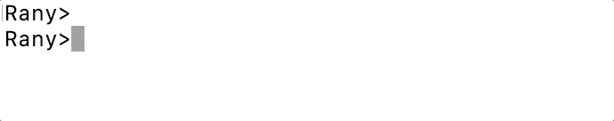

如果您的计算机没有 Nodejs，请遵循下面的文章

 [## 为 React 和节点开发准备您的 Mac，安装 NodeJS、npm、VS 代码，并配置 VS…

### 按照以下步骤/视频安装 Nodejs

ranyel.medium.com](https://ranyel.medium.com/preparing-your-mac-for-react-and-node-development-install-nodejs-npm-vs-code-and-configure-vs-e4f0cf1e99a4) 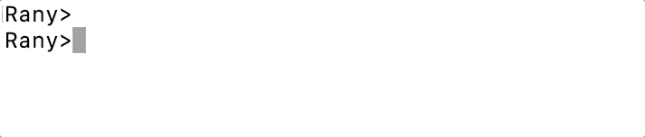

让我们使用创建 react 应用程序

**npx 创建反应应用反应引导**

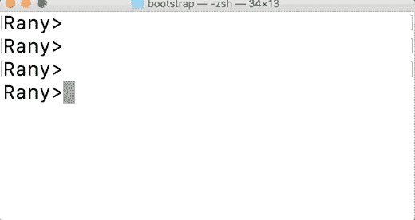

创建完应用程序后，将目录更改为(cd react-with-bootstrap)。

然后使用(代码)打开 Visual Studio 代码。)

如左侧所示

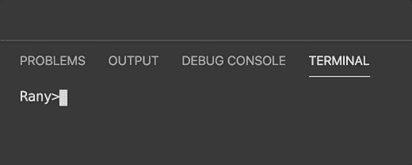

当 VSCode 打开时，单击(ctrl +`)在 VSCode 中打开一个终端。然后安装引导程序

npm 安装引导程序反应-引导程序

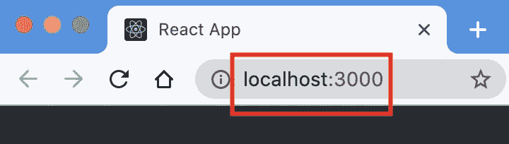

让我们通过编写以下内容在浏览器上启动应用程序

npm 开始

## 添加引导

现在，让我们将 Bootstrap 按钮添加到 src/App.js，如下所示

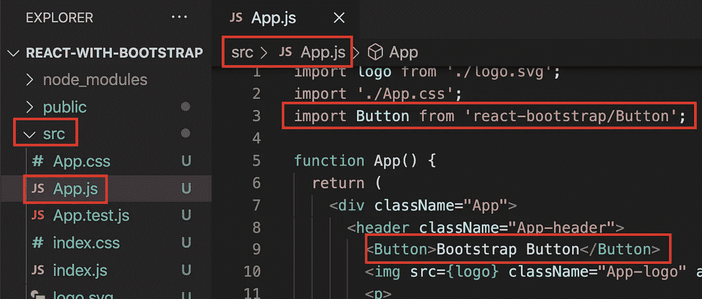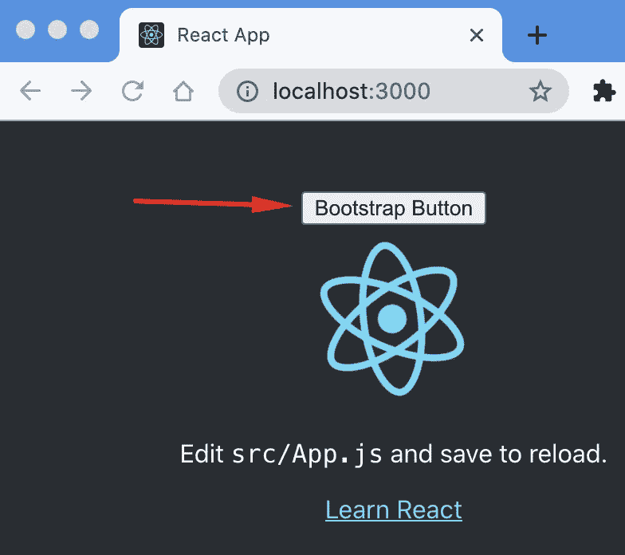

观察按钮是如何添加到页面上的

然而，它没有风格

让我们导入 css

请注意，您可以用另一种方式导入，如下所示

从“反应引导程序”导入{ Button }

我们将使用后者来导入多个组件

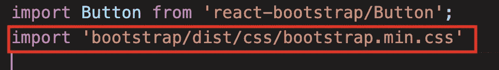

保存并注意浏览器。它会自动添加样式

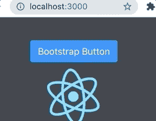

## 创建卡片

你会反复看到的东西之一是卡片。这是今天版面的一个基本元素

从“反应-引导”导入{按钮，卡片}

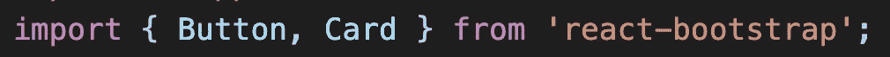

卡片由图像、正文、标题和文本组成。所有这些都将在开始和结束卡标记之间

## 添加图像

让我们从一张来自[https://picsum.photos/200/100](https://picsum.photos/200/100)的随机图片开始

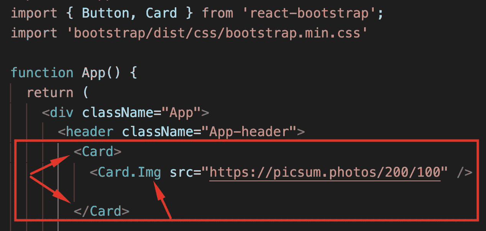

现在让我们添加带有标题的正文(我在卡片上添加了 style={{color : 'blue'}}，因为在 App.css 中默认是白色的，你看不到文字)

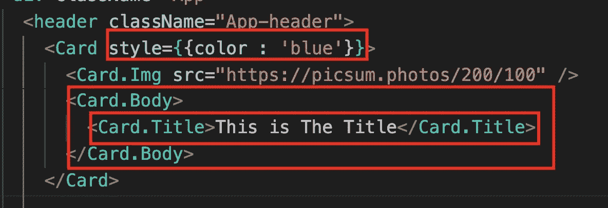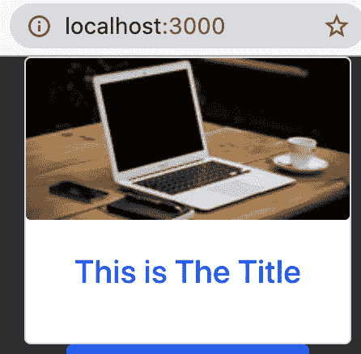

最后，让我们添加文本

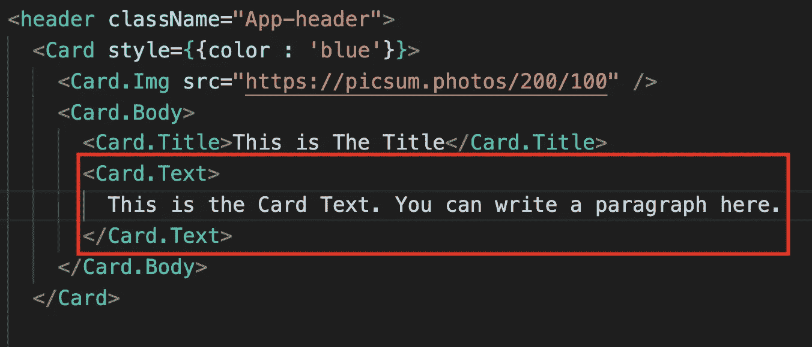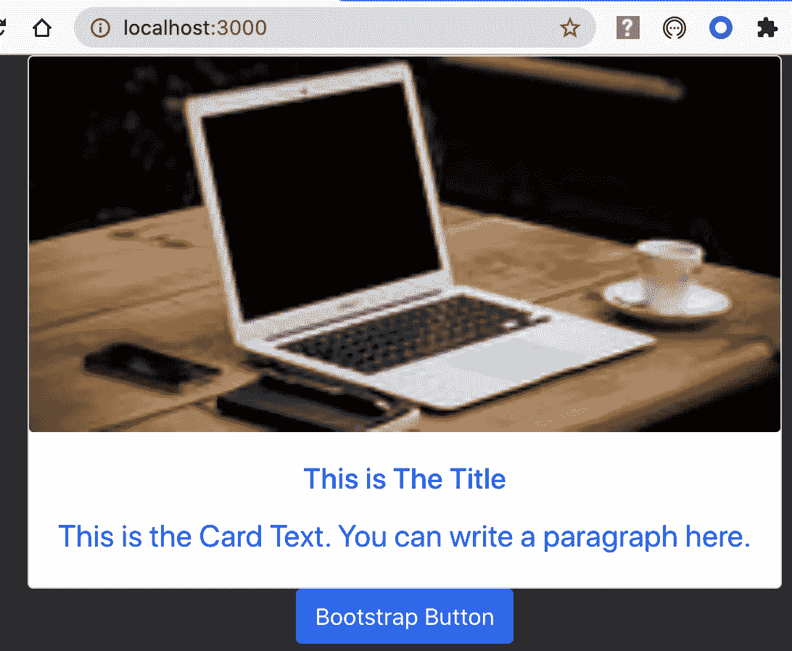

让我们移动卡内的按钮。

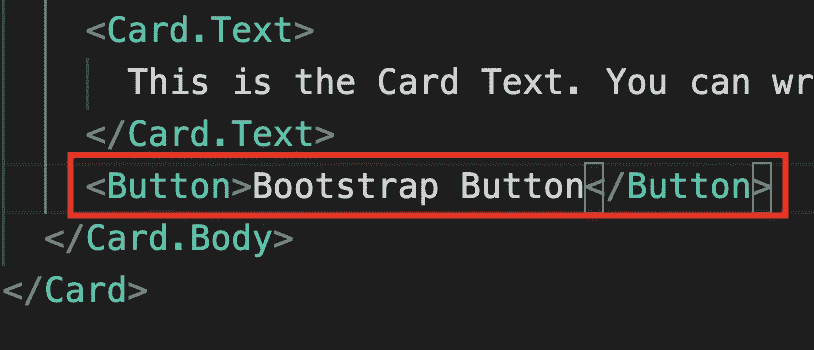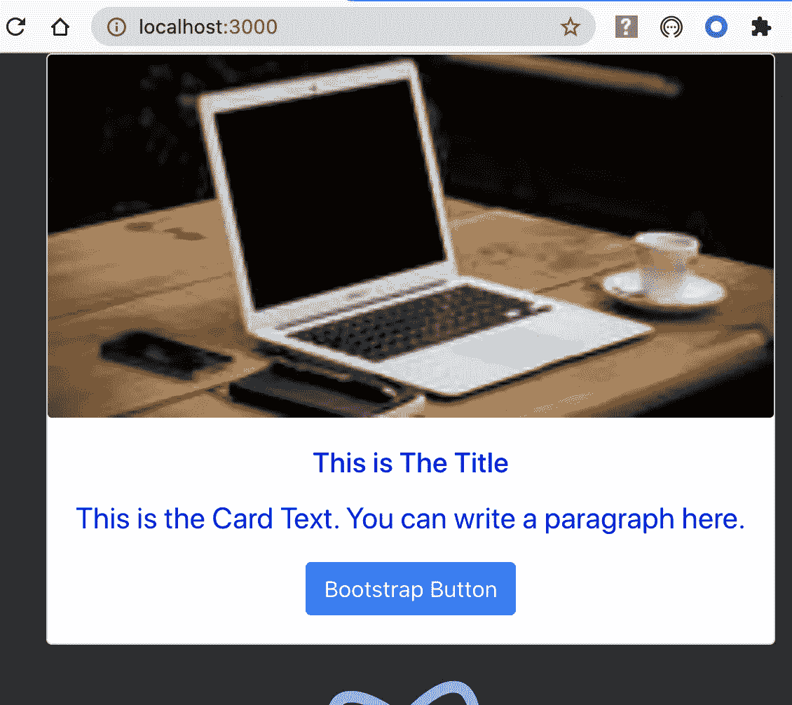

下面的文章我们再加一个<navbar>:</navbar>

 [## <navbar>:用 Bootstrap 进行造型反应</navbar>

### “Navbar”是大多数 React 页面中的另一个重要组件。让我们从 react-bootstrap 了解更多关于<navbar>的信息</navbar>

ranyel.medium.com](https://ranyel.medium.com/navbar-styling-react-with-bootstrap-6c74b0631d04)