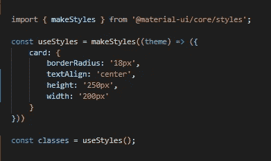
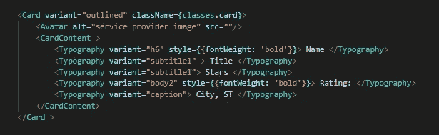

# 使用材质用户界面设计反应组件的样式

> 原文：<https://medium.com/nerd-for-tech/styling-react-components-with-material-ui-58c9bed44e68?source=collection_archive---------5----------------------->

像网页一样漂亮的代码的组织策略。

React 的 styled-components 背后的理念是，与组件相关的所有代码都应该在一个文件中，包括样式代码。在样式化组件中，CSS 被写在组件的 JavaScript 文件中它自己的部分。这对于组织和快速定位相关的样式代码来说是非常棒的，而不必筛选潜在的巨大 CSS 文件。

但是，有时您可能想要更多的 CSS 结构和组织，并转向 React 的语义 UI 或材质 UI 等库。

每个材质 UI 组件都有内置的样式，但也允许这些基本样式被通过 props 传递的样式扩展或覆盖。
根据[文档](https://material-ui.com/styles/api/)，这可以通过导入和插入样式表或者在组件文件中写出样式来完成(听起来很熟悉吧？).这非常类似于样式化组件哲学！

# 入门指南

材质 UI 提供了创建属性对象的功能，该对象将被访问并插入到 JSX 中。
`makeStyles`是像 React 中的其他钩子一样实现的。

*   **从`‘@material-ui/core/styles’`导入**功能
*   **调用** `makeStyles`来访问返回的`useStyles`函数，该函数本身接受一个参数:将用于 JSX 插值的属性。
*   将调用函数分配给一个通常称为“类”的变量。

我们的代码应该是这样的:

您可能会注意到，用于创建样式的代码的语法与我们通常在 JSX 内联样式中使用的语法相同。一个键-值对的对象，具有按照 JavaScript 约定区分大小写的键和对应于 CSS 属性的名称。这些值用引号括起来，对应于所需的 CSS 值。

该对象本身是一个值，其键是样式将应用到的元素的描述符。在上面的例子中，我正在设计一个卡片的样式，因此相应地命名了这个样式。

# 收尾工作

一旦样式被写出，就可以用`className={classes.card}`将它们插入到 JSX 中:“T5”是一个对象，因此可以使用点符号`Object.key`来访问它的值。

为什么是“`className`”？这是 React JSX 的普通 JavaScript 中的“`class`”。如果我们考虑如何将样式应用于 CSS 中的元素(使用选择器，class 是其中之一)，我们给元素一个类，该类对应于用`makeStyles`创建的一组样式是有意义的。

我的卡的 JSX 是这样的:

所有这些都有必要吗？不。我可以使用 style 属性内联编写我所有的样式，但是那会使我的 JSX 非常非常长。我也可以简单地创建一个 CSS 文件，然后把所有内容都放在那里。
然而，我更喜欢将所有适用的代码放在一个地方的风格化组件哲学。我喜欢 Material UI 在使用它们的样式库的同时提供了这样做的方法！

得到那种风格。