# 样式与 CSS 模块样式表反应

> 原文：<https://medium.com/nerd-for-tech/styling-react-with-css-modules-stylesheet-56e40d1498a8?source=collection_archive---------2----------------------->

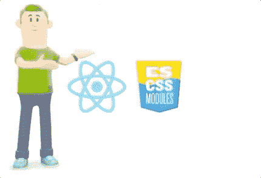

在这篇文章中，我将解释我如何使用 CSS 模块设计我在 https://rany.elhousieny.com/publications 的出版物页面

包含短视频的 Youtube 播放列表可以在:【https://youtube.com/playlist? 找到 list = plj zed-em7iW _ awzs 1hg 5o wucgcbpw 8 q-

最终的地点在(【https://rany.elhousieny.com/publications】T4)将如下所示

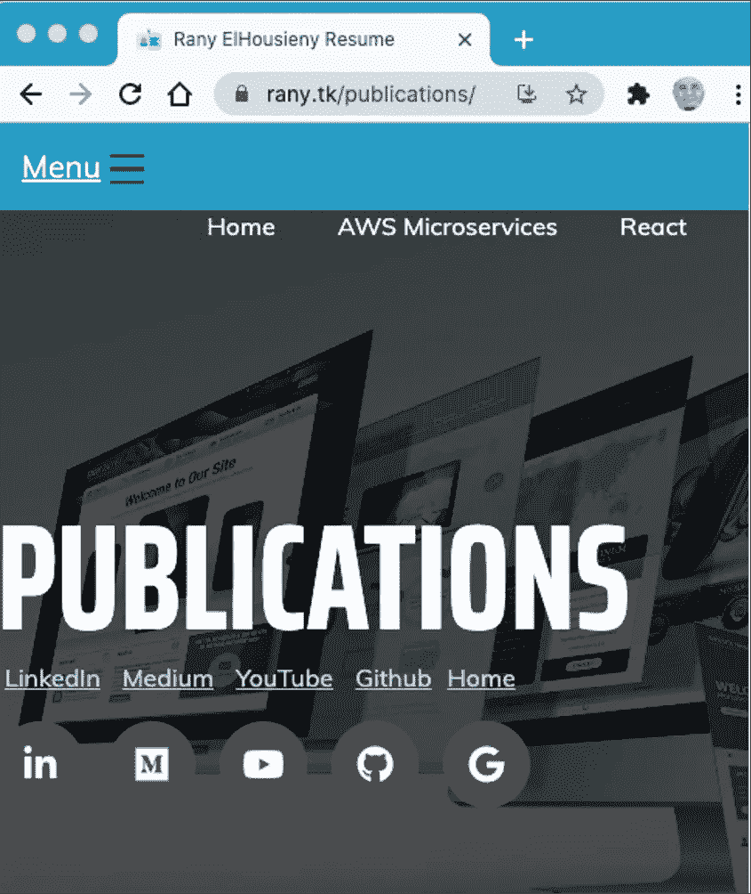

1.  让我们创建一个名为 publications 的 react 函数组件(如果您不知道如何设置您的机器和创建 React 应用程序，请参考

 [## 为 React 和节点开发准备您的 Mac，安装 NodeJS、npm、VS 代码，并配置 VS…

### 按照以下步骤/视频安装 Nodejs

ranyel.medium.com](https://ranyel.medium.com/preparing-your-mac-for-react-and-node-development-install-nodejs-npm-vs-code-and-configure-vs-e4f0cf1e99a4) 

2.创建相应的 CSS 模块文件(publications.module.css)

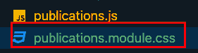

在 publications.module.css 中添加一个名为。出版物

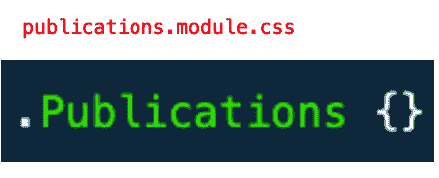

如下所示导入 publications.js 中的 publications.module.css，并将样式添加到标题中。

在 CSS 模块中，我们导入一个别名。在这个例子中，我使用了一个别名“Classes ”,文件中的所有 CSS 类都将成为这个别名中的属性。因此，为了访问公共类，我们添加了下面一行

ClassName={Classes。出版物}

我们将它添加到{}中，因为它是 Java 脚本对象

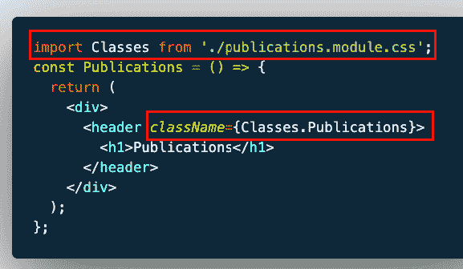

现在，让我们在 CSS 中添加一个背景图片。出版类

## 背景图像

首先，让我们在谷歌图片上寻找一个高分辨率的背景

1.  进入[谷歌图片](https://www.google.com/imghp?hl=en&authuser=0&ogbl)，搜索[高分辨率网络开发背景](https://www.google.com/search?newwindow=1&hl=en&authuser=0&tbm=isch&sxsrf=ALeKk03QQizknyXFZYfq0X_qVtViQiJPWQ%3A1613401085394&source=hp&biw=1344&bih=738&ei=_YsqYPOXFc3y-gTEtqHgCw&q=high+resolution+web+development&oq=high&gs_lcp=CgNpbWcQAxgBMgQIIxAnMgQIIxAnMgUIABCxAzIFCAAQsQMyBQgAELEDMgUIABCxAzICCAAyBQgAELEDMgUIABCxAzIFCAAQsQM6BwgjEOoCECc6CAgAELEDEIMBUIINWL4TYOwiaAFwAHgAgAEuiAGxAZIBATSYAQCgAQGqAQtnd3Mtd2l6LWltZ7ABCg&sclient=img)
2.  点击背景过滤器
3.  寻找你喜欢的图像
4.  右键单击->另存为并保存图像
5.  创建一个目录 src/assets/img，并将映像移动到其中
6.  在里面。Publications 类，添加背景图像

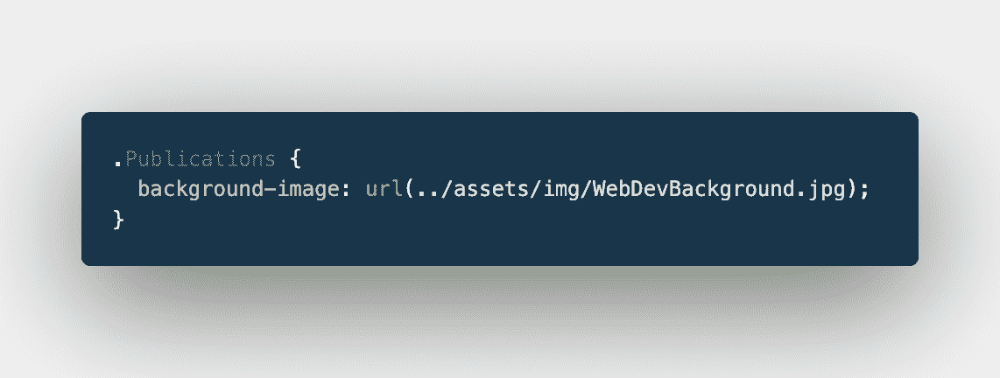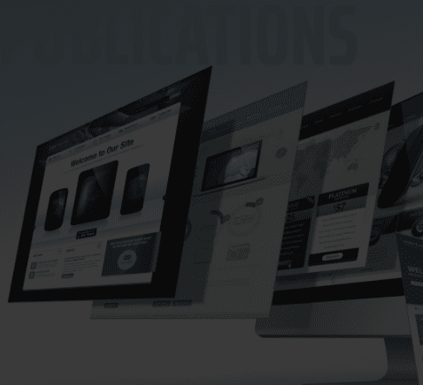

你添加一个透明度为 70%的线性渐变(0.7)，如下图所示，让字体覆盖它。

这是 MyComponent.css

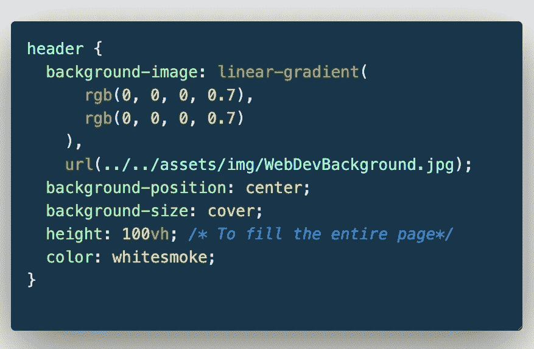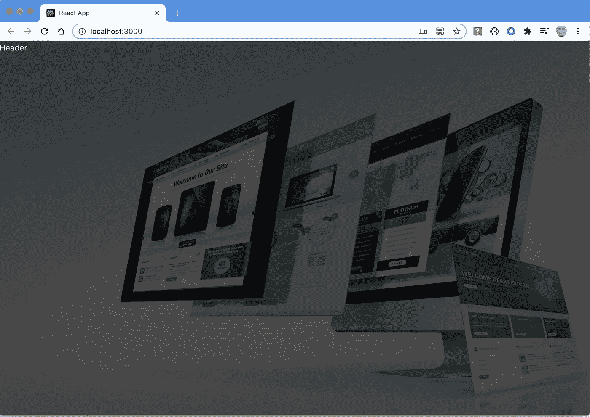

# 背景图像

这是 MyComponent.css

你添加了一个透明度为 90%的线性渐变(0.9)，如下图所示，使字体立于其上。

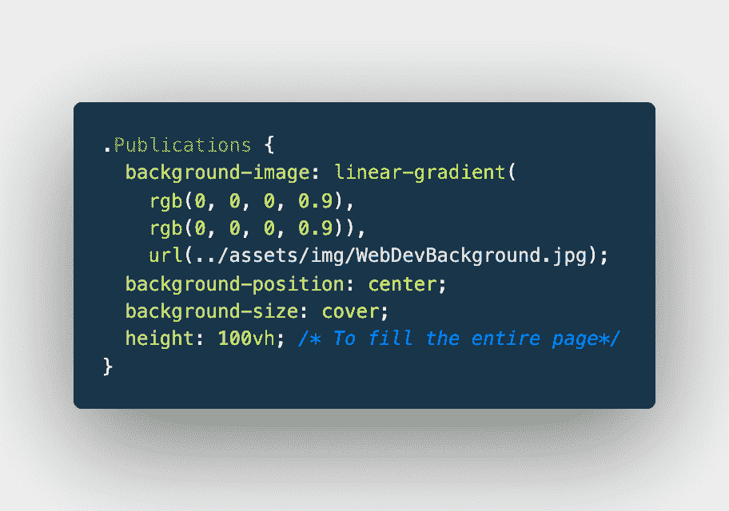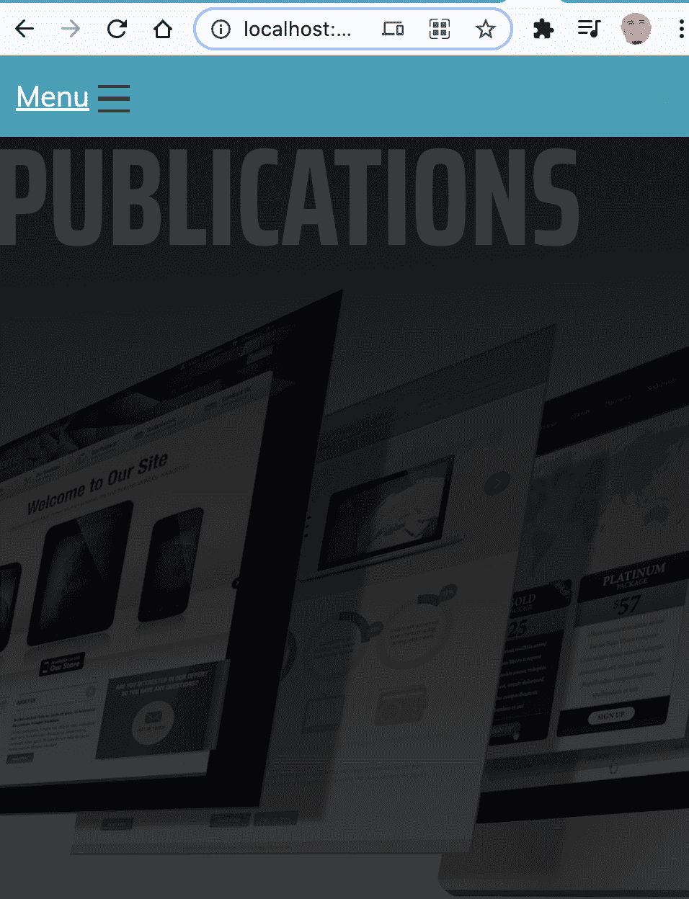

通过添加 top 将标题放在中间:50%

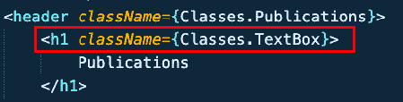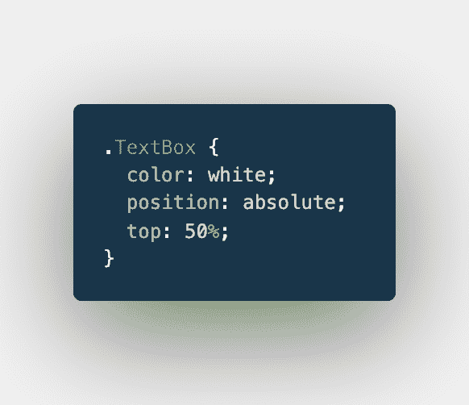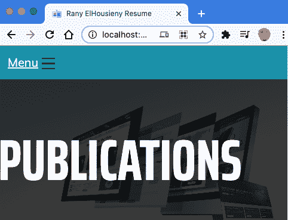

# 配置链接

我们将为它们创建一个像按钮一样的样式。

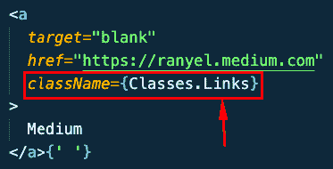

1.  用浅蓝色将它们排成一行

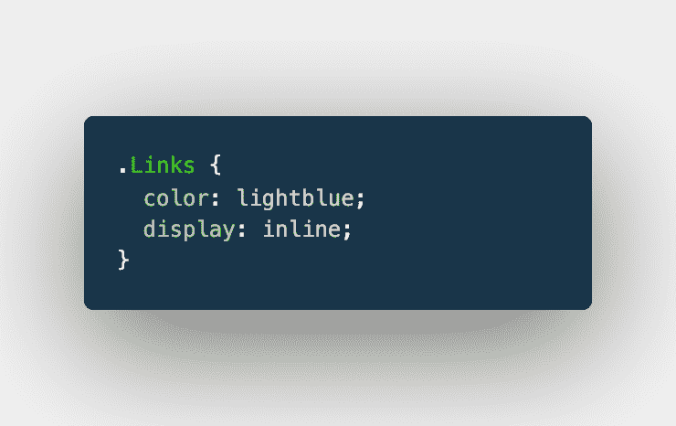

它们将如下所示:

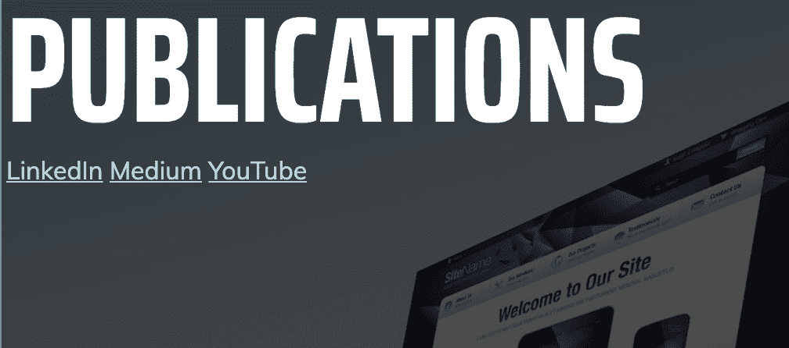

# 添加填充

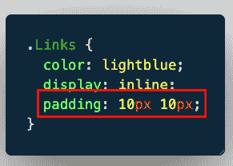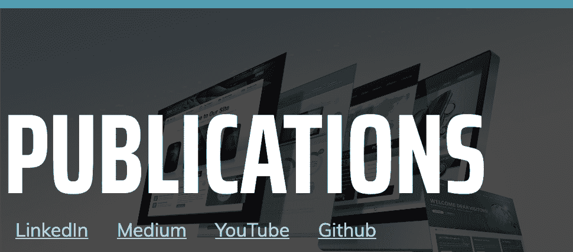

# 导航条

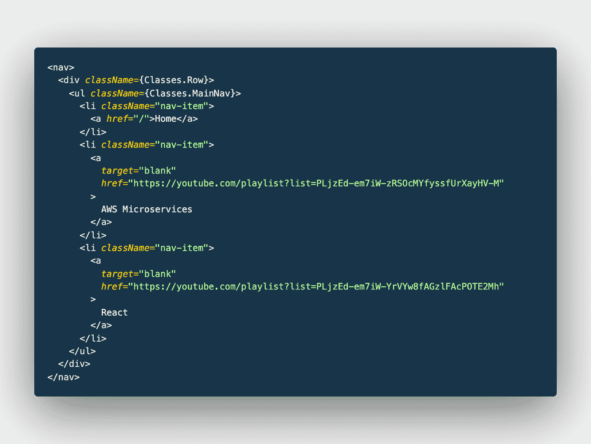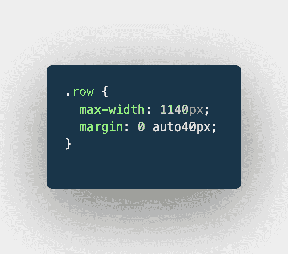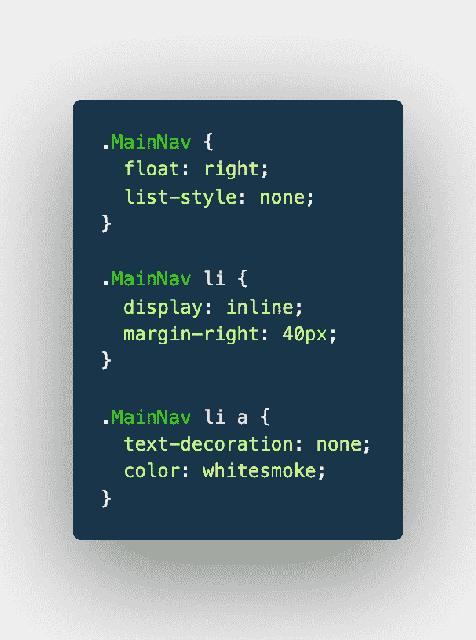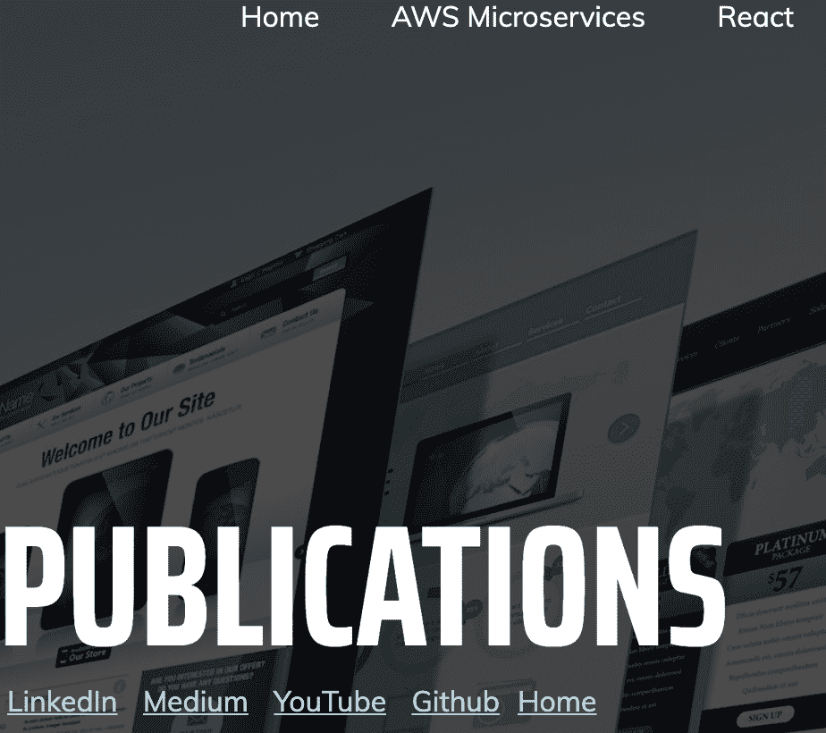

# 现在让我们添加动画

 [## React CSS 模块中的动画

### 本文是上一篇文章的延续:最后一页在 https://rany.elhousieny。

www.linkedin.com](https://www.linkedin.com/pulse/animation-react-css-modules-rany-elhousieny-phd%25E1%25B4%25AC%25E1%25B4%25AE%25E1%25B4%25B0/?trackingId=lrIwGmaSC17kQFKM%2Bf1wcQ%3D%3D) 

发布在 LinkedIn 上:

 [## 样式与 CSS 模块样式表反应

### 最终网站在(https://rany.elhousieny。

www.linkedin.com](https://www.linkedin.com/pulse/styling-react-withcss-modules-stylesheet-rany-elhousieny-phd%E1%B4%AC%E1%B4%AE%E1%B4%B0/)