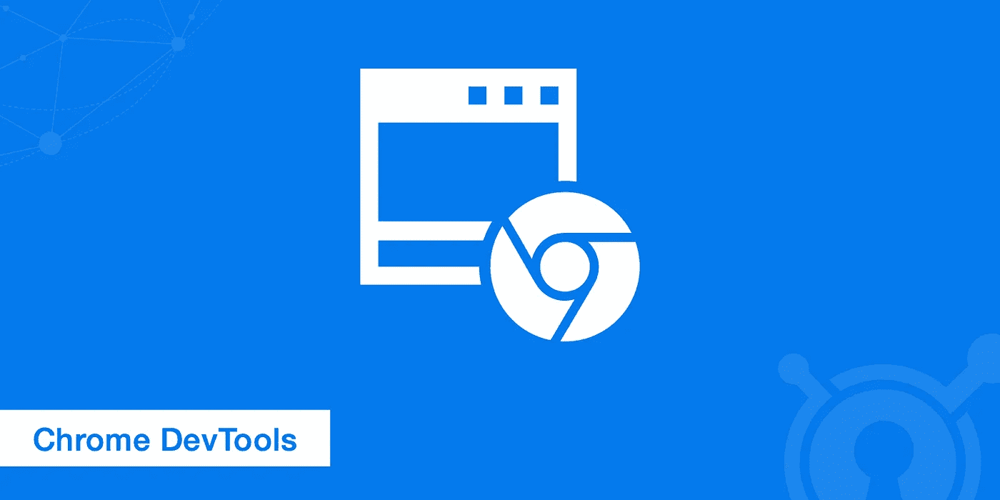
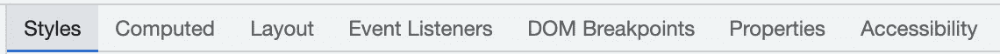
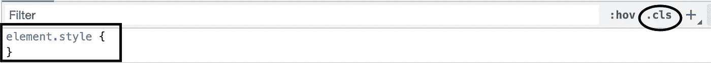
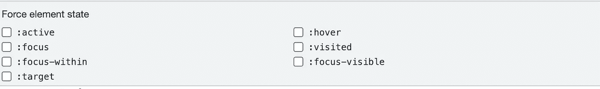
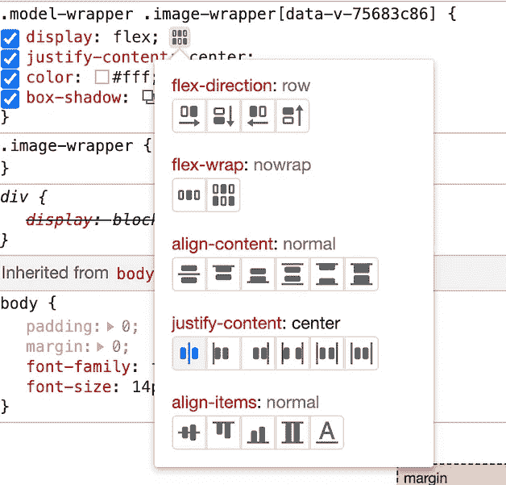
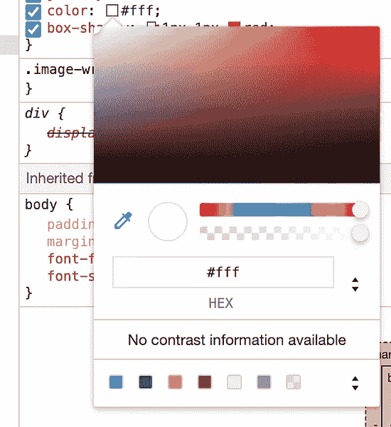
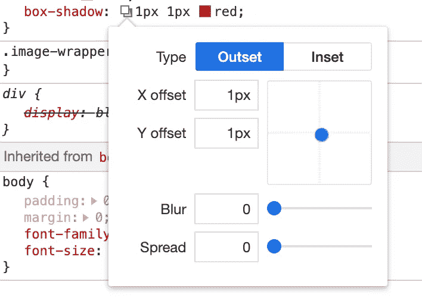
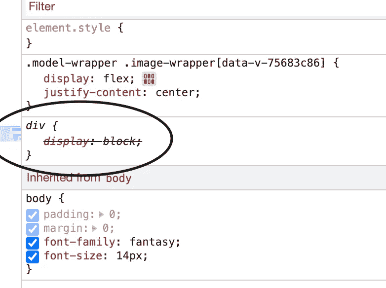
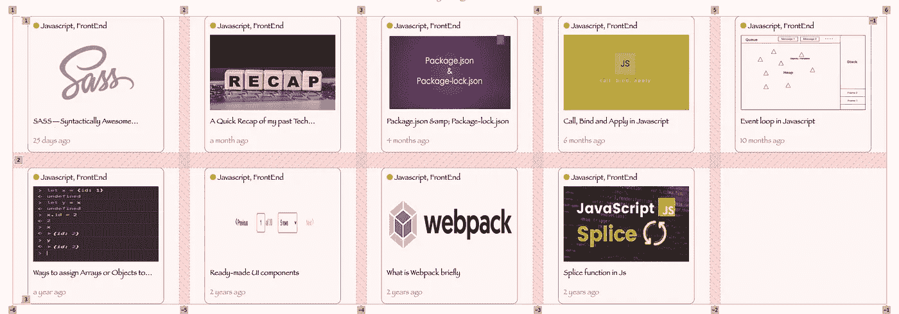
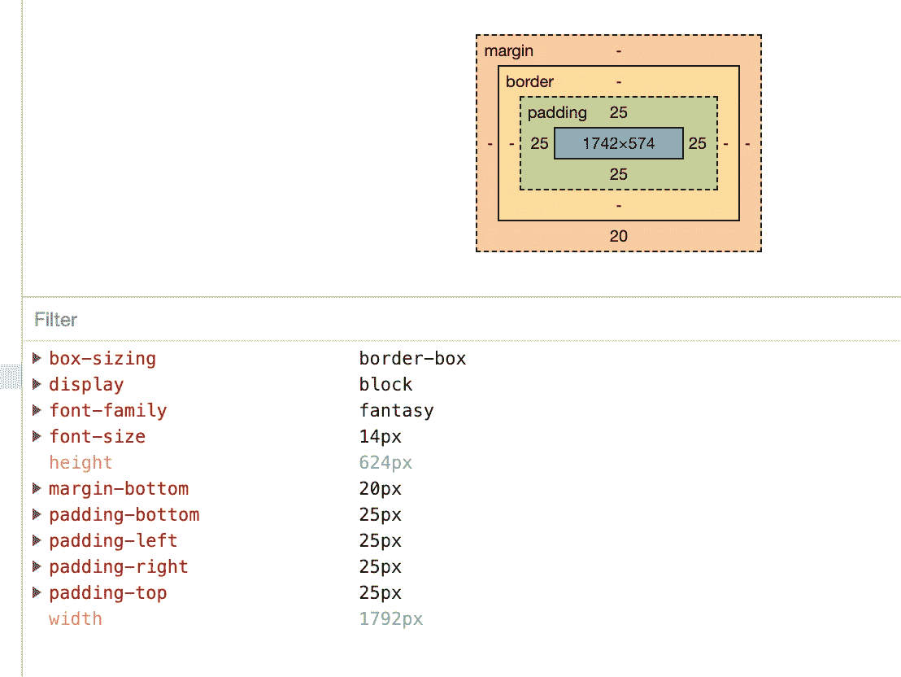

# 用 Chrome 开发者工具设计风格！！

> 原文：<https://medium.com/nerd-for-tech/styling-with-developer-tools-29cdc81ee899?source=collection_archive---------3----------------------->

Chrome 开发工具

开发者工具对于 UI 开发者来说是相当常见的，但是我们有没有高效地使用它们进行开发呢？我很乐意分享一些小技巧，让你的造型工作变得更简单、更高效。没有任何耽搁，让我们从✍️开始吧

开发工具为我们提供了很多选项来检查我们的风格，这个博客的范围将主要是关于造型。

开发者工具

# 风格

所以页面的所有 CSS 都会在 ***样式*** 标签中可见。在这个标签页中，你可以玩 CSS，看看哪种风格最适合你。

怎么用？
简单，只需点击你想要的 DOM 元素，点击后你将得到页面上所有现有的样式，如果你想检查或尝试新的样式，你可以添加一些样式。

有两种方法可以为选定的 DOM 元素设置样式，

要么使用***element . style****或者否则可以*。****cls****帮助你创建一个新的类。如果样式适合页面，您可以简单地将其复制并粘贴到您的 CSS 文件中。**

**在样式选项卡中还有一个有趣的功能，即 ***:hov*****

****

**:hov 选项**

**这些选项可以帮助你检查你的页面效果，比如悬停、活动、焦点元素等。**

************

**不同造型的建议。**

## **未使用的 CSS**

****

**未使用的 CSS**

**您还可以跟踪未使用的 CSS 代码，并删除它们以提高页面性能。**

# **布局**

**你的页面布局在 ***布局*** 标签中，简而言之，你的 flex 和 grid 样式将在这个标签中可用。
如果我们想知道您的 flex 项目或 grid 项目的确切位置，一旦点击 DOM 元素(flex 或 grid ),您就可以简化页面上的视觉效果并做出相应的更改。**

****

**网格视觉效果**

**这样，您可以相应地调整 flex 项目或网格项目。**

# **计算**

**如果你热衷于检查你的页边距、填充、边框、位置，你可以在你的 **C *计算机*标签中看到它们。****

****

**DOM 元素的 CSS 框元素的详细信息**

**这是一些使用开发人员工具进行样式设计的技巧，但是还有很多其他的技巧和窍门可以让我们的样式更加高效和简单。**

**开始吧，这就是我们的博客。希望大家喜欢。如果你喜欢，就为它鼓掌👏并分享给你的朋友。**

**更多前端精彩内容，请关注我🎯。**

**反馈是最可观的❤️.**

**非常感谢大家🙏。**

 **下次再见，快乐学习✍️**

**[*阿布舍克·科武里*](https://www.linkedin.com/in/abhishek-kovuri-25101996/) *，UI 开发者***

**更多信息，请务必阅读
[https://developer.chrome.com/docs/devtools/open/](https://developer.chrome.com/docs/devtools/open/)**