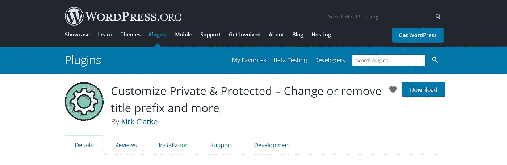
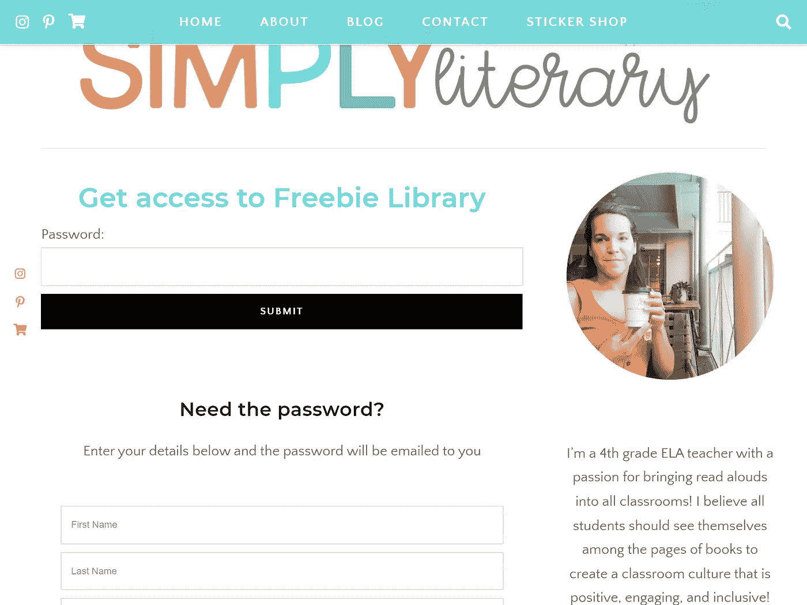
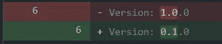
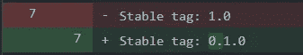

# 提交我的第一个 WordPress 插件。一

> 原文：<https://medium.com/nerd-for-tech/submitting-my-first-wordpress-plugin-pt-1-df4a1be8e183?source=collection_archive---------5----------------------->

只是对我的经历和过程的一些想法

我有几年的 WordPress 经验，尽管我还不是专家。尤其是自从我在 2009 年短暂的暑期实习中第一次接触 WordPress 以来，它已经发生了很大的变化。

直到几年前，我只为自己或其他人修改和定制过插件和模板，尽管我有雄心制作一个主题和插件供分发，但我从未跳过。(我甚至已经购买了 Udemy 的一些课程，但是还没有完成，这些课程涵盖了插件开发)。我相信，就像我生活中的许多事情一样，做某事的想法有时看起来势不可挡，怀疑悄然而至，最终使开始变得似乎不可能。尽管说起来容易做起来难，但永远不要让怀疑阻止你追求某样东西。失败(并希望从中吸取教训)通常比根本不尝试要好。

我的第一个“真正的”插件诞生于 2020 年，当时我为一个朋友拼凑了一个定制插件，用来修改一个[密码保护页面](https://simplyliterary.com/freebie-library/)的外观。这没有什么疯狂的，他们只是想让用户填写表格，请求访问他们的免费图书馆。

允许一个小部件被添加到默认的 WordPress 密码保护页面。

现在快进大约一年，我终于开始把插件变成我可以提交到 WordPress 插件目录的东西。我推荐阅读[详细的插件指南](https://developer.wordpress.org/plugins/wordpress-org/detailed-plugin-guidelines/)和[计划、提交和维护插件](https://developer.wordpress.org/plugins/wordpress-org/planning-submitting-and-maintaining-plugins/)。在更新了一点代码后，我提交了我的文件/插件[供审查](https://wordpress.org/plugins/developers/add/)。这很简单，他们花了大约一天时间通过电子邮件回复我关于我需要修复的项目。我因为有一个**不正确的稳定标签**和**通用函数/类/定义/命名空间名称**而被批评。

# **不正确的稳定标签**

这很容易解决，我所要做的就是确保我的主插件文件中列出的版本和 readme.txt 中的 stable 标签是相同的。因为这是初始开发，所以我遵循了这个[规范](https://semver.org/spec/v0.1.0.html)并使用了 0.1.0。

主插件文件

readme.txt

关于语义版本化(SemVer)的信息，[访问这个站点](https://semver.org/)。

# **通用函数/类/定义/命名空间名称**

正如插件审查小组所说:

> 所有插件必须有唯一的函数名、名称空间、定义和类名。这可以防止你的插件与其他插件或主题冲突。我们需要你更新你的插件，以使用更独特和不同的名称。
> …
> 不要再尝试使用两(2)或三(3)个字母前缀。仅在 WordPress.org，我们就托管了近 10 万个插件。我们的服务器外还有成千上万个。相信我们，你会陷入冲突。

为此，我扩展了插件函数的名称。我的插件命名为*Customize Private&Protected*，所以有些地方我就从**CPP**->-**Customize _ PP _ plugin**为前缀。

而我代码的其他部分完全没有前缀。

在做了这些修正之后，我需要做的就是压缩我的文件，然后用我的插件作为附件回复邮件。谢天谢地，大约 30 分钟后，我收到通知，我的审核已成功完成！在我的下一篇文章中，我将回顾一些关于使用 Subversion (SVN)的内容和需要注意的事情。再次感谢你的阅读，并让我知道你对插件的想法。

自定义隐私和受保护的
https://wordpress.org/plugins/customize-private-protected/