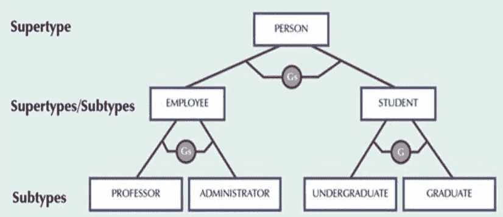
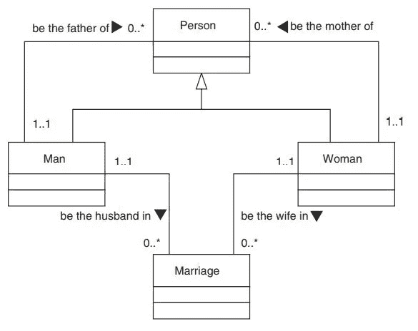
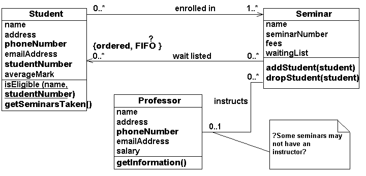
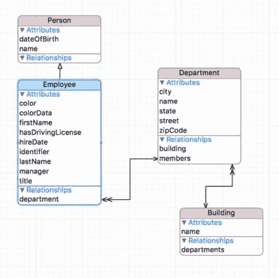
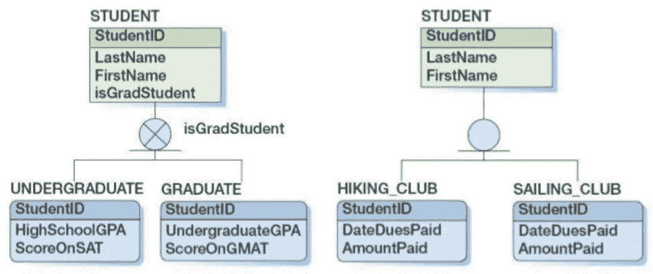

# 子类型和超类型

> 原文：<https://medium.com/nerd-for-tech/subtypes-and-supertypes-ef3b6b37c250?source=collection_archive---------0----------------------->

**子类型和超类型**

**简介**

在本次讨论中，我们将关注数据建模中一个特殊且非常重要的选择类型。事实上，它是如此重要，以至于我们引入了一个特殊的约定子类型来允许我们的 E-R 图同时显示几个不同的选项。我们还会发现子类型对于简洁地表示规则和约束以及管理复杂性是有用的。我们在这次讨论中的重点是概念建模阶段，我们只是略微涉及逻辑建模问题。

**不同层次的概括**

重要的是要认识到，我们对一般化级别的选择不仅会对数据库，而且会对整个系统的设计产生深远的影响。泛化最明显的效果是减少了实体类的数量，表面上看，简化了模型。有时，通过整合公共程序逻辑，这将转化为系统复杂性的显著降低。在其他情况下，合并处理完全不同的子类型所需的逻辑所增加的程序复杂性超过了收益。如果你使用一种算法来估计系统的规模和成本(例如，根据功能点)，你应该特别注意第二种可能性。通过泛化故意减少实体类的数量来实现较低的成本估计，可能没有充分考虑到相关的编程复杂性。

**规则对稳定性**

为了选择最合适的一般化级别，我们从查看模型之间的一个重要差异开始:每个模型支持的业务规则(约束)的数量和类型。

由没有经验的建模者开发的模型通常在数据结构中包含太多的规则，主要是因为熟悉的概念和常见的业务术语本身可能不够通用。反之，一旦发现概括的力量，就有矫枉过正的倾向。非常通用的模型看起来几乎不会受到批评，因为它们几乎可以容纳任何东西。这不是出色的建模，而是为了流程建模者或用户而放弃设计，用户现在必须捡起数据建模者遗漏的所有业务规则。

**使用子类型和超类型**

不足为奇的是，数据建模中出现的许多争论都是关于适当的泛化水平，尽管它们并不总是被认为是这样。我们不能通过求助于规则手册来轻易地解决这样的争议，我们也不想在建模过程中过早地丢弃有趣的选项。

表示不同级别概括的能力需要一种新的图表惯例，即框中框。你应该小心不要用太多不同的符号使图过于复杂，但是这确实为我们的模型增加了另一个维度(一般化/特殊化)。

**作为实体类的子类型和超类型**

围绕正确使用子类型和超类型的许多困惑可以用一个简单的规则来解决:子类型和超类型是实体类。

*   我们使用相同的图表惯例(带圆角的方框)来表示所有的实体类，无论它们是否是其他实体类的子类型或超类型。
*   定义必须支持子类型和超类型。
*   子类型和超类型可以有属性。特定于单个子类型的属性被分配给这些子类型；公共属性被分配给超类型。
*   子类型和超类型可以参与关系。请注意，在我们的家谱模型中，我们已经能够通过在最适当的级别将“母亲”和“父亲”关系与实体类联系起来，来捕捉它们。事实上，这张图显示了大多数让建模者担心的关系，特别是实体类和它自己的超类型之间的关系。
*   子类型本身可以有子类型。我们不需要把自己局限于两个层次的亚类型。在实践中，我们倾向于在一个、两个或三个一般性级别上表示大多数概念，尽管四个或五个级别有时是有用的。

**图表惯例**

**1。盒中盒**

盒子里的盒子

我们可以使用“盒中盒”的惯例来表示子类型。这不是唯一的选择，但是它很紧凑，应用广泛，并且受几种流行的文档工具的支持。事实上所有的替代约定，包括 UML，都是基于父类型和子类型之间的界限。

**2。UML 约定**

在 UML 符号中，子类型由父类型框外面的框表示，而不是在父类型框里面。

用户模式

**3。使用不支持子类型的工具**

一些文档工具根本没有为子类型提供单独的约定，通常的建议是将它们显示为一对一的关系。这是一个非常糟糕的选择，但总比完全忽略子类型要好。如果被迫使用它，我们建议您采用一个关系名称，如“be”或“is”，这是专门为子类型保留的。

**定义**

实体类继承其超类型的定义。在编写子类型的定义时，我们的任务是指定它与它的兄弟子类型的区别(即，在同一级别的子类型，如果相关的话，在同一分区内)。

超类型/子类型

**超类型和子类型的属性**

有时，我们可以通过在两个或多个概括级别上表示属性来为模型添加意义。

属性

**不重叠和穷举**

我们的家谱模型中的子类型遵循两个重要的规则:

*   他们是**不重叠的**:一个特定的人不可能既是男人又是女人。
*   他们是**详尽无遗的**:一个给定的人必须是一个男人或一个女人，没有别的。

事实上，这两个规则是必要的，以使每一级的泛化本身成为一个有效的实现选项。考虑一个模型，其中**贸易伙伴**被细分为**买方**和**卖方**。

**重叠的子类型和角色**

建立了子类型不能重叠的规则后，我们剩下的问题是处理某些现实世界的概念和约束，这些概念和约束似乎需要重叠的子类型来建模。最常见的例子是个人和组织扮演的各种角色。

许多在商业中使用的最重要的术语(客户、雇员、股东、经理等。)描述这样的角色，我们很可能在几乎每一个数据建模项目中至少会遇到其中的一些角色。我们塑造(并因此实施)这些角色的方式对于组织服务客户、管理风险以及遵守反垄断和隐私立法的能力具有重要意义。在不违反“不重叠”原则的情况下，我们可以使用几种策略。

***忽略现实世界的重叠***

有时，可以模拟某些重叠不存在的情况。我们之前已经区分了现实世界的规则(“每个人都必须有一个母亲。”)从关于我们需要持有或能够持有的关于现实世界的数据的规则(“我们只知道一些人的母亲。").

***只建模了*** 的超类型

对人员和组织的角色进行建模的最常见的方法之一是只使用一个超类型实体类来表示所有可能的角色。如果要进行分类，也是基于其他标准，如“法人实体类别 type"partnership、公司、个人等”。

***将角色建模为参与关系***

在上面描述的仅超类型模型中，角色通常可以根据关系中的参与来描述。

如果您没有使用 Chen 符号，那么，与其为了模型的一个部分而进一步复杂化关系符号，我们建议您在主实体类的定义中记录这样的规则。

***使用角色实体类和一对一关系***

尽管在区分关系和子类型时有些笨拙，但当适用于不同角色的属性和关系存在显著差异时，角色实体类方法通常是最简洁的解决方案。

***多个分区***

多个 CASE 工具通过将多个细分(分区)为完整的、不重叠的子类型来支持重叠子类型的部分解决方案。

多分区工具在处理角色问题上帮助不大，因为我们可能会以不太好的分区结束。

**子类型层次**

每个子类型只能有一个直接超类型(在一个层次结构中，每个人都只有一个直接上司，除了在顶端的人没有)。这符合“不重叠”的要求，因为包含一个共同子类型的两个超类型会重叠。

很少有约定或工具支持一个实体类的多个超类型，这可能是因为它们引入了“多重继承”的复杂性，即一个子类型直接从两个或多个超类型继承属性和关系。

**使用子类型和超类型的好处**

每个子类型层次结构中的每一层都代表了一个特定的选项，用于实现最高层超类型所包含的业务概念。但是子类型和超类型不仅在呈现选项方面有好处，而且在支持创造性和处理复杂性方面也有好处。

***创意***

到目前为止，我们在创作过程中对子类型的使用有点被动。我们假设已经设计了两个或更多的替代模型，并且我们使用子类型在同一个图上比较它们。当不同的建模者处理同一个问题并且(几乎总是发生)产生不同的模型时，这是一个非常有用的技术。

***演示:详细程度***

子类型和超类型提供了一种在不同细节层次上呈现数据模型的机制。这种能力可以对我们交流和验证复杂模型的能力产生巨大的影响。如果您熟悉流程建模技术，您将知道分级数据流图在首先传达“大图”，然后根据需要传达细节方面的价值。

通过有选择地删除实体类和/或关系，可以显示和/或打印同一模型的多个视图的文档工具在这种活动中是有用的。

***沟通***

沟通不仅仅是处理复杂性的问题。术语也经常是一个问题。车辆经理可能对卡车感兴趣，但会计的兴趣是资产。我们的子类型约定允许 Truck 被表示为资产的一个子类型，因此这两个术语都出现在模型中，并且它们的关系很清楚。

当使用子类型和超类型来帮助交流模型时，我们不需要将它们实现为表；交流本身就是包含它们的充分理由。

***输入到设计视图中***

从另一个角度来看，使用子类型和超类型来捕捉数据的不同视角，为我们提供了有用视图规范的有价值的输入，并鼓励了它们定义的严谨性。

***对常见图案进行分类***

我们还可以使用超类型来帮助我们分类和识别常见的模式。

***分而治之***

结构化建模方法使我们能够从上到下、从中间到外或者从下到上攻击模型。

从创造性建模的角度来看，基于专门化的自上而下的方法允许我们在超类型级别放置一组关键概念，并将我们的其余结果放入这个框架中。这里有一个与建筑很好的类比:建筑的基本形状决定了如何满足其他需求。

**我们什么时候停止超类型化和亚类型化？**

没有单一的规则告诉我们何时停止子类型化，因为我们将子类型用于几种不同的目的。例如，为了更好地解释模型，我们可能会将无意实现的子类型显示为表。相反，有几个准则。在实践中，你会发现它们很少冲突。如有疑问，请包括额外的级别。

***标识符差异***

如果一个实体类可以被子类型化为实体类，而实体类的实例由不同的属性标识，则显示子类型。

***不同属性组***

如果一个实体类可以被细分为具有不同属性的实体类，那么可以考虑显示子类型。

***不同的关系***

如果实体类可以划分为子类型，使得一个子类型可以参与关系，而另一个从不参与，则显示该子类型。

***不同流程***

如果一个实体类的一些实例参与了重要的过程，而其他的没有，考虑子类型化。相反，参与同一进程的实体类是超类型化的候选。

***从一个子类型迁移到另一个子类型***

如果我们要实现一个基于这种不稳定子类型的数据库，我们需要在每次状态改变时将数据从一个表转移到另一个表。这将使处理变得复杂，并且很难随着时间的推移跟踪实体实例。

***沟通***

有时只显示两到三个说明性的子类型是有用的。为了避免破坏完整性规则，我们需要添加一个“杂项”实体类。

***捕捉意义和规律***

我们经常得到可以方便地在概念数据模型中表示的信息，即使我们不打算将它包含在最终的(单级)逻辑模型中。例如，业务专员可能会告诉我们，“只有管理人员可以办理员工贷款”。

***汇总***

子类型和超类型是我们在数据建模过程中使用的工具，而不是出现在逻辑和物理模型中的结构，至少只要我们的 DBMSs 不能直接实现它们。

**关系的概括**

与实体类一样，我们的决策需要基于使用的通用性、稳定性和约束的实施。个人关系的使用方式相似吗？我们能预测进一步的关系吗？关系所实施的规则是稳定的吗？让我们简单看一下关系泛化的主要类型。

***将几个一对多关系归纳为一个多对多关系***

请记住，您可以选择只概括一对多关系中的一部分，而保留其余部分。如果一两个关系是业务的基础，而其他关系是“额外的”,这可能是合适的。

***将几个一对多关系归纳为一个一对多关系***

如果单个一对多关系是互斥的，那么将几个一对多关系概括成一个多对多关系是合适的，这种情况比您想象的更常见。我们可以用专属弧线来表示这一点。

***概括一对多和多对多的关系***

概括应该是相当明显的，但是您需要认识到，如果您在概括中包括一对多关系，您将会失去只有一个员工可以填补一个职位或在一个职位上工作的规则。

**理论背景**

许多关于数据建模的文本和论文关注于分解，特别是通过标准化。关于概括程度的决定通常被隐藏起来，或者被当作“常识”而不予考虑我们应该非常怀疑这一点，在规范化的规则正式形成之前，这一过程也被认为只是一个常识问题。

**总结**

子类型和超类型用于表示不同级别的实体类泛化。它们有助于采用自顶向下的方法来开发和表示数据模型以及关于数据的业务规则的简明文档。它们通过允许探索和比较替代数据模型来支持创造力。

子类型和超类型不是由标准关系 DBMSs 直接实现的。因此，逻辑和物理数据模型需要没有子类型。通过采用子类型不重叠且详尽的约定，我们可以确保每一级的泛化都是一个有效的实现选项。

该公约导致一些代表权的丧失，但在实践中广泛使用。

**参考**

数据建模理论与实践