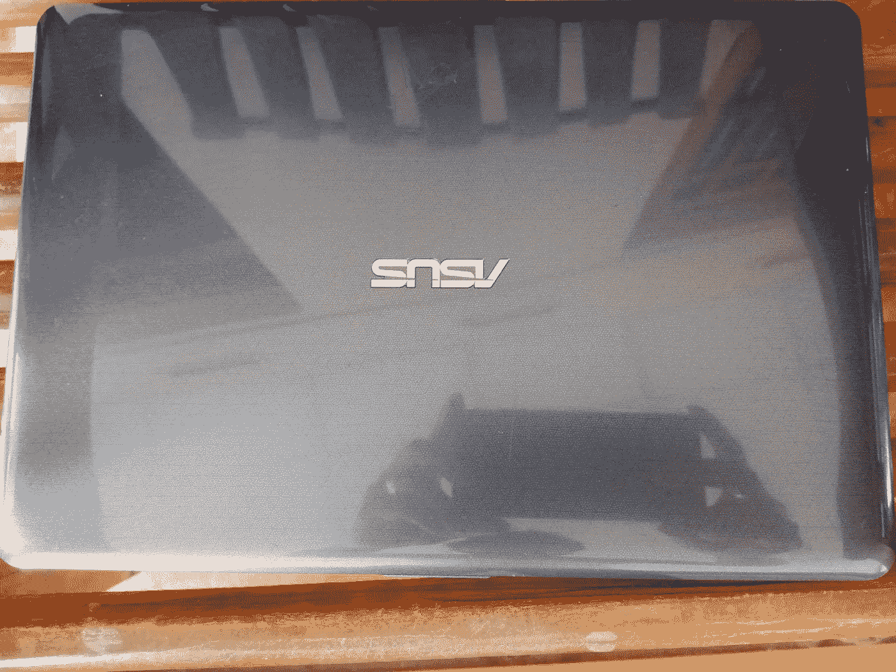
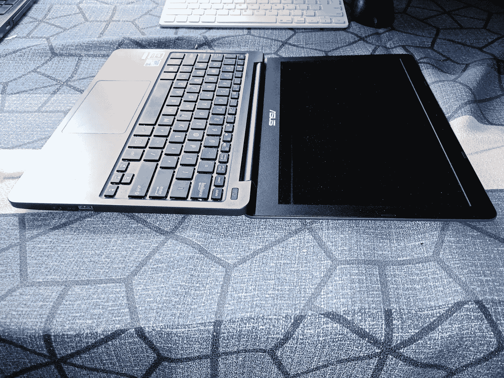

# 建议在你的华硕 VivoBook 上安装 Ubuntu。

> 原文：<https://medium.com/nerd-for-tech/suggest-installing-ubuntu-on-your-asus-vivobook-d4925d4b7a65?source=collection_archive---------0----------------------->

最近，我在寻找一款重量很轻、便携、电池续航时间更长的小型笔记本电脑，以便上网冲浪、做兼职工作以及偶尔看电影😇。唯一的选择是华硕 Vivobook。让我看一下规格。

比 A4 纸还小

## **11.6 英寸屏幕**

这是促使我购买这台笔记本电脑的原因。我真的很喜欢它可爱的外观和便携性，这让我简单的工作变得更加容易。实际上它的尺寸比一张 A4 纸还小。😂

## **不到 1Kg**

华硕 Vivobook 重量在 950g 左右。简单地说，你可以把它带到任何地方。当你拿着它的时候，你能感觉到它有多轻。

## **近 10 小时的续航时间**

我期待的下一件大事是更长的电池寿命。这真的符合我的预期，电池续航时间约为 10 小时。在任何地方工作真的很容易，不用总是把笔记本电脑插在充电器上，困在家里的一个地方。

## **180** **铰链**

Vivobook 最酷的功能之一是，它可以平放在桌子上。其实可以当笔记本放在你的桌子上。

180°铰链

所以，华硕 Vivobook 是我的首选。由于它有 4gb 的内存和英特尔四核处理器，这可能不是一个更好的运行 docker 和打开 Visual Studio 代码。:D:这就是为什么我告诉你，我的期望是有一个真正的小，便携，更长的电池寿命，并做我的兼职工作，不太相关的编程或高内存消耗的东西。

华硕 Vivobook 预装 Windows 10。在用了几个月后，我的感觉是，如果我能让机器再加速一点，那就太好了。我想到了 Ubuntu。我们都知道 Ubuntu 是轻量级的，比 windows 操作系统性能更好。我今天试了一下，结果真的很好。我现在在 vivobook 上有了巨大的进步。虽然有便携，小巧，更好的电池，但现在我用 Ubuntu 20.04 获得了非常好的性能。:)

我正在安装最新的 Ubuntu 版本 20.04。我会说它看起来真的很酷。我得到了 windows 10 的双重引导。你可以按照简单的步骤安装 Ubuntu 20.04 和 windows 10。

1.  下载 Ubuntu。iso(镜像文件)来自[这里](https://releases.ubuntu.com/20.04/)。
2.  使用通用 USB 安装程序创建可启动的 USB 驱动器(在 windows 机器中)。
3.  从 USB 启动您的华硕 Vivobook(华硕启动时按“esc”进入启动菜单)。
4.  你可以先用“立即尝试”选项来尝试 ubuntu，如果你对体验满意的话，就可以安装了。
5.  如果计算机内存不足，请确保手动创建了根(/)空间、主(/home)空间和交换区域。我在我的 vivobook 中创建了交换区，增加了两倍大小的内存。
6.  仅此而已。你用 Ubuntu 得到了一个不错的 vivobook。真的很酷。

华硕 Vivobook 中的 Ubuntu 20.04 安装

如果您正在使用华硕 Vivobook，并且需要您的机器有更多的性能，请尝试一下。现在我甚至可以做一些编程的东西了。:)