# 自杀式袭击:数字

> 原文：<https://medium.com/nerd-for-tech/suicide-attacks-behind-the-numbers-9c5f10641355?source=collection_archive---------15----------------------->

2019 年 9 月 3 日，在中国广州的广州塔观景台，日落时可以看到广州和珠江。(路透社)

堵车真的很可怕。这不仅仅是交通问题；去参加宗教聚会、社交聚会，或者只是坐在房子里的沙发上，对一些人来说会很可怕。我是说，因为炸药随时都会爆炸。

虽然自杀式袭击的数量似乎有所减少(嗯，直到我们看到最近的数字，我们才能完全确定)，但仍然不能忽视它们仍在发生。谈谈 2021 年 3 月 22 日发生在中国南方城市广州郊区的自杀式袭击，那次袭击造成 5 人死亡(包括袭击者)和 5 人受伤。

好吧，让我们直接从 1982 年到 2015 年全球范围内的自杀式袭击数据中提取信息，然后作为一个国家…尼日利亚。请注意，这里可能还有其他没有提到的攻击实例，我只是利用了从 CORGIS 数据集项目网站上获得的数据集，这里是。

我用 Juptyer 笔记本分析了这个数据集。我写的完整代码可以在[这里](https://github.com/Goldochim/Projects-with-Friends/blob/main/suicide%20attack%20final.ipynb)找到

数据集有 21 列和 4，616 行。这些列如下所示:

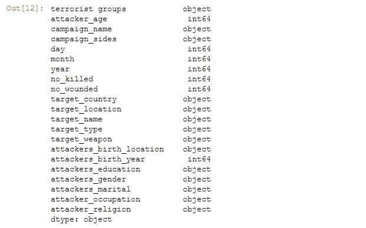

在整个数据集中，伤亡人数最多的自杀式袭击是 2001 年 9 月 11 日对纽约世贸中心的袭击。这次袭击中受伤人数最多，死亡人数也最多。

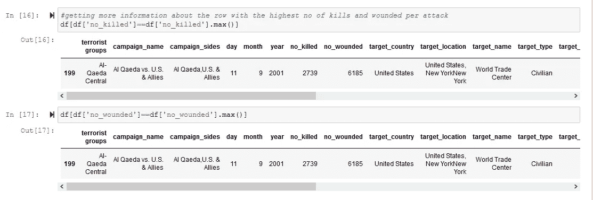

这次攻击的目标是平民，攻击的武器是飞机。根据这个数据集，2739 人死亡，6185 人受伤。袭击者来自基地组织中央恐怖组织，是一名拥有大专学历的未婚埃及人。袭击者也是一名穆斯林。

历史上还是有不少失败的自杀式袭击的。这个数据集记录了总共 273 个没有人员伤亡的例子(我对‘失败的自杀式袭击’的定义)。请注意,“年龄”和“出生年份”列已被删除，因为缺少大量值(异常值)。

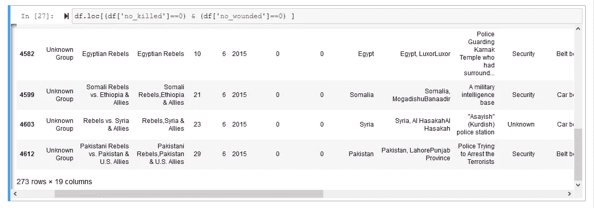

伤亡人数趋势如下:

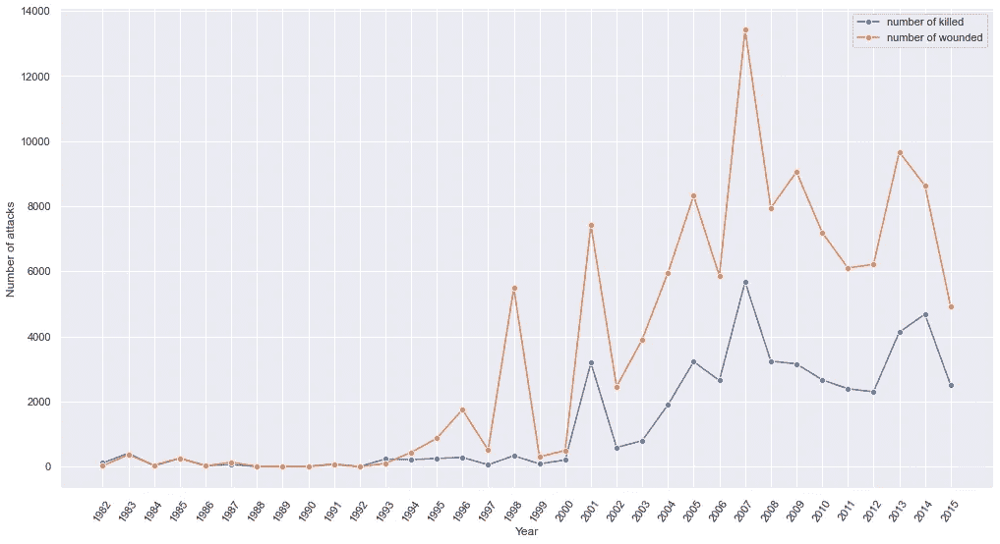

1982 年至 2015 年死亡和受伤的人

从上图可以看出，2007 年的伤亡人数最多。那一年受伤的总人数是 13，413 人，死亡的总人数是 5，679 人。

2007 年总共发生了 525 起袭击事件。死亡人数最少的一年是 1989 年，死亡人数为零。受伤人数最少的一年是 1992 年，0 人受伤。

每年攻击总数的趋势如下所示:

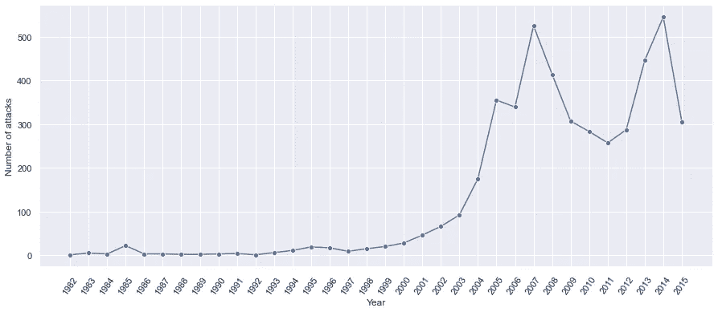

每年的袭击

自 1999 年以来，袭击次数呈上升趋势。2014 年的攻击次数最多(545 次)。第二高的年份是 2007 年，发生了 525 起攻击事件。1982 年和 1992 年的袭击次数最少；1.

一些国家受到的影响比其他国家更大。该数据集共记录了 47 个国家。让我们看看从 1982 年到 2015 年每个国家的攻击次数

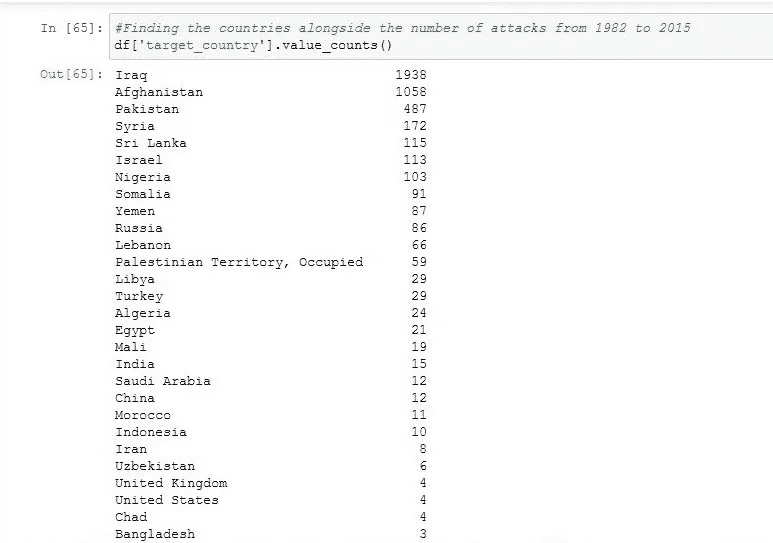

代表的一些国家和攻击次数

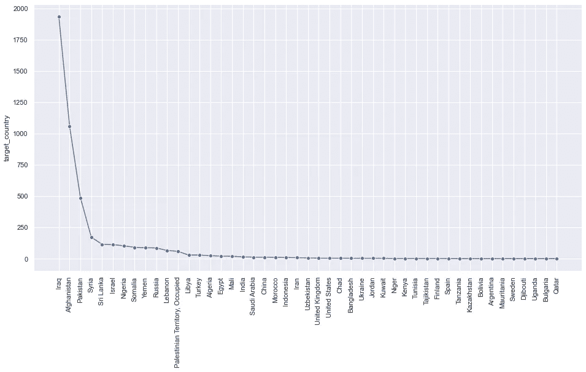

袭击的国家和次数

下面是从 1982 年到 2015 年每个国家在袭击中死亡和受伤的图表

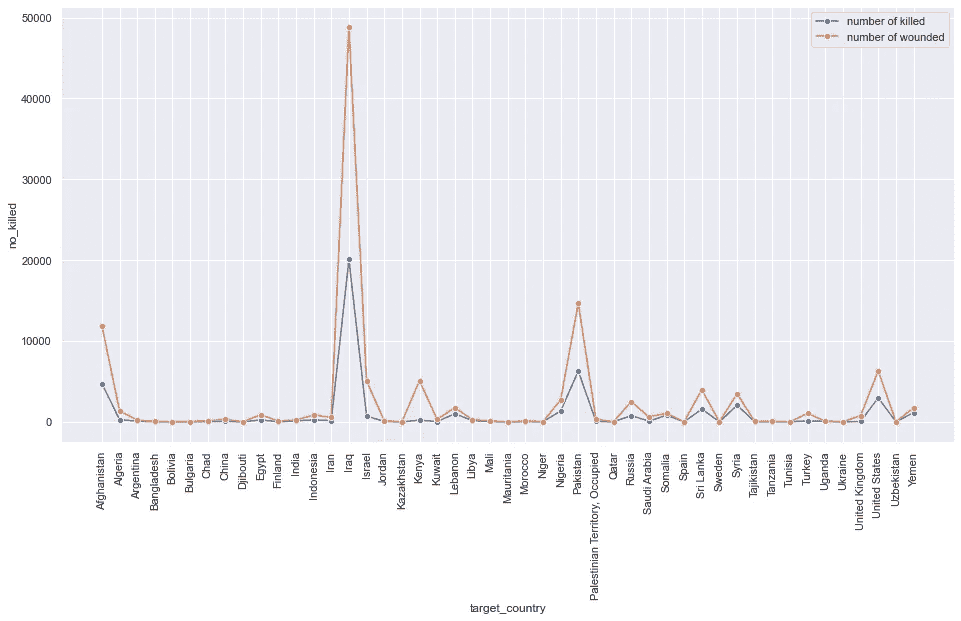

从 1982 年到 2015 年每个国家的死亡和受伤人数

从上面的图表中我们可以看到，从 1982 年到 2015 年，伊拉克的受伤人数(48902 人)和死亡人数(20084 人)最高。还要观察受伤的人数通常高于死亡的人数。

从下图可以看出，该数据集中有 128 个独特的恐怖组织。此外，袭击次数最多的恐怖组织是由“未知组织”实施的。因此，已知的发动袭击次数最多的恐怖组织是塔利班(IEA)组织，发动了 661 次袭击。

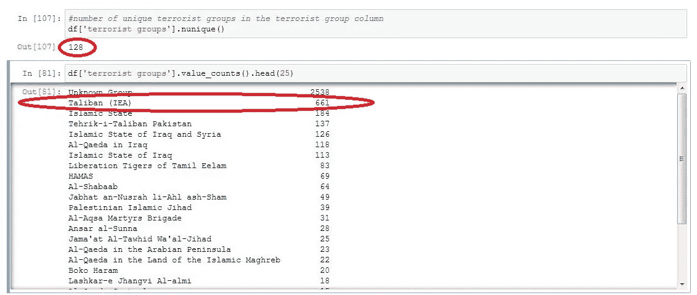

恐怖组织的袭击次数

1982 年至 2015 年期间被特定已知恐怖组织伤害和杀害的总人数如下

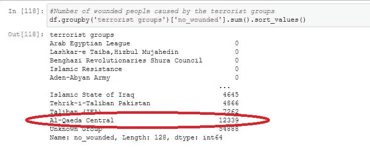

每个恐怖组织伤害的人数

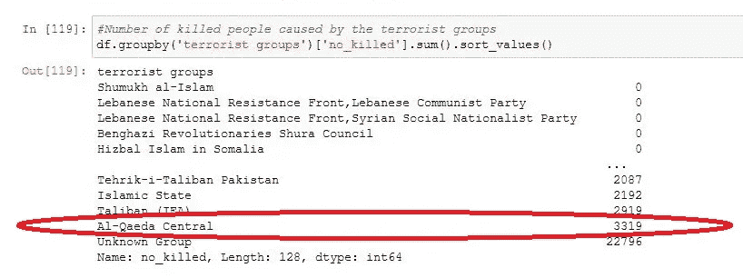

每个恐怖组织杀害的人数

从上面我们可以看到，基地组织中央恐怖组织是已知的恐怖组织，在 1982 年至 2015 年间(忽略‘未知组织’恐怖组织)对最高数量的自杀死亡和伤害负责。人们还可以观察到，根据该数据集，该恐怖组织在此期间总共制造了 15 起自杀式袭击。

从 1982 年到 2015 年，共有 117，989 人受伤，45，824 人死亡。

# **尼日利亚**

在 2011 年之前，自杀式袭击在尼日利亚并不常见，2011 年 6 月 16 日发生了第一次自杀式袭击。这次袭击的目标是联邦首都区的安全人员。六人死亡，没有受伤人员的记录。根据数据集，袭击者，一名已婚穆斯林男子在第一次袭击中使用了汽车炸弹。

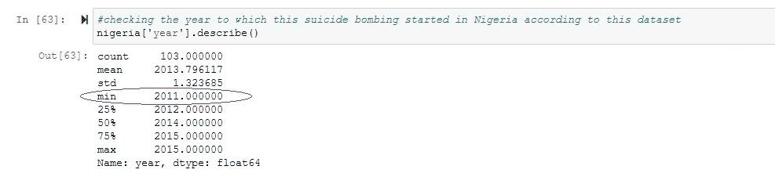

同年发生了几起袭击事件，造成大量人员伤亡。

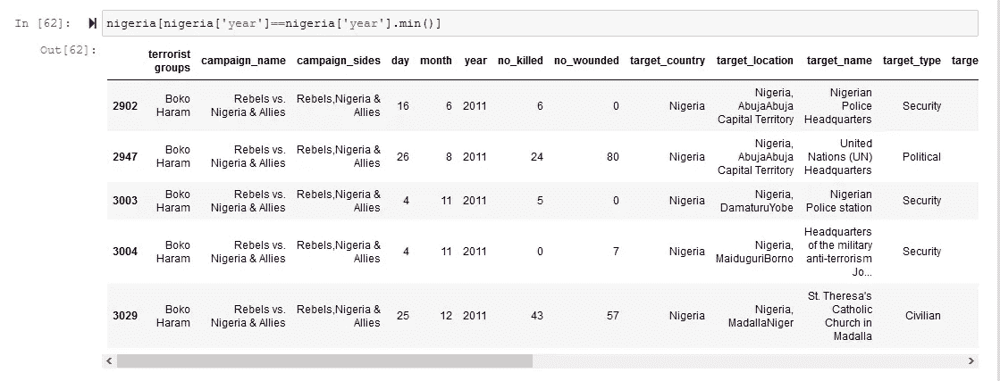

2011 年尼日利亚发生的所有袭击

总的来说，从这个数据集来看，2011 年至 2015 年尼日利亚的自杀式袭击次数为 103 次。

从数据集来看，平民是攻击的最大目标。安全人员是第二大目标，然后是政治家是最不为人知的目标群体。

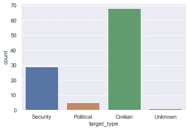

尼日利亚自杀式袭击的目标类型。

这些袭击也发生在大城市或城镇。来自数据集的攻击被认为主要影响了尼日利亚北部地区。下面是一个饼图，显示了这些城镇的攻击分布情况:

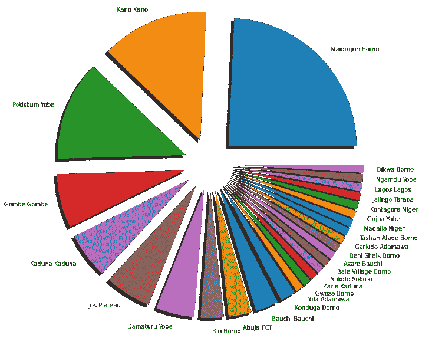

博尔诺州首府迈杜古里在 2011 年至 2015 年间被认为发生了约 25 起袭击事件。不能忽视的事实是，同一个博尔诺州的几个城镇也遭到了袭击。仅博尔诺就在几个城镇发生了 35 起袭击事件。卡诺州首府卡诺被认为在 2011 年至 2015 年期间发生了第二多的袭击事件(14 起)。约贝的 Potiskum 是第三大受攻击的城镇(13 次攻击)。从这些我们可以看到，与预期的不同，各州首府也没有例外。不知何故，这些自杀式袭击者想方设法在这些首都和其他城镇重复他们的行为。下图显示了每个城镇发生这些袭击的确切次数:

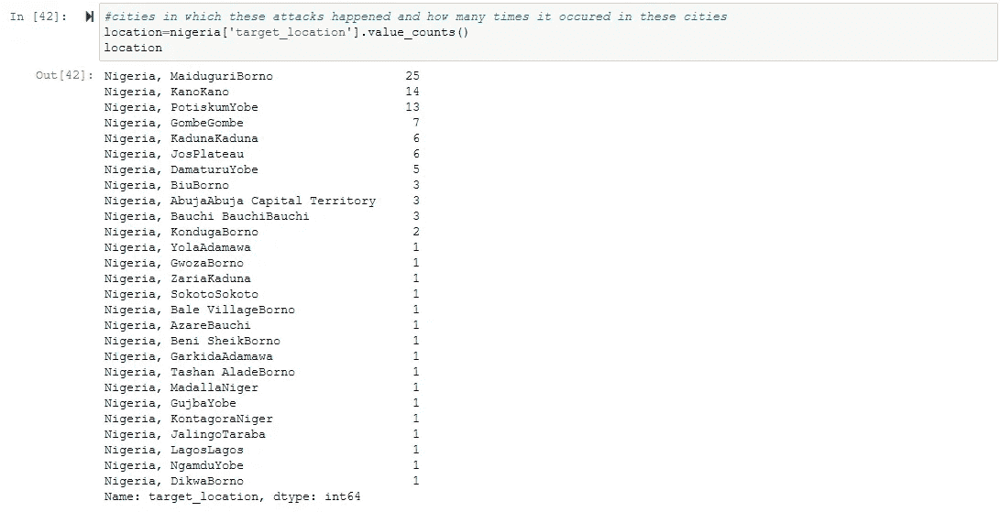

每个城镇的攻击次数

这些攻击是由男女双方造成的；男性和女性。据记录，一些袭击者的性别不详。但是，男性袭击者的数量最多(29 人)，尽管这种差异可以忽略不计，女性为 27 人。被记录为未知的攻击者人数为 47 人。

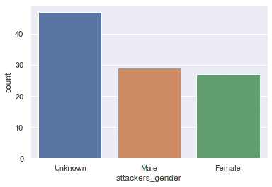

通常，当涉及到自杀式袭击等事情时，女性不太容易受到怀疑，但这个数据集清楚地表明，她们积极参与了此类事情，在调查或搜索过程中不应被忽视。

在尼日利亚，对这些自杀式袭击负责的主要恐怖组织之一是博科圣地。该记录显示，其中 20 起袭击显然是由博科圣地实施的，但不清楚其中 83 起袭击是由谁实施的。尽管大多数人仍然认为这都是同一个博科圣地干的。问题是如果不只是他们呢？如果有其他恐怖组织对这些袭击负责呢？

大多数自杀式袭击者的宗教信仰不明。只有一个记录显示宗教是穆斯林。

尼日利亚每年的袭击趋势如下:

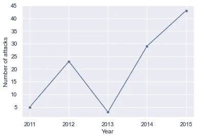

从 2011 年到 2012 年，攻击数量上升，然后下降。2014 年和 2015 年都有所增加。由于数据数量有限，目前很难预见这些攻击的未来预测。

下表还显示了每年的伤亡人数:

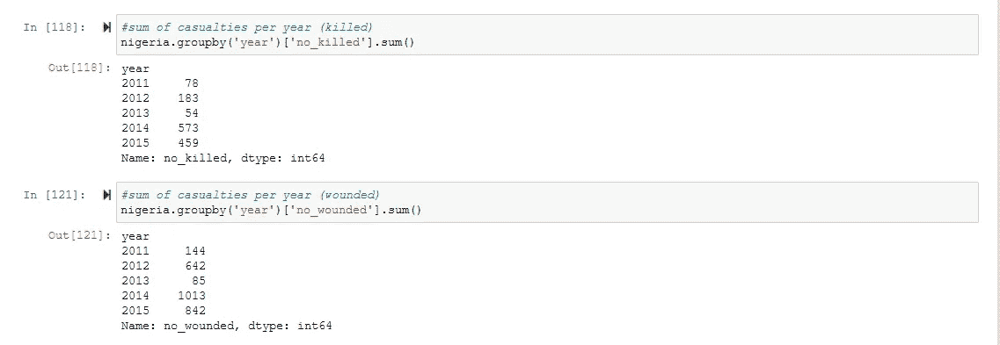

每年死亡和受伤人数

2014 年伤亡人数最多。

伤亡人数最多的袭击是对卡诺大清真寺的袭击，造成 120 人死亡，270 人受伤。袭击是用皮带炸弹进行的。袭击发生在 2014 年 11 月 28 日。

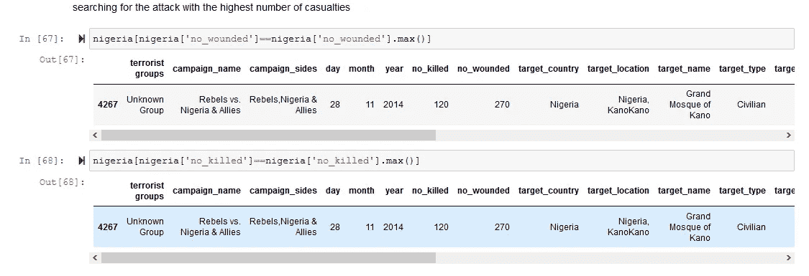

这些自杀式袭击者使用的武器如下所示。也显示了使用该武器的攻击次数:

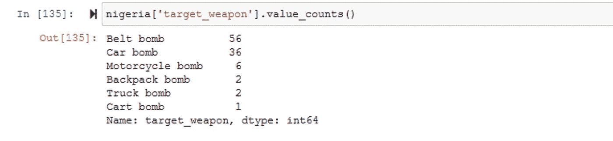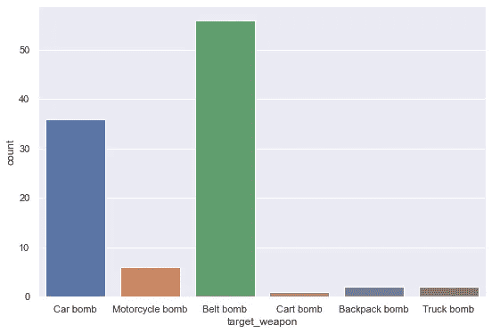

我们可以看到皮带炸弹是最常用的攻击武器，而手推车炸弹是最少使用的攻击武器。当涉及到保护公民安全时，应该采取什么安全措施是显而易见的。这并不意味着最少使用的武器应该被忽视。总体想法是安全人员和个人要小心并观察陌生人和活动

从 2011 年到 2015 年，共有 4，073 人伤亡。2726 人受伤，1347 人死亡。

这些不仅仅是数字，这些是人类。

参考:

https://link.medium.com/rf0ZQkXk8eb

 [## 博科圣地-维基百科

### (自 2015 年起)(自 2015 年起)博科圣地，正式名称为 jamāat ahl as-Sunnah lid-da ' wah wa ' l-jihād(阿拉伯语:جماعة…

en.wikipedia.org](https://en.wikipedia.org/wiki/Boko_Haram)  [## seaborn . count plot-seaborn 0 . 11 . 1 文档

### 海博恩。countplot( *，，，，，，，，，，** kwargs)显示每个分类框中的观察值计数…

seaborn.pydata.org](https://seaborn.pydata.org/generated/seaborn.countplot.html)