# 熊猫的描述性统计

> 原文：<https://medium.com/nerd-for-tech/summarizing-and-computing-descriptive-statistics-in-pandas-7320a1fec371?source=collection_archive---------4----------------------->

## 大熊猫描述性统计数据计算指南。

[斯科特·格雷厄姆](https://unsplash.com/@homajob?utm_source=medium&utm_medium=referral)在 [Unsplash](https://unsplash.com?utm_source=medium&utm_medium=referral) 上拍照

# 加载数据

首先，让我们导入库。

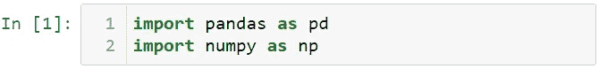

让我们创建一个名为 df 的数据框，该数据集包含缺失数据。

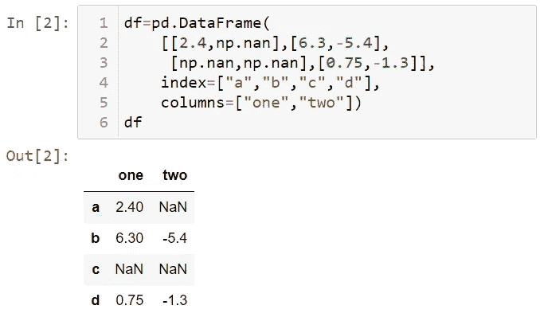

您可以使用 sum 方法计算列的总和。

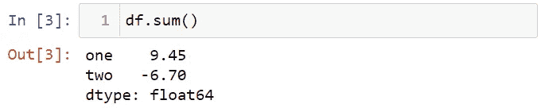

对于行的总和，可以使用 axis = "columns "或 axis = 1。

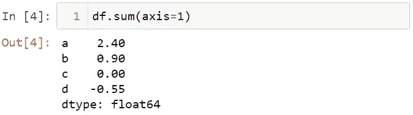

您可以使用 mean 方法计算行的平均值。

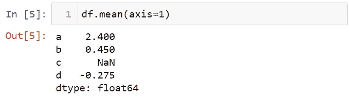

请注意，默认情况下，缺失数据不包括在平均值中。如果要考虑缺失的数据，可以使用 skipna = False。

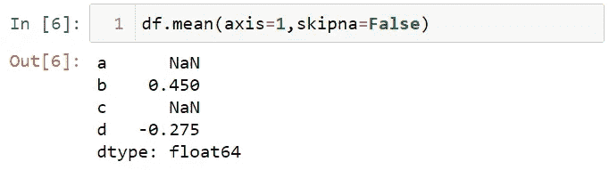

让我们看看行和列中的最大值。

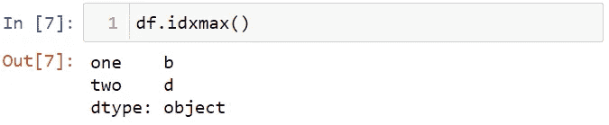

让我们看看行和列中的最小值。

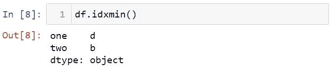

让我们来计算累计的总数。

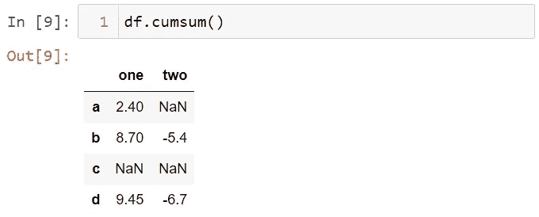

您可以使用所描述的方法来查看数据集的汇总统计信息。

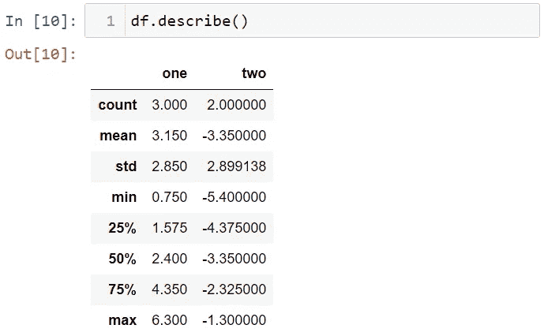

为了找到相关系数，我们先导入著名的 iris 数据集。你可以从[这里](https://archive.ics.uci.edu/ml/datasets/iris)下载虹膜数据集。

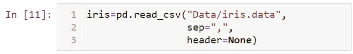

让我们看看 iris 数据集的前五行。

如您所见，iris 数据集中没有列名。让我们给出列名。

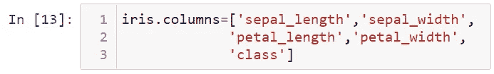

让我们再看一下 iris 数据集的前五行。

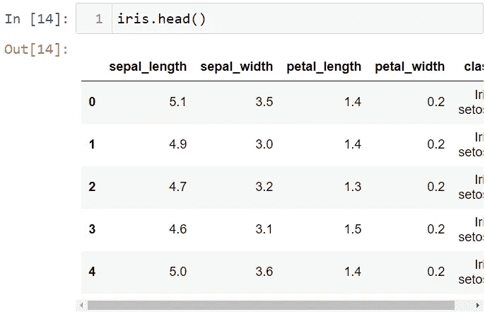

我们来计算一下萼片长度和萼片宽度的相关性。

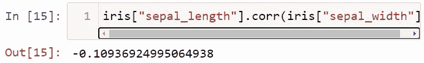

您可以使用 corr 方法查看数据框中所有变量的二进制相关性。

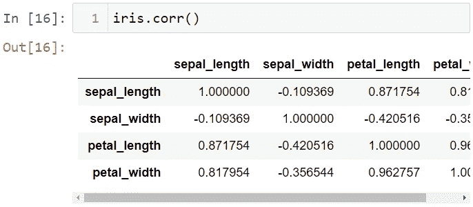

您可以使用 cov 方法来查看所有变量的二元协方差。

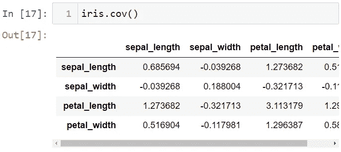

使用 corrwith 方法，可以获得数据集中某个变量与其他变量之间的二进制比较。

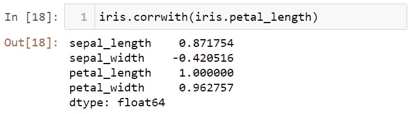

您可以使用 unique 方法来查看唯一值。为了说明这一点，让我们创建一个名为 s 的系列。

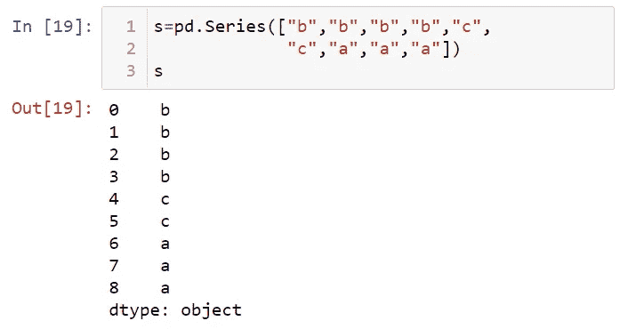

让我们使用独特的方法。

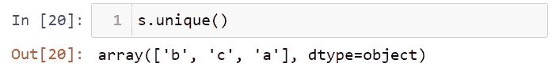

您可以使用 value_counts 方法来查看值的频率。

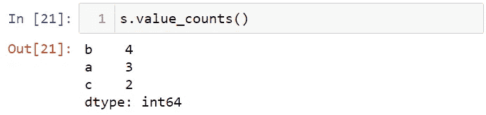

若要控制值是否在数据集中，可以使用 is in 方法。

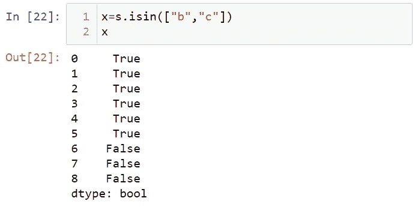

让我们看看有这些值的行。

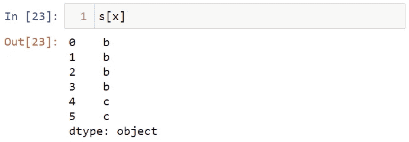

就是这样。我希望你喜欢这篇文章。你可以在这里访问笔记本[。](https://github.com/TirendazAcademy/PANDAS-TUTORIAL/blob/main/09-Summary%20Statistics.ipynb)

别忘了关注我们的视频，YouTube，T2，Twitter，GitHub，Linkedin，Kaggle 和 T9

 [## Python 熊猫教程

### Pandas 是 Python 最重要的库之一。在这篇博文中，我将谈论熊猫图书馆并展示…

medium.com](/codex/python-pandas-tutorial-42be3e827e2a)  [## 熊猫的实用数据分析

### 在我的上一篇文章中，我提到了在熊猫图书馆使用数据。Python 最重要的库之一是熊猫…

levelup.gitconnected.com](https://levelup.gitconnected.com/practical-data-analysis-with-pandas-c40fbd2955fa) 

如果这篇文章有帮助，请点击拍手👏按钮几下，以示支持👇