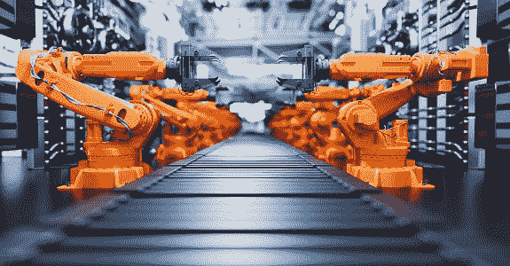

# 2021 年中国工业机器人行业运行总结及 2022 年行业趋势预测

> 原文：<https://medium.com/nerd-for-tech/summary-of-the-operation-of-chinas-industrial-robot-industry-in-2021-and-industry-trend-forecast-2fd67b855771?source=collection_archive---------2----------------------->

预计 2022 年工业机器人国产化进程将加快，工业机器人的集成化将是技术突破的重点。

## **1。工业机器人产业回顾**

**1 增加机器人密度**

工业机器人性价比的不断提高和投资回收期的缩短，促进了工业机器人密度的提高。在过去五年中，中国一直是全球机器人密度增长的主要驱动市场。2015 年机器人密度为 49 台/万人，2020 年增至 246 台/万人，排名从第 25 位升至第 9 位。根据机器人产业发展“十四五”规划，到 2025 年机器人产业年均增速超过 20%，制造机器人密度增长 100%，即每万人拥有 450 台。

**2 工业机器人产量增加**

近年来，中国工业机器人产量持续上升。2020 年突破 20 万套，达到 23.71 万套，同比增长 19.1%。随着后疫情时代的到来，中国工业经济表现出了应对复杂严峻形势的强大韧性和活力。工业机器人也以出色的表现逆势崛起。2021 年 1 月至 11 月，中国生产了 330，100 台工业机器人，同比增长 49.0%。

**3 工业机器人销量增长**

中国已连续八年成为全球最大的工业机器人消费国，工业机器人销量呈增长趋势。随着中国迅速控制住疫情，许多行业在 2020 年下半年出现井喷，对工业机器人的需求急剧增长。2020 年，工业机器人市场规模为 422.5 亿元，同比增长 18.9%。2021 年，中国工业机器人市场规模将达到 445.7 亿元。到 2023 年，国内市场将进一步扩大，预计将超过 589 亿元。

**4 工业机器人投融资活跃**

2018 年以来，我国工业机器人投融资事件减少，资本市场逐渐趋于理性，融资日益向部分优势企业集中。2020 年，工业机器人投融资事件 68 起，金额 132.89 亿元。2021 年，工业机器人领域投融资升温，投融资事件 96 起，融资金额 236.55 亿元。

## **2。2022 年工业机器人行业预测**

**1 加快本地化和独立进程**

近年来，我们着力突破关键技术难点，先后攻克了减速器、控制器、伺服电机等核心零部件领域的共性“瓶颈”问题。目前企业正在加大研发投入，预计 2022 年中国国产化进程将加速。

**2 工业机器人集成是技术突破的关键点**

目前，中国的工业机器人主要在结构化环境中执行确定性任务。它们不够灵活，无法在复杂的动态环境中工作，这主要是因为工业机器人在与环境融合以及与其他机器人协作方面的感知能力较弱。随着传统工业机器人在机器视觉、智能传感和云技术方面的发展，未来的工业机器人将更加智能和灵活，从传统机器人向集成机器人优化。

## **高质量的训练数据正在帮助人工智能打破新的壁垒**

目前，各行业对最优质的 AI 训练数据需求迫切。人工智能应用于各个领域，如教育、法律、智能驾驶、银行和金融等。每个领域都有细分和专业化的要求。

其中，尤其是智能转型的传统企业和科技企业，更需要有丰富项目经验的培训数据服务商的协助，帮助整理数据标注指令，获取更适合的数据。在特殊场景下使用高质量的数据，减少研发周期，加速实施过程，帮助企业更快更好地进行智能化转型。

在深入的产业落地过程中，人工智能技术与企业需求仍有差距。企业用户的核心目标是利用人工智能技术实现业务增长。实际上，人工智能技术本身并不能直接解决所有的业务需求。它需要创建可以基于特定业务场景和目标大规模实现的产品和服务。

我们需要明确的是，对于 AI 公司和整个行业来说，数据标注是实现人工智能的重要一环。标注数据的准确性和效率影响着人工智能算法模型的最终结果。

## 结束

将你的数据标注任务外包给 [ByteBridge](https://tinyurl.com/4c9kf8ez) ，你可以更便宜更快的获得高质量的 ML 训练数据集！

*   无需信用卡的免费试用:您可以快速获得样品结果，检查输出，并直接向我们的项目经理反馈。
*   100%人工验证
*   透明标准定价:[有明确的定价](https://www.bytebridge.io/#/?module=price)(含人工成本)

**为什么不试一试？**

来源:https://www . robot-China . com/news/202201/14/69474 . html